# AGENTS.md — AI-Native Proof-of-Work Repository Compiler

## Mission

Maintain a private GitHub proof-of-work repository that documents Marcus’s AI-native workflow design, product thinking, automation systems, business strategy, architecture reasoning, local project context, reusable skills, and weekly execution.

This repository is **not a code repository**.

It is a polished, recruiter-shareable documentation repository showing how Marcus thinks, builds, evaluates, documents, and improves workflows using Claude, Codex, scheduled tasks, GitHub, local project archives, shared skills, and structured review loops.

The repository should feel like a modern startup/product strategy workspace:

- clean Markdown
- strong visual hierarchy
- GitHub-readable Mermaid diagrams
- concise executive summaries
- evidence-backed claims
- visible decision trails
- recruiter-readable proof of execution
- deeper technical sections for advanced readers

Avoid hype. Show practical execution.

---

## Target Repository

Canonical GitHub repository:

```text
https://github.com/TheOneDarkHorse/ai-native-proof-of-work
```

Repository name:

```text
ai-native-proof-of-work
```

Repository purpose:

```text
Private recruiter-shareable proof-of-work archive for AI-native workflow design, automation strategy, product thinking, architecture reasoning, local knowledge organization, and weekly execution evidence.
```

Codex must treat this repository as the source of truth for proof-of-work documentation.

If Codex is not running inside this repository, it must clearly report that it needs to be run from the repo root or given access to the repo before making file changes.

---

## Core Principle

This repository is a **proof-of-work system**, not a content dump.

Every document should answer at least one of these questions:

1. What problem was identified?
2. What was the previous workflow or assumption?
3. What changed?
4. Why was that change made?
5. What alternatives were considered?
6. What tradeoffs were accepted?
7. What evidence supports the decision?
8. What remains unvalidated?
9. How does this demonstrate practical execution?
10. Why would this matter to a recruiter, hiring manager, or collaborator?

---

## Decision Trail Standard

Show the visible reasoning trail, not hidden model chain-of-thought.

Do **not** write private/internal model reasoning.

Use this structure instead:

```text
Context → Options Considered → Tradeoffs → Decision → Evidence → Open Questions → Next Action
```

Use this in:

- product strategy
- value proposition
- pricing
- business model
- architecture
- ingestion model
- autoresearch model
- recursive workflows
- problem-solving logs
- weekly decision logs

---

## Canonical Format

Markdown is the source of truth.

Use:

- `.md` files for all main documentation
- Mermaid diagrams for GitHub-rendered infographics
- tables for comparisons
- short executive summaries at the top of important files
- decision logs for strategy and architecture reasoning
- clear status labels for claims

Optional recruiter exports may later be created as:

- `.pdf`
- `.docx`
- `.pptx`

Exports must never replace Markdown.

---

# Access Rules

## Critical Access Rule

Do not assume access to any file, repo, documentation, chat, email, Google Drive document, Claude project, Codex project, skill, or local script unless it is available in the current runtime.

If a source is unavailable, write:

```text
Source unavailable — needs user-provided file, repo path, export, or connector access.
```

Do not invent source contents.

---

## Known Local Source Roots

Marcus has relevant local material in these Windows paths:

```text
C:\Users\marcu\.codex\
C:\Users\marcu\.codex\projects

C:\Users\marcu\.claude\
C:\Users\marcu\.claude\projects

C:\Users\marcu\.agents
```

Important:

- `.codex\projects` contains Codex project histories / repo-related work.
- `.claude\projects` contains Claude project histories / context.
- `.agents` contains shared skills, documentation, scripts, and reusable agent material.
- Marcus uses a custom shared-skills setup. Do not assume a standard folder layout.
- Inspect and index before relying on contents.
- Do not repeatedly deep-scan these folders if a fresh index already exists.

---

# Internal Source Indexes

Create and maintain internal source indexes so Codex does not rediscover folder contents every run.

Create:

```text
internal/
  README.md
  LOCAL_SOURCE_MAP.md
  source-indexes/
    CODEX_ROOT_INDEX.md
    CODEX_PROJECTS_INDEX.md
    CLAUDE_ROOT_INDEX.md
    CLAUDE_PROJECTS_INDEX.md
    AGENTS_ROOT_INDEX.md
    SKILLS_INDEX.md
    SCRIPTS_INDEX.md
    DOCUMENTATION_INDEX.md
```

These files are operational/internal.

They may contain local paths and should not be included in recruiter-facing exports.

---

## Git Ignore for Private Local Maps

Create or update `.gitignore`:

```gitignore
# Internal source maps and local machine paths
internal/LOCAL_SOURCE_MAP.md
internal/source-indexes/*.md

# Local exports or temporary files
tmp/
.cache/
.DS_Store
Thumbs.db

# Secrets
.env
.env.*
*.key
*.pem
```

Default rule:

```text
Keep internal source indexes local and gitignored.
```

If the user explicitly wants to commit internal indexes to the private repo, warn that local paths and private structure may become visible to anyone with repo access.

---

## internal/LOCAL_SOURCE_MAP.md

Create this file:

```markdown
# Local Source Map

Last updated: YYYY-MM-DD  
Status: Internal / Not recruiter-facing

## Purpose

Maps local source material used by the proof-of-work compiler.

This file helps Codex find relevant local projects, documentation, shared skills, and scripts without repeatedly rediscovering the folder layout.

Do not expose this file in recruiter-facing exports.

## Local Root Paths

| Source Root | Path | Purpose | Access Status |
|---|---|---|---|
| Codex root | `C:\Users\marcu\.codex\` | Codex configuration, history, projects, related metadata | Available / Unknown |
| Codex projects | `C:\Users\marcu\.codex\projects` | Codex project work and repo-related material | Available / Unknown |
| Claude root | `C:\Users\marcu\.claude\` | Claude configuration, history, projects, related metadata | Available / Unknown |
| Claude projects | `C:\Users\marcu\.claude\projects` | Claude project context and work histories | Available / Unknown |
| Shared agents root | `C:\Users\marcu\.agents` | Shared skills, docs, scripts, reusable agent material | Available / Unknown |

## Index Files

| Index | Source | Purpose | Freshness |
|---|---|---|---|
| `source-indexes/CODEX_ROOT_INDEX.md` | `.codex` | Map root-level Codex folders/files | Fresh / Needs review |
| `source-indexes/CODEX_PROJECTS_INDEX.md` | `.codex/projects` | Map Codex projects | Fresh / Needs review |
| `source-indexes/CLAUDE_ROOT_INDEX.md` | `.claude` | Map root-level Claude folders/files | Fresh / Needs review |
| `source-indexes/CLAUDE_PROJECTS_INDEX.md` | `.claude/projects` | Map Claude projects | Fresh / Needs review |
| `source-indexes/AGENTS_ROOT_INDEX.md` | `.agents` | Map shared agent system | Fresh / Needs review |
| `source-indexes/SKILLS_INDEX.md` | `.agents` and related folders | Map reusable skills | Fresh / Needs review |
| `source-indexes/SCRIPTS_INDEX.md` | `.agents` and related folders | Map scripts | Fresh / Needs review |
| `source-indexes/DOCUMENTATION_INDEX.md` | `.agents`, `.codex`, `.claude` | Map useful docs | Fresh / Needs review |

## Rule

Before scanning local roots, check whether a relevant fresh index already exists.

If the index is older than 14 days or the user says the folder changed, refresh it.
```

---

## Source Indexing Rules

When indexing local folders:

### Include

- project names
- file paths
- folder purpose
- README files
- instruction files
- skill definitions
- scripts
- templates
- documentation
- workflow descriptions
- `AGENTS.md`
- `CLAUDE.md`
- `CODEX.md`
- reusable prompts
- scheduled task instructions
- architecture notes
- implementation plans

### Exclude

Do not index or ingest:

- `node_modules`
- `.git`
- `.next`
- `dist`
- `build`
- `.venv`
- `venv`
- `__pycache__`
- `.cache`
- binary files
- large logs
- raw credentials
- secrets
- API keys
- private email dumps
- unrelated temporary files

### Summarize, Do Not Dump

Indexes should summarize folder purpose. Do not copy huge file contents into index files.

Use this format:

```markdown
# [Index Name]

Last updated: YYYY-MM-DD  
Source path: `C:\...`  
Status: Internal / Not recruiter-facing

## Summary

Brief description of what this source root appears to contain.

## Important Folders

| Path | Apparent Purpose | Relevance | Notes |
|---|---|---|---|
| | | High / Medium / Low | |

## Important Files

| File | Apparent Purpose | Relevance | Notes |
|---|---|---|---|
| | | High / Medium / Low | |

## Skills / Reusable Components

| Name | Path | Purpose | Relevance |
|---|---|---|---|
| | | | |

## Scripts

| Script | Path | Purpose | Risk |
|---|---|---|---|
| | | | Low / Medium / High |

## Candidate Proof-of-Work Signals

| Signal | Source | Why It Matters | Evidence Status |
|---|---|---|---|
| | | | Verified / Estimated / Needs review |

## Unknowns

List folders or files that need manual review.
```

---

# Public Source Map

Create `SOURCE_MAP.md`.

This file is safe for the repo and recruiter-facing readers.

It must not expose private local paths.

Use this structure:

```markdown
# Source Map

## Purpose

This file explains what types of sources inform the proof-of-work repository.

It does not expose private local paths or sensitive material.

## Canonical Repository

| Item | Location | Notes |
|---|---|---|
| Proof-of-work repo | `https://github.com/TheOneDarkHorse/ai-native-proof-of-work` | Main private recruiter-shareable archive |

## Source Categories

| Source Type | Use | Handling |
|---|---|---|
| AI workflow conversations | Extract decisions, patterns, and workflow improvements | Summarized, not dumped |
| Codex project work | Evidence of structured repo/documentation work | Referenced when available |
| Claude project work | Strategy, synthesis, planning, and instruction design | Summarized when relevant |
| Shared skills and scripts | Reusable workflow components | Described at a high level |
| Job/recruiter material | Career positioning and application assets | Redacted and generalized |
| Research sources | Product, GTM, architecture, and workflow insights | Filtered for source quality |
| GitHub artifacts | Proof of execution | Linked when safe |

## Evidence Rule

Claims should point to artifacts, logs, decisions, or clearly marked estimates.

## Privacy Rule

Private paths, raw chats, emails, credentials, internal-only documents, and sensitive personal data are excluded from recruiter-facing documents.
```

---

# Repository Structure

Create and maintain this structure:

```text
ai-native-proof-of-work/
  AGENTS.md
  README.md
  START_HERE.md
  EXECUTIVE_SUMMARY.md
  SOURCE_MAP.md
  PROOF_OF_WORK.md
  RECRUITER_BRIEF.md
  PORTFOLIO_CASE_STUDY.md
  DEMO_SCRIPT.md
  SHARING_CHECKLIST.md

  strategy/
    PRODUCT_STRATEGY.md
    VALUE_PROPOSITION.md
    BUSINESS_MODEL.md
    PRICING_STRATEGY.md
    GO_TO_MARKET.md
    COMPETITIVE_POSITIONING.md
    DECISION_TRAIL.md

  architecture/
    ARCHITECTURE.md
    INGESTION_MODEL.md
    AUTORESEARCH_MODEL.md
    RECURSIVE_WORKFLOWS.md
    DATA_FLOW.md
    SYSTEM_BOUNDARIES.md
    TECHNICAL_DECISION_LOG.md

  workflows/
    WORKFLOW_PHILOSOPHY.md
    AI_OPERATING_MODEL.md
    CLAUDE_CODEX_WORKFLOW.md
    SCHEDULED_TASKS_MODEL.md
    REVIEW_AND_PROMOTION_LOOP.md
    SOURCE_QUALITY_MODEL.md

  diagrams/
    USER_FLOW.md
    FUNCTIONAL_MODEL.md
    TECHNICAL_MODEL.md
    RECURSIVE_AGENT_MODEL.md
    RECRUITER_VIEW.md
    LOCAL_SOURCE_DISCOVERY_MODEL.md

  logs/
    WEEKLY_LOG.md
    CHANGELOG.md
    PROBLEM_SOLVING_LOG.md
    DECISION_LOG.md

  recruiter-assets/
    CV_BULLETS.md
    LINKEDIN_DRAFTS.md
    RECRUITER_SUMMARY.md
    INTERVIEW_TALKING_POINTS.md

  exports/
    README.md

  internal/
    README.md
    LOCAL_SOURCE_MAP.md
    source-indexes/
      CODEX_ROOT_INDEX.md
      CODEX_PROJECTS_INDEX.md
      CLAUDE_ROOT_INDEX.md
      CLAUDE_PROJECTS_INDEX.md
      AGENTS_ROOT_INDEX.md
      SKILLS_INDEX.md
      SCRIPTS_INDEX.md
      DOCUMENTATION_INDEX.md
```

Remember:

```text
internal/ should normally be gitignored or excluded from recruiter-facing sharing.
```

---

# Static vs Dynamic Files

## Mostly Static Files

Update only when there is a meaningful strategic, architectural, positioning, or workflow decision.

```text
README.md
START_HERE.md
EXECUTIVE_SUMMARY.md
SOURCE_MAP.md
strategy/VALUE_PROPOSITION.md
strategy/BUSINESS_MODEL.md
strategy/PRICING_STRATEGY.md
strategy/GO_TO_MARKET.md
strategy/COMPETITIVE_POSITIONING.md
architecture/ARCHITECTURE.md
architecture/INGESTION_MODEL.md
architecture/AUTORESEARCH_MODEL.md
architecture/RECURSIVE_WORKFLOWS.md
workflows/WORKFLOW_PHILOSOPHY.md
workflows/AI_OPERATING_MODEL.md
workflows/CLAUDE_CODEX_WORKFLOW.md
diagrams/*.md
```

## Weekly Dynamic Files

Update every weekly run.

```text
PROOF_OF_WORK.md
RECRUITER_BRIEF.md
PORTFOLIO_CASE_STUDY.md
DEMO_SCRIPT.md
logs/WEEKLY_LOG.md
logs/CHANGELOG.md
logs/PROBLEM_SOLVING_LOG.md
logs/DECISION_LOG.md
recruiter-assets/CV_BULLETS.md
recruiter-assets/LINKEDIN_DRAFTS.md
recruiter-assets/RECRUITER_SUMMARY.md
recruiter-assets/INTERVIEW_TALKING_POINTS.md
```

## Internal Index Files

Update when:

- first bootstrapping
- source folders change
- index is older than 14 days
- user asks to refresh
- weekly run cannot find relevant evidence

```text
internal/LOCAL_SOURCE_MAP.md
internal/source-indexes/*.md
```

---

# Bootstrap Mode

If the repository is empty or incomplete:

1. Create the full folder structure.
2. Create all required Markdown files.
3. Create `SOURCE_MAP.md`.
4. Create `internal/LOCAL_SOURCE_MAP.md`.
5. Create internal source index placeholders.
6. Add `.gitignore`.
7. Add `START_HERE.md`.
8. Add initial Mermaid diagrams.
9. Add placeholder sections where evidence is missing.
10. Do not fabricate completed work.
11. Mark unknowns clearly.
12. Return a list of missing inputs needed for the next run.

First run creates the skeleton.

Later runs update evidence.

---

# README.md

Purpose: explain the repo at a glance.

Use this structure:

```markdown
# AI-Native Proof of Work

> Canonical repo: `TheOneDarkHorse/ai-native-proof-of-work`

A private, recruiter-shareable archive documenting practical work on AI-assisted workflow automation, product strategy, architecture reasoning, and execution discipline.

This repository is not a codebase.

It is a structured proof-of-work portfolio showing how I use Claude, Codex, scheduled routines, GitHub-based documentation, local project archives, and reusable skills to turn fragmented work into clearer systems, decisions, and artifacts.

---

## What This Repository Shows

This repository demonstrates:

- AI-native workflow design
- automation strategy
- product and business model thinking
- technical architecture reasoning
- structured documentation
- recruiter-facing proof of execution
- recursive workflow improvement
- practical use of Claude and Codex
- decision-making under uncertainty
- execution without inflated AI claims

The goal is simple:

> Turn real work into reusable proof.

---

## Recruiter Reading Path

Recommended order:

1. [`START_HERE.md`](START_HERE.md)
2. [`EXECUTIVE_SUMMARY.md`](EXECUTIVE_SUMMARY.md)
3. [`PROOF_OF_WORK.md`](PROOF_OF_WORK.md)
4. [`PORTFOLIO_CASE_STUDY.md`](PORTFOLIO_CASE_STUDY.md)
5. [`diagrams/RECRUITER_VIEW.md`](diagrams/RECRUITER_VIEW.md)
6. [`recruiter-assets/RECRUITER_SUMMARY.md`](recruiter-assets/RECRUITER_SUMMARY.md)
7. [`recruiter-assets/CV_BULLETS.md`](recruiter-assets/CV_BULLETS.md)

---

## Repository Map

| Section | Purpose |
|---|---|
| `START_HERE.md` | Fast recruiter-readable entry point |
| `EXECUTIVE_SUMMARY.md` | High-level positioning and current status |
| `PROOF_OF_WORK.md` | Central evidence map |
| `strategy/` | Value proposition, product strategy, business model, pricing, GTM |
| `architecture/` | System design, ingestion, autoresearch, recursive workflows |
| `workflows/` | Claude/Codex workflow, AI operating model, scheduled tasks |
| `diagrams/` | GitHub-readable Mermaid diagrams |
| `logs/` | Weekly diary, decisions, changelog, problem-solving log |
| `recruiter-assets/` | CV bullets, recruiter summary, LinkedIn drafts, interview talking points |
| `exports/` | Optional recruiter-readable exports |
| `internal/` | Local source maps and indexes; not recruiter-facing |

---

## Evidence Standard

Claims are labeled to avoid overstatement.

| Label | Meaning |
|---|---|
| `Verified` | Supported by an artifact, file, commit, screenshot, source, or explicit input |
| `Estimated` | Plausible but not directly measured |
| `Planned` | Intended but not yet completed |
| `Open Question` | Still unresolved |
| `Decision` | A strategic, architectural, workflow, or product decision |
| `Hypothesis` | A testable business/product assumption |
| `Rejected` | Considered and intentionally not pursued |
| `Needs Review` | Stale, incomplete, or uncertain |

No fake metrics. No inflated claims. No generic AI hype.

---

## One-Sentence Summary

This repository documents how I turn fragmented work, research, and AI-assisted execution into structured proof-of-work artifacts that demonstrate workflow automation, product thinking, architecture reasoning, and practical execution.
```

---

# START_HERE.md

Purpose: make the repo instantly understandable to a recruiter.

Required sections:

```markdown
# Start Here

## One-Minute Overview

Explain the project in plain language.

## Why This Exists

Useful work often disappears into chats, local projects, notes, and undocumented workflows.

This repository turns that work into structured proof.

## What This Repository Shows

- AI-native workflow design
- structured thinking
- product strategy
- architecture reasoning
- business model thinking
- documentation discipline
- weekly execution

## How to Read This Repository

Recommended path:

1. `EXECUTIVE_SUMMARY.md`
2. `PROOF_OF_WORK.md`
3. `diagrams/RECRUITER_VIEW.md`
4. `PORTFOLIO_CASE_STUDY.md`
5. `strategy/VALUE_PROPOSITION.md`
6. `architecture/ARCHITECTURE.md`
7. `workflows/CLAUDE_CODEX_WORKFLOW.md`
8. `logs/WEEKLY_LOG.md`

## What to Look For

- structured problem-solving
- practical automation thinking
- clear before/after workflow improvements
- documented tradeoffs
- recruiter-relevant execution evidence
```

---

# EXECUTIVE_SUMMARY.md

Purpose: high-level recruiter-facing overview.

Required structure:

```markdown
# Executive Summary

Last updated: YYYY-MM-DD  
Status: Verified / Estimated / Planned / Open Question

## Positioning

AI-native operator focused on workflow automation, product thinking, documentation systems, and practical execution.

## Core Thesis

AI is most useful when treated as an operating layer for real workflows, not as a content gimmick.

## What I Built / Designed

Summarize the proof-of-work system and related product/workflow thinking.

## Why It Matters

Explain operational value:

- less duplicated work
- better reuse of execution evidence
- clearer documentation
- stronger recruiter-facing proof
- better decision traceability
- improved workflow review discipline

## Skills Demonstrated

| Skill Area | Evidence |
|---|---|
| Product thinking | |
| Workflow automation | |
| AI-native operating model | |
| Architecture reasoning | |
| Business model thinking | |
| Documentation discipline | |
| Strategic decision-making | |

## Current Status

Separate:

- verified work
- planned work
- open questions
- rejected or deferred ideas
```

---

# PROOF_OF_WORK.md

Purpose: central evidence page.

Required structure:

```markdown
# Proof of Work

Last updated: YYYY-MM-DD

## What This Demonstrates

- AI-native workflow design
- structured automation thinking
- product strategy
- technical architecture reasoning
- documentation discipline
- practical execution

## Evidence Map

| Artifact | What It Shows | Status | Link |
|---|---|---|---|
| Weekly log | Execution cadence | Verified / Estimated | |
| Value proposition | Product thinking | Decision / Hypothesis | |
| Architecture docs | Technical reasoning | Planned / Decision | |
| Workflow model | Operating model | Decision | |
| Recruiter brief | Communication clarity | Verified | |
| Local source indexes | Ability to operationalize project context | Internal / Not recruiter-facing | |

## Workflow Improvements

| Workflow | Before | After | Evidence |
|---|---|---|---|
| Weekly documentation | Scattered notes/chats/local projects | Structured GitHub archive | |
| Career assets | Rewritten manually | Generated from one source | |
| Strategy decisions | Implicit | Decision trail with tradeoffs | |
| Local project context | Rediscovered repeatedly | Indexed source map | |

## Best Current Proof Points

Each proof point must include:

- what was done
- why it matters
- status
- evidence link
- recruiter relevance
```

---

# Strategy Documents

## strategy/VALUE_PROPOSITION.md

```markdown
# Value Proposition

Last updated: YYYY-MM-DD  
Status: Decision / Hypothesis / Needs validation

## Core Claim

The system helps turn fragmented work, research, AI-assisted execution, local project archives, and strategic thinking into structured, reusable proof-of-work assets.

## User Problem

Describe the underlying problem.

## Before

Describe the old workflow.

## After

Describe the improved workflow.

## Value Created

| Value | Explanation | Evidence Needed |
|---|---|---|
| Less documentation friction | | |
| More reusable work evidence | | |
| Better recruiter communication | | |
| Better strategic traceability | | |
| Less repeated source discovery | | |
| Better reuse of skills/scripts/docs | | |

## Why Now

Explain why Claude, Codex, GitHub, scheduled tasks, local project indexes, and AI-native workflows make this possible now.

## Validation Needed

List assumptions that still need evidence.
```

---

## strategy/PRODUCT_STRATEGY.md

```markdown
# Product Strategy

Last updated: YYYY-MM-DD

## Target User

Who this is for.

## Core Problem

What painful workflow problem it solves.

## Existing Alternatives

List current alternatives and why they are incomplete.

## Product Wedge

What narrow initial use case creates adoption.

## MVP Scope

What should be included first.

## Non-MVP Scope

What should not be built yet.

## Feature Prioritization

| Feature | User Value | Complexity | Priority |
|---|---|---|---|
| Weekly proof-of-work compiler | High | Medium | High |
| Recruiter brief generator | High | Low | High |
| Local source indexing | High | Medium | High |
| Autoresearch pipeline | Medium | High | Medium |
| Recursive instruction promotion | High | High | Medium |
| Shared skills map | High | Medium | High |

## Risks

- adoption risk
- trust risk
- privacy risk
- source quality risk
- over-automation risk
- local path leakage risk
- stale index risk

## Strategy Decisions

Use decision-trail format.
```

---

## strategy/BUSINESS_MODEL.md

```markdown
# Business Model

Last updated: YYYY-MM-DD

## Possible Customer Segments

| Segment | Problem | Willingness to Pay | Notes |
|---|---|---|---|
| Job seekers | Need better applications and proof of work | Unknown | |
| Career switchers | Need credibility without traditional credentials | Unknown | |
| Consultants | Need reusable proof and case studies | Possible | |
| Small teams | Need workflow documentation and automation | Possible | |
| AI-native agencies | Need reusable operating systems | Possible | |

## Business Model Options

| Model | Pros | Cons | Best Fit |
|---|---|---|---|
| Free + Pro | Easy adoption | Conversion risk | B2C |
| Monthly subscription | Predictable revenue | Churn risk | Power users |
| One-time setup | Clear value | Less recurring revenue | Consultants/job seekers |
| Usage-based | Aligns cost with usage | Harder to explain | Automation-heavy workflows |
| B2B/team license | Higher revenue | Longer sales cycle | Teams/agencies |

## Current Hypothesis

State the most realistic current model.

## Rejected or Deferred Models

List ideas not pursued and why.

## Validation Needed

What must be tested before claiming this works commercially.
```

---

## strategy/PRICING_STRATEGY.md

```markdown
# Pricing Strategy

Last updated: YYYY-MM-DD

## Pricing Philosophy

Pricing should reflect workflow value, not generic AI access.

## Pricing Options Considered

| Model | Example | Pros | Cons | Status |
|---|---|---|---|---|
| Free + Pro | Free basic, paid advanced workflows | Low friction | Conversion risk | Hypothesis |
| Subscription | Monthly fee | Predictable | Requires ongoing value | Hypothesis |
| One-time setup | Fixed setup package | Easy to understand | Less scalable | Hypothesis |
| Usage-based | Pay per artifact/research run | Cost-aligned | More complex | Deferred |
| B2B license | Team workspace | Higher ACV | Longer sales | Deferred |

## Current Recommendation

State the current preferred pricing hypothesis.

## Reasoning Trail

Context → Options Considered → Tradeoffs → Decision → Evidence → Open Questions → Next Action

## Validation Needed

List what must be tested.
```

---

# Architecture Documents

## architecture/ARCHITECTURE.md

```markdown
# Architecture

Last updated: YYYY-MM-DD

## Non-Technical Overview

Explain the system in recruiter-readable language.

## Technical Overview

Explain the components more deeply.

## System Layers

| Layer | Purpose | Examples |
|---|---|---|
| Input Layer | Captures raw material | chats, notes, job ads, research, tasks, local project folders |
| Source Index Layer | Maps local project/docs/skills folders | `.codex`, `.claude`, `.agents` indexes |
| Ingestion Layer | Cleans and structures input | summaries, metadata, deduplication |
| Analysis Layer | Extracts meaning | strategy, decisions, patterns |
| Artifact Layer | Creates outputs | docs, briefs, diagrams |
| Review Layer | Human approval | keep, revise, archive |
| Repository Layer | Stores proof of work | GitHub Markdown docs |

## System Diagram

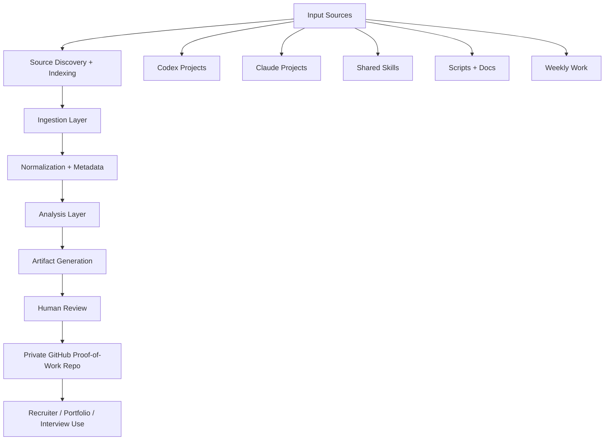

## Human Approval Points

Explain where Marcus reviews decisions manually.

## Failure Modes

| Failure Mode | Risk | Handling |
|---|---|---|
| Bad source quality | Weak decisions | Source quality filter |
| Overclaiming | Loss of credibility | Evidence labels |
| Context bloat | Confusing docs | Summaries and links |
| Sensitive info leakage | Privacy risk | Manual review |
| Stale source index | Missed or outdated evidence | Refresh indexes every 14 days or on user request |
| Local path leakage | Recruiter sees private machine paths | Keep internal maps gitignored / exclude from exports |
```

---

## architecture/INGESTION_MODEL.md

```markdown
# Ingestion Model

Last updated: YYYY-MM-DD

## Purpose

Turn messy inputs into structured, reusable knowledge without exposing sensitive information or bloating the repo.

## Sources

| Source | Data Type | Use | Risk | Handling |
|---|---|---|---|---|
| Chat logs | Ideas / decisions | Strategy extraction | Context bloat / privacy | Summarize, do not dump raw text |
| Codex projects | Repo/documentation work | Evidence and implementation traces | Local/private paths | Index and summarize |
| Claude projects | Strategy/synthesis/instruction work | Decision trail and planning evidence | Raw context leakage | Summarize |
| Shared agents folder | Skills/scripts/docs | Reusable operating assets | Unknown custom layout | Map with internal index |
| Gmail | Recruiter/job signals | Follow-up workflow | Sensitive data | Human approval required |
| Job ads | Role requirements | Application targeting | Expiring links | Snapshot key fields |
| Research links | Market/technical insight | Strategy input | Hype/low quality | Source quality filter |
| GitHub | Artifacts | Proof of work | Oversharing | Private repo / curated sharing |

## Metadata

Track:

- source
- date
- topic
- status
- confidence
- evidence link
- sensitivity level
- recommended destination
- last indexed date
- recruiter-safe status

## Deduplication

Do not create duplicate docs.

Update existing docs unless a new topic deserves its own file.

## Privacy Handling

Do not include:

- private emails
- personal addresses
- sensitive personal data
- credentials
- API keys
- private local paths in recruiter-facing files
- confidential third-party material
- raw chat logs
```

---

## architecture/AUTORESEARCH_MODEL.md

```markdown
# Autoresearch Model

Last updated: YYYY-MM-DD

## Definition

Autoresearch means using scheduled or semi-automated research loops to discover, filter, summarize, and promote useful insights into strategy, architecture, workflows, or product decisions.

## Research Loop

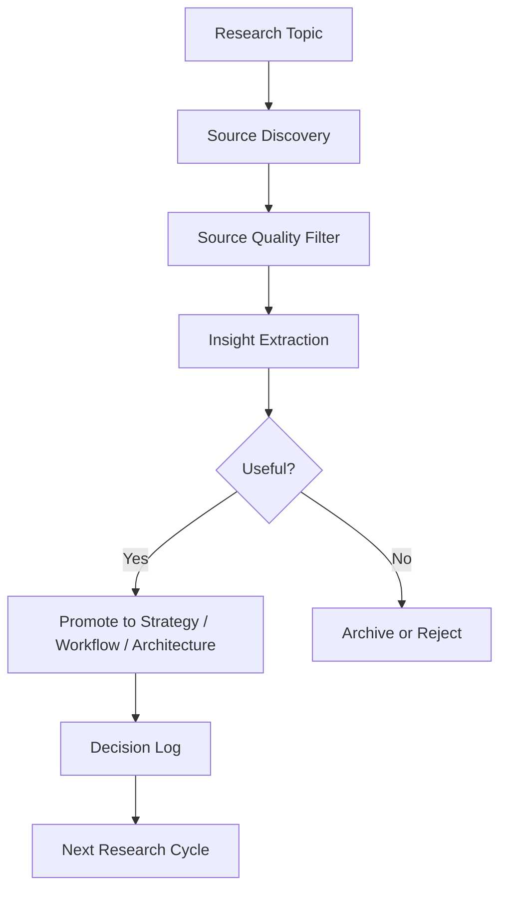

## Source Quality Criteria

| Criterion | Question |
|---|---|
| Primary source | Is this from the builder/company/researcher? |
| Reproducible | Can the claim be tested? |
| Practical | Can it change a workflow or decision? |
| Relevant | Does it apply to Marcus’s projects? |
| Low-hype | Is the claim concrete and bounded? |

## Promotion Rules

Research can become:

- strategy update
- architecture update
- workflow checklist
- Codex instruction
- Claude instruction
- scheduled task
- portfolio insight
- rejected idea

## Anti-Duplication Rule

Before adding a research insight, check whether the same idea already exists in the repo.
```

---

## architecture/RECURSIVE_WORKFLOWS.md

```markdown
# Recursive Workflows

Last updated: YYYY-MM-DD

## Core Loop

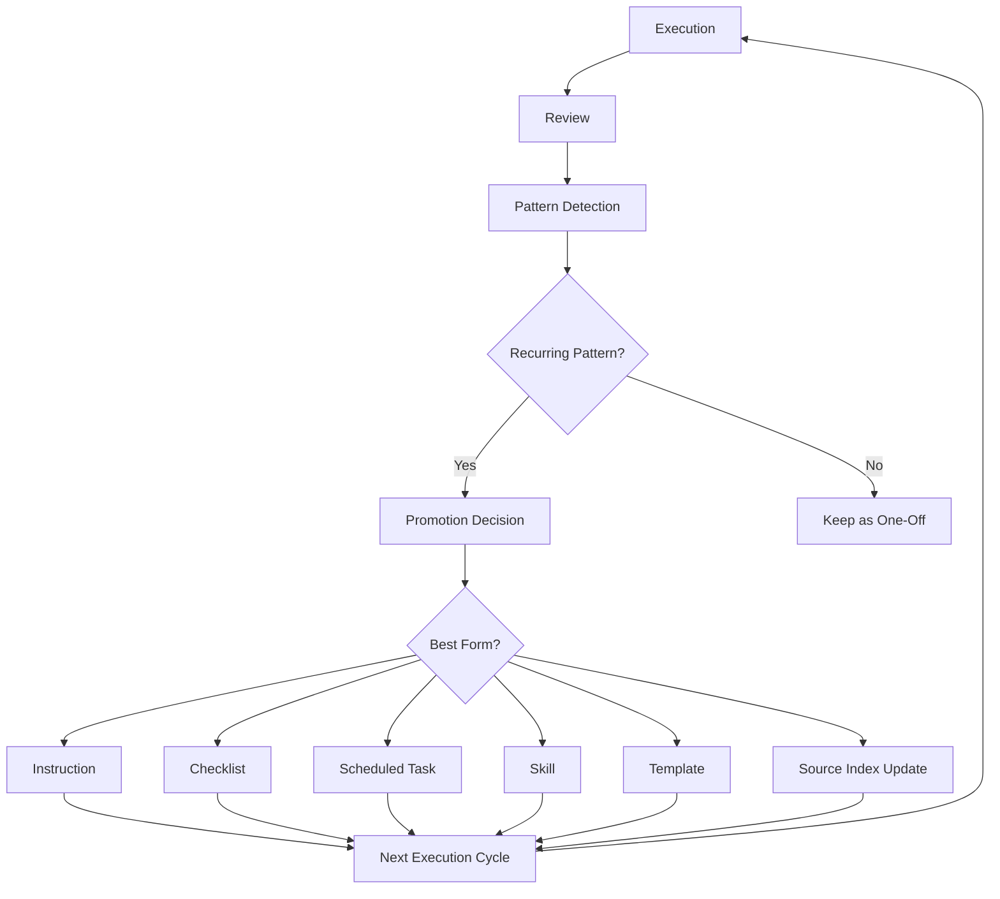

## What Gets Promoted

| Pattern | Destination |
|---|---|
| Repeated prompt | Template or instruction |
| Repeated review step | Checklist |
| Repeated scheduled need | Scheduled task |
| Repeated coding workflow | Codex instruction |
| Repeated reasoning process | Claude instruction |
| Repeated artifact type | Repo template |
| Reusable local skill/script | Skills index |
| Useful local documentation | Documentation index |

## What Gets Deleted

Delete or archive:

- noisy routines
- duplicate prompts
- stale instructions
- unvalidated claims
- workflows that no longer produce value

## Human Gate

No recursive loop should update important instructions without human review.
```

---

# Workflow Documents

## workflows/WORKFLOW_PHILOSOPHY.md

```markdown
# Workflow Philosophy

Last updated: YYYY-MM-DD

## Core Beliefs

- Proof of work beats vague claims.
- AI is an operating layer, not magic.
- Workflow design is leverage.
- Documentation compounds.
- Human judgment remains the final gate.
- Source quality matters.
- Automate repeatable work.
- Review important decisions manually.
- Practical execution matters more than hype.
- Local knowledge only becomes useful when indexed, structured, and reusable.

## How This Shows Up in Practice

| Belief | Practical Behavior |
|---|---|
| Proof of work beats credentials | Maintain recruiter-shareable artifacts |
| Documentation compounds | Weekly logs and decision trails |
| AI is an operating layer | Use Claude and Codex for different strengths |
| Human judgment remains final gate | Review before publishing or sharing |
| Local context should not be rediscovered forever | Maintain source maps and indexes |

## Working Style

Describe the workflow style:

- exploratory first
- structured after signal appears
- promote repeated patterns
- prune noise
- prefer clear artifacts over abstract notes
- reuse existing skills/scripts/docs before creating new ones
```

---

## workflows/AI_OPERATING_MODEL.md

```markdown
# AI Operating Model

Last updated: YYYY-MM-DD

## Operating Model

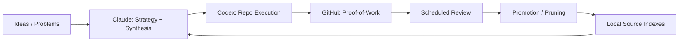

## Roles

| Tool / Layer | Role |
|---|---|
| Claude | reasoning, strategy, synthesis, evaluation |
| Codex | repo updates, structured file changes, implementation planning |
| GitHub | source of truth and proof archive |
| Local Codex projects | historical project evidence |
| Local Claude projects | strategy and planning evidence |
| Shared agents folder | reusable skills, scripts, documentation |
| Scheduled Tasks | recurring review and compilation |
| Human Review | judgment, approval, prioritization |

## Why This Matters

Explain how this reduces duplicated work and turns thinking into reusable assets.
```

---

## workflows/CLAUDE_CODEX_WORKFLOW.md

```markdown
# Claude + Codex Workflow

Last updated: YYYY-MM-DD

## Claude

Best for:

- reasoning
- strategy
- product thinking
- synthesis
- instruction writing
- document drafting
- evaluation

## Codex

Best for:

- repository work
- file updates
- structured documentation maintenance
- implementation planning
- diff-based edits
- repeatable repo hygiene
- source indexing
- keeping proof-of-work docs organized

## Shared Skills / Agents Layer

The shared skills layer lives under local agent folders such as:

```text
C:\Users\marcu\.agents
```

Because Marcus uses a custom shared-skills setup, Codex must inspect indexes before assuming structure.

## Combined Workflow

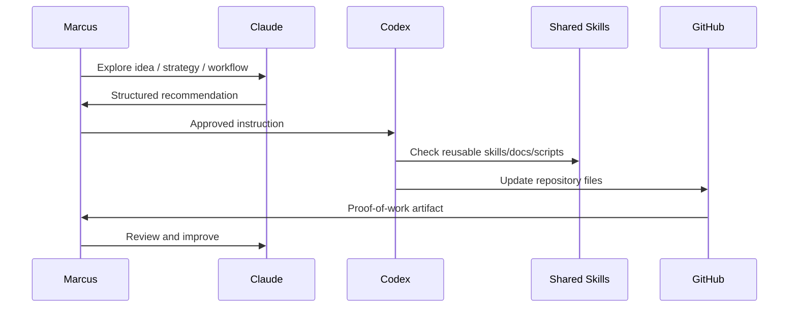

## Operating Rule

Claude explores and structures. Codex maintains the repo. Shared skills provide reusable components. GitHub preserves the proof. Marcus makes final decisions.
```

---

## workflows/SCHEDULED_TASKS_MODEL.md

```markdown
# Scheduled Tasks Model

Last updated: YYYY-MM-DD

## Purpose

Scheduled tasks reduce the chance that useful work disappears into chats, notes, local projects, or memory.

## Task Layers

| Layer | Purpose |
|---|---|
| Daily verifier | Check prior outputs and evidence |
| Command center | Maintain overview |
| Recruiter follow-up | Track job/recruiter signals |
| Source quality filter | Separate useful sources from hype |
| Proof-of-work compiler | Turn weekly work into artifacts |
| Source index refresh | Keep local project/skill maps current |
| Instruction drift audit | Remove duplicate or stale instructions |
| Kill-switch review | Disable routines that no longer produce value |

## Operating Principle

Scheduled tasks should produce artifacts, decisions, or clear next actions.

If they produce noise, they should be merged, rewritten, or disabled.
```

---

# Diagram Files

Create clean Mermaid-based infographic documents.

## diagrams/USER_FLOW.md

```markdown
# User Flow

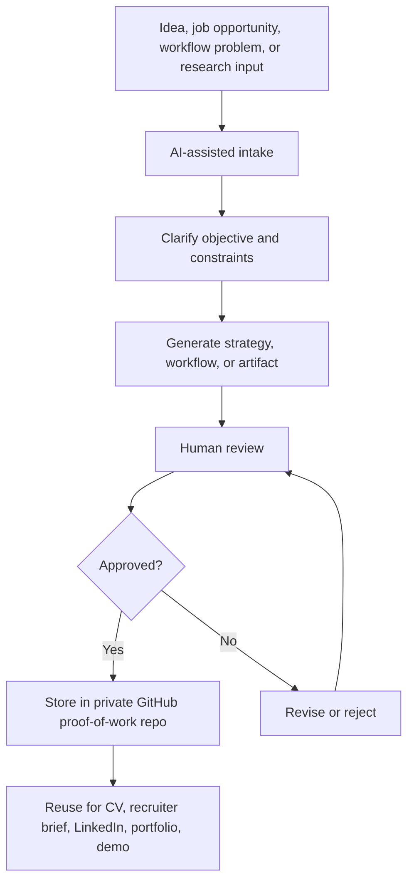
```

---

## diagrams/FUNCTIONAL_MODEL.md

```markdown
# Functional Model

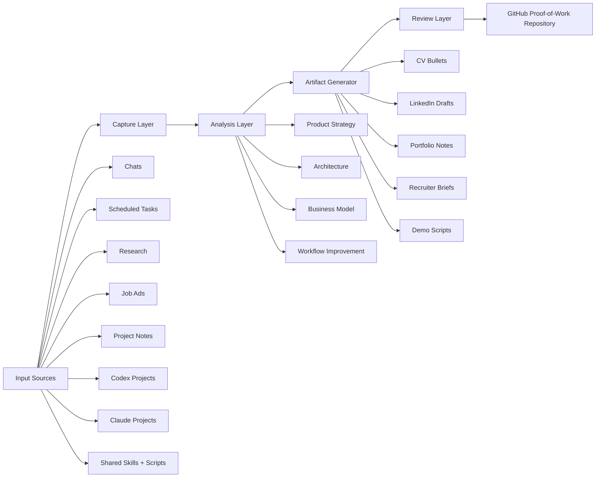
```

---

## diagrams/TECHNICAL_MODEL.md

```markdown
# Technical Model

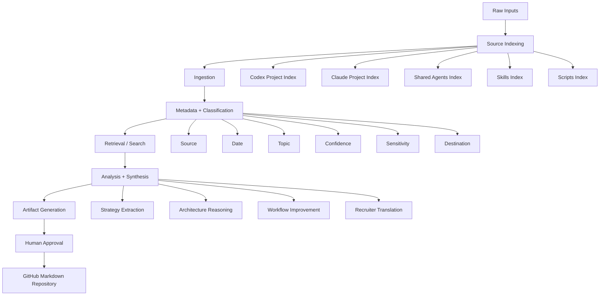
```

---

## diagrams/RECURSIVE_AGENT_MODEL.md

```markdown
# Recursive Agent Model

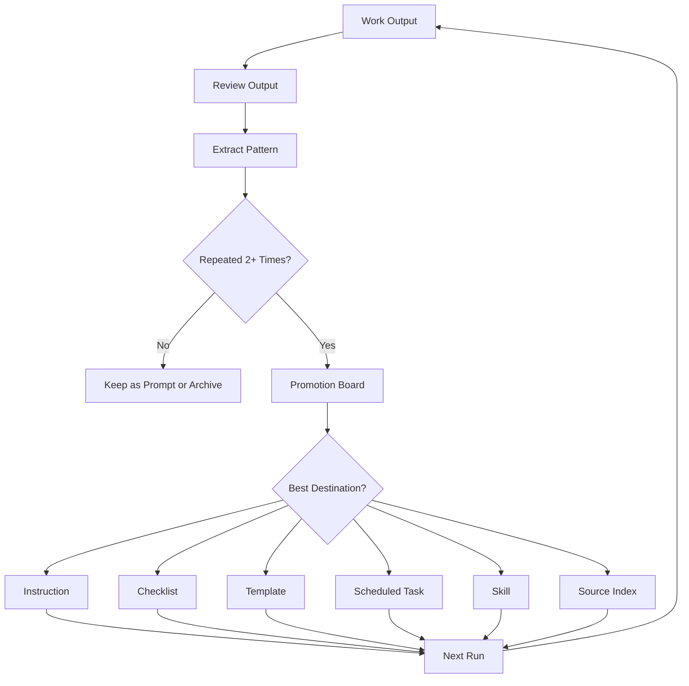
```

---

## diagrams/RECRUITER_VIEW.md

```markdown
# Recruiter View

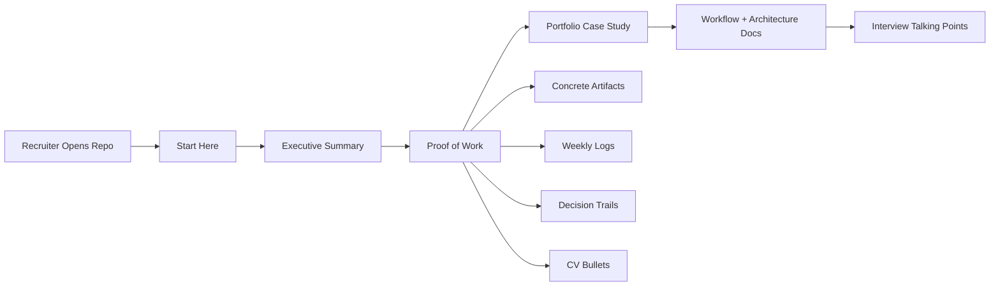
```

---

## diagrams/LOCAL_SOURCE_DISCOVERY_MODEL.md

```markdown
# Local Source Discovery Model

Status: Internal concept. Do not expose local paths in recruiter-facing exports.

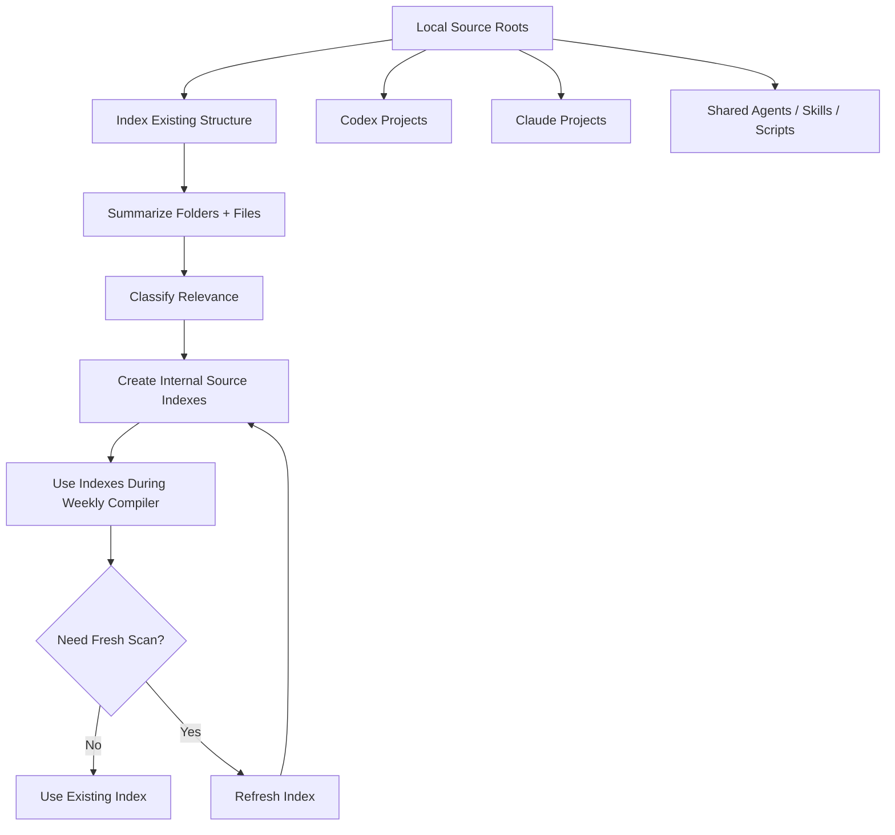
```

---

# Weekly Run

Run this process once per week.

## Weekly Objective

Compile this week’s work into recruiter-readable proof-of-work artifacts.

Before updating artifacts, inspect:

1. `SOURCE_MAP.md`
2. `internal/LOCAL_SOURCE_MAP.md` if available
3. `internal/source-indexes/*.md` if available
4. `logs/WEEKLY_LOG.md`
5. `logs/CHANGELOG.md`
6. `logs/DECISION_LOG.md`
7. `PROOF_OF_WORK.md`
8. newly added or changed files since the last run

If no verified new source material is available, do not invent a weekly update.

Instead, add:

```text
No verified new source material available this week.
Required input: weekly summary, repo changes, exported notes, linked source files, or refreshed source indexes.
```

Create or update:

1. GitHub-ready project log
2. weekly diary / changelog
3. CV bullet
4. LinkedIn post draft
5. portfolio case-study note
6. demo script
7. recruiter-facing summary
8. product strategy updates if changed
9. value proposition updates if changed
10. business model updates if changed
11. pricing strategy updates if changed
12. architecture updates if changed
13. ingestion/autoresearch updates if changed
14. recursive workflow updates if changed
15. Claude + Codex workflow philosophy updates if changed
16. local source index updates if needed

---

# Weekly Log Format

Update `logs/WEEKLY_LOG.md`:

```markdown
# Weekly Log

## Week of YYYY-MM-DD

### 1. Executive Summary

Briefly describe the week’s work in plain language.

### 2. Work Added

| Item | Type | Status | Evidence | Recruiter Relevance |
|---|---|---|---|---|
| | Strategy / Architecture / Workflow / Documentation / Automation / Research / Product / Source Index | Verified / Estimated / Planned | | |

### 3. Workflow Improvements

| Before | After | Improvement | Evidence |
|---|---|---|---|
| | | | |

### 4. Automation Added or Improved

| Automation | Purpose | Input | Output | Current Status |
|---|---|---|---|---|
| | | | | |

### 5. Strategic Decisions

| Decision | Alternatives Considered | Reasoning | Tradeoff | Status |
|---|---|---|---|---|
| | | | | |

### 6. Source Index Updates

| Source | Index Updated? | Evidence Found | Needs Review |
|---|---|---|---|
| Codex projects | Yes / No | | |
| Claude projects | Yes / No | | |
| Shared agents / skills | Yes / No | | |

### 7. Product Thinking

Cover:

- user problem
- value proposition
- target user
- positioning
- feature implications
- risks

### 8. Technical Thinking

Cover:

- ingestion
- data model
- orchestration
- autoresearch
- recursive workflows
- source indexing
- agent review loops
- human approval points
- failure modes

### 9. Problems Encountered

| Problem | Cause | Fix / Current Handling | Lesson |
|---|---|---|---|
| | | | |

### 10. Proof-of-Work Assets Created

- GitHub project log:
- CV bullet:
- LinkedIn draft:
- Portfolio note:
- Demo script:
- Recruiter summary:

### 11. Time / Effort

Use tracked time if available.

If not available:

Time spent: Estimated / not directly tracked.

### 12. Next Week

List only concrete next actions.
```

---

# Decision Log

Update `logs/DECISION_LOG.md` for meaningful changes:

```markdown
# Decision Log

## YYYY-MM-DD — Decision Title

### Context

What situation triggered the decision?

### Options Considered

| Option | Pros | Cons |
|---|---|---|
| | | |

### Decision

What was decided?

### Reasoning Trail

Context → Options Considered → Tradeoffs → Decision → Evidence → Open Questions → Next Action

### Evidence

Links, files, notes, or explicit user input.

### Status

Decision / Hypothesis / Open Question / Rejected
```

---

# Problem-Solving Log

Update `logs/PROBLEM_SOLVING_LOG.md`:

```markdown
# Problem-Solving Log

## YYYY-MM-DD — Problem Title

### Problem

What happened?

### Cause

What likely caused it?

### Attempted Fixes

What was tried?

### Resolution

What worked or what is currently being done?

### Lesson

What should change in the workflow?

### Reusable Rule

Should this become:

- instruction
- checklist
- scheduled task
- template
- source index update
- no action
```

---

# Recruiter Assets

## recruiter-assets/CV_BULLETS.md

Each bullet must follow one of these structures:

```text
Built/designed/implemented [system/workflow] that [practical function], improving [workflow/result] by [verified or estimated measure], using [tools/approach].
```

Or, if no metric exists:

```text
Built/designed [system/workflow] to reduce [manual friction/problem] by converting [input] into [reusable output].
```

Do not invent metrics.

Group bullets by role relevance:

```markdown
# CV Bullets

## AI Transformation / Automation

## Product Operations

## Business Development

## Digital Transformation

## Customer Outcome / AI Adoption

## Technical Product Strategy
```

---

## recruiter-assets/LINKEDIN_DRAFTS.md

Each draft must:

- be sober
- show a real workflow problem
- include before/after
- include one practical insight
- avoid generic thought-leader language
- avoid “excited to share”
- avoid fake metrics
- avoid inflated AI claims

Use this structure:

```markdown
# LinkedIn Drafts

## Draft — YYYY-MM-DD

### Topic

### Draft

### Proof Point Used

### Claim Risk

Low / Medium / High

### Needs Evidence?

Yes / No
```

---

## recruiter-assets/RECRUITER_SUMMARY.md

Use this format:

```markdown
# Recruiter Summary

## One-Sentence Positioning

AI-native operator focused on workflow automation, product thinking, and practical execution.

## What This Repository Shows

- ability to structure ambiguous problems
- ability to design automation workflows
- ability to reason about product strategy
- ability to document technical and business decisions
- ability to use AI tools as an operating system rather than a gimmick
- ability to organize local knowledge into reusable systems

## Selected Proof Points

| Proof Point | Evidence | Relevance |
|---|---|---|
| | | |

## Roles This Supports

- AI Transformation
- Digital Transformation
- Product Operations
- Business Development
- Automation Specialist
- AI Workflow Designer
- Customer Outcome / AI Adoption roles

## Best Interview Angles

List concise talking points.
```

---

# Portfolio and Demo

## PORTFOLIO_CASE_STUDY.md

Use this format:

```markdown
# Portfolio Case Study

## Problem

## Context

## Constraints

## Approach

## Architecture / Workflow

## Strategic Decisions

## Tradeoffs

## Result

## What I Would Improve Next

## Recruiter-Relevant Skills Demonstrated
```

---

## DEMO_SCRIPT.md

The demo must be usable for a 3–5 minute walkthrough.

Required structure:

```markdown
# Demo Script

## 1. Opening

Explain the problem.

## 2. Repository Structure

Show how the repo is organized.

## 3. Proof of Work

Show `PROOF_OF_WORK.md`.

## 4. Strategy

Show value proposition, product strategy, business model, and pricing docs.

## 5. Architecture

Show architecture, ingestion, autoresearch, recursive workflow, and source indexing docs.

## 6. Workflow Philosophy

Show Claude + Codex workflow and AI operating model.

## 7. Weekly Execution

Show weekly log, changelog, decision log, and problem-solving log.

## 8. Recruiter Relevance

Show recruiter summary, CV bullets, and interview talking points.

## 9. Closing

Explain what this demonstrates:

- structured thinking
- practical automation
- product judgment
- documentation discipline
- ability to work with AI tools as an operating system
- ability to organize messy local knowledge into reusable proof
```

---

# Privacy and Redaction Rule

Before writing recruiter-shareable files, remove or generalize:

- private email contents
- personal phone numbers
- home addresses
- private recruiter names unless approved
- confidential company information
- internal PostNord details that should not be public
- sensitive personal data
- raw chat logs
- private family/health references
- credentials
- tokens
- API keys
- secrets
- private local machine paths
- internal `.codex`, `.claude`, `.agents` folder details

Use generalized phrasing when needed.

Example:

Instead of:

```text
I discussed X with [specific person] at [company] about [internal system].
```

Use:

```text
I explored an internal workflow improvement involving field data capture, master data quality, and operational feedback loops.
```

---

# SHARING_CHECKLIST.md

Create `SHARING_CHECKLIST.md`:

```markdown
# Sharing Checklist

Before sharing this repository or any export with recruiters, verify:

## Private Information

- [ ] No private local Windows paths
- [ ] No raw chat logs
- [ ] No private emails
- [ ] No phone numbers or addresses
- [ ] No secrets, tokens, or API keys
- [ ] No confidential third-party details
- [ ] No sensitive personal information

## Claim Quality

- [ ] Metrics are verified or clearly estimated
- [ ] Speculative claims are labeled
- [ ] Planned work is not presented as completed
- [ ] Rejected/deferred ideas are clear

## Recruiter Readability

- [ ] `START_HERE.md` is clear
- [ ] `EXECUTIVE_SUMMARY.md` is readable without context
- [ ] `PROOF_OF_WORK.md` has concrete artifacts
- [ ] `RECRUITER_BRIEF.md` is concise
- [ ] Diagrams render correctly

## Technical Depth

- [ ] Architecture docs are available for deeper review
- [ ] Technical docs do not overwhelm recruiter-facing route
- [ ] Internal-only source maps are excluded or sanitized
```

---

# Evidence Labels

Every meaningful claim should be labeled when appropriate.

| Label | Meaning |
|---|---|
| `Verified` | Supported by an artifact, file, commit, screenshot, source, or explicit user input |
| `Estimated` | Plausible but not directly measured |
| `Planned` | Intended but not yet completed |
| `Open Question` | Still unresolved |
| `Decision` | A strategic, architectural, workflow, or product decision |
| `Hypothesis` | A testable product/business assumption |
| `Rejected` | Considered and intentionally not pursued |
| `Internal` | Useful for operation but not recruiter-facing |
| `Needs Review` | Stale or uncertain artifact |

Do not invent exact metrics.

If time is not tracked, write:

```text
Time spent: Estimated / not directly tracked.
```

---

# Static File Protection

Do not rewrite static strategy files unless one of these is true:

1. The user explicitly requested a change.
2. New evidence changes the value proposition, business model, pricing, architecture, or positioning.
3. A decision log entry explains why the change was made.
4. The existing file is clearly incomplete, duplicated, or outdated.

If updating a static file, also update:

```text
logs/DECISION_LOG.md
```

---

# Artifact Freshness

Each major artifact should include:

```text
Last updated: YYYY-MM-DD
Status: Verified / Estimated / Planned / Open Question / Decision / Hypothesis
```

If a document has not been updated in more than 30 days, mark it as:

```text
Needs review
```

Internal source indexes older than 14 days should be marked:

```text
Needs refresh
```

---

# Recruiter Reading Path

Maintain this clear recruiter reading path:

1. `START_HERE.md`
2. `EXECUTIVE_SUMMARY.md`
3. `PROOF_OF_WORK.md`
4. `PORTFOLIO_CASE_STUDY.md`
5. `diagrams/RECRUITER_VIEW.md`
6. `recruiter-assets/RECRUITER_SUMMARY.md`
7. `recruiter-assets/CV_BULLETS.md`

These files must be readable without deep technical context.

---

# Quality Gate

Before completing any weekly run, verify:

- Are all claims grounded?
- Are speculative claims marked as hypotheses or open questions?
- Are metrics either verified or clearly estimated?
- Are diagrams valid Mermaid?
- Are recruiter-facing files readable without context?
- Is the weekly log updated?
- Is there a clear before/after workflow improvement?
- Are technical docs understandable to a non-engineer?
- Are deeper technical sections available for advanced review?
- Is sensitive/private information excluded?
- Are static files only changed when there is a real reason?
- Is the repo still useful if shared with a recruiter?
- Is the writing clear, concise, and credible?
- Does the repo show decision quality, not just activity?
- Are local source indexes fresh enough?
- Are private local paths excluded from recruiter-facing docs?

If any answer is no, fix it before finishing.

---

# Operating Rules for Codex

1. Inspect existing files before editing.
2. Preserve useful prior work.
3. Update incrementally unless a file is clearly wrong or obsolete.
4. Do not create duplicate documents.
5. Keep Markdown clean and GitHub-readable.
6. Use Mermaid for infographics.
7. Do not add application code unless explicitly requested.
8. Do not expose private/sensitive information.
9. Do not fabricate metrics, commits, evidence, or source contents.
10. Mark uncertainty clearly.
11. Keep recruiter-facing documents readable without technical background.
12. Keep technical documents available for deeper review.
13. Separate static strategy from weekly updates.
14. Record meaningful strategy or architecture changes in the decision log.
15. Prioritize substance over volume.
16. Check source indexes before rescanning local roots.
17. Refresh stale source indexes when necessary.
18. Summarize local sources; do not dump raw content.
19. Respect Marcus’s custom shared-skills setup.
20. Treat `.agents` as potentially important but structurally non-standard.
21. Treat `https://github.com/TheOneDarkHorse/ai-native-proof-of-work` as the canonical repository.
22. If not running inside the repo, report that limitation before attempting edits.

---

# Weekly Final Response Format

At the end of each weekly run, return:

```markdown
# Weekly Proof-of-Work Compiler Result

## Updated Files

| File | Change | Reason |
|---|---|---|
| | | |

## New Artifacts

| Artifact | Purpose | Recruiter Relevance |
|---|---|---|
| | | |

## Static Files Changed

| File | Why It Changed | Decision Log Updated? |
|---|---|---|
| | | Yes / No |

## Source Index Updates

| Index | Updated? | Reason | Freshness |
|---|---|---|---|
| CODEX_ROOT_INDEX.md | Yes / No | | |
| CODEX_PROJECTS_INDEX.md | Yes / No | | |
| CLAUDE_ROOT_INDEX.md | Yes / No | | |
| CLAUDE_PROJECTS_INDEX.md | Yes / No | | |
| AGENTS_ROOT_INDEX.md | Yes / No | | |
| SKILLS_INDEX.md | Yes / No | | |
| SCRIPTS_INDEX.md | Yes / No | | |
| DOCUMENTATION_INDEX.md | Yes / No | | |

## Key Proof-of-Work This Week

1.
2.
3.

## Claims That Need Evidence

| Claim | Missing Evidence | Suggested Fix |
|---|---|---|
| | | |

## Problems / Blockers

| Problem | Current Handling | Next Action |
|---|---|---|
| | | |

## Suggested Next Action

One concrete next action only.
```

---

# Definition of Done

A weekly run is complete only when:

- `logs/WEEKLY_LOG.md` has a new weekly entry
- `PROOF_OF_WORK.md` reflects the strongest current evidence
- recruiter-facing assets are updated
- any changed strategy or architecture docs have decision-log entries
- diagrams are valid Mermaid
- no sensitive/private material is included
- private local paths are excluded from recruiter-facing docs
- all speculative claims are labeled
- local source indexes are checked or marked stale
- final response lists updated files, new artifacts, source index status, missing evidence, and one next action
