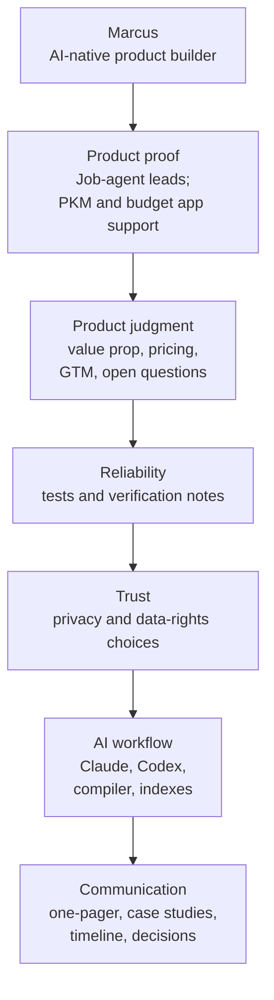

# Evidence Matrix

Last updated: 2026-06-01
Status: Active / Recruiter-facing

## Purpose

This matrix maps recruiter-relevant capabilities to concrete proof points.

Use it as a quick scan before reading the deeper case studies.

## Visual Map

## Capability Matrix

| Capability | Evidence | Status | Why It Matters |
|---|---|---|---|
| Full-stack product execution | [case-studies/JOB_AGENT_CASE_STUDY.md](case-studies/JOB_AGENT_CASE_STUDY.md) | Internal / Verified | Shows a broad product system, not only documentation |
| Current project progression | [PROJECT_STATUS.md](PROJECT_STATUS.md), [PROJECT_TIMELINE.md](PROJECT_TIMELINE.md) | Internal / Verified | Shows what is complete, what is progressing, and what remains blocked |
| Career-domain product judgment | [PROJECT_PROOF_POINTS.md](PROJECT_PROOF_POINTS.md), [strategy/job-agent/product/VALUE_PROPOSITION.md](strategy/job-agent/product/VALUE_PROPOSITION.md) | Hypothesis / Internal Verified | Connects project execution to job-search workflow pain |
| Knowledge workflow design | [case-studies/PKM_CASE_STUDY.md](case-studies/PKM_CASE_STUDY.md) | Internal / Verified | Shows ingestion, search, learning, and prioritization thinking |
| Financial domain modeling | [case-studies/HOUSEHOLD_BUDGET_CASE_STUDY.md](case-studies/HOUSEHOLD_BUDGET_CASE_STUDY.md) | Internal / Verified | Shows careful modeling of household data, imports, goals, and forecasts |
| QA and regression discipline | Job-agent and budget case studies | Internal / Verified | Shows attention to reliability and verification, not just ideation |
| Reproducible product handoff | [case-studies/JOB_AGENT_INSTALL_AND_HANDOFF.md](case-studies/JOB_AGENT_INSTALL_AND_HANDOFF.md), [PROJECT_STATUS.md](PROJECT_STATUS.md) | Verified | Shows that setup claims are tied to source-verified env files, startup docs, ports, and validation paths rather than memory |
| Published product snapshots | [Published Demo Portal](https://theonedarkhorse.github.io/ai-native-proof-of-work-demo/) | Verified | Gives reviewers a no-install way to inspect the main product surfaces before reading deeper docs |
| Privacy-aware execution | [SOURCE_MAP.md](SOURCE_MAP.md), [SHARING_CHECKLIST.md](SHARING_CHECKLIST.md) | Verified | Shows judgment about what should and should not be shared |
| Structured decision-making | [logs/DECISION_LOG.md](logs/DECISION_LOG.md), [strategy/job-agent/decisions/DECISION_TRAIL.md](strategy/job-agent/decisions/DECISION_TRAIL.md) | Decision | Makes tradeoffs visible without exposing private reasoning |
| Automation as operating layer | [AUTOMATION_PROMPT.md](AUTOMATION_PROMPT.md), [prompts/WEEKLY_PROOF_OF_WORK_COMPILER.md](prompts/WEEKLY_PROOF_OF_WORK_COMPILER.md), [workflows/CLAUDE_CODEX_WORKFLOW.md](workflows/CLAUDE_CODEX_WORKFLOW.md) | Verified | Shows repeatability, review discipline, and evidence packaging |
| Recruiter communication | [RECRUITER_ONE_PAGER.md](RECRUITER_ONE_PAGER.md), [RECRUITER_BRIEF.md](RECRUITER_BRIEF.md), recruiter assets | Verified | Makes the portfolio easier to evaluate quickly |

## Evidence Gaps To Close Next

| Gap | Why It Matters | Suggested Fix |
|---|---|---|
| Public-safe job-agent screenshots | Makes the product feel more concrete | Add 2-4 sanitized screenshots after privacy review |
| Selected commit/test references for job-agent | Strengthens verification beyond summaries | Add safe commit hashes or copied test result summaries if shareable |
| Recruiter feedback | Validates whether the repo improves interview quality | Log recruiter/hiring-manager reactions when available |
