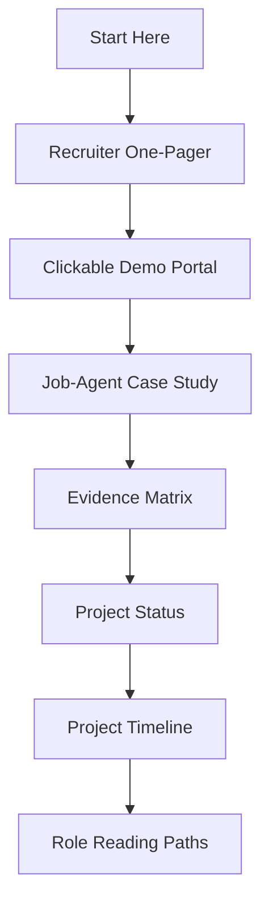

# Navigation Hub

Last updated: 2026-06-01
Status: Active / Recruiter-facing

## Purpose

This page is the simplest map through the repository.

Use it if the file list feels overwhelming.

## If You Have 5 Minutes

| Step | Open | Why |
|---|---|---|
| 1 | [Recruiter One-Pager](RECRUITER_ONE_PAGER.md) | Fast overview of the strongest proof points |
| 2 | [Published Demo Portal](https://theonedarkhorse.github.io/ai-native-proof-of-work-demo/) | Quick product feel without installing anything |
| 3 | [Job-Agent Case Study](case-studies/JOB_AGENT_CASE_STUDY.md) | Lead project proof point |
| 4 | [Evidence Matrix](EVIDENCE_MATRIX.md) | Capability-to-evidence map |

Best freshest status check: [Project Status](PROJECT_STATUS.md) plus [Project Timeline](PROJECT_TIMELINE.md).

## If You Have 15 Minutes

| Step | Open | Why |
|---|---|---|
| 1 | [Start Here](START_HERE.md) | One-minute orientation |
| 2 | [Recruiter One-Pager](RECRUITER_ONE_PAGER.md) | Summary of positioning and proof |
| 3 | [Published Demo Portal](https://theonedarkhorse.github.io/ai-native-proof-of-work-demo/) | Static click-through for job-agent, PKM, and budget app |
| 4 | [Job-Agent Case Study](case-studies/JOB_AGENT_CASE_STUDY.md) | Main product evidence |
| 5 | [Evidence Matrix](EVIDENCE_MATRIX.md) | Capability map |
| 6 | [Project Status](PROJECT_STATUS.md) | Current state and open work |
| 7 | [Project Timeline](PROJECT_TIMELINE.md) | Progression over time |
| 8 | [Role Reading Paths](ROLE_READING_PATHS.md) | Choose the angle that fits the role |

## If You Have 30 Minutes

| Step | Open | Why |
|---|---|---|
| 1 | [Recruiter Agent Guide](RECRUITER_AGENT_GUIDE.md) | Best path for agents and structured review |
| 2 | [Evidence Matrix](EVIDENCE_MATRIX.md) | Capability map |
| 3 | [Project Status](PROJECT_STATUS.md) | Current state, progress, and blockers |
| 4 | [Project Proof Points](PROJECT_PROOF_POINTS.md) | Portfolio-level evidence |
| 5 | [Job-Agent Case Study](case-studies/JOB_AGENT_CASE_STUDY.md) | Lead project |
| 6 | [PKM Case Study](case-studies/PKM_CASE_STUDY.md) | Supporting knowledge-system evidence |
| 7 | [Household Budget App Case Study](case-studies/HOUSEHOLD_BUDGET_CASE_STUDY.md) | Supporting domain-modeling evidence |
| 8 | [Decision Log](logs/DECISION_LOG.md) | Tradeoffs and positioning decisions |
| 9 | [Before / After Snapshots](BEFORE_AFTER_SNAPSHOTS.md) | How the portfolio improved |

## Technical Reviewer / LLM Handoff

| Step | Open | Why |
|---|---|---|
| 1 | [Recruiter Agent Guide](RECRUITER_AGENT_GUIDE.md) | Agent-readable review path |
| 2 | [Job-Agent Install And Handoff Guide](case-studies/JOB_AGENT_INSTALL_AND_HANDOFF.md) | Reproducible setup path for the lead product |
| 3 | [Architecture Overview](architecture/ARCHITECTURE.md) | Technical model |
| 4 | [AI Operating Model](workflows/AI_OPERATING_MODEL.md) | How the workflow layer works |
| 5 | [llms.txt](llms.txt) | Machine-readable repository map |

## By Question

| Question | Best File |
|---|---|
| What is this repo? | [Start Here](START_HERE.md) |
| What should a recruiter read first? | [Recruiter One-Pager](RECRUITER_ONE_PAGER.md) |
| Where can I click through product demos? | [Published Demo Portal](https://theonedarkhorse.github.io/ai-native-proof-of-work-demo/) |
| What should an agent read first? | [Recruiter Agent Guide](RECRUITER_AGENT_GUIDE.md) |
| What is the strongest project? | [Job-Agent Case Study](case-studies/JOB_AGENT_CASE_STUDY.md) |
| How can another user install the lead product? | [Job-Agent Install And Handoff Guide](case-studies/JOB_AGENT_INSTALL_AND_HANDOFF.md) |
| What is the current project status? | [Project Status](PROJECT_STATUS.md) |
| What capabilities are evidenced? | [Evidence Matrix](EVIDENCE_MATRIX.md) |
| How did this develop over time? | [Project Timeline](PROJECT_TIMELINE.md) |
| What role does this support? | [Role Reading Paths](ROLE_READING_PATHS.md) |
| What changed and why? | [Decision Log](logs/DECISION_LOG.md) |
| What evidence is private/internal? | [Source Map](SOURCE_MAP.md) |
| Where is project strategy documented? | [Project Strategy Index](strategy/README.md) |
| How can another person recreate this repository system? | [Template Adoption Kit](template/README.md) |
| Is the weekly compiler scheduled? | [Weekly Automation Runbook](template/WEEKLY_AUTOMATION_RUNBOOK.md) |

## What Not To Start With

These file areas are useful, but they are not the best first read for a non-technical recruiter.

| File Area | Use Later For |
|---|---|
| [architecture/](architecture/) | Technical depth after the project story is clear |
| [strategy/](strategy/) | Project-level product, business, pricing, GTM, and positioning strategy |
| [workflows/](workflows/) | Operating model details |
| [prompts/](prompts/) | Automation maintenance |
| [logs/](logs/) | Chronology and audit trail |
| [weekly-input/](weekly-input/) | Weekly compiler input notes |
| [template/](template/) | Clone/fork adoption kit for reusing the system |
| [internal/](internal/) | Local-only source maps and templates; not recruiter-facing |

## Recommended Summary Path

