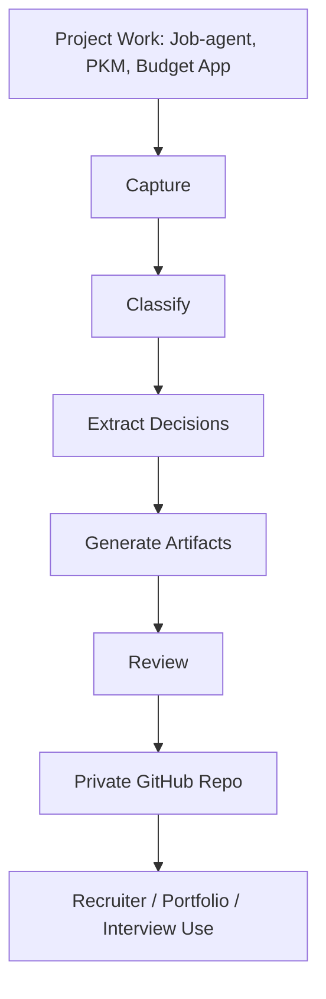

# Portfolio Case Study

Last updated: 2026-05-09
Status: Active / Project-focused

## Problem

Substantial product work often disappears into local codebases, task folders, AI chats, test logs, handoff notes, and project-specific documentation.

This makes it harder to show practical execution to recruiters, hiring managers, or collaborators.

## Context

The work spans job-agent, PKM, a household budget app, Claude, Codex, scheduled tasks, GitHub documentation, local project archives, reusable skills, research inputs, and recruiter-facing career materials.

The main portfolio mistake to avoid is making the documentation automation look like the whole product story. The automation should be documented as the packaging and review layer. The projects are the primary proof.

## Constraints

- Avoid exposing private local paths or sensitive material.
- Avoid fake metrics and inflated claims.
- Keep recruiter-facing materials readable without deep technical background.
- Preserve enough technical depth for advanced review.
- Make weekly updates repeatable.

## Approach

Create a private GitHub proof-of-work repository that foregrounds:

- job-agent as the primary product proof point
- PKM as supporting knowledge-system evidence
- the household budget app as supporting domain-modeling and test-discipline evidence

Use:

- structured Markdown files
- Mermaid diagrams
- weekly logs
- decision trails
- strategy docs
- architecture docs
- recruiter assets
- source maps
- privacy rules
- evidence labels

## Architecture / Workflow

## Strategic Decisions

| Decision | Reason | Status |
|---|---|---|
| Make concrete projects the lead proof points | Recruiters need to see what was built, not only how it was documented | Decision |
| Lead with job-agent | It has the strongest direct link to career workflows, product execution, privacy, QA, and deployment planning | Decision |
| Use Markdown as canonical source | GitHub-readable and easy to version | Decision |
| Keep repo private | Reduces privacy and oversharing risk | Decision |
| Use evidence labels | Avoids inflated claims | Decision |
| Use Mermaid diagrams | Gives lightweight visual structure | Decision |
| Separate static strategy from weekly logs | Prevents unnecessary churn | Decision |

## Tradeoffs

| Choice | Benefit | Cost |
|---|---|---|
| Markdown-first | Simple, versionable, GitHub-native | Less visually polished than slides |
| Private repo | Safer sharing | Requires explicit recruiter access |
| Evidence-first | More credible | Slower than generic content generation |
| Local source indexes | Less repeated discovery | Must manage privacy and freshness |
| Project-first positioning | Stronger recruiter signal | Requires careful summarization of private/local evidence |

## Result

Initial scaffold created and committed as `1c74a04` (`Bootstrap AI-native proof-of-work repository`). The first weekly compiler pass now treats the repository scaffold, decision standard, recruiter asset set, and automation prompt as verified repo-visible evidence.

Local source indexes were then created as internal, gitignored artifacts. They keep Codex projects, Claude projects, and shared agent assets separate so future proof extraction can distinguish execution evidence from strategy/planning evidence and reusable workflow infrastructure.

The repository has now been repositioned so job-agent, PKM, and the household budget app are the primary project evidence. The proof-of-work compiler remains documented as evidence of repeatable automation for extraction, review, privacy, and recruiter translation.

## What I Would Improve Next

1. Create a sanitized job-agent case-study page with evidence labels.
2. Add shorter supporting case-study notes for PKM and the household budget app.
3. Create a first export PDF after the repo passes the sharing checklist.

## Recruiter-Relevant Skills Demonstrated

- workflow design
- full-stack product execution
- product strategy
- documentation architecture
- AI-native operating model design
- technical communication
- privacy-aware artifact creation
- structured decision-making
