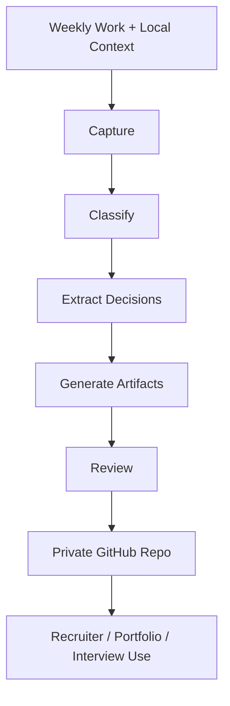

# Portfolio Case Study

Last updated: 2026-05-08  
Status: Initial scaffold / Needs evidence

## Problem

Useful work often disappears into chat histories, local project folders, undocumented experiments, and scattered notes.

This makes it harder to show practical execution to recruiters, hiring managers, or collaborators.

## Context

The work spans Claude, Codex, scheduled tasks, GitHub documentation, local project archives, reusable skills, research inputs, and recruiter-facing career materials.

## Constraints

- Avoid exposing private local paths or sensitive material.
- Avoid fake metrics and inflated claims.
- Keep recruiter-facing materials readable without deep technical background.
- Preserve enough technical depth for advanced review.
- Make weekly updates repeatable.

## Approach

Create a private GitHub proof-of-work repository with:

- structured Markdown files
- Mermaid diagrams
- weekly logs
- decision trails
- strategy docs
- architecture docs
- recruiter assets
- source maps
- privacy rules
- evidence labels

## Architecture / Workflow

## Strategic Decisions

| Decision | Reason | Status |
|---|---|---|
| Use Markdown as canonical source | GitHub-readable and easy to version | Decision |
| Keep repo private | Reduces privacy and oversharing risk | Decision |
| Use evidence labels | Avoids inflated claims | Decision |
| Use Mermaid diagrams | Gives lightweight visual structure | Decision |
| Separate static strategy from weekly logs | Prevents unnecessary churn | Decision |

## Tradeoffs

| Choice | Benefit | Cost |
|---|---|---|
| Markdown-first | Simple, versionable, GitHub-native | Less visually polished than slides |
| Private repo | Safer sharing | Requires explicit recruiter access |
| Evidence-first | More credible | Slower than generic content generation |
| Local source indexes | Less repeated discovery | Must manage privacy and freshness |

## Result

Initial scaffold created. Evidence-backed weekly updates still need to be populated.

## What I Would Improve Next

1. Add first real weekly proof-of-work entry.
2. Index local Codex/Claude/agents folders.
3. Populate recruiter assets with verified proof points.
4. Create a first export PDF after the repo passes the sharing checklist.

## Recruiter-Relevant Skills Demonstrated

- workflow design
- product strategy
- documentation architecture
- AI-native operating model design
- technical communication
- privacy-aware artifact creation
- structured decision-making
