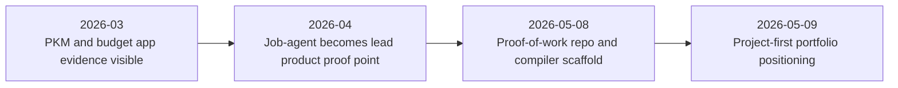

# Project Timeline

Last updated: 2026-05-09
Status: Active / Living milestone log

## Purpose

This timeline shows how the proof-of-work portfolio develops over time.

It is not a full changelog. It highlights recruiter-relevant milestones across job-agent, PKM, the household budget app, and the proof-of-work automation that packages the work.

## Timeline View

## Milestone Log

| Date / Period | Milestone | Project / Layer | Status | Evidence | Recruiter Relevance |
|---|---|---|---|---|---|
| 2026-03 | PKM project evidence appears in local Codex project material | PKM | Internal / Verified | Source summary in `PROJECT_PROOF_POINTS.md` | Shows knowledge workflow, ingestion, search, learning, and feature lifecycle thinking |
| 2026-03 to 2026-04 | Household budget app develops product memory, domain spec, roadmap, import/review work, household access, and tests | Household budget app | Internal / Verified | Source summary in `PROJECT_PROOF_POINTS.md` | Shows financial domain modeling, security-aware shared data, and test-backed execution |
| 2026-04 | Job-agent becomes a broad career workflow product | Job-agent | Internal / Verified | Source summary in `PROJECT_PROOF_POINTS.md` | Shows full-stack product execution in a career domain |
| 2026-04 | Job-agent QA and privacy/trust work becomes a strong proof point | Job-agent | Internal / Verified | Source summary in `PROJECT_PROOF_POINTS.md` | Shows regression testing, Playwright coverage, GDPR/data-rights planning, and production-readiness thinking |
| 2026-05-08 | Private proof-of-work repository scaffold created | Proof-of-work repo | Verified | Commit `1c74a04`, `README.md`, `AGENTS.md` | Shows documentation architecture and evidence discipline |
| 2026-05-08 | Weekly compiler prompt and recruiter asset set created | Automation / documentation | Verified | `AUTOMATION_PROMPT.md`, `prompts/WEEKLY_PROOF_OF_WORK_COMPILER.md`, `recruiter-assets/` | Shows repeatable packaging of project evidence |
| 2026-05-08 | Local source indexes created | Automation / source mapping | Internal / Verified | Summarized in `SOURCE_MAP.md` and `PROJECT_PROOF_POINTS.md` | Shows source separation and privacy-aware evidence extraction |
| 2026-05-09 | Project-first repositioning completed | Portfolio positioning | Decision / Verified | `PROJECT_PROOF_POINTS.md`, `PROOF_OF_WORK.md`, `logs/DECISION_LOG.md` | Makes job-agent the lead proof point while keeping automation documented as the operating layer |

## How To Maintain This

Add a new row when a milestone changes the story of the portfolio, not for every small file edit.

Good milestone candidates:

- a project reaches a new usable state
- a major feature area lands
- a meaningful QA or privacy milestone closes
- a recruiter-facing case study is added
- a decision changes the portfolio positioning
- automation improves how evidence is captured or reviewed

Use evidence labels:

- `Verified` for repo-visible commits or files
- `Internal / Verified` for indexed local project evidence
- `Decision` for positioning or architecture choices
- `Planned` for intended future milestones

## Next Planned Milestones

| Planned Milestone | Why It Matters | Suggested Evidence |
|---|---|---|
| Sanitized job-agent case study | Turns the strongest product proof point into a recruiter-readable artifact | Case-study Markdown with evidence labels |
| PKM supporting case-study note | Shows knowledge workflow and ingestion/search capability | Short project note with sanitized evidence |
| Household budget app supporting case-study note | Shows domain modeling, privacy/security, and test discipline outside the career domain | Short project note with sanitized evidence |
| First recruiter export | Tests whether the repo can become a shareable review packet | PDF or curated Markdown export after privacy review |
