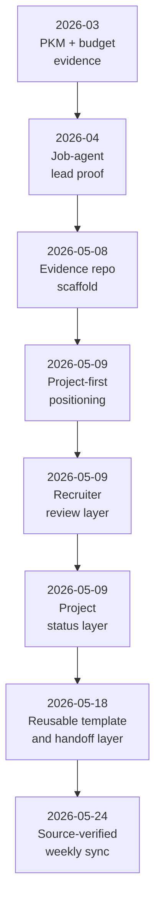

# Project Timeline

Last updated: 2026-05-24
Status: Active / Living milestone log

## Purpose

This timeline shows how the product portfolio and its evidence layer develop over time.

It is not a full changelog. It highlights recruiter-relevant milestones across job-agent, PKM, the household budget app, and the documentation automation that packages the work.

## Timeline View

## Milestone Log

| Date / Period | Milestone | Project / Layer | Status | Evidence | Recruiter Relevance |
|---|---|---|---|---|---|
| 2026-03 | PKM project evidence appears in local Codex project material | PKM | Internal / Verified | Source summary in [PROJECT_PROOF_POINTS.md](PROJECT_PROOF_POINTS.md) | Shows knowledge workflow, ingestion, search, learning, and feature lifecycle thinking |
| 2026-03 to 2026-04 | Household budget app develops product memory, domain spec, roadmap, import/review work, household access, and tests | Household budget app | Internal / Verified | Source summary in [PROJECT_PROOF_POINTS.md](PROJECT_PROOF_POINTS.md) | Shows financial domain modeling, security-aware shared data, and test-backed execution |
| 2026-04 | Job-agent becomes a broad career workflow product | Job-agent | Internal / Verified | Source summary in [PROJECT_PROOF_POINTS.md](PROJECT_PROOF_POINTS.md) | Shows full-stack product execution in a career domain |
| 2026-04 | Job-agent QA and privacy/trust work becomes a strong proof point | Job-agent | Internal / Verified | Source summary in [PROJECT_PROOF_POINTS.md](PROJECT_PROOF_POINTS.md) | Shows regression testing, Playwright coverage, GDPR/data-rights planning, and production-readiness thinking |
| 2026-05-08 | Private portfolio evidence repository scaffold created | Portfolio evidence layer | Verified | Commit `1c74a04`, [README.md](README.md), [AGENTS.md](AGENTS.md) | Shows documentation architecture and evidence discipline |
| 2026-05-08 | Weekly compiler prompt and recruiter asset set created | Automation / documentation | Verified | [AUTOMATION_PROMPT.md](AUTOMATION_PROMPT.md), [prompts/WEEKLY_PROOF_OF_WORK_COMPILER.md](prompts/WEEKLY_PROOF_OF_WORK_COMPILER.md), `recruiter-assets/` | Shows repeatable packaging of project evidence |
| 2026-05-08 | Local source indexes created | Automation / source mapping | Internal / Verified | Summarized in [SOURCE_MAP.md](SOURCE_MAP.md) and [PROJECT_PROOF_POINTS.md](PROJECT_PROOF_POINTS.md) | Shows source separation and privacy-aware evidence extraction |
| 2026-05-09 | Project-first repositioning completed | Portfolio positioning | Decision / Verified | [PROJECT_PROOF_POINTS.md](PROJECT_PROOF_POINTS.md), [PROOF_OF_WORK.md](PROOF_OF_WORK.md), [logs/DECISION_LOG.md](logs/DECISION_LOG.md) | Makes job-agent the lead proof point while keeping automation documented as the operating layer |
| 2026-05-09 | Recruiter and agent review layer added | Recruiter experience | Verified | [RECRUITER_ONE_PAGER.md](RECRUITER_ONE_PAGER.md), [RECRUITER_AGENT_GUIDE.md](RECRUITER_AGENT_GUIDE.md), [EVIDENCE_MATRIX.md](EVIDENCE_MATRIX.md), [ROLE_READING_PATHS.md](ROLE_READING_PATHS.md) | Makes the repo easier for humans and recruiter-side agents to evaluate quickly |
| 2026-05-09 | Current project status layer added | Portfolio status | Internal / Verified | [PROJECT_STATUS.md](PROJECT_STATUS.md), [PROJECT_PROOF_POINTS.md](PROJECT_PROOF_POINTS.md) | Shows what is complete, active, blocked, or pending across the project portfolio |
| 2026-05-18 | Reusable template and handoff layer added | Portfolio operating layer | Verified | Commits `657754b` and `962e968`, [template/README.md](template/README.md), [template/REPO_SEED_BLUEPRINT.md](template/REPO_SEED_BLUEPRINT.md), [template/WEEKLY_AUTOMATION_RUNBOOK.md](template/WEEKLY_AUTOMATION_RUNBOOK.md), [llms.txt](llms.txt), [case-studies/JOB_AGENT_INSTALL_AND_HANDOFF.md](case-studies/JOB_AGENT_INSTALL_AND_HANDOFF.md) | Shows that the repo can explain both Marcus's evidence and a reusable, provider-neutral adoption path |
| 2026-05-24 | Weekly compiler source-verifies the job-agent handoff and syncs the portfolio docs | Weekly evidence layer | Verified | [case-studies/JOB_AGENT_INSTALL_AND_HANDOFF.md](case-studies/JOB_AGENT_INSTALL_AND_HANDOFF.md), [logs/WEEKLY_LOG.md](logs/WEEKLY_LOG.md), [logs/PROBLEM_SOLVING_LOG.md](logs/PROBLEM_SOLVING_LOG.md) | Improves reproducibility and reduces drift between the portfolio layer and the lead source repo |

## How To Maintain This

Add a new row when a milestone changes the story of the portfolio, not for every small file edit.

Good milestone candidates:

- a project reaches a new usable state
- a major feature area lands
- a meaningful QA or privacy milestone closes
- a recruiter-facing case study is added
- a decision changes the portfolio positioning
- automation improves how evidence is captured or reviewed

Use evidence labels:

- `Verified` for repo-visible commits or files
- `Internal / Verified` for indexed local project evidence
- `Decision` for positioning or architecture choices
- `Planned` for intended future milestones

## Next Planned Milestones

| Planned Milestone | Why It Matters | Suggested Evidence |
|---|---|---|
| Sanitized job-agent screenshots | Makes the strongest product proof point easier to inspect visually | 2-4 privacy-reviewed screenshots |
| Selected safe test/commit excerpts | Strengthens verification beyond summarized internal status | Short copied test summaries or safe commit references |
| Recruiter export packet | Tests whether curated portfolio evidence can become a shareable review packet | PDF or curated Markdown export after privacy review |
