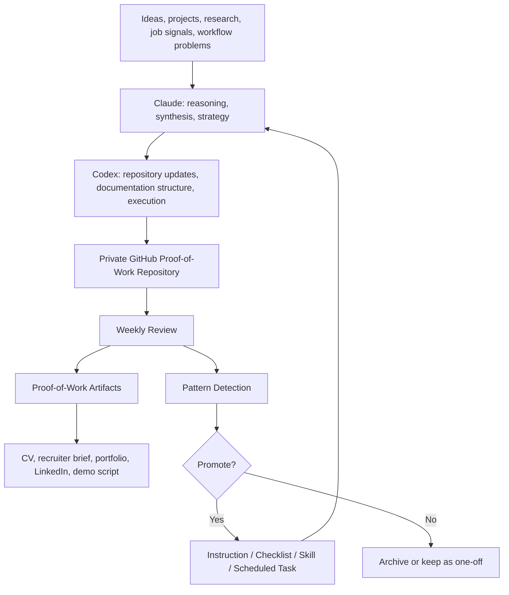

# AI-Native Proof of Work

> Canonical repo: `TheOneDarkHorse/ai-native-proof-of-work`

A private, recruiter-shareable archive documenting practical work on AI-assisted workflow automation, product strategy, architecture reasoning, and execution discipline.

This repository is not a codebase.

It is a structured proof-of-work portfolio showing how I use Claude, Codex, scheduled routines, GitHub-based documentation, local project archives, and reusable skills to turn fragmented work into clearer systems, decisions, and artifacts.

---

## What This Repository Shows

This repository demonstrates:

- AI-native workflow design
- automation strategy
- product and business model thinking
- technical architecture reasoning
- structured documentation
- recruiter-facing proof of execution
- recursive workflow improvement
- practical use of Claude and Codex
- decision-making under uncertainty
- execution without inflated AI claims

The goal is simple:

> Turn real work into reusable proof.

---

## Operating Model



---

## Repository Map

| Section | Purpose |
|---|---|
| `START_HERE.md` | Fast recruiter-readable entry point |
| `EXECUTIVE_SUMMARY.md` | High-level positioning and current status |
| `PROOF_OF_WORK.md` | Central evidence map |
| `strategy/` | Value proposition, product strategy, business model, pricing, GTM |
| `architecture/` | System design, ingestion, autoresearch, recursive workflows |
| `workflows/` | Claude/Codex workflow, AI operating model, scheduled tasks |
| `diagrams/` | GitHub-readable Mermaid diagrams |
| `logs/` | Weekly diary, decisions, changelog, problem-solving log |
| `recruiter-assets/` | CV bullets, recruiter summary, LinkedIn drafts, interview talking points |
| `exports/` | Optional recruiter-readable exports |
| `internal/` | Local source maps and indexes; not recruiter-facing |

---

## Recruiter Reading Path

Recommended order:

1. [`START_HERE.md`](START_HERE.md)
2. [`EXECUTIVE_SUMMARY.md`](EXECUTIVE_SUMMARY.md)
3. [`PROOF_OF_WORK.md`](PROOF_OF_WORK.md)
4. [`PORTFOLIO_CASE_STUDY.md`](PORTFOLIO_CASE_STUDY.md)
5. [`diagrams/RECRUITER_VIEW.md`](diagrams/RECRUITER_VIEW.md)
6. [`recruiter-assets/RECRUITER_SUMMARY.md`](recruiter-assets/RECRUITER_SUMMARY.md)
7. [`recruiter-assets/CV_BULLETS.md`](recruiter-assets/CV_BULLETS.md)

---

## What to Look For

| Capability | How It Shows Up |
|---|---|
| Structured thinking | Decision logs, strategy docs, tradeoff analysis |
| Workflow automation | Scheduled task model, proof-of-work compiler, review loops |
| Product judgment | Value proposition, MVP scope, pricing hypotheses, GTM thinking |
| AI-native execution | Claude + Codex workflow, source indexing, recursive improvement |
| Technical reasoning | Architecture, ingestion model, autoresearch model, system boundaries |
| Documentation discipline | Weekly logs, changelog, recruiter assets, diagrams |
| Practical communication | Recruiter brief, CV bullets, portfolio case study, demo script |

---

## Evidence Standard

| Label | Meaning |
|---|---|
| `Verified` | Supported by an artifact, file, commit, screenshot, source, or explicit input |
| `Estimated` | Plausible but not directly measured |
| `Planned` | Intended but not yet completed |
| `Open Question` | Still unresolved |
| `Decision` | A strategic, architectural, workflow, or product decision |
| `Hypothesis` | A testable business/product assumption |
| `Rejected` | Considered and intentionally not pursued |
| `Needs Review` | Stale, incomplete, or uncertain |

No fake metrics. No inflated claims. No generic AI hype.

---

## Decision Trail

Important decisions are documented using a visible reasoning trail:

```text
Context → Options Considered → Tradeoffs → Decision → Evidence → Open Questions → Next Action
```

---

## Current Focus

- building a recruiter-shareable proof-of-work archive
- documenting AI-native workflow design
- turning weekly execution into reusable artifacts
- mapping Claude, Codex, scheduled tasks, and shared skills into one operating model
- separating static strategy from weekly execution logs
- making decisions and tradeoffs visible without exposing private material

---

## Privacy and Sharing

This repository is private by default.

Recruiter-facing files should not contain private local paths, raw chat logs, private emails, credentials, API keys, personal addresses, sensitive personal data, confidential third-party material, or internal-only operational details.

---

## Status

```text
Status: Active
Repository type: Private proof-of-work archive
Primary audience: Recruiters, hiring managers, collaborators
Canonical format: Markdown
Diagrams: Mermaid
Exports: Optional
```

---

## One-Sentence Summary

This repository documents how I turn fragmented work, research, and AI-assisted execution into structured proof-of-work artifacts that demonstrate workflow automation, product thinking, architecture reasoning, and practical execution.
