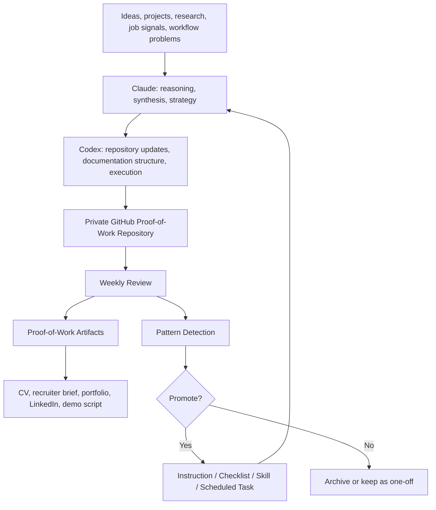

# AI-Native Proof of Work

> Canonical repo: `TheOneDarkHorse/ai-native-proof-of-work`

A private, recruiter-shareable archive documenting practical product work, AI-native execution, product strategy, architecture reasoning, and execution discipline.

This repository is not a codebase.

It is a structured proof-of-work portfolio showing concrete product work first, especially job-agent, with PKM and a household budget app as supporting evidence. Claude, Codex, scheduled routines, GitHub-based documentation, local project archives, and reusable skills are the operating layer that helps package and improve that work.

---

## What This Repository Shows

This repository demonstrates:

- AI-native workflow design
- concrete product execution
- product and business model thinking
- technical architecture reasoning
- privacy-aware product design
- test and QA discipline
- structured documentation
- recruiter-facing proof of execution
- recursive workflow improvement
- practical use of Claude and Codex
- decision-making under uncertainty
- execution without inflated AI claims

The goal is simple:

> Turn real work into reusable proof.

---

## Operating Model



---

## Repository Map

| Section | Purpose |
|---|---|
| [Navigation Hub](NAVIGATION.md) | Plain-English navigation hub for recruiters |
| [START_HERE.md](START_HERE.md) | Fast recruiter-readable entry point |
| [RECRUITER_ONE_PAGER.md](RECRUITER_ONE_PAGER.md) | One-screen recruiter overview |
| [RECRUITER_AGENT_GUIDE.md](RECRUITER_AGENT_GUIDE.md) | Agent-readable guide for recruiter-side assistants |
| [EXECUTIVE_SUMMARY.md](EXECUTIVE_SUMMARY.md) | High-level positioning and current status |
| [PROOF_OF_WORK.md](PROOF_OF_WORK.md) | Central evidence map |
| [PROJECT_STATUS.md](PROJECT_STATUS.md) | Current status, recent progress, and open work across projects |
| [PROJECT_PROOF_POINTS.md](PROJECT_PROOF_POINTS.md) | Project-focused proof points for job-agent, PKM, and the household budget app |
| [PROJECT_TIMELINE.md](PROJECT_TIMELINE.md) | Milestone timeline showing how the portfolio develops over time |
| [EVIDENCE_MATRIX.md](EVIDENCE_MATRIX.md) | Capability-to-evidence map with visual layout |
| [ROLE_READING_PATHS.md](ROLE_READING_PATHS.md) | Role-specific reading paths |
| [case-studies/](case-studies/) | Sanitized project case studies |
| [strategy/](strategy/) | Value proposition, product strategy, business model, pricing, GTM |
| [architecture/](architecture/) | System design, ingestion, autoresearch, recursive workflows |
| [workflows/](workflows/) | Claude/Codex workflow, AI operating model, scheduled tasks |
| [diagrams/](diagrams/) | GitHub-readable Mermaid diagrams |
| [logs/](logs/) | Weekly diary, decisions, changelog, problem-solving log |
| [recruiter-assets/](recruiter-assets/) | CV bullets, recruiter summary, LinkedIn drafts, interview talking points |
| [exports/](exports/) | Optional recruiter-readable exports |
| [internal/](internal/) | Local source maps and indexes; not recruiter-facing |

---

## Recruiter Reading Path

Recommended order:

1. [START_HERE.md](START_HERE.md)
2. [RECRUITER_ONE_PAGER.md](RECRUITER_ONE_PAGER.md)
3. [case-studies/JOB_AGENT_CASE_STUDY.md](case-studies/JOB_AGENT_CASE_STUDY.md)
4. [EVIDENCE_MATRIX.md](EVIDENCE_MATRIX.md)
5. [PROJECT_STATUS.md](PROJECT_STATUS.md)
6. [PROJECT_TIMELINE.md](PROJECT_TIMELINE.md)
7. [ROLE_READING_PATHS.md](ROLE_READING_PATHS.md)
8. [EXECUTIVE_SUMMARY.md](EXECUTIVE_SUMMARY.md)
9. [PROOF_OF_WORK.md](PROOF_OF_WORK.md)
10. [PROJECT_PROOF_POINTS.md](PROJECT_PROOF_POINTS.md)
11. [diagrams/RECRUITER_VIEW.md](diagrams/RECRUITER_VIEW.md)

---

## What to Look For

| Capability | How It Shows Up |
|---|---|
| Product execution | Job-agent, PKM, and household budget app case studies |
| Recruiter skim-readability | One-pager, evidence matrix, role reading paths |
| Agent readability | Recruiter agent guide and canonical reading order |
| Progress over time | Project timeline and weekly logs |
| Structured thinking | Decision logs, strategy docs, tradeoff analysis |
| Workflow automation | Scheduled task model, proof-of-work compiler, source indexes, and review loops as documented operating infrastructure |
| Product judgment | Value proposition, MVP scope, pricing hypotheses, GTM thinking |
| AI-native execution | Claude + Codex workflow, source indexing, recursive improvement |
| Technical reasoning | Architecture, ingestion model, autoresearch model, system boundaries |
| Documentation discipline | Weekly logs, changelog, recruiter assets, diagrams |
| Practical communication | Recruiter brief, CV bullets, portfolio case study, demo script |

---

## Evidence Standard

| Label | Meaning |
|---|---|
| `Verified` | Supported by an artifact, file, commit, screenshot, source, or explicit input |
| `Estimated` | Plausible but not directly measured |
| `Planned` | Intended but not yet completed |
| `Open Question` | Still unresolved |
| `Decision` | A strategic, architectural, workflow, or product decision |
| `Hypothesis` | A testable business/product assumption |
| `Rejected` | Considered and intentionally not pursued |
| `Needs Review` | Stale, incomplete, or uncertain |

No fake metrics. No inflated claims. No generic AI hype.

---

## Decision Trail

Important decisions are documented using a visible reasoning trail:

```text
Context → Options Considered → Tradeoffs → Decision → Evidence → Open Questions → Next Action
```

---

## Current Focus

- making job-agent the lead proof point
- using PKM and the household budget app as supporting project evidence
- documenting the automation clearly while keeping concrete project work as the main story
- mapping Claude, Codex, scheduled tasks, and shared skills into one operating model
- separating static strategy from weekly execution logs
- making decisions and tradeoffs visible without exposing private material

---

## Privacy and Sharing

This repository is private by default.

Recruiter-facing files should not contain private local paths, raw chat logs, private emails, credentials, API keys, personal addresses, sensitive personal data, confidential third-party material, or internal-only operational details.

---

## Status

```text
Status: Active
Repository type: Private proof-of-work archive
Primary audience: Recruiters, hiring managers, collaborators
Canonical format: Markdown
Diagrams: Mermaid
Exports: Optional
```

---

## One-Sentence Summary

This repository documents how I use AI-native workflows to build, test, and improve real products, then turn that work into structured proof-of-work artifacts that demonstrate product thinking, architecture reasoning, privacy-aware execution, and practical delivery.
