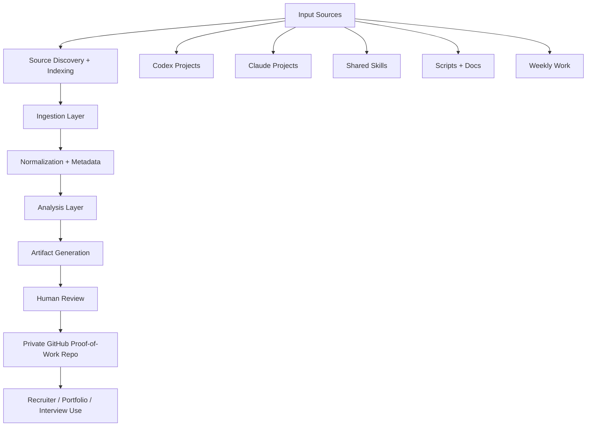

# Architecture

Last updated: 2026-05-08  
Status: Initial design

## Non-Technical Overview

The system turns scattered work into structured proof.

It starts with inputs such as chats, local project work, scheduled task outputs, research, job signals, and reusable skills. These are captured, summarized, classified, reviewed, and converted into recruiter-readable artifacts.

## Technical Overview

The architecture is documentation-first and GitHub-native.

Markdown is the canonical storage format. Mermaid diagrams provide visual structure. Local source indexes help Codex find relevant project and skill context without repeatedly scanning the same folders.

## System Layers

| Layer | Purpose | Examples |
|---|---|---|
| Input Layer | Captures raw material | chats, notes, job ads, research, tasks, local project folders |
| Source Index Layer | Maps local project/docs/skills folders | Codex, Claude, agents indexes |
| Ingestion Layer | Cleans and structures input | summaries, metadata, deduplication |
| Analysis Layer | Extracts meaning | strategy, decisions, patterns |
| Artifact Layer | Creates outputs | docs, briefs, diagrams |
| Review Layer | Human approval | keep, revise, archive |
| Repository Layer | Stores proof of work | GitHub Markdown docs |

## System Diagram

## Human Approval Points

Human review is required before:

- sharing the repo
- exporting recruiter-facing files
- updating static strategy
- exposing internal project details
- turning a one-off workflow into a recurring instruction
- claiming measurable impact

## Failure Modes

| Failure Mode | Risk | Handling |
|---|---|---|
| Bad source quality | Weak decisions | Source quality filter |
| Overclaiming | Loss of credibility | Evidence labels |
| Context bloat | Confusing docs | Summaries and links |
| Sensitive info leakage | Privacy risk | Manual review |
| Stale source index | Missed or outdated evidence | Refresh indexes every 14 days or on user request |
| Local path leakage | Recruiter sees private machine paths | Keep internal maps gitignored / exclude from exports |
