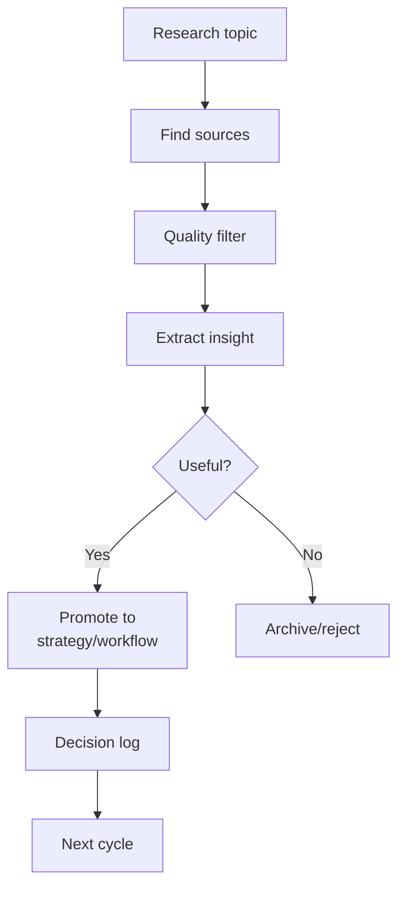

# Autoresearch Model

Last updated: 2026-05-11
Status: Initial design

## Definition

Autoresearch means using scheduled or semi-automated research loops to discover, filter, summarize, and promote useful insights into strategy, architecture, workflows, or product decisions.

## Research Loop

## Source Quality Criteria

| Criterion | Question |
|---|---|
| Primary source | Is this from the builder/company/researcher? |
| Reproducible | Can the claim be tested? |
| Practical | Can it change a workflow or decision? |
| Relevant | Does it apply to Marcus’s projects? |
| Low-hype | Is the claim concrete and bounded? |

## Promotion Rules

Research can become:

- strategy update
- architecture update
- workflow checklist
- Codex instruction
- Claude instruction
- scheduled task
- portfolio insight
- rejected idea

## Anti-Duplication Rule

Before adding a research insight, check whether the same idea already exists in the repo.
