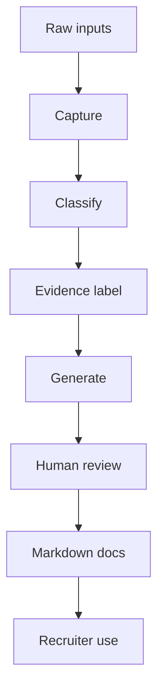

# Data Flow

Last updated: 2026-05-11
Status: Initial design

## Purpose

Describe how information moves from raw input to recruiter-readable proof.

## Flow

## Data Handling Rules

| Stage | Rule |
|---|---|
| Capture | Summarize source material rather than dumping raw content |
| Classification | Label by source, topic, sensitivity, and evidence status |
| Evidence labeling | Separate verified, estimated, planned, and open questions |
| Artifact generation | Produce concise recruiter-readable outputs |
| Human review | Check privacy, claim quality, and usefulness |
| Publishing | Keep Markdown canonical and exports optional |

## Sensitive Data

Sensitive data should be excluded, redacted, or generalized before entering recruiter-facing files.
