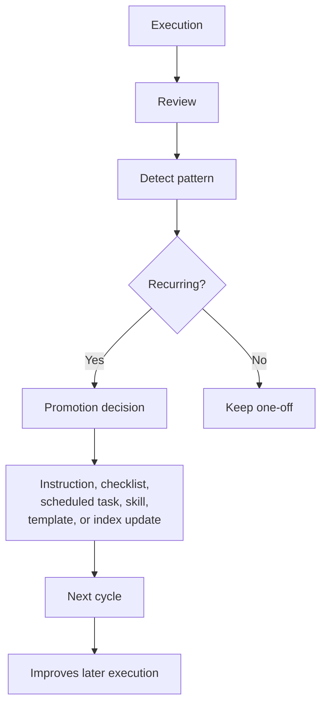

# Recursive Workflows

Last updated: 2026-05-11
Status: Initial design

## Core Loop

## What Gets Promoted

| Pattern | Destination |
|---|---|
| Repeated prompt | Template or instruction |
| Repeated review step | Checklist |
| Repeated scheduled need | Scheduled task |
| Repeated coding workflow | Codex instruction |
| Repeated reasoning process | Claude instruction |
| Repeated artifact type | Repo template |
| Reusable local skill/script | Skills index |
| Useful local documentation | Documentation index |

## What Gets Deleted

Delete or archive:

- noisy routines
- duplicate prompts
- stale instructions
- unvalidated claims
- workflows that no longer produce value

## Human Gate

No recursive loop should update important instructions without human review.
