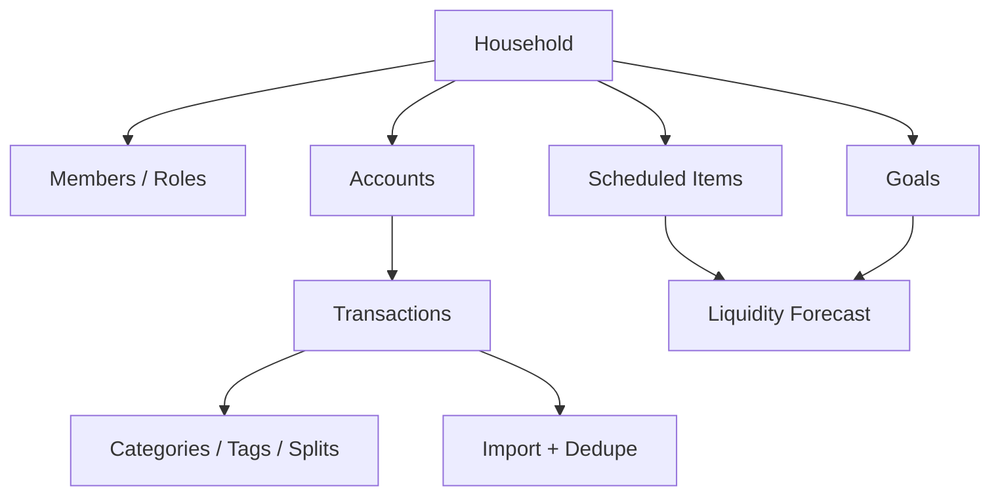

# Household Budget App Case Study

Last updated: 2026-05-09
Status: Supporting proof point / Internal evidence summarized

## Executive Summary

The household budget app is a supporting proof point for domain modeling, financial-product UX, shared data access, imports, review workflows, forecasting, goals, and test-backed execution.

## Problem

Household budgeting is not only category totals. A useful product needs shared household data, imports, review queues, liquidity forecasting, credit-card handling, goals, rules, and security boundaries.

## Product Scope

| Area | Evidence Signal | Status |
|---|---|---|
| Shared household | Household/member role concepts and shared data access are central to the product design | Internal / Verified |
| Imports | CSV/XLSX import, mapping, preview, dedupe, and review concepts are represented | Internal / Verified |
| Transactions | Transaction review, categories, tags, rules, and split logic are represented | Internal / Verified |
| Forecasting | Liquidity forecast, scheduled items, credit-card payments, and goals are represented | Internal / Verified |
| Security | RLS/security thinking and household-scoped access are represented | Internal / Verified |
| Tests | Broad unit-test surface is represented in project summaries | Internal / Verified |

## Domain Model View

## Recruiter Relevance

- Shows ability to model a real domain with constraints.
- Shows privacy/security thinking around shared household data.
- Shows test-backed product work outside the AI/career domain.
- Demonstrates that the operating style transfers across product categories.

## Evidence Boundaries

This case study summarizes internal project evidence. It does not expose household data, private financial details, local paths, or raw project logs.
