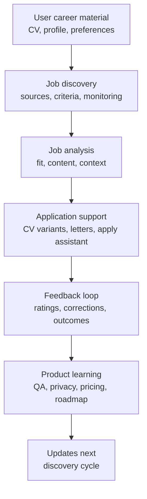

# Job-Agent Case Study

Last updated: 2026-05-24
Status: Active / Lead proof point / Internal evidence summarized

## Executive Summary

Job-agent is the lead proof point in this repository.

It demonstrates product execution across career workflow automation: CV handling, job discovery, application support, feedback loops, privacy/data rights, QA, deployment planning, telemetry, and billing/product decisions.

## Problem

Job search work is fragmented across CVs, job boards, application portals, interviews, notes, feedback, and follow-ups. AI can help, but only if the workflow remains trustworthy, reviewable, and grounded in user control.

## What Was Built / Designed

| Area | Summary | Status |
|---|---|---|
| CV workflow | CV pipeline and per-job CV/application surfaces are part of the product scope | Internal / Verified |
| Job discovery | Discovery/scanning, source handling, suggestions, and monitoring are represented in the project evidence | Internal / Verified |
| Apply assistant | Application support and apply-session persistence are represented in task and QA material | Internal / Verified |
| Feedback loops | Product and AI-output feedback surfaces are tracked as product signals | Internal / Verified |
| Privacy/data rights | Consent, data-rights models, export/delete flows, retention planning, and marketing guardrails are tracked | Internal / Verified |
| QA and regression coverage | Backend tests, Playwright coverage, live verification notes, and regression-focused docs are present in source summaries | Internal / Verified |
| Production readiness | Deployment, observability, Stripe/live activation, and legal/privacy decisions are tracked as open or external blockers | Internal / Verified |

## Current Status

| Area | Current State | Remaining Work |
|---|---|---|
| MVP / career-ops | Local status marks MVP complete and career-ops tasks done; source-repo status docs now also report OAuth social auth landed on master | Public-safe proof still needs screenshots or selected excerpts |
| Privacy / GDPR | Consent, data-rights, export/delete request UX, retention planning, and marketing-pixel guardrails are locally represented | Legal review and final production policy decisions |
| QA | Backend checks, Playwright coverage, discover regression coverage, migration smokes, and CI workflows are represented in local docs | Full production-like verification and selected recruiter-safe evidence |
| Production | Hosting architecture and observability plans exist | Domain/server setup, public backend origin, OTel/Grafana, Stripe live, OAuth credentials, and small repo-ops cleanup around doc drift and migration audit follow-up |
| Product economics | Billing, credits, referrals, and telemetry are planned or represented | Final pricing and live-market validation |

## Workflow Model

## Decision Trail

| Element | Summary |
|---|---|
| Context | Career workflows need useful automation without giving up user control, privacy, or evidence quality |
| Options Considered | Build only content generation, build a full autonomous applier, or build a reviewed career workflow product |
| Tradeoffs | More workflow coverage increases complexity, privacy burden, and QA needs |
| Decision | Treat job-agent as a career workflow product, not a simple content generator |
| Evidence | Internal project summaries show product surfaces, QA notes, privacy planning, and production blockers |
| Open Questions | Pricing, referral economy, production activation, legal/privacy review, and safe destructive data-rights workflows |
| Next Action | Add sanitized screenshots and selected safe test/commit references |

## Recruiter-Relevant Skills Demonstrated

| Skill | Evidence Signal |
|---|---|
| Product thinking | Career workflow framed as a system with discovery, application, feedback, privacy, and business-model questions |
| Full-stack execution | Backend, frontend, tests, QA notes, deployment planning, and CI references are represented in source summaries |
| Privacy judgment | Consent, data rights, retention, export/delete, and marketing-pixel guardrails are explicit |
| QA discipline | Regression tests, Playwright coverage, and live verification notes are tracked |
| AI-native workflow design | AI assistance is integrated into a reviewed workflow rather than treated as an unchecked generator |
| Communication | The project is summarized with evidence labels and clear open questions |

## Evidence Boundaries

- Status is `Internal / Verified` because the evidence comes from local project docs, tests, task files, and QA summaries.
- Recruiter-facing files do not expose private local paths or raw logs.
- Exact user/business impact is not claimed until measured.
- Production/legal decisions are not presented as complete if they remain open.

## Suggested Interview Questions

1. How did you decide where automation should stop and human review should remain?
2. What privacy decisions shaped the job-agent roadmap?
3. Which QA or regression issues changed your product approach?
4. How would you validate whether job-agent creates real user value?
5. What would you cut or simplify for a public MVP?
