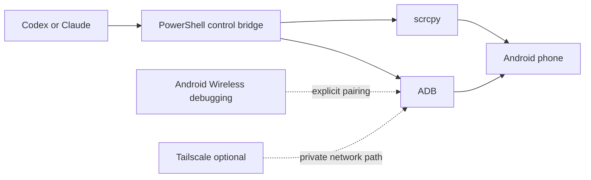

# PCMR Device Agent Case Study

Last updated: 2026-09-01
Status: Supporting product proof / evidence-bounded

## Executive Summary

PCMR Device Agent is a local-first bridge for controlling an Android phone from a Windows computer. It is designed to work with Codex, Claude, or another local AI assistant while keeping the phone visible to the user and consequential actions behind an explicit approval boundary.

The project combines Android Wireless debugging, ADB, and scrcpy. Optional Tailscale support provides a private network path when the computer and phone are not on the same local network. WhatsApp is one possible target, but the design is app-agnostic: it controls visible Android UI surfaces rather than depending on one app's API.

The public proof is intentionally bounded. The source repository is private. This case summarizes the verified design, implementation surface, smoke-test result, and remaining product work without exposing device identifiers, pairing data, personal messages, screenshots, or private machine paths.

## Problem

An AI assistant running on a computer cannot safely act on a phone just because both devices are connected to the same Wi-Fi network. The workflow needs a clear bridge for:

- seeing the phone screen;
- checking device and UI state;
- sending bounded input such as taps, swipes, text, and key events;
- starting and stopping a visual control session; and
- keeping the user in control of actions that can change phone data or state.

The project also needed to stay small enough for a low-storage machine. A full mobile-management suite, local AI model, or several app-specific integrations would add installation cost without improving the first proof of control.

## What Was Built

| Area | Implementation | Evidence status |
|---|---|---|
| Computer-to-phone bridge | PowerShell control script over ADB | **Verified** in the private source implementation |
| Visual control | scrcpy session with audio disabled and optional Stay awake mode | **Verified** in source and local operation |
| Wi-Fi connection | Android Wireless debugging with explicit pairing | **Verified** in the exercised setup |
| Remote network option | Tailscale as an optional private-network layer | **Verified** as an installation/design option; not required on the same Wi-Fi |
| AI assistant boundary | Codex or Claude can invoke the documented script surface; the user remains able to see the phone | **Verified** as the intended integration boundary |
| Mutating actions | Tap, swipe, type, key, and app launch require `-Confirm` | **Verified** in source implementation |
| Non-mutating inspection | Status, screenshot, and UI hierarchy commands | **Verified** in source implementation |
| Smoke test | PowerShell syntax, ADB connection, PNG capture, and UI hierarchy checks | **Verified**: smoke test passed in the inspected environment |
| Packaged graphical installer | Click-through flow with the original storm-track background, horse-race animation, default/custom paths, and visible installation state | **Planned / Prototype**; no packaged `.exe` is claimed in version 0.1.0 |

## Architecture

The important boundary is not the network technology. It is the separation between:

1. assistant intent;
2. a small, inspectable command surface;
3. explicit user approval for state-changing actions; and
4. a visible Android execution surface.

## Decision Trail

### Decision 1: Use ADB and scrcpy as the first integration surface

| Option | Benefit | Trade-off |
|---|---|---|
| App-specific integrations | Can expose structured app data | Does not generalize to other apps and often needs separate authentication or APIs |
| Remote desktop or support software | Broad visual access | Larger product surface and weaker fit for a small, scriptable agent bridge |
| ADB plus scrcpy | Built for Android device control, scriptable, visible, and useful across apps | Requires Android developer setup and careful permission boundaries |

**Decision:** Use ADB for device state and bounded input, and scrcpy for visual control. This gives the assistant a small technical surface while the user can see what is happening.

**Evidence:** The private source project contains the PowerShell bridge, ADB checks, scrcpy startup, screenshot capture, UI dump, and control actions.

### Decision 2: Make Tailscale optional

**Context:** The first setup uses Wi-Fi. Tailscale is useful when the devices need a private overlay network, but it should not be a mandatory download for a same-network setup.

**Decision:** Keep Tailscale as an optional network layer. The minimum installation is Android Platform Tools, scrcpy, and Android Wireless debugging.

**Trade-off:** This keeps the install smaller and easier to explain, while remote-network use needs an additional setup step.

### Decision 3: Keep mutating actions approval-gated

**Decision:** Inspection commands can run without confirmation. Actions that change the phone require `-Confirm` on the same command.

This boundary applies to taps, swipes, text input, key events, and app launches. There is deliberately no generic “send message” command in the first version. That prevents the project from implying that an AI can silently send WhatsApp or other messages without a user decision.

### Decision 4: Prompt for Stay awake, but support automation

When `start` runs without an explicit preference, the bridge asks whether the phone should stay awake while scrcpy is running. An assistant or repeatable script can use `-StayAwake` to make the choice explicit and non-interactive.

This is a small interaction detail, but it shows a useful product rule: interactive defaults should be friendly for a person and explicit for automation.

## Verification Evidence

- **Verified:** ADB connected to an Android device through Wireless debugging after explicit pairing.
- **Verified:** scrcpy launched with audio disabled and Stay awake enabled.
- **Verified:** the smoke test completed four checks: PowerShell syntax, Android connection, PNG screenshot output, and Android UI hierarchy output.
- **Verified:** mutating commands reject execution unless `-Confirm` is present.
- **Verified:** the source contract excludes screenshots, UI dumps, messages, credentials, pairing codes, and device secrets from the repository.
- **Estimated:** the installation flow uses small desktop components; exact size varies by release and platform package.
- **Planned:** a real packaged installer with the original storm-track background, horse-race animation, default/custom paths, a global “use default location” choice, authoritative progress states, and the extracted visual language from the prototype.

## What This Demonstrates

| Capability | Proof in this project |
|---|---|
| Product judgment | Reduced a broad “control my phone” request to a small, useful first surface |
| Systems thinking | Connected AI intent, a local bridge, Android debugging, visual control, and network options |
| Safety-aware automation | Separated inspection from mutation and required explicit approval for state changes |
| Technical execution | Built a PowerShell bridge with device discovery, screenshots, UI dumps, input, and launch actions |
| UX judgment | Added a human-friendly Stay awake prompt while preserving an explicit automation flag |
| QA discipline | Added a non-mutating smoke test that checks both connection and output validity |
| Evidence discipline | Kept private device data out of the public proof and labelled installer work accurately |

## Current Boundary and Open Questions

**Not claimed:** a production-ready agent, a signed graphical installer with the horse-race sequence implemented, unattended control, message sending without approval, multi-device orchestration, or measured productivity improvement.

Open questions for the next iteration:

1. Should the packaged installer bundle ADB and scrcpy, or download verified versions during setup?
2. How should the product represent more than one connected Android device?
3. Which actions should remain confirmation-gated when an AI assistant is allowed to run a longer workflow?
4. What audit record should be shown to the user after a sequence of approved actions?
5. What controlled test would measure reliability across different Android versions and apps?

## Related Documentation

- [PCMR Device Agent setup tutorial](../docs/tutorial-pcmr-device-agent.md)
- [PCMR Device Agent CLI reference](../docs/reference-pcmr-device-agent.md)
- [Phone-layout-agent case study](PHONE_LAYOUT_AGENT_CASE_STUDY.md) for a related, narrower Android automation workflow
- [Canonical case study registry](../docs/evidence/CASE_STUDY_REGISTRY.md)
