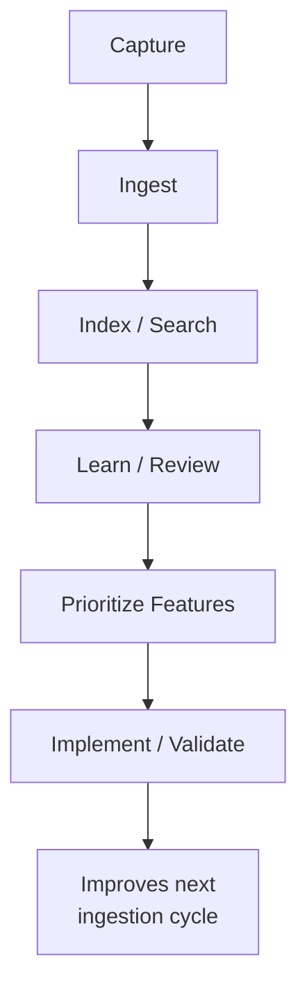

# PKM Case Study

Last updated: 2026-06-01
Status: Supporting proof point / Internal evidence summarized

## Executive Summary

PKM is a supporting proof point for knowledge workflow design.

It shows ingestion, search, learning surfaces, feed/social ideas, browser-extension material, backend/frontend structure, tests, and feature lifecycle discipline.

## Problem

Personal knowledge work can become a pile of notes, links, fragments, and half-processed ideas. A useful PKM system needs capture, retrieval, prioritization, learning loops, and clear feature workflow.

## What This Demonstrates

| Area | Evidence Signal | Status |
|---|---|---|
| Ingestion | Project evidence includes ingestion routes and source handling | Internal / Verified |
| Retrieval | Search and embedding-related surfaces are represented in the source summaries | Internal / Verified |
| Learning loops | Learning routes and spaced-repetition style signals are represented | Internal / Verified |
| Browser capture | Browser extension material is present in project structure | Internal / Verified |
| Feature lifecycle | Brainstorm queues, feature queues, ICE scoring, and lifecycle states are documented | Internal / Verified |
| Testing | Backend tests across auth, ingest, search, learning, feed/social, and related surfaces are represented | Internal / Verified |

## Current Status

| Area | Current State | Remaining Work |
|---|---|---|
| Core workflow | Ingestion, search, learning, feed, sources, persons, topics, and browser capture are represented | Verify full daily-use flow after operational blockers are cleared |
| Feature workflow | Brainstorm queue, feature queue, lifecycle states, ICE scoring, and review workflow are documented | Continue promoting only validated ideas into implementation |
| Social feed | Marked `done` in the local feature queue | Needs operational source setup and usage validation before impact claims |
| Search / AI enrichment | Hybrid search and AI enrichment are part of the product direction | OpenAI billing/quota and re-embedding behavior need cleanup |
| Operations | Local setup and deployment docs exist | SMTP, frontend URL cleanup, Hetzner deployment, Discord digest, extension, and MCP verification |
| Maintenance freshness | Latest observed repo signal is a 2026-05-26 frontend dependency-maintenance commit | Treat as maintenance evidence only; do not claim user impact from it |

## Clickable Demo

The [static PKM demo](../demos/index.html#pkm) gives a lightweight, recruiter-safe snapshot of the knowledge-feed and source-capture concept. It uses synthetic/demo data and should support the main job-agent story rather than replacing it.

## Workflow Model

## Recruiter Relevance

- Shows information architecture thinking.
- Shows ability to design workflows around messy knowledge inputs.
- Shows prioritization discipline through feature queues and ICE scoring.
- Supports the broader story that AI-native work needs source quality, review loops, and durable structure.

## Evidence Boundaries

This case study summarizes internal project evidence. It should not be treated as a public product launch claim or measured adoption claim.
