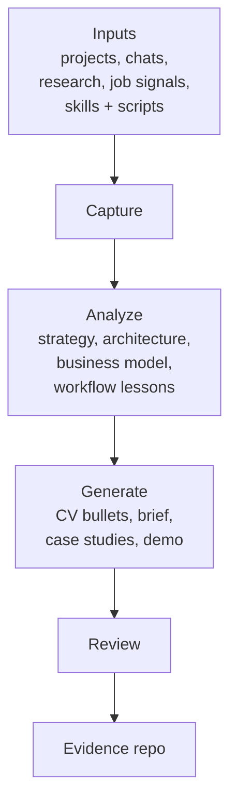

# Functional Model

Last updated: 2026-05-11
Status: Active diagram

```mermaid
flowchart TD
    A["Inputs<br/>projects, chats,<br/>research, job signals,<br/>skills + scripts"] --> B["Capture"]
    B --> C["Analyze<br/>strategy, architecture,<br/>business model,<br/>workflow lessons"]
    C --> D["Generate<br/>CV bullets, brief,<br/>case studies, demo"]
    D --> E["Review"]
    E --> F["Evidence repo"]
```
