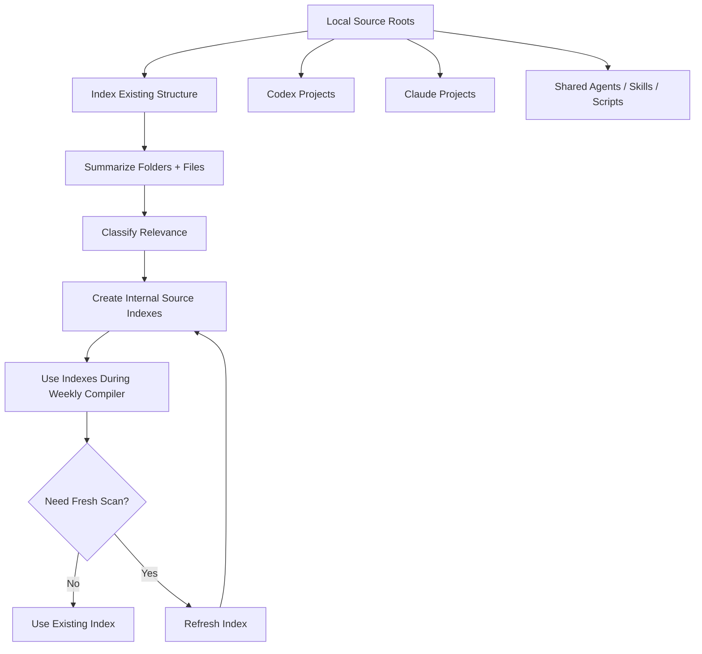

# Local Source Discovery Model

Last updated: 2026-05-08  
Status: Internal concept. Do not expose local paths in recruiter-facing exports.

```mermaid
flowchart TD
    A[Local Source Roots] --> B[Index Existing Structure]
    B --> C[Summarize Folders + Files]
    C --> D[Classify Relevance]
    D --> E[Create Internal Source Indexes]
    E --> F[Use Indexes During Weekly Compiler]
    F --> G{Need Fresh Scan?}
    G -->|No| H[Use Existing Index]
    G -->|Yes| I[Refresh Index]
    I --> E

    A --> A1[Codex Projects]
    A --> A2[Claude Projects]
    A --> A3[Shared Agents / Skills / Scripts]
```
