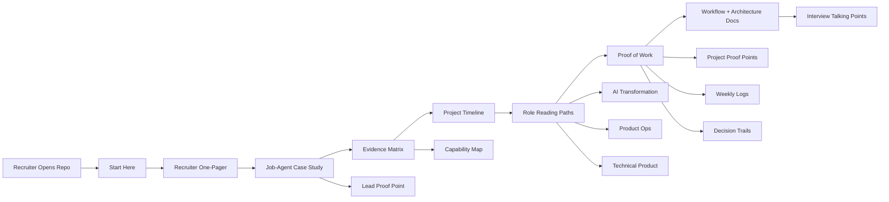

# Recruiter View

Last updated: 2026-05-09
Status: Active diagram

```mermaid
flowchart LR
    A[Recruiter Opens Repo] --> B[Start Here]
    B --> C[Recruiter One-Pager]
    C --> D[Job-Agent Case Study]
    D --> E[Evidence Matrix]
    E --> F[Project Timeline]
    F --> G[Role Reading Paths]
    G --> H[Proof of Work]
    H --> I[Workflow + Architecture Docs]
    I --> J[Interview Talking Points]

    D --> D1[Lead Proof Point]
    E --> E1[Capability Map]
    G --> G1[AI Transformation]
    G --> G2[Product Ops]
    G --> G3[Technical Product]
    H --> H1[Project Proof Points]
    H --> H2[Weekly Logs]
    H --> H3[Decision Trails]
```
