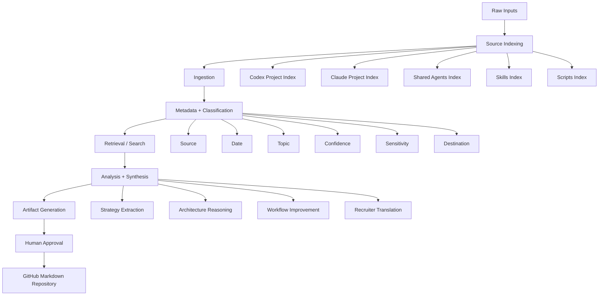

# Technical Model

Last updated: 2026-05-08  
Status: Active diagram

```mermaid
flowchart TD
    A[Raw Inputs] --> B[Source Indexing]
    B --> C[Ingestion]
    C --> D[Metadata + Classification]
    D --> E[Retrieval / Search]
    E --> F[Analysis + Synthesis]
    F --> G[Artifact Generation]
    G --> H[Human Approval]
    H --> I[GitHub Markdown Repository]

    B --> B1[Codex Project Index]
    B --> B2[Claude Project Index]
    B --> B3[Shared Agents Index]
    B --> B4[Skills Index]
    B --> B5[Scripts Index]

    D --> D1[Source]
    D --> D2[Date]
    D --> D3[Topic]
    D --> D4[Confidence]
    D --> D5[Sensitivity]
    D --> D6[Destination]

    F --> F1[Strategy Extraction]
    F --> F2[Architecture Reasoning]
    F --> F3[Workflow Improvement]
    F --> F4[Recruiter Translation]
```
