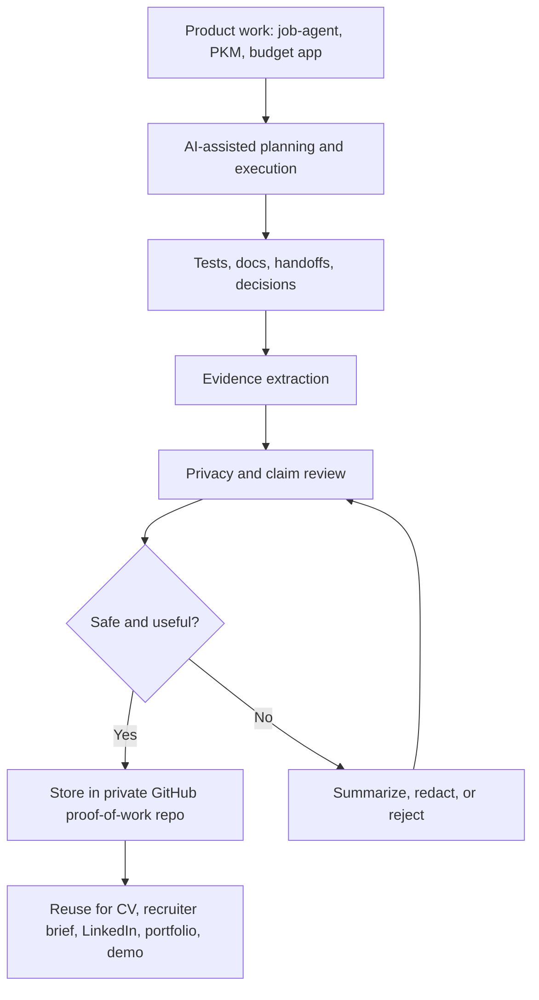

# User Flow

Last updated: 2026-05-09
Status: Active diagram

```mermaid
flowchart TD
    A[Product work: job-agent, PKM, budget app] --> B[AI-assisted planning and execution]
    B --> C[Tests, docs, handoffs, decisions]
    C --> D[Evidence extraction]
    D --> E[Privacy and claim review]
    E --> F{Safe and useful?}
    F -->|Yes| G[Store in private GitHub proof-of-work repo]
    F -->|No| H[Summarize, redact, or reject]
    H --> E
    G --> I[Reuse for CV, recruiter brief, LinkedIn, portfolio, demo]
```
