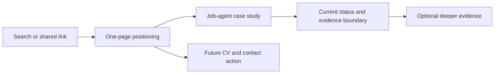

# Recruiter Documentation Review

## Executive Result

Verdict: **Needs revision before broad recruiter outreach.**

The repository contains strong product and workflow evidence. Its largest risks were the recruiter entry flow, stale freshness language, the old public demo, missing candidate/contact information, and a public/private description conflict.

Best-judgment edits were applied to the recruiter front door. Product identity, contact, CV publication, account strategy, and demo republication still need owner decisions or new source material.

## Review Coverage

| Review | Status | Notes |
|---|---|---|
| Coherence | Completed | Checked consistency, freshness, and reading-order conflicts |
| Feasibility | Completed | Verified referenced local files and public demo availability |
| Product | Completed | Reviewed positioning, recruiter value, and conversion flow |
| Design | Completed | Reviewed information hierarchy, density, visual language, and accessibility implications |
| Adversarial | Completed | Challenged credibility, proof boundaries, and weak public evidence paths |
| Bundled Claude cross-model route | Not usable | `jq` was installed successfully; the bundled runner then failed because the installed Claude CLI does not accept its `--safe-mode` option |
| Direct independent Claude review | Completed | Claude Opus 4.8, high effort, tools disabled; model receipt reported `claude-opus-4-8` |

The direct Claude result is included as an independent second opinion. It is not represented as a successful artifact from the bundled cross-model runner.

## Claude Findings

| ID | Priority | Finding | Resolution |
|---|---|---|---|
| CLAUDE-1 | P0 | The June `Last updated` date contradicted the repository's freshness claims | Applied after checking the portfolio evidence recorded through 2026-08-09; the entry page now states its evidence cutoff |
| CLAUDE-2 | P0 | The primary path sent recruiters to the known-stale public demo | Applied in documentation: the demo is removed from the primary three-link path and labeled archived V1; publishing the current snapshot remains open |
| CLAUDE-3 | P1 | The 13-step path contradicted the one-minute promise | Applied: the primary path now contains three links and deeper material is separated |
| CLAUDE-4 | P1 | No target role, seniority, location preference, or availability | Open owner decision; not invented |
| CLAUDE-5 | P1 | No contact method or recruiter call to action | Open owner decision; not invented |
| CLAUDE-6 | P1 | Three projects were presented as equal proof although two public demos are lightweight previews | Applied: Job-agent is the lead proof point; PKM and Household Budget are supporting projects |
| CLAUDE-7 | P1 | The entry page did not explain what the products do | Applied with concise, evidence-backed product descriptions |
| CLAUDE-8 | P2 | `PKM` was not expanded | Applied as `PKM (personal knowledge management)` |
| CLAUDE-9 | P2 | The opening used abstract AI/product language without a concrete hook | Applied: the opening now starts with Marcus, the work, and the lead product |
| CLAUDE-10 | P2 | Two trait lists repeated claims instead of showing evidence | Applied: replaced with one compact evidence-linked capability table |
| CLAUDE-11 | P2 | Template adoption interrupted the recruiter flow | Applied: moved to a secondary-audience section |
| CLAUDE-12 | P2 | Fresh-signal wording foregrounded missing evidence | Applied: the page states what was verified and gives a clear evidence cutoff |
| CLAUDE-13 | P3 | Product naming and capitalization were inconsistent | Applied on the entry page |
| CLAUDE-14 | P3 | Live, local, placeholder, and archived links were not distinguished | Applied for the primary entry and navigation surfaces |

## Consolidated Repository Findings

| Priority | Finding | Status |
|---|---|---|
| P0 | Public GitHub state conflicted with README and source-map claims that the repository was private | Partly resolved: public-facing descriptions now match the public state; `AGENTS.md` still contains the older private-repository mission and needs an explicit owner decision |
| P0 | The published demo is older than the strongest local Job-agent snapshot | Documentation fixed; demo republication remains open |
| P1 | Recruiter entry paths were long, repetitive, and circular | Resolved for the main README, `START_HERE.md`, one-pager, and navigation hub |
| P1 | The strongest claims lacked a fast verification path | Resolved with a 60-second verification table; stronger public commit/test excerpts remain useful future work |
| P1 | The portfolio has no explicit target role or recruiter conversion action | Open owner decision |
| P1 | The public identity is split between Marcus's name and the pseudonymous `TheOneDarkHorse` account | Open identity decision |
| P1 | No public canonical CV is linked | Open; recommended as an indexable web/Markdown page plus a downloadable PDF |
| P2 | The dark bronze visual system is distinctive but some muted text has low contrast | Open implementation item for the demo surface |
| P2 | Demo pages lack complete descriptions, social metadata, structured data, and a shared `DESIGN.md` contract | Open implementation item |
| P2 | Several root documents still overlap in purpose | Improved through shorter paths; full consolidation requires a separate content-architecture change |
| P2 | Internal source indexes exceed the repository's 14-day freshness target | Open; refresh only when source access is available |

## Recruiter Flow After This Review

## Files Changed by the Best-Judgment Route

| File | Change |
|---|---|
| `START_HERE.md` | Rewritten as a concise recruiter entry point with a three-link path and evidence cutoff |
| `README.md` | Shortened the recruiter path and aligned public/private wording with the actual public repository state |
| `RECRUITER_ONE_PAGER.md` | Labeled the published demo as V1 and reduced the follow-up path |
| `NAVIGATION.md` | Reduced the main reading paths and removed the stale demo from the primary path |
| `SOURCE_MAP.md` | Corrected the portfolio repository visibility description |
| `PORTFOLIO_CASE_STUDY.md` | Replaced the obsolete private-repository claim with the actual privacy boundary |
| `PROJECT_TIMELINE.md` | Corrected the demo milestone's privacy description |
| `docs/README.md` and `docs/audits/README.md` | Added a stable path to this audit |
| `docs/audits/2026-08-15-recruiter-documentation-review.md` | Preserved findings, resolutions, coverage limits, and remaining decisions |

## Decisions Still Needed

1. Choose the primary target role, seniority, location/remote preference, and availability statement.
2. Choose the public recruiter action: email, LinkedIn, booking link, or a combination.
3. Decide whether the named public identity will use a new GitHub account and `marcus.uden.dev`, while `TheOneDarkHorse` remains pseudonymous.
4. Decide whether to transfer the proof-of-work repositories, mirror them, or keep them on the pseudonymous account.
5. Publish a sanitized canonical CV as HTML or Markdown plus PDF.
6. Republish the current Job-agent snapshot before using the demo in outreach.
7. Reconcile the private-repository mission in `AGENTS.md` with the repository's current public state.

## Deferred / Open Questions

### From 2026-08-16 review

- **Public demo understates the strongest work** — Published Job-agent demo (P0, design, adversarial, and Claude, confidence 100)

  Recruiters can reach an outdated product interface before they see the stronger current evidence. The documentation now identifies the published snapshot as archived V1, but the easiest public demonstration will remain weaker than the case study until the current snapshot is republished and verified.

- **Public proof still depends on narrative summaries** — 60-second verification path and Job-agent case study (P1, product, adversarial, and Claude, confidence 100)

  Recruiters still have to trust narrative summaries for several important execution claims. A later public-evidence pass should add existing public-safe screenshots, selected test or commit evidence, and explicit evidence-status labels without exposing private source paths or unsupported metrics.

## Recommended Next Action

Resolve the public identity and recruiter-contact decisions first. They determine the portfolio domain, GitHub ownership, CV location, metadata, and final call to action.
