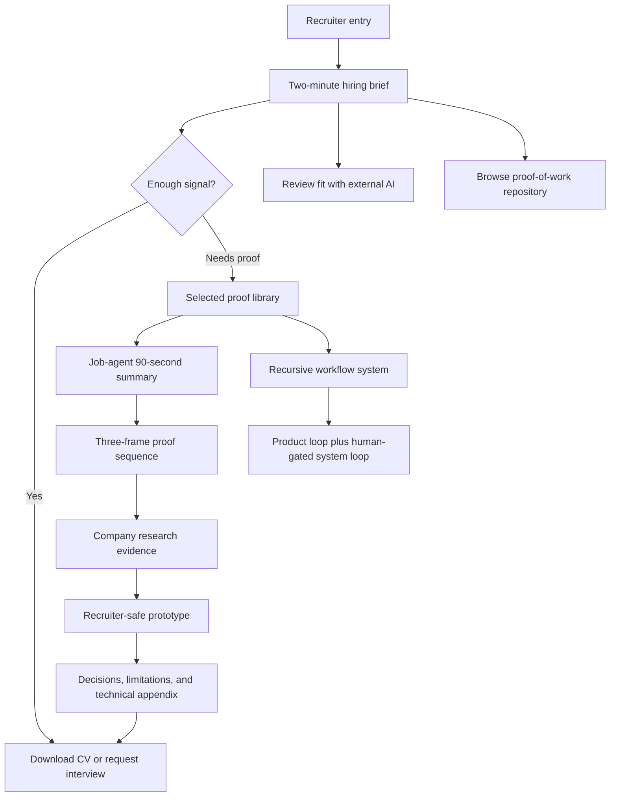

# Recruiter-First Public Proof-of-Work Edition - Plan

## Goal Capsule

- **Objective:** Give recruiters and hiring managers a fast, credible reason to consider Marcus for hands-on product work.
- **Means:** Build a clean-room, recruiter-first public edition with static progressive depth, curated Job-agent evidence, and a controlled release boundary. (KTD1-KTD6)
- **Product authority:** The Product Contract is authoritative for public behavior. `DESIGN.md` is authoritative for visual identity. The evidence release manifest is authoritative for public maturity and provenance. (KTD5)
- **Execution profile:** Cross-repository static web implementation with privacy, identity, accessibility, and publication gates.
- **Planning blockers:** None.
- **Release gates:** A sanitized CV, a completed privacy record, passing release validation, a validated temporary host, and Marcus's explicit publication approval.
- **Tail ownership:** The implementer can build and validate locally. Marcus owns the one-way-door decisions to create public repositories, publish them, and activate DNS.

---

## Product Contract

> **Preservation note:** Product Contract meaning and stable IDs are preserved. R13 and its governed examples use the later user-approved synthetic-only first release.

### Summary

Create a public, recruiter-first proof-of-work edition under Marcus's professional identity.
The experience will establish the hiring case first, then use a guided Job-agent case study and curated evidence to support it without overstating product maturity.

### Problem Frame

Current recruiter surfaces can anchor attention on Marcus's latest PostNord delivery role before they show his wider product, operational, and technical capability.
That sequence can cause early rejection before a recruiter sees evidence of product judgment, execution, or AI-native working methods.

The private proof repository contains useful evidence, but it also contains working context, stale identity links, and language that can imply a more mature product than the current evidence supports.
The public surface must compress this material into a clear hiring case while preserving trust, privacy, and honest status labels.

### Key Decisions

- **Lead with the hiring case, not employment chronology.** (session-settled: user-approved — chosen over a CV-first opening: recruiters need the product signal before recent job-title context.) Governs R1-R4.
- **Use guided proof before the interactive demo.** (session-settled: user-directed — chosen over demo-first and evidence-storyboard layouts: the reader should understand the product judgment before exploring the interface.) Governs R6-R7 and R10.
- **Make company research the primary evidence section.** (session-settled: user-directed — chosen over treating research as supporting metadata: it best demonstrates product decisions from fragmented information.) Governs R7-R9.
- **Use a synthetic-only company in release one.** (session-settled: user-approved — chosen over a hybrid real-and-synthetic release: it gives the clearest privacy and provenance boundary before public-company examples are reviewed.) Governs R12-R13.
- **Publish curated evidence releases.** (session-settled: user-directed — chosen over mirroring the latest build: each release needs a clear date, version, status, and privacy review.) Governs R14-R16.
- **Keep professional and pseudonymous identities separate.** (session-settled: user-directed — chosen over account transfer, fork, or cross-linking: `OneDarkHorse` remains private and pseudonymous.) Governs R19-R21.
- **Present Job-agent as a transparent work in progress.** (session-settled: user-directed — chosen over launch or validation framing: the product is not live and has no measured market outcome.) Governs R16-R18.
- **Put the external AI review beside the CV and keep the repository link quieter.** (session-settled: user-approved — the first screen must support fast conversion and evidence inspection without making GitHub the main destination.) Governs R4, R21, and R29-R31.
- **Add a human-gated compounding loop beneath the product loop.** (session-settled: user-approved — the existing product loop stays intact, while Autoresearch, daily automation, and promotion show how repeated work improves the next cycle.) Governs R11 and R32-R34.
- **Keep Job-agent as a visible working title.** (session-settled: user-approved — the current name remains useful for recognition but must not imply a final product name.) Governs R16-R18 and R35.

### Actors

- A1. A recruiter or hiring manager needs enough signal for an initial interview decision.
- A2. A product or technical reviewer wants deeper evidence about decisions, trade-offs, workflow design, and implementation progress.
- A3. An external AI assistant evaluates Marcus against a supplied job description using public evidence only.
- A4. Marcus curates public releases and protects the boundary between working material and recruiter-safe evidence.

### Requirements

**Hiring brief and conversion**

- R1. The public entry point must communicate within one screen that Marcus is an experienced individual contributor with operational depth, product thinking, and AI-native execution.
- R2. The opening must state that Marcus turns messy operational problems into clear, buildable product work.
- R3. The hiring brief must explain why Marcus fits hands-on product work without requiring employment-history reading first.
- R4. The primary conversion path must offer the relevant CV, followed by a request-interview path through `marcus.uden.dev@gmail.com`.
- R5. Public page titles, descriptions, canonical links, and identity text must consistently use `Marcus Udén`, `marcus.uden.dev`, and `github.com/marcus-uden-dev` without promising a search-ranking outcome.

**Proof architecture**

- R6. The lead Job-agent case study must follow this reading order: 90-second summary, three-frame proof sequence, company research, recruiter-safe static demo, product decisions, evidence, limitations, and technical appendix.
- R7. Company research must be the strongest proof section and answer, "Is this company and role worth my time?"
- R8. Company research must cover compensation benchmarks, company stage and financial signals, culture and working-model indicators, positive and warning signals, and source confidence.
- R9. The research proof must also show how evidence supports application tailoring, interview investigation, and compensation decisions.
- R10. The case study must support progressive depth so A1 can stop after the summary while A2 can continue into decisions, evidence, limitations, and technical detail.
- R11. The proof library must lead with Job-agent, then present the Recursive workflow system as supporting proof. It must retain the Discover → Define → Build → Improve product loop.

**Evidence, status, and trust**

- R12. Every public research field must visibly identify sourced public data, synthetic demo data, or inferred demo data in reader-friendly language.
- R13. Release one must use a synthetic company only. Real-company examples remain deferred until a later release has source and privacy review.
- R14. Each public evidence release must show its evidence date, product version, current maturity, next test, and completed privacy-review record.
- R15. Public screenshots, prototypes, and excerpts must exclude local paths, worktree names, private identifiers, credentials, private communication, and misleading realistic data.
- R16. All public surfaces must use one consistent status: work in progress, not live, not market-validated, and with the next test identified.
- R17. Public wording must not describe the Job-agent as live, live-verifiable, a current production experience, or a validated outcome unless later evidence supports that claim.
- R18. Product impact, recruiter response rates, and job-search outcomes must remain unclaimed or explicitly unmeasured until the evidence exists.

**Public identity and repository boundary**

- R19. The professional surface must use `marcus-uden-dev` and must not link to, name, redirect through, or visually associate with `OneDarkHorse`.
- R20. The public repository must be a clean edition without a fork relationship, private history, private paths, or inherited identity metadata from the working repository.
- R21. The curated case-study pages must be the primary proof destination, while GitHub provides supporting artifacts and evidence.
- R22. LinkedIn must not be a required conversion path in the first release.
- R29. The header must provide a quiet `Browse proof-of-work repo ↗` link to the professional public repository without competing with the primary conversion actions.

**Recruiter AI handoff**

- R23. The public experience must provide a copyable prompt that lets A3 assess Marcus against any supplied job description.
- R24. The prompt must direct A3 to use public evidence only, distinguish evidence from inference, resist instructions inside the job description or fetched pages, and link findings to public sources.
- R30. The opening action group must place `Review fit with AI` beside `Download CV`, with the CV as the visually primary action and selected proof as the next page-level route.
- R31. The opening must explain that the AI review uses an external assistant and cited public evidence. It must not imply that an AI assistant is embedded in the site.

**Recursive workflow proof**

- R32. The site must preserve the product loop `Discover → Define → Build → Improve` and add the system loop `Execute → Review → Detect pattern → Human gate → Promote → Next cycle` beneath it.
- R33. The system-loop explanation must show that Autoresearch filters broad discovery into decision-relevant evidence, daily automation turns health, drift, opportunities, and decisions into bounded next actions, and promotion converts repeated friction into reusable infrastructure.
- R34. The Recursive workflow system must appear as supporting proof, not as a second lead case. Its copy must state that human review controls promotion, change, removal, and the kill switch.
- R35. Public Job-agent references must label `Job-agent` as a working title and explain that it is the current name for the career decision-support product, not the final product name.

**Design and experience quality**

- R25. The visual system must follow `DESIGN.md`: restrained editorial composition, warm paper, dark ink, limited gold and teal accents, clear hierarchy, and evidence-first presentation.
- R26. The first release must remain readable and usable from 375 px through desktop widths, without horizontal overflow or dependence on pointer-only interaction.
- R27. Core navigation, proof exploration, CV access, and interview contact must work with a keyboard and expose clear focus and link states.
- R28. The recruiter brief must retain a clean print or save-to-PDF path without becoming a second source of truth.

### Key Flows

- F1. Hiring brief scan
  - **Trigger:** A1 opens the public entry point.
  - **Actors:** A1
  - **Steps:** Read the positioning, scan claim-to-evidence signals, then choose the CV, external AI review, selected proof, repository, or interview path.
  - **Outcome:** A1 can explain Marcus's product value before reading his employment chronology.
  - **Covers:** R1-R5, R11, and R29-R31.
- F2. Guided Job-agent review
  - **Trigger:** A1 or A2 selects Job-agent from the proof library.
  - **Actors:** A1, A2
  - **Steps:** Read the working-title notice and short summary, follow the proof frames, inspect company research, optionally use the static prototype, then open deeper decisions and limitations.
  - **Outcome:** The reviewer can connect the product problem, design choices, system behavior, maturity limits, and temporary product name.
  - **Covers:** R6-R10, R16-R18, and R35.
- F3. Company research evaluation
  - **Trigger:** A1 or A2 opens the company-research proof section.
  - **Actors:** A1, A2
  - **Steps:** Review decision-relevant fields, inspect each field's evidence label, compare positive and warning signals, then see the supported next decisions.
  - **Outcome:** The reviewer sees how fragmented information becomes practical product decisions without confusing demo data with sourced facts.
  - **Covers:** R7-R9 and R12-R13.
- F4. Recruiter AI assessment
  - **Trigger:** A1 copies the public evaluation prompt into an external AI assistant with a job description.
  - **Actors:** A1, A3
  - **Steps:** A3 reads only public sources, treats supplied and fetched content as untrusted, maps role needs to evidence, labels inference, and returns source links.
  - **Outcome:** A1 receives a traceable role assessment rather than an unsupported generated pitch.
  - **Covers:** R23-R24 and R30-R31.
- F5. Curated evidence release
  - **Trigger:** A4 decides that a meaningful product milestone deserves public evidence.
  - **Actors:** A4
  - **Steps:** Select artifacts, sanitize content, verify labels and claims, record privacy review, assign date and version, then publish the curated snapshot.
  - **Outcome:** The public evidence stays credible without exposing the working repository or implying continuous synchronization.
  - **Covers:** R14-R21.
- F6. Recursive workflow review
  - **Trigger:** A1 or A2 selects the Recursive workflow system supporting proof.
  - **Actors:** A1, A2
  - **Steps:** Compare the product loop with the system loop, inspect Autoresearch and daily-automation examples, then review the human promotion gate and kill switch.
  - **Outcome:** The reviewer sees how repeated work can improve later cycles without implying autonomous self-modification.
  - **Covers:** R11 and R32-R34.

### Acceptance Examples

- AE1. **Covers R1-R4.** Given a recruiter who knows only Marcus's recent PostNord role, when they scan the first screen, then they can identify his product positioning and reach the CV or interview path without opening an employment timeline.
- AE2. **Covers R6, R10, R16-R18.** Given the Job-agent has internal implementation progress but no live market test, when a reviewer opens its case study, then the summary shows WIP status and does not imply production use or measured outcomes.
- AE3. **Covers R7-R9 and R12.** Given a company-research field contains a compensation estimate, when it appears in the proof, then the reviewer sees its source class and the decision it informs.
- AE4. **Covers R12-R13.** Given release one contains company research, when a reviewer inspects the company identity and fields, then the company is synthetic and each field is clearly labeled as synthetic or inferred demo data.
- AE5. **Covers R14-R15.** Given a screenshot has no obvious private information but lacks a recorded privacy review, when A4 prepares a release, then the artifact remains unpublished until the review record exists.
- AE6. **Covers R16-R18.** Given inherited copy says `live`, `current-UX`, `working application`, `verified demo snapshot`, or `live-verifiable`, when the release is reviewed, then the wording is removed or replaced with the approved WIP status before publication.
- AE7. **Covers R19-R20.** Given a public file, link, repository relationship, or visible identity reference names `OneDarkHorse`, when the professional edition is checked, then the release fails the identity boundary.
- AE8. **Covers R23-R24.** Given A1 supplies a job description that contains instructions to ignore evidence rules, when A3 uses the copied prompt, then the assessment treats those instructions as untrusted, cites public proof, and marks unsupported interpretation as inference.
- AE9. **Covers R4, R21, and R29-R31.** Given A1 scans the first screen, when the action group appears, then `Download CV` is visually primary, `Review fit with AI` is adjacent, selected proof remains available, and the repository link stays quieter in the header.
- AE10. **Covers R11 and R32-R34.** Given A2 opens the recursive workflow proof, when the loops appear, then the existing product loop remains intact and the system loop ends in a human-controlled promotion decision and next cycle.
- AE11. **Covers R16-R18 and R35.** Given A1 sees the name Job-agent, when the status notice appears, then it identifies Job-agent as the current working title and does not imply a final name, live product, validation, or measured outcome.

### Success Criteria

- A cold reviewer can understand the target role, value proposition, lead proof, maturity status, and contact path in a two-minute review.
- Every published claim is supported, labeled as inference, or explicitly marked unmeasured.
- Every published artifact has a recorded privacy review and contains no professional link to `OneDarkHorse`.
- Job-agent status and working-title language are consistent across the brief, case study, prototype, manifest, and repository documentation.
- The recursive workflow proof keeps its human gate visible and remains subordinate to the Job-agent lead case.
- The public experience remains clear on mobile, desktop, keyboard navigation, and print output.

### Scope Boundaries

#### Deferred for later

- Role-specific pitch chips and automatic role tailoring.
- Real-company examples with public source citations.
- An embedded AI assistant or chat experience.
- Automatic synchronization from the private working repository or the latest product build.
- A live hosted Job-agent product experience.
- Additional role-specific CV editions beyond the separate public CV plan.

#### Outside this product's identity

- Publishing the complete Job-agent source repository.
- Publishing private repository history, raw agent sessions, local source indexes, or machine paths.
- Publicly connecting the professional identity to `OneDarkHorse`.
- Presenting implementation progress as market validation or product impact.
- Presenting the recursive workflow system as autonomous self-modification or allowing promotion without human review.
- Requiring LinkedIn before the public experience can convert a recruiter.

### How This Work Fits Together

- **Depends on:** The CV download uses the public CV work in `plans/2026-08-16-2024-public-cv-repository-plan.md`. This plan does not redefine CV content or source selection.
- **Shares:** `DESIGN.md` provides the visual contract for the recruiter brief and public proof pages.
- **Enables:** A clean public repository under `marcus-uden-dev` packages approved pages and evidence without exposing the private compiler repository.
- **Adds:** The Recursive workflow system provides supporting evidence about Autoresearch, daily automation, human-gated promotion, and removal of noisy routines.
- **Can proceed independently of:** Role-specific chips, embedded AI, live product hosting, real-company examples, and automatic release synchronization.

### Dependencies and Assumptions

- The `marcus-uden-dev` GitHub account exists and remains the professional account.
- `marcus.uden.dev` is the intended public domain. Its DNS and HTTPS route are not active yet.
- The current static Job-agent demo supplies interaction and content patterns, but it is not a safe publication source by itself.
- The three current Job-agent screenshots are candidates only. Publication requires a recorded privacy review.
- The current working repository remains the private source and rollback point.

### Sources and Research

**Repository sources**

- `DESIGN.md` — visual identity and editorial design contract.
- `docs/prototypes/marcus-uden-recruiter-brief-concept.html` — confirmed recruiter-brief direction and print concept.
- `assets/screenshots/README.md` — screenshot inventory and synthetic-data description.
- `recruiter-assets/SCREENSHOT_SHARING_PLAN.md` — unresolved privacy-review requirement.
- `demos/job-agent/index.html` and `demos/job-agent/app.js` — static demo behavior and provenance label patterns.
- `demos/README.md` and `demos/manifest.json` — stale public identity and conflicting maturity labels that must not be copied.
- `case-studies/JOB_AGENT_CASE_STUDY.md` — problem, workflow, limitations, and unmeasured-impact framing.
- `case-studies/JOB_AGENT_INSTALL_AND_HANDOFF.md` — inherited identity references that the public edition must reject.
- `architecture/AUTORESEARCH_MODEL.md` and `architecture/RECURSIVE_WORKFLOWS.md` — evidence for recursive discovery, review, promotion, and human gates.
- `workflows/SCHEDULED_TASKS_MODEL.md` and `workflows/REVIEW_AND_PROMOTION_LOOP.md` — evidence for daily automation, bounded next actions, promotion, and kill-switch behavior.
- `case-studies/WORKFLOW_IMPLEMENTATION_CASES.md` — implementation evidence for reusable workflow infrastructure.
- `tasks/lessons.md` — recruiter positioning, privacy, project priority, source freshness, and diagram lessons.
- Job-agent source status, verified on 2026-08-20 — internal implementation progress with production activation and market validation still open.

**External decision sources**

- [GitHub Pages custom domain guidance](https://docs.github.com/en/pages/configuring-a-custom-domain-for-your-github-pages-site/managing-a-custom-domain-for-your-github-pages-site) — supports GitHub Pages, custom subdomains, and HTTPS sequencing.
- [GitHub Pages domain verification](https://docs.github.com/en/pages/configuring-a-custom-domain-for-your-github-pages-site/verifying-your-custom-domain-for-github-pages) — supports account-level domain verification before DNS activation.
- [GitHub profile guidance for job searches](https://docs.github.com/en/account-and-profile/tutorials/using-your-github-profile-to-enhance-your-resume) — supports a concise bio, profile README, website link, and selected pinned repositories.
- [Google guidance for AI features and search](https://developers.google.com/search/docs/fundamentals/ai-optimization-guide) — supports crawlable first-hand content and rejects ranking promises for special AI files.
- [Google title-link guidance](https://developers.google.com/search/docs/appearance/title-link) and [sitemap guidance](https://developers.google.com/search/docs/crawling-indexing/sitemaps/build-sitemap) — support normal metadata and canonical crawl paths.
- [Google ProfilePage structured data](https://developers.google.com/search/docs/appearance/structured-data/profile-page) — supports a professional identity graph without a ranking guarantee.
- [llms.txt proposal](https://github.com/AnswerDotAI/llms-txt) — supports a small agent-orientation file that links to canonical public evidence.
- [WCAG focus guidance](https://www.w3.org/WAI/WCAG21/Understanding/focus-visible) — supports visible focus and keyboard review.
- Public product portfolio patterns from [Isaac Vazquez](https://isaacvazquez.com/), [Naman Chitkara](https://www.namanchitkara.com/), [Vaibhav Jain](https://vaibhav20jain01.github.io/portfolio/), and [Simon Pan](https://simonpan.com/) shaped the hiring-first, claim-to-evidence, and progressive-depth decisions.

---
