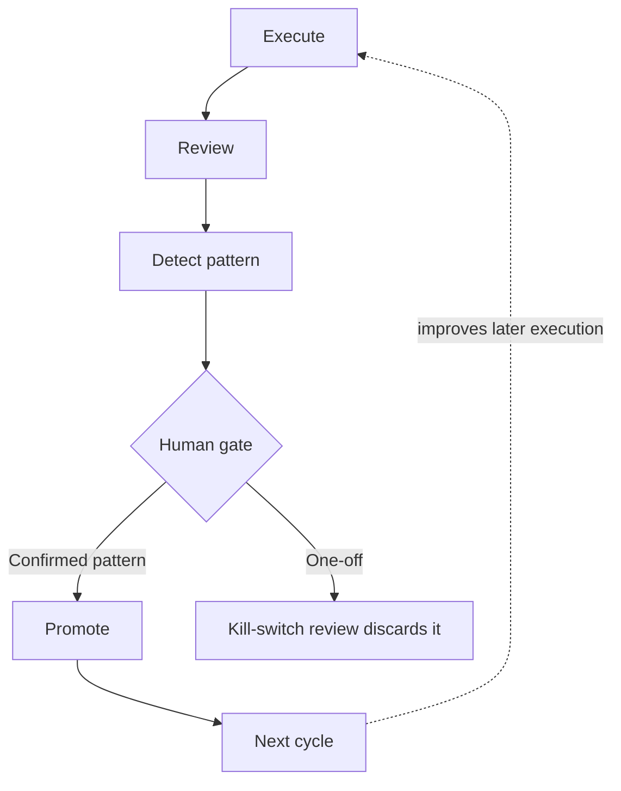

# Recursive Workflow Page Content, Link Audit, and Proof-Page Substantiation - Plan

**Target repo:** `ai-native-proof-of-work-public-staging` (`C:\Users\marcu\code\ai-native-proof-of-work-public-staging`). All Implementation Unit file paths are relative to that repository.

## Summary

Ground the Recursive workflow proof page's four existing sections in specific, verified source material instead of the current vague paraphrases, while keeping it visibly lighter than the Job-agent case study. Confirms the live site's links all resolve and the Job-agent case study is already well-substantiated for a recruiter audience.

## Problem Frame

Marcus flagged that `site/proof/recursive-workflow/index.html` "needs content" — the page currently states its four claims (two loops, Autoresearch, daily automation, promotion/human gate/kill switch) but each is thin: no named example, no stated quality-filter criteria, only one task layer named, and no visual. This deepens R11/R32-R34/AE10 from the original recruiter-first plan (already implemented and passing) — the requirements are satisfied at a pass/fail level; this plan raises the evidence quality within the same scope, without adding new sections or turning the page into a second lead case.

A companion `plan-for-plan.md` (`plans/recursive-workflow-page-content/plan-for-plan.md` in the target repo) already scoped the objective, inputs, and decision criteria, and ran the bounded research pass this plan builds on.

Marcus also asked to verify every link on the live site resolves, and that each proof page (Job-agent case study, Recursive workflow page) is well-substantiated for a recruiter audience — both checks ran during this planning pass (see Sources and Research).

## Requirements

- R1. The recursive-workflow page's Autoresearch section must name the actual quality-filter criteria instead of the current vague "quality filter" phrase.
- R2. The daily-automation section must name more than one task layer.
- R3. The promotion section must gain one specific, named, Verified-status example — it currently has none (the page's only current example lives in the Autoresearch section and stays there, per U1's regression scenario).
- R4. The promotion section must state the pattern→destination mapping (what kind of recurring output becomes what kind of durable asset), compact enough to stay lighter than the Job-agent case study's evidence density.
- R5. The page must gain a small diagram of the two loops, matching the visual style already used in the private repo's own architecture docs.
- R6. Every live link on the site (internal and external) must resolve, excluding the canonical/`og:url` metadata tags that intentionally still name `marcus.uden.dev` per the release runbook.
- R7. The Job-agent case study must be reviewed against the same "well-substantiated for a recruiter audience" bar; any small, low-risk gaps found get fixed in this plan, larger gaps get logged as a deferred follow-up.

## Key Technical Decisions

- **KTD1 — Ground existing sections, do not add new ones.** All four content additions (R1-R4) land inside the page's current section structure. Rationale: the plan-for-plan research confirmed the structure already matches R33's three required claims; the gap is depth, not missing sections.
- **KTD2 — Use only Verified-status evidence from `case-studies/WORKFLOW_IMPLEMENTATION_CASES.md`.** The promotion example (R3) uses "Codex tasks and lessons loop" — the clearest single-outcome case with a plain "Verified" status (not "Internal / Verified summary" or "Needs Review"): durable project rules captured in a lessons file so repeated mistakes become prevention checks. Rationale: matches the plan-for-plan's decision criteria rejecting unverifiable "Internal source scan found" rows as content sources.
- **KTD2b — The named case is new content in `#promotion`, not a replacement of the Autoresearch example.** The promotion section currently has no example of its own; the Autoresearch section's "a recurring signal found during research..." example illustrates a different claim (source-quality filtering) and stays untouched. Rationale: doc review found the plan's earlier draft left this ambiguous across R3/U3/U1, risking either an accidental rewrite of the Autoresearch claim or a missing promotion example — both closed by keeping the two examples separate.
- **KTD3 — Name three task layers, not the full twelve-item list.** Daily verifier, weekly proof-of-work compiler (already used), and kill-switch review — three layers that together show detection, evidence, and cleanup, without turning the section into an inventory dump. Rationale: R2 asks for "more than one," not an exhaustive scan; three is enough to demonstrate range while the fourth (kill-switch review) already anchors the page's existing kill-switch claim in a real task layer instead of leaving it abstract.
- **KTD4 — Compact 3-row promotion table, not the full pattern→destination table.** `architecture/RECURSIVE_WORKFLOWS.md`'s table has 8 rows; using all 8 would make this section denser than any single block on the Job-agent case study, risking a second-lead-case read (R34). Three representative rows (repeated prompt → template, repeated review step → checklist, repeated schedule need → scheduled task) carry the pattern without the density.
- **KTD5 — This plan document's own High-Level Technical Design diagram is mermaid (standard for a markdown plan); the shipped page diagram (U5) is inline SVG/HTML, not mermaid.** The target repo's static pipeline has no mermaid renderer wired up (confirmed: no `mermaid` reference anywhere in `site/assets/js/site.js` or any shipped page) — a `<pre class="mermaid">` block would render as raw text on the live site. The mermaid sketch below is directional guidance for the shape, mirroring the private repo's own `RECURSIVE_WORKFLOWS.md` flowchart (Execution → Review → Detect pattern → decision branch → Promotion → Next cycle); U5 implements it as static markup.
- **KTD6 — Job-agent case study needs no content changes.** The live-site review (see Sources and Research) found the case study already has a 90-second summary, three-frame proof sequence, fully labeled company-research evidence (source class, confidence, decision use per field), downstream decisions, a prototype link, limitations, and a technical appendix — no gaps met the "small, low-risk fix" bar from the plan-for-plan's decision criteria. Confirming this in writing satisfies R7 without opening a second work stream.

## High-Level Technical Design

## Implementation Units

### U1. Ground the Autoresearch section in the actual quality-filter criteria

- **Goal:** Replace the vague "quality filter" phrase with the named criteria a finding must pass.
- **Requirements:** R1.
- **Dependencies:** None.
- **Files:** `site/proof/recursive-workflow/index.html` (`#autoresearch` section), `tests/e2e/recursive-workflow.spec.js`.
- **Approach:** In the "What it filters" article, name the criteria drawn from `workflows/SOURCE_QUALITY_MODEL.md`'s quality-criteria table (primary source, reproducible, practical, relevant, low-hype, evidence-backed), paraphrased as a short list or single sentence — not the full table, since this is one supporting fact inside an existing card, not a new block.
- **Patterns to follow:** existing `.decision-grid--two` article markup already on this page (`site/proof/recursive-workflow/index.html:92-103`).
- **Test scenarios:**
  - Happy path: the Autoresearch section names at least three of the specific quality criteria (e.g., "primary source," "reproducible," "low-hype") rather than the generic phrase "quality filter" alone.
  - Regression: the existing "source quality before insight" claim and the existing example article both remain present and accurate.
- **Verification:** `npm test` passes with the extended assertion.

### U2. Name three task layers in the daily-automation section

- **Goal:** Ground "daily automation" in more than the one currently-named example.
- **Requirements:** R2.
- **Dependencies:** None.
- **Files:** `site/proof/recursive-workflow/index.html` (the daily-automation section), `tests/e2e/recursive-workflow.spec.js`.
- **Approach:** Extend the "What it produces" or add a short list naming three task layers from `workflows/SCHEDULED_TASKS_MODEL.md`'s task-layer table — daily verifier, weekly proof-of-work compiler (already referenced), and kill-switch review — each with a one-clause description of what it checks, not the full twelve-layer list.
- **Patterns to follow:** existing article/list markup in this section; `.limitations-list` styling used elsewhere on the page for a compact bulleted list if a list reads better than prose here.
- **Test scenarios:**
  - Happy path: the section names at least three task layers by name (not just "the weekly compiler").
  - Edge case: kill-switch review is named here, giving the page's existing kill-switch claim (in the promotion section) a concrete anchor.
- **Verification:** `npm test` passes with the extended assertion.

### U3. Add a named, verified promotion example

- **Goal:** Give the promotion section its own concrete example — it currently has none.
- **Requirements:** R3.
- **Dependencies:** None.
- **Files:** `site/proof/recursive-workflow/index.html` (`#promotion` section), `tests/e2e/recursive-workflow.spec.js`.
- **Approach:** Add a new example to the `#promotion` section (currently a plain `<ul class="limitations-list">` with no example) citing "Codex tasks and lessons loop" (per KTD2/KTD2b), paraphrased: durable project rules get captured as reusable lessons so repeated mistakes become prevention checks, without naming internal tool mechanics beyond what's already public-safe on this site (no Codex/Claude session internals beyond the tool names already used elsewhere on this site, e.g. in the CV's "Tools" section). The Autoresearch section's existing example is not touched by this unit.
- **Patterns to follow:** existing `case-studies/WORKFLOW_IMPLEMENTATION_CASES.md` mini-case shape (Context → Previous Workflow → Change Implemented), condensed to one sentence for this page.
- **Test scenarios:**
  - Happy path: the page names a specific promoted pattern (not "a recurring signal" or "a pattern, not a headline") and states what it became.
  - Content: the cited case matches a row marked "Verified" in `case-studies/WORKFLOW_IMPLEMENTATION_CASES.md`, not "Needs Review" or an unverifiable "Internal source scan found" row.
- **Verification:** `npm test` passes; manual check that the case is paraphrased, not exposing raw session mechanics.

### U4. Add the compact promotion pattern→destination reference

- **Goal:** State what kind of recurring output becomes what kind of durable asset.
- **Requirements:** R4.
- **Dependencies:** U3 (shares the promotion section; land together to avoid re-touching the same block twice).
- **Files:** `site/proof/recursive-workflow/index.html` (`#promotion` section), `site/assets/css/site.css` (only if the existing `.limitations-list` or `.decision-grid` styling doesn't fit a 3-row pattern→destination list), `tests/e2e/recursive-workflow.spec.js`.
- **Approach:** Add three rows (repeated prompt → template or instruction, repeated review step → checklist, repeated schedule need → scheduled task), drawn from `architecture/RECURSIVE_WORKFLOWS.md`'s "What Gets Promoted" table and `workflows/REVIEW_AND_PROMOTION_LOOP.md`'s promotion-destinations table. Reuse existing list/grid styling per KTD4's density constraint — do not introduce a new dense table component. Match the existing `.limitations-list` bullets' full-sentence style rather than a bare "X → Y" glyph shorthand, e.g. "A repeated prompt becomes a template or instruction," so the three new items read consistently against the section's existing prose bullets.
- **Patterns to follow:** `.limitations-list` (compact bulleted list, already used on this page) is the most likely fit; avoid `.research-grid`/`.signal-columns` (too dense, case-study-specific per KTD1/KTD4).
- **Test scenarios:**
  - Happy path: the page states at least three pattern→destination pairs.
  - Edge case: the existing "no important instruction... without human review" and kill-switch bullets remain present and are not crowded out by the new content.
- **Verification:** `npm test` passes; visual check that the promotion section doesn't visually outweigh the two-loop or Autoresearch sections.

### U5. Add the two-loop diagram

- **Goal:** Give the page a visual, matching KTD5's High-Level Technical Design.
- **Requirements:** R5.
- **Dependencies:** None.
- **Files:** `site/proof/recursive-workflow/index.html` (`#loops` section).
- **Approach:** Since this is a static HTML page (no build-time mermaid renderer wired up on this site — confirmed, per KTD5), render the diagram as inline SVG or a simple styled HTML/CSS flow (boxes and arrows) — not a mermaid `<pre>` block. Keep it small: six stages plus the human-gate branch, no more detail than the mermaid sketch in this plan's High-Level Technical Design section. The branch (Confirmed pattern → Promote vs. One-off → Kill-switch review) must be distinguished by a text label on each path, not color alone — DESIGN.md's Tokens block rules out relying on decorative color effects, and color-only differentiation fails in print and for colorblind readers. Below the 760px single-column breakpoint, stack the branch paths vertically rather than side-by-side, consistent with how `.process-strip` already collapses to one column at that width.
- **Patterns to follow:** `DESIGN.md`'s Principles item 4 ("Use hierarchy before decoration") and its Tokens block's "Do not use gradients, neon colors, purple AI effects, decorative glow, large rounded containers, or skill bars" rule; the existing `.process-strip`/`.process-strip--system` visual rhythm already on the homepage for the same two loops, adapted to a single-page diagram rather than two separate stage lists.
- **Test scenarios:**
  - Happy path: the diagram is present, accessible (has appropriate `aria-label` or adjacent text description so screen readers get the same information), and does not cause horizontal overflow at 375px.
  - Edge case: `prefers-reduced-motion` is respected if any transition/animation is added (prefer none — a static diagram needs no motion).
- **Verification:** `npm test` passes (accessibility + overflow checks already run on this page); visual check at 375/768/1440px.

### U6. Verify all live links resolve

- **Goal:** Confirm R6 and record the result.
- **Requirements:** R6.
- **Dependencies:** None for the initial confirmation (already run during planning, see Sources and Research). The post-deploy re-audit described below must follow U1-U5, not run first.
- **Files:** none (no code change expected — see Sources and Research for the audit already run during planning).
- **Approach:** The link audit already ran during this planning pass against the live site (internal nav, external GitHub links, agent-guide/llms.txt source URLs) and found zero broken functional links — the only non-resolving URLs are the canonical/`og:url` metadata tags that intentionally still name `marcus.uden.dev`, per the release runbook's documented design. Re-run the same audit after U1-U5 ship to confirm the new content didn't introduce a broken link.
- **Test scenarios:**
  - Happy path: re-running the live link audit after deploy shows the same zero-broken-functional-links result.
- **Verification:** Manual live-site check (fetch every internal/external link, confirm 200 status) post-deploy; `npm run release:validate`'s existing internal-link check continues to pass.

### U7. Confirm the Job-agent case study needs no changes

- **Goal:** Close out R7 with a written record of the review outcome.
- **Requirements:** R7.
- **Dependencies:** None.
- **Files:** none (review-only unit; see KTD6).
- **Approach:** The live Job-agent case study was read in full during this planning pass. It already has progressive depth (90-second summary → three-frame sequence → company research with per-field source-class/confidence/decision-use labels → downstream decisions → optional prototype → limitations → technical appendix) — no gap met the "small, low-risk fix" bar. No implementation work follows from this unit.
- **Test expectation:** none -- review-only unit with no code change; existing test coverage for this page (`tests/e2e/job-agent-case-study.spec.js`) already verifies the structure this review confirmed.
- **Verification:** This plan's write-up stands as the verification record.

---

## Scope Boundaries

### Considered and deliberately excluded from the recursive-workflow page

- **Full 8-row promotion pattern→destination table.** Would make this section denser than anything on the Job-agent case study, directly risking the "second lead case" read R34 forbids. Using 3 representative rows instead (U4/KTD4).
- **Full 12-item task-layer list.** Reads as an inventory dump rather than evidence; three named layers (U2/KTD3) demonstrate range without turning the section into a reference table.
- **More than one named promotion case.** One well-chosen Verified case (U3/KTD2) is enough to ground the claim; citing several would start to read as a mini case-study gallery, which belongs to `case-studies/WORKFLOW_IMPLEMENTATION_CASES.md` itself, not this supporting-proof page.
- **A prototype, screenshots, or technical appendix for this page.** These are Job-agent case-study-specific patterns (R6 of the original recruiter-first plan). Adding them here would make the page structurally indistinguishable from the lead case, contradicting R34.
- **Any case from the workflow-case inventory marked "Needs Review" or only "Internal source scan found."** These rows lack the evidence standard the plan-for-plan's decision criteria set; using them would overclaim relative to what's actually verified.
- **Exposing Codex/Claude/OneDarkHorse session-mechanics detail from the case inventory.** `case-studies/WORKFLOW_IMPLEMENTATION_CASES.md`'s own Evidence Boundaries section already forbids this; U3's paraphrase stays at the pattern level (what changed, what it became), not the tool-session level.
- **Restructuring which page is the lead case, or moving the recursive-workflow page's URL/position.** Out of scope — this plan only deepens existing content within the page's current shape.

### Considered for the Job-agent case study and held out

- **Any content change to the Job-agent case study.** The review (U7/KTD6) found the page already well-substantiated; changing it now would be scope creep with no identified problem to fix. If a future review finds a real gap, it gets its own plan.

### Deferred to follow-up work

- None identified — the link audit and Job-agent review both closed clean, and the recursive-workflow content additions are fully scoped within this plan.

---

## Risks and Dependencies

- **Source fidelity.** U3's named case and U1/U2's grounding claims are paraphrased from private-repo architecture/workflow docs — must not expose local paths, session-mechanics detail, or anything `case-studies/WORKFLOW_IMPLEMENTATION_CASES.md`'s own Evidence Boundaries section forbids. Mitigated by KTD2's Verified-only sourcing rule and by running `npm run release:validate` (its `local-path`/`private-identity` checks) after each unit.
- **Diagram accessibility.** A hand-built SVG/HTML diagram (U5) risks being decorative-only for screen-reader users if not paired with equivalent text. Mitigated by the explicit accessibility test scenario in U5 and the existing `axe-core` WCAG scan already covering this page.
- **Section density creep.** U3 and U4 both land in the same `#promotion` section; landing them separately risks two passes producing an unintentionally dense block. Mitigated by U4's explicit dependency on U3 (land together) and KTD4's density constraint.

---

## Sources and Research

**Repository sources (target repo)**

- `site/proof/recursive-workflow/index.html` — current page state, re-read in full during planning.
- `DESIGN.md` — component vocabulary and restrained-visual-language rules for the diagram (U5) and any new list styling (U4).
- `docs/RELEASE_RUNBOOK.md` — confirms canonical/`og:url` metadata intentionally names `marcus.uden.dev` before DNS is live; excluded from the R6 link-audit finding on that basis.

**Repository sources (private repo)**

- `workflows/SOURCE_QUALITY_MODEL.md` — quality-filter criteria table used in U1.
- `workflows/SCHEDULED_TASKS_MODEL.md` — task-layer table used in U2.
- `case-studies/WORKFLOW_IMPLEMENTATION_CASES.md` — case inventory and evidence-status column used in U3; its Evidence Boundaries section governs what U3 may and may not expose.
- `architecture/RECURSIVE_WORKFLOWS.md` and `workflows/REVIEW_AND_PROMOTION_LOOP.md` — promotion pattern→destination tables used in U4.
- `plans/recursive-workflow-page-content/plan-for-plan.md` (target repo) — the companion plan-for-plan artifact this plan builds on; carries the full objective, decision criteria, and research-pass log.

**Live-site verification (this planning pass)**

- Full link audit across the homepage, Job-agent case study, Job-agent demo, recursive-workflow page, `recruiter-agent-guide.md`, `recruiter-report-brief.md`, and `llms.txt` — 32 unique links checked; zero broken functional links found. The four non-resolving results were all `<link rel="canonical">`/`<meta property="og:url">` tags intentionally pointing at `marcus.uden.dev` (see `docs/RELEASE_RUNBOOK.md`).
- Full read-through of the live Job-agent case study — confirmed progressive depth, per-field evidence labeling, and existing limitations/technical-appendix sections already meet the recruiter-substantiation bar (R7/KTD6/U7).
