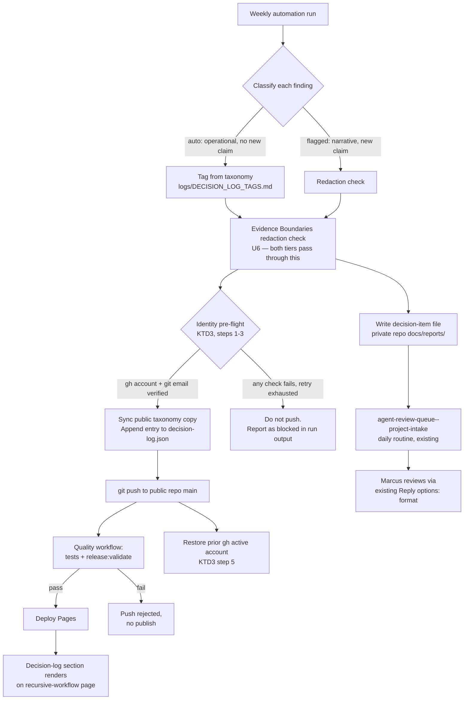

**Target repos (multi-repo plan):**
- `C:\Users\marcu\.codex\automations\ai-native-proof-of-work\automation.toml` (Codex automation config, private — not a git-tracked product repo)
- `C:\Users\marcu\.code\ai-native-proof-of-work` (private repo, referenced as `<private>` below)
- `C:\Users\marcu\code\ai-native-proof-of-work-public-staging` (public site repo, referenced as `<public>` below)

---

## Summary

Extend the existing weekly Codex automation so it classifies its own output into two tiers — small/mechanical (auto-published) and large/narrative (flagged for review) — and tags every auto-published entry from a fixed, evidence-only capability taxonomy. Auto-tier entries publish to a small decision-log section on the recruiter site's recursive-workflow page, through the site's existing CI gate, with no new GitHub secret. Flagged-tier entries land in Marcus's existing daily Codex intake queue instead of a new destination.

## Problem Frame

The weekly automation already produces structured self-improvement evidence (lessons, fixes, promoted patterns) but only writes it into the private repo — none of it reaches the public, recruiter-facing site. Marcus wants a public, tagged, scannable log of this evidence so a recruiter or their AI agent can assess AI-maturity directly, without manually curating it each week. The catch: any mechanism that lets an unattended weekly automation push to the public site risks publishing under the wrong GitHub identity — this exact failure (`TheOneDarkHorse` active instead of `marcus-uden-dev`) already happened once this session and was only caught by a manual pre-push check.

## Requirements

- **R1.** A fixed, evidence-only tag taxonomy (Marcus's confirmed list, 2026-08-23 revision — 49 current tags plus a gated "future tags" bank) governs every decision-log entry. A tag is assigned only when the underlying case provides concrete evidence for that capability — never inferred from tools or terminology alone. Future-bank tags are never assigned until a case demonstrates them.
- **R2.** Every weekly automation output is classified into exactly one tier: **auto** (small/mechanical — publishes without human review) or **flagged** (large/narrative — requires Marcus's review before anything ships).
- **R3.** Auto-tier entries publish to the public site without introducing any new stored credential (PAT, Action secret, or otherwise) beyond the two `gh` accounts already authenticated on Marcus's machine.
- **R4.** Every auto-tier publish is preceded by a hard identity check covering both vectors that actually gate a publish on this machine: the active `gh` account (which authenticates `git push` to github.com, confirmed below) and the local checkout's `git config user.email` (which `<public>`'s own release gate separately enforces). The automation refuses to publish — reporting instead — if either cannot be verified.
- **R5.** Auto-tier entries pass through the exact same `npm run release:validate` + test-suite gate that every other change to `<public>`'s `main` branch already goes through — no side channel that skips CI. This requires every new file the automation creates to be present in `<public>/release/allowlist.json` before the first publish attempt.
- **R6.** Flagged-tier entries land in the existing `agent-review-queue--project-intake` daily intake path (repo-local `docs/reports/` in `<private>`, per that routine's existing read list) — not a new destination Marcus has to learn.
- **R7.** The decision log renders as a new section on the recursive-workflow page (`<public>/site/proof/recursive-workflow/index.html`), styled within DESIGN.md's existing component vocabulary, ordered newest-first with a visible-entry cap.
- **R8.** Entries redact session-mechanics and tool-internal detail per `<private>/case-studies/WORKFLOW_IMPLEMENTATION_CASES.md`'s existing Evidence Boundaries rule, with a deterministic pattern-based backstop in the contract test — not solely reliance on the automation prompt following the rule correctly.

## Key Technical Decisions

**KTD1 — Tier-boundary rule.** An entry is **auto** only if it changes *how existing work is verified, executed, or maintained* — a completed fix, a reliability improvement, a promoted lesson, a test/coverage addition, a doc/process hygiene fix — with a factual one-line why and zero new claims about Marcus's capability or the product's maturity. An entry is **flagged** if it changes or adds to *what is claimed publicly* — a new site section, new copy, a new case study, a new diagram, or anything that reads as a capability claim rather than an operational note. This mirrors `ce-code-review`'s `safe_auto` vs. `manual` distinction, applied to site content instead of code diffs. *(see origin: plan-for-plan §9)*

**KTD2 — No new secret, identity-safe by construction, not by credential scoping.** The plan-for-plan document (2026-08-22) proposed a `workflow_dispatch`-triggered GitHub Action using the target repo's ambient `GITHUB_TOKEN`. On closer analysis: triggering that workflow externally still requires *some* credential with `actions:write` on `<public>` — there is no credential-free way to invoke it from the local automation. Marcus's explicit "no new secret" constraint rules out creating one. **Revised design:** skip the external-trigger indirection entirely. The auto-tier publish is a direct, small `git push` to `<public>`'s `main`, made by the same local automation that already has `gh`/git write access to `<private>` today — gated by a hard identity pre-flight (KTD3) instead of a narrower credential. This reuses `<public>`'s existing `Quality` → `Deploy Pages` pipeline unchanged; no new GitHub Actions workflow file is needed at all.

*Alternative considered and rejected (adversarial review, 2026-08-23): a semi-automated design — batch auto-tier findings across the week and have Marcus run a single manual publish command — would eliminate the identity pre-flight's entire risk surface at the cost of one weekly manual step. Rejected because the payload is a small, low-risk JSON log entry (not code), and KTD3's pre-flight plus the restore-on-completion step below reduces the residual risk to a level proportional to that payload; a GitHub App with a repo-scoped installation token was also considered and excluded under the same no-new-credential constraint. If the pre-flight's real-world reliability proves weaker than expected across the first several live runs (see Risks), revisit this decision.*

**KTD3 — Identity pre-flight, covering both vectors that actually gate a publish on this machine.**

Verified directly against this machine's configuration (2026-08-23), not assumed:
- `git config --get credential.https://github.com.helper` resolves to `gh.exe auth git-credential` — `gh auth setup-git` has already been run, so `gh`'s active account genuinely authenticates `git push` to github.com on this machine (Windows' generic Git Credential Manager is overridden for that host specifically). This closes the credential-mechanism gap an adversarial review raised as a hypothetical — it does not apply here today.
- `<public>`'s existing persistent checkout already has `git config user.email` set to `marcus.uden.dev@gmail.com` (`<public>`'s own `scripts/check-public-release.mjs` separately enforces this exact address against every commit author via its `git-author` check, independent of which `gh` account is active). The machine's *global* `git config user.email` is a different address — so this guarantee holds only if the automation reuses the persistent checkout, not a fresh scratch clone (see the clone-strategy commitment below).

Pre-flight steps, run before any `<public>`-repo write:
1. Run `gh auth status`. If the active account is `marcus-uden-dev`: proceed to step 2. If it is anything else (including `TheOneDarkHorse`): run `gh auth switch --user marcus-uden-dev`, re-run `gh auth status`, and only proceed to step 2 if the switch is confirmed. If `gh auth status` errors outright (no parseable account, both accounts de-authenticated, `gh` unavailable) at any point: treat identically to a failed switch — do not push (see step 4).
2. In the target checkout, verify `git config --get user.email` equals `marcus.uden.dev@gmail.com`. If not, set it explicitly before committing.
3. Verify `git config --get credential.https://github.com.helper` still resolves to a `gh`-routed helper (drift guard — this configuration could change independently of this plan). If it does not, treat as a failed pre-flight.
4. If any check in steps 1-3 fails after the allowed retry: **do not push.** Report the auto-tier entries as blocked-pending-manual-publish in the run output instead, exactly like any other failure mode already defined in `automation.toml`'s commit/push rules.
5. After the publish attempt (success, failure, or blocked) — restore the `gh` active account to whatever it was before step 1 ran. `gh auth switch` mutates machine-global state, not a scope local to this automation's process; leaving the machine switched to `marcus-uden-dev` after a Sunday-night run would itself be a form of the identity confusion this design exists to prevent, especially if Marcus is using `gh` interactively as a different account around the same time.

This is the same discipline used manually, twice, earlier this session, made into a non-skippable automated step instead of relying on a human catching it — now extended to cover the commit-author vector a feasibility review found the original design missed, and closed by restoring prior state rather than leaving a global mutation behind.

**KTD4 — Flagged-tier delivery reuses an existing routine, not a new one.** Per Marcus's confirmed choice, flagged entries write a decision-item file into `<private>/docs/reports/` using the intake routine's own canonical decision format (`Owner: human`, `Reply options:`, stable `id` — per `template/collaboration/AUDIT_DECISION_RESPONSE_TEMPLATE.md` in the separate `llm-repo-template` repo at `C:\Users\marcu\.code\llm-repo-template`, referenced directly by `agent-review-queue--project-intake`'s own SKILL.md). No new Claude scheduled task, no new polling logic — the existing daily routine already reads that path.

**KTD5 — Decision-log placement.** Per Marcus's confirmed choice, the log is a new section on the recursive-workflow page, not a standalone page — consistent with that page's own "human-gated system loop" narrative and this session's precedent of keeping supporting-proof content lighter than the lead case.

**KTD6 — Taxonomy needs a public-repo-accessible copy, not just a private source.** A coherence review caught that U1's original design stored the taxonomy only in `<private>` (`logs/DECISION_LOG_TAGS.md`), but U4's contract test and U5's e2e test both need to validate entries against it inside `<public>`'s own CI, which has no filesystem access to `<private>`. Resolution: `<private>` stays the source of truth (the file Marcus and future edits touch first), and the automation publishes a generated, verbatim JSON copy into `<public>` as part of the same commit that appends a decision-log entry — so the copy is always current as of the last publish, with no separate sync mechanism to maintain. See U1 and U4.

**KTD7 — Client-side rendering, not build-time generation.** `<public>` has no build/templating step today — it is served as static files (confirmed: `scripts/serve-static.mjs`, the existing `job-agent-company-v1.json` fixture is already fetched client-side by `site/proof/job-agent/demo/`). The decision-log section follows the same established pattern: `decision-log.json` is fetched client-side by a small script, matching the site's existing architecture rather than introducing a new build step.

## High-Level Technical Design



## Implementation Units

### U1. Tag taxonomy source file and public-repo copy

**Goal:** Store Marcus's confirmed tag taxonomy (49 current tags + gated future-tags bank + 10 assignment rules, 2026-08-23 revision) as the private source of truth, and generate a public-repo-accessible copy the site and its tests can validate against (KTD6).

**Requirements:** R1

**Dependencies:** none

**Files:**
- Create: `logs/DECISION_LOG_TAGS.md` (in `<private>`) — YAML frontmatter block with the current-tags list (tag + `shows:` description), the future-tags bank clearly marked as not-yet-assignable, and all 10 assignment rules quoted exactly as Marcus supplied them.
- Create: `<public>/site/data/decision-log-tags.json` — a generated array of `{ tag, shows }` objects covering only the *current* (assignable) tags, verbatim from `logs/DECISION_LOG_TAGS.md`. The future-tags bank is never copied here — a tag with no path to being assigned has no reason to exist in the public validation surface.

**Approach:** Copy the YAML Marcus provided verbatim into `logs/DECISION_LOG_TAGS.md` — do not paraphrase the `shows:` descriptions, and preserve the "current" vs. "possible future" split exactly as given, including the note that future tags are not aspirational and only become valid once a case demonstrates them. Follow this repo's existing frontmatter convention (`created`, `author`, `source_tool`, `source`, `type`, `status`, `review_status`, `tags`). The `<public>` JSON copy is regenerated by the automation each time it runs (U4's approach step), not maintained by hand — this keeps the two files from drifting without needing a separate sync mechanism.

**Patterns to follow:** `<private>/logs/DECISION_LOG.md`'s existing entry structure for surrounding prose conventions; `<public>/site/evidence/fixtures/job-agent-company-v1.json`'s existing pattern for a small, static, client-fetched JSON data file.

**Test scenarios:**
- Test expectation: none for the private source file — static reference content, no behavioral surface.
- Integration (covered in U4's contract test, not a separate test here): the generated `<public>` copy's tag set is a subset of `logs/DECISION_LOG_TAGS.md`'s current-tags list, never including future-bank tags.

**Verification:** `logs/DECISION_LOG_TAGS.md` exists, contains every current tag with a non-empty `shows:` line, the future-tags bank, and all 10 assignment rules verbatim. After U4 ships, a manual run confirms `<public>/site/data/decision-log-tags.json` matches the current-tags subset exactly.

---

### U2. Tier-classification in the automation prompt

**Goal:** Add KTD1's tier rule as an explicit, numbered step in `automation.toml`'s existing weekly prompt.

**Requirements:** R2

**Dependencies:** U1 (tag file must exist for the prompt to reference)

**Files:**
- Modify: `C:\Users\marcu\.codex\automations\ai-native-proof-of-work\automation.toml` (`prompt` field)

**Approach:** Insert a new numbered responsibility into the existing "Weekly output responsibilities" list (currently 1–12): classify each finding as auto/flagged per KTD1's rule, tag auto-tier findings from `logs/DECISION_LOG_TAGS.md` following all 10 assignment rules (evidence-only, 3-7 tags per case, capability over implementation-detail, no outcome tags without measured evidence). Keep the existing "Clean-state contract" and "Commit and push rules" sections untouched for `<private>`-repo behavior — this unit only adds new steps, it does not alter the automation's existing private-repo responsibilities.

**Technical design (directional):**
```text
Step N: Classify each weekly finding.
  IF finding changes how work is verified/executed/maintained AND makes no new public capability claim:
    tier = auto
    assign 3-7 tags from logs/DECISION_LOG_TAGS.md's current-tags list per its 10 assignment rules
      (evidence-only; prefer capability tags over implementation-detail tags;
       never assign future-bank tags; never assign outcome tags like business-value
       without measured evidence)
  ELSE:
    tier = flagged
```

**Patterns to follow:** The existing "Clean-state contract" section's fail-closed shape (stop and report the blocker rather than partially completing).

**Test scenarios:**
- Test expectation: none — this unit changes an LLM prompt, not executable code. Verification is behavioral (U4's contract test exercises the resulting output's tag validity).

**Verification:** The updated prompt text contains the classification rule and references the 10 assignment rules; a dry run of the automation produces correctly tiered, correctly tagged output (3-7 tags per entry, all from the current-tags list).

---

### U3. Flagged-tier decision-item output

**Goal:** Wire flagged-tier findings into the existing intake queue's canonical decision format so `agent-review-queue--project-intake` picks them up automatically.

**Requirements:** R6, R8

**Dependencies:** U2 (tier classification must exist first)

**Files:**
- Modify: `C:\Users\marcu\.codex\automations\ai-native-proof-of-work\automation.toml` (`prompt` field, continuing U2's new steps)
- Create (at runtime, by the automation, not by this plan): files under `<private>/docs/reports/` — one per flagged finding or one batched file per run

**Approach:** For each flagged-tier finding, write a decision-item file into `<private>/docs/reports/` using the format `agent-review-queue--project-intake`'s own SKILL.md already requires (`Owner: human`, stable `id` in `N.a` form, `Reply options:` with recommended/defer/reject, `Decision: pending`). Apply U6's shared redaction gate before writing (R8) — no session-mechanics or tool-internal detail.

**Patterns to follow:** `C:\Users\marcu\.code\llm-repo-template\template\collaboration\AUDIT_DECISION_RESPONSE_TEMPLATE.md` (referenced directly by the intake routine's SKILL.md, and located in the separate `llm-repo-template` repo, not inside `<private>`'s own `template/` directory) — follow its field shape exactly so the existing routine parses it without changes on its side.

**Test scenarios:**
- Test expectation: none — prompt/process change; correctness is verified by the next `agent-review-queue--project-intake` run successfully picking up and triaging a real flagged-tier file.

**Verification:** A flagged finding, once produced, appears in the next `agent-review-queue--project-intake` run's NEW INTAKE ITEMS section without manual intervention.

---

### U4. Decision-log data file, allowlist registration, and auto-publish

**Goal:** Give the site a small, structured data source for decision-log entries, register every new file the release gate must allow, and have the automation append/sync/push through the identity pre-flight — reusing the existing CI gate, no new workflow.

**Requirements:** R3, R4, R5, R8

**Dependencies:** U1, U2

**Files:**
- Create: `<public>/site/data/decision-log.json` — array of `{ date, tags: [...], why, demonstrates }` entries, newest-first
- Create: `<public>/site/data/decision-log-tags.json` — generated public copy from U1
- Modify: `<public>/release/allowlist.json` — add both new data files and the new contract test path to `allowedFiles` (feasibility review, confirmed by direct inspection: `release:validate` fails closed with an `unexpected-path` error on any file not listed here, which would silently block every downstream step including `Deploy Pages` on the very first publish attempt)
- Modify: `C:\Users\marcu\.codex\automations\ai-native-proof-of-work\automation.toml` (`prompt` field — the actual sync+append+push step, and the identity pre-flight from KTD3)
- Test: `<public>/tests/contracts/decision-log.test.mjs` — validates `decision-log.json`'s shape (every entry has 3-7 tags, all present in `decision-log-tags.json`'s current set, non-empty `why`/`demonstrates` strings, valid `date`, newest-first ordering) and includes a pattern-based redaction backstop (see below)

**Approach:** After a confirmed identity pre-flight (KTD3 steps 1-3), the automation operates on `<public>`'s existing persistent checkout (not a fresh scratch clone — see the Risks section for why this matters for the `git config user.email` guarantee), pulling latest first. It regenerates `decision-log-tags.json` from `logs/DECISION_LOG_TAGS.md`'s current tags (KTD6), prepends the new entry to `decision-log.json` (newest-first, per R7), commits both files together with a fixed conventional message (e.g. `docs: auto-publish decision-log entry`), and pushes directly to `main`. KTD3 step 5 restores the prior `gh` active account regardless of push outcome. This push triggers `<public>`'s existing `Quality` workflow (tests + `npm run release:validate`) exactly as any human commit would; `Deploy Pages` only runs if `Quality` passes.

**Redaction backstop (R8, addressing a security review finding):** `release:validate`'s existing categories (no local paths, no forbidden identities, no disallowed positive-maturity wording) do not cover session-mechanics or tool-internal detail — those are currently enforced only by the automation prompt's own compliance with the Evidence Boundaries rule (U6), with no deterministic check. Extend the new contract test with a small deny-list pattern check (session/tool-internal markers such as raw file-path fragments matching this machine's user directory, known internal tool-name strings) against every entry's `why`/`demonstrates` text, so a missed redaction has a second, code-enforced gate before it can reach `main`.

**Patterns to follow:** `<public>/scripts/check-public-release.mjs`'s existing validation categories and its `allowedFiles` mechanism; `<public>/site/evidence/fixtures/job-agent-company-v1.json` for the client-fetched static JSON pattern (KTD7).

**Test scenarios:**
- Happy path: a well-formed entry (3-7 valid tags, non-empty why/demonstrates, valid date) passes the contract test.
- Edge case: an entry with a tag not present in `decision-log-tags.json`'s current set fails the contract test.
- Edge case: an entry with a tag from the future-tags bank fails the contract test (never assignable yet).
- Edge case: an entry with fewer than 3 or more than 7 tags fails the contract test.
- Edge case: an entry with an empty `why` or `demonstrates` string fails the contract test.
- Edge case: an entry containing a redaction-backstop-matched pattern (session-mechanics/tool-internal marker) fails the contract test.
- Edge case: entries not in newest-first order fail the contract test.
- Integration: appending an entry, regenerating `decision-log-tags.json`, and running `npm run release:validate` end-to-end still reports success for the full site (no regression in existing file-count validation) — this specifically requires the allowlist update above to already be in place.

**Verification:** `npm run test:contracts` passes with the new test included; a manually-appended sample entry survives `npm run release:validate` and `npm test` unchanged; a manual dry run confirms the allowlist update is live before the automation's first real attempt.

---

### U5. Decision-log site section

**Goal:** Render `decision-log.json` as a new section on the recursive-workflow page, per KTD5's placement decision and KTD7's client-side rendering approach.

**Requirements:** R7

**Dependencies:** U4 (data files must exist for the section to render against)

**Files:**
- Modify: `<public>/site/proof/recursive-workflow/index.html` (new `<section>`, likely near the end before the contact panel)
- Modify: `<public>/site/assets/js/site.js` (client-side fetch + render of `decision-log.json`, following the same pattern already used for `job-agent-company-v1.json`)
- Modify: `<public>/site/assets/css/site.css` (new component styling, following this session's established discipline of using only root/light tokens — this page's sections are not `.section--dark`)
- Modify: `<public>/DESIGN.md` (register the new component in the Components list, same discipline as this session's `.loop-diagram` addition)
- Test: `<public>/tests/e2e/recursive-workflow.spec.js` (new test scenarios)

**Approach:** Render each entry as a stacked list row (extending `.limitations-list`'s existing pattern, not `.decision-grid`'s card-grid pattern — a design review flagged the plan's original wording as ambiguously naming both; a stacked list better matches this section's own "log, not case study, keep it scannable" framing). Each row shows: date, 3-7 tag pills (preceded by a visually-hidden "Capabilities shown:" label for screen readers), one-line why, one-line "what it demonstrates." Entries render newest-first (R7), capped at roughly 10-15 visible entries with a "show more" affordance once the log exceeds that. Text fields (`why`, `demonstrates`) render via safe text interpolation (`textContent`, never raw HTML concatenation) — these strings originate from unattended automation output with no human review before rendering, so this is not optional. Entries carry no evidence-source link — a design review asked whether one was needed; the answer is no, by the same Evidence Boundaries redaction rule that governs everything else this automation publishes (R8), a link back to private-repo evidence isn't safe to expose, so this is a deliberate, documented choice, not an oversight. If `decision-log.json` is empty (no auto-tier entries published yet), render an honest "no entries yet" state rather than a broken or empty-looking section — mirrors this repo's existing "no invented progress" discipline (`automation.toml` responsibility 12). If the fetch fails or the JSON is malformed, render a quiet, non-broken fallback state (e.g. omit the section rather than show an error to a recruiter) and log the failure to the console for later debugging — never let a data-layer failure surface as visibly broken UI on a recruiter-facing page.

**Patterns to follow:** `.limitations-list` component pattern already on this page; `site/proof/job-agent/demo/` for the existing client-side-fetch-of-JSON-fixture pattern; the DESIGN.md Components entry pattern established for `.loop-diagram` this session (light-context tokens only, documented rationale for why it's a new component rather than a reuse).

**Test scenarios:**
- Happy path: with sample entries in `decision-log.json`, the section renders each entry's tags, why, and demonstrates text, visible on the page, newest-first.
- Edge case: with an empty `decision-log.json` array, the section renders the explicit "no entries yet" state, not a blank gap.
- Edge case: with a fetch failure or malformed JSON, the section omits itself quietly rather than rendering broken markup.
- Edge case: with more than the cap threshold worth of entries, only the cap is visible plus a working "show more" affordance.
- Integration: the section's tag pills only ever show tags from `decision-log-tags.json`'s current set (cross-check against U1's public copy in the test).
- Accessibility: each entry's tag-pill group has an accessible label (screen-reader text) preceding it.
- Regression: existing recursive-workflow page tests (U1–U7 content from the 2026-08-22 content-depth plan) continue to pass unchanged.

**Verification:** `npm test` (contracts + e2e) passes; manual browser check confirms the section renders correctly in populated, empty, and fetch-failure states; `npm run release:validate` still passes for the full site.

---

### U6. Redaction and evidence-boundary check

**Goal:** Confirm auto-tier and flagged-tier entry generation both apply the existing Evidence Boundaries redaction rule before anything reaches either destination, and that the check happens once, upstream of both branches — not duplicated per tier.

**Requirements:** R8

**Dependencies:** U2

**Files:**
- Modify: `C:\Users\marcu\.codex\automations\ai-native-proof-of-work\automation.toml` (`prompt` field — explicit redaction check step, positioned before the tier branch, applying to every finding regardless of tier)

**Approach:** Add one explicit step, run for every finding immediately after classification (U2) and before either tier's write/publish step, so it gates both branches from a single point rather than being reimplemented per tier: check the finding text against `<private>/case-studies/WORKFLOW_IMPLEMENTATION_CASES.md`'s Evidence Boundaries section (session-mechanics detail, tool-internal detail, private file paths, OneDarkHorse-identifying detail are all forbidden). U4's contract test provides a deterministic backstop specifically for the auto-tier path (R8); this step is the primary, LLM-applied gate for both tiers.

**Patterns to follow:** The redaction discipline `automation.toml` already applies to every other public artifact it produces (case studies, recruiter summaries) — this unit extends the same discipline to the new decision-log content type rather than inventing new redaction logic.

**Test scenarios:**
- Test expectation: none — this is a prompt-level content-safety step for the flagged-tier path (which has no code-level backstop, since it never leaves `<private>`). The auto-tier path's equivalent coverage lives in U4's contract test.

**Verification:** First live run's auto-tier and flagged-tier outputs contain no session-mechanics, tool-internal, private-path, or OneDarkHorse-identifying content — reviewed manually once, then trusted as part of the same discipline already governing this automation's other outputs.

## Scope Boundaries

**In scope:** tag taxonomy storage (private + public copy), tier classification, identity-safe auto-publish (no new secret, covering both the gh-account and git-email vectors), allowlist registration, flagged-tier routing through the existing intake queue, the new site section (with defined empty/error/cap states), redaction gate with a deterministic backstop.

**Explicitly excluded from this plan:**
- Any change to the private repo's existing weekly responsibilities (PROOF_OF_WORK.md, case studies, recruiter briefs, etc.) — those stay exactly as they are today. *Reason: this plan is additive, not a rework of the existing automation's core job.*
- A new GitHub Actions workflow file, `workflow_dispatch` trigger, or any new stored secret/PAT. *Reason: superseded by KTD2 after Marcus's explicit "no new secret" — the direct-push design makes this unnecessary.*
- A dedicated new `/decision-log/` page. *Reason: Marcus chose the existing-page-section option.*
- A PR-based review flow for flagged entries. *Reason: Marcus chose the existing intake-queue option instead.*
- A semi-automated (batch-then-weekly-manual-confirm) publish flow. *Reason: considered during adversarial review and rejected — see KTD2's alternatives note — but worth revisiting if the pre-flight's live reliability proves weaker than expected.*
- Retroactively back-filling the decision log with historical entries from before this ships. *Reason: not requested; would require re-deriving evidence for past work under the new tag taxonomy, a separate effort.*
- Any UI for Marcus to edit/curate published entries after the fact (e.g. an admin view). *Reason: not requested; entries are append-only via the automation, matching this repo's existing append-only logs convention.*
- A GitHub App with a repo-scoped installation token as the publish mechanism. *Reason: considered during adversarial review; excluded under the same no-new-credential constraint that ruled out the Action-secret design.*

### Deferred to Follow-Up Work

- If the identity pre-flight (KTD3) fails repeatedly across multiple weekly runs, or a dry-run/simulated-failure test surfaces reliability problems the plan didn't anticipate, that's a signal the "no new secret" design may need revisiting toward a narrower credential or the semi-auto alternative — out of scope for this plan, worth its own decision-log entry if it happens.
- A `docs/solutions/` or `logs/lessons.md`-style write-up of the theme-token-scoping convention (root tokens vs. `--dark-muted`), flagged as worth capturing during this session's earlier code review — unrelated to this plan's scope, noted here only so it isn't lost.
- Whether `automation.toml`'s `cwds` field (currently only `C:\Users\marcu\.code\ai-native-proof-of-work`) actually permits the automation's execution sandbox to read/write/clone into `<public>` as U4 assumes — a feasibility review flagged this as unverifiable from the config file alone. Confirm against Codex's actual execution model before implementation; if the sandbox is more restrictive than assumed, U4's approach may need a `cwds` addition or a different clone strategy.

## Risks & Dependencies

- **Risk:** the direct-push design (KTD2) means the automation's local git/gh state must be clean and correctly configured every week — reusing `<public>`'s existing persistent checkout (rather than a fresh scratch clone) is a deliberate choice, not an oversight: only the persistent checkout already carries the correct `git config user.email` KTD3 depends on. A fresh clone would inherit the machine's global (wrong) email and fail `release:validate`'s `git-author` check even after a successful gh-identity pre-flight. *Mitigation:* `git pull` the persistent checkout immediately before appending; never fresh-clone for this step.
- **Risk:** `<public>`'s `Quality` workflow could reject an auto-tier push (e.g., a tag validation failure tripping U4's contract test) — a Sunday-night automation failure with no one watching until Marcus next checks. Because the push goes directly to `main` with no PR gate, a failing commit still lands in history even though it never deploys; recovery (revert or fix-forward) is manual. *Mitigation:* this is the same behavior as any other CI-gated push today (fails safely, does not deploy) — an acceptable existing pattern per `<public>`'s CI design, not a new risk this plan introduces, but worth knowing recovery isn't automatic.
- **Risk:** the identity pre-flight's real-world reliability against the exact failure mode this plan exists to prevent remains unverified until observed across several live weekly runs — no dry-run or simulated-failure test exists for KTD3 before it starts operating unattended against a public repo. *Mitigation:* treat the first 2-3 live runs as a soft rollout Marcus should spot-check, per the Deferred to Follow-Up Work note above.
- **Dependency:** U4 and U5 depend on `<public>`'s existing `release:validate` gate continuing to run on every push to `main`, AND on `release/allowlist.json` being updated before the first publish attempt (see U4).
- **Dependency:** U3 depends on `agent-review-queue--project-intake`'s SKILL.md continuing to read `docs/reports/` in accessible repos — already documented in that routine's own read list.
- **Dependency:** KTD3's git-credential-helper guarantee depends on `gh auth setup-git` remaining configured on this machine — verified today, with a drift guard (KTD3 step 3) added specifically because this could change independently of this plan.

## Sources & Research

Primary input: `C:\Users\marcu\.agents\docs\plans\shared\2026-08-22-recruiter-decision-log-automation-plan-for-plan.md` (objective, inputs, decision criteria, initial tag-taxonomy draft superseded by Marcus's confirmed taxonomy, initial identity-mechanism proposal revised by KTD2 after Marcus's "no new secret" constraint).

Direct repo research (no subagent dispatch for the initial pass — findings gathered first-hand during planning, same session already holding full context on both repos):
- `C:\Users\marcu\.codex\automations\ai-native-proof-of-work\automation.toml` — full current prompt, existing commit/push discipline, GitHub export pattern to a second repo.
- `C:\Users\marcu\.claude\scheduled-tasks\agent-review-queue--project-intake\SKILL.md` — confirmed exact intake contract (decision format, read paths, `Owner:`/`Reply options:` shape) that U3 wires into.
- `<public>/.github/workflows/quality.yml`, `pages.yml` — confirmed the existing CI gate every push to `main` already passes through.
- `<private>/logs/DECISION_LOG.md`, `case-studies/WORKFLOW_IMPLEMENTATION_CASES.md` — existing entry/case shape and Evidence Boundaries rule.

**Doc review (2026-08-23):** Five reviewers ran against the initial plan — coherence, feasibility, design-lens, security-lens, adversarial. All five surfaced real, non-overlapping issues, since incorporated:
- Feasibility (confidence 100, direct inspection of `<public>/release/allowlist.json`): the plan's new files were never registered in the allowlist — the first auto-publish would have silently failed CI and never deployed. **Fixed in U4.**
- Feasibility (confidence 75, direct inspection of `check-public-release.mjs`): a second identity vector — commit author email — exists independent of the `gh` account check, and only holds if the automation reuses the persistent checkout rather than a fresh clone. **Fixed in KTD3 and the Risks section.**
- Coherence (confidence 75): the tag taxonomy was private-only but public-repo tests needed to validate against it. **Fixed via KTD6 and U1's public copy.**
- Coherence (confidence 75, both safe_auto): the HTD diagram omitted the redaction gate; a regression-test scenario cited the wrong unit range from the prior recursive-workflow plan. **Both fixed.**
- Security-lens (confidence 75 x2): `gh auth switch` mutates global state with no isolation from concurrent interactive use and no restore step; the redaction backstop only covered `release:validate`'s existing categories, not the full Evidence Boundaries scope. **Fixed via KTD3 step 5 and U4's redaction backstop.**
- Security-lens (confidence 50 x2, advisory): unescaped rendering of automation-generated free text; unspecified fail-closed behavior for total `gh auth status` failure. **Both addressed in U5's Approach and KTD3 step 1.**
- Adversarial (confidence 75, P0): raised the possibility that `gh auth status` doesn't govern actual push authentication on Windows (Git Credential Manager vs. gh's credential helper). **Directly verified against this machine's real configuration — confirmed not applicable today, documented as a verified fact plus a drift guard in KTD3 rather than left as an open risk.**
- Adversarial (confidence 75, cross-confirmed with security-lens): no restore-prior-account step. **Fixed via KTD3 step 5.**
- Adversarial (confidence 50-75): interrupted-mid-push clone-strategy ambiguity, semi-auto alternative not documented, GitHub App alternative not mentioned. **All addressed — clone strategy committed to explicitly, both alternatives now documented in KTD2 and Scope Boundaries.**

External research: skipped, both for the original plan and the review-fix pass. The relevant mechanics (`gh auth switch`, git credential helpers, GitHub Actions `GITHUB_TOKEN` scoping, `release:validate` gate behavior) were verified directly against this repo's and this machine's own working configuration — a stronger source than generic external documentation for this specific design, and the P0 finding above is a direct example of why that verification mattered.

No relevant `docs/brainstorms/` origin document existed; this plan proceeded from the plan-for-plan document plus direct planning-bootstrap conversation with Marcus (tag taxonomy, tier-delivery choice, placement choice, and the 2026-08-23 taxonomy revision).
