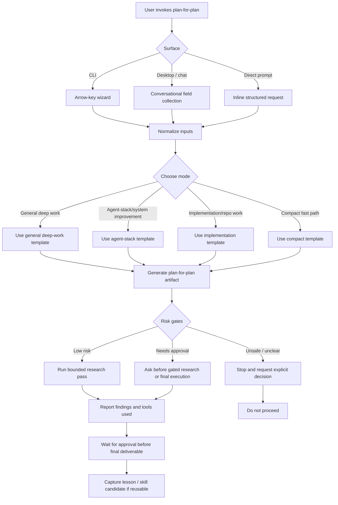

# Plan for the Plan: Complete Swedish Recruiter-Site Translation

Mode: Implementation / repo work

## 1. Objective

Define a safe, evidence-based implementation plan for a complete Swedish experience across the recruiter-facing website, while preserving an English experience, stable machine identifiers, recruiter readability, and static HTML accessibility.

## 2. Final artifact target

A phased implementation plan for the private evidence repository, its public-site repository, and the relevant automation. The plan will specify translation coverage, data-model changes, UI behavior, GitHub-profile synchronization, validation, rollout, and rollback. It will not include implementation.

## 3. Inputs to examine

- `logs/DECISION_LOG_TAGS.md` for stable IDs, Swedish display labels, and tag-language policy.
- `logs/DECISION_LOG.md`, translation-related plans, and prototypes for existing product decisions and terminology.
- `C:\Users\marcu\.codex\automations\ai-native-proof-of-work\automation.toml` for publishing, decision-log, and sync requirements.
- The public repository's `AGENTS.md`, `DESIGN.md`, site structure, evidence JSON, contract tests, end-to-end tests, and release validation scripts.
- The current GitHub-profile and recruiter-site source boundaries, if they can be identified without changing external state.

## 4. Context assumptions

- The target is the recruiter-facing AI-native proof-of-work website, not the Job Agent product UI.
- The private repository owns the human-edited source taxonomy; the public site consumes generated data.
- English tag IDs remain stable machine values. Swedish labels are presentation data, not replacement identifiers.
- Existing uncommitted work in either repository belongs to the user and must not be edited or staged by this planning task.
- Static HTML must remain useful without JavaScript.

## 5. Key questions to answer

- Which public pages, navigation elements, metadata, evidence entries, and generated assets need Swedish coverage?
- Which content should be shared data, which should have localized fields, and which must remain stable English identifiers?
- Where should initial-language selection, persisted preference, visible language state, and Swedish/English switching live?
- How can GitHub-profile or recruiter-site content changes trigger a paired language-sync check without inventing a source or changing credentials?
- Which contract, end-to-end, accessibility, and release checks prove the translated experience is complete and does not drift?
- What work is explicitly deferred until the base bilingual experience is reliable?

## 6. Extraction method

Inspect the existing private taxonomy and planning artifacts, then trace the public site from source data through static HTML and client-side enhancement to the release checks. Build a page and content inventory, record present localization patterns, identify data ownership, and distinguish user-owned worktree changes from pre-existing baseline behavior.

## 7. Synthesis method

Translate the findings into a smallest coherent staged plan:

1. Define language and data contracts.
2. Inventory and translate shared UI, page content, metadata, and decision-log presentations.
3. Add a non-JavaScript-safe language entry and switch behavior.
4. Add synchronized content-generation and validation gates.
5. Roll out incrementally with page-level acceptance checks and a reversible default-language fallback.

## 8. Decision criteria

- Prefer one source of truth with localized fields over duplicated hand-maintained pages.
- Keep stable URLs, tag IDs, evidence provenance, and existing recruiter links intact.
- Treat untranslated visible text, stale localized content, or language-dependent content that requires JavaScript as release failures.
- Defer personalization, machine translation at runtime, and external GitHub polling until a concrete source and operating model are approved.
- Do not expand into Job Agent product localization except where it is explicitly linked as evidence content on the recruiter site.

## 9. Proposed final output structure

1. Scope and non-goals.
2. Current-state inventory and ownership map.
3. Translation architecture and language contract.
4. Page-by-page rollout sequence.
5. Decision-log and taxonomy localization contract.
6. GitHub-profile/recruiter-site synchronization design.
7. Validation matrix and acceptance criteria.
8. Risks, rollout, rollback, and deferred work.

## 10. Acceptance criteria

The eventual implementation plan must provide:

- A complete public-surface inventory with ownership and source-of-truth mappings.
- A clear English-ID/Swedish-label rule for decision-log tags.
- A static-HTML-safe language strategy.
- A concrete definition of what counts as a GitHub-profile content change and how it is checked.
- Named repository-native validation commands and page-level checks.
- A phased implementation sequence that does not modify code until approved.

## 11. Risk gates

- GitHub profile polling or webhook configuration may involve external accounts, permissions, rate limits, or credentials. Do not design it as an active integration without an approved source URL and authorization model.
- Public deployment, DNS, Pages configuration, new dependencies, or changes to identity handling require explicit approval before implementation.
- Translation content can affect public claims and recruiter interpretation; retain evidence boundaries and require human review for substantive claim changes.

## 12. Failure modes

- Planning from private taxonomy files without tracing the public renderer and its validation path.
- Translating machine IDs, URLs, or provenance keys instead of display labels.
- Creating JavaScript-only language content that fails static access requirements.
- Treating a GitHub profile as a configured source when no canonical profile URL or ownership boundary exists.
- Overwriting the user’s current uncommitted translation artifacts.

## 13. Stop rule

Stop after the bounded research identifies the relevant repositories, source-of-truth files, rendering path, validation path, unresolved external-source questions, and implementation risks. Do not write application code, modify existing translation artifacts, publish, or deploy.

## 14. Next action

Ready to produce the final implementation plan after the bounded research pass and user confirmation.

## 15. Research pass log

### Sources and tools

- PowerShell and `rg` read-only inspection.
- Private source taxonomy: `logs/DECISION_LOG_TAGS.md`.
- Existing bilingual product decision: `docs/plans/2026-08-24-001-feat-bilingual-recruiter-profile-experience.md`.
- Private automation prompt: `C:\\Users\\marcu\\.codex\\automations\\ai-native-proof-of-work\\automation.toml`.
- Public repository: `AGENTS.md`, `DESIGN.md`, `package.json`, `release/allowlist.json`, HTML pages, evidence JSON, contract tests, end-to-end tests, and sitemap.

### Key findings

- The private taxonomy already defines stable English tag IDs and canonical Swedish display labels for all 49 current tags. The correct model is bilingual presentation, not a Swedish-only tag-ID migration.
- The public site is static HTML. Its visible public surfaces are the home page, CV page, Job-agent case study, recursive-workflow case study, Job-agent prototype, and 404 page; its public Markdown and JSON evidence assets also need an explicit language decision.
- Existing client-side JavaScript only supports copy actions and the Job-agent prototype. There is no localization framework. Language access must therefore be real static HTML navigation first, with persistence as optional enhancement.
- The public site already has strong no-JavaScript, keyboard, print, responsive, contract, and release validation coverage. The eventual plan should extend these existing suites rather than introduce a parallel test system.
- `site/evidence/decision-log-tags.json` currently contains English IDs and English descriptions only. It needs localized presentation fields while preserving `tag` as the stable identifier; `decision-log.test.mjs` is the natural contract-test owner.
- `sitemap.xml` and all current HTML documents declare English. The rollout must include language-specific metadata, `lang`, canonical/hreflang handling, and sitemap coverage.
- The private automation names a `ai-native-proof-of-work-public-staging` checkout, while the accessible public checkout is `ai-native-proof-of-work-public`. Confirm the canonical publish checkout before implementation.
- Existing uncommitted translation artifacts are present in the private repository and are excluded from this planning task.

### Unresolved questions

- Which GitHub profile URL and content surface is canonical for language synchronization?
- Whether Swedish pages use a path prefix such as `/sv/`, a language query parameter, or another static URL contract. The recommended default is an `/sv/` path tree because it supports direct GitHub README links and no-JavaScript access.
- Whether public Markdown and machine-readable evidence should have Swedish equivalents or retain English with a clearly linked Swedish reader-facing alternative.
- Whether the public repository path named in the automation is still the active release checkout.

## Workflow Diagram

