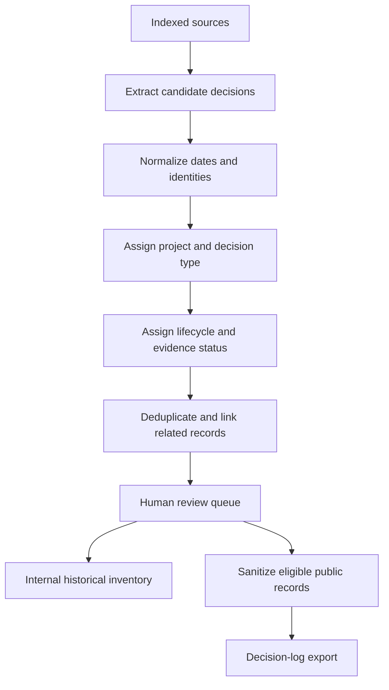

# Historical Decision and Personal AI Harness Backfill

## Goal Capsule

Build a bounded backfill process that reconstructs the historical decision trail from two evidence domains:

1. Decisions already documented in this proof-of-work repository.
2. Personal AI Harness work that exists outside the repository, including plans, lessons, memory records, scheduled-task outputs, and incident reports.

The result is a reviewed, chronologically ordered decision inventory. Each record has one primary project tag, optional secondary tags, a lifecycle status, evidence boundaries, and a public eligibility decision. Only sanitized and sufficiently supported records may reach the recruiter-facing decision log.

This is a backfill plan, not an instruction to publish every historical artifact. Raw conversations, private paths, secrets, unverified claims, and inferred dates remain internal or are excluded.

## Current Backfill Result

The first execution pass produced 15 inventory records and 12 sanitized profile-oracle decisions. Sources included the repository decision log, project strategy trails, repository plans, `tasks/lessons.md`, and selected shared harness plans, durable lessons, and incident summaries.

The profile oracle contains only records with a usable public summary and stable project assignment. Records marked `eligible-after-redaction`, `eligible-after-implementation`, or `planned` remain bounded claims and require the normal human review or implementation gate before publication.

## Problem Frame

The current decision log begins after the public decision-log mechanism was designed. Earlier product and harness decisions already exist across repository documents and local operating sources, but they are split by source type and use different levels of detail. If they are copied directly into the public log, the result may have incorrect dates, duplicate decisions, mixed project ownership, or claims that are stronger than the evidence.

The backfill must therefore separate extraction from classification, classification from human review, and reviewed history from public export.

## Scope

### In scope

- Historical decisions in repository-visible Markdown, plans, logs, strategy trails, workflow documents, and case studies.
- Personal AI Harness evidence from indexed local sources such as plans, lessons, memory, scheduled-task outputs, and incident reports.
- Historical date reconstruction using explicit dates and a documented confidence rule.
- Primary project assignment and stable project tags.
- Decision type, lifecycle status, evidence status, capability tags, and public eligibility.
- Duplicate detection and links between related decisions, implementations, lessons, and incidents.
- A human review queue for ambiguous, incomplete, or public-facing records.
- A sanitized export shape for the recruiter-facing decision log.

### Out of scope

- Publishing raw chat or session transcripts.
- Treating every task, note, or file change as a decision.
- Reconstructing exact dates when the source does not support them.
- Adding technical-depth personalization to the recruiter experience.
- Changing the existing scheduled-task cadence.
- Replacing the source indexes or inventing access to unavailable local sources.

## Canonical Record Model

Each backfilled candidate record should contain these fields before review:

| Field | Purpose |
|---|---|
| `id` | Stable record identifier that survives reordering and reclassification |
| `decision_date` | Best-supported date, never based only on file modification time |
| `date_precision` | `day`, `month`, `range`, or `unknown` |
| `primary_project` | Exactly one project owner |
| `secondary_projects` | Optional related projects when the evidence genuinely spans them |
| `decision_type` | `product`, `architecture`, `workflow`, `memory`, `automation`, `incident`, or `evidence-packaging` |
| `lifecycle_status` | `implemented`, `in-progress`, `planned`, `rejected`, or `needs-review` |
| `evidence_status` | `verified`, `estimated`, `planned`, or `needs-review` |
| `title` | Short recruiter-readable decision statement |
| `context` | Why the decision was needed |
| `decision` | What was chosen or proposed |
| `tradeoff` | The main cost, risk, or rejected alternative |
| `evidence_refs` | Internal source references used for review |
| `capability_tags` | Three to seven evidence-based recruiter capability tags |
| `public_eligibility` | `publish`, `internal-only`, or `needs-review` |
| `redaction_notes` | Internal explanation of removed or generalized detail |

The public export must omit internal paths, raw source references, private identities, secrets, session mechanics, and fields that expose unsupported personal or product claims.

## Project Taxonomy

Use one primary project tag on every accepted record:

| Project tag | Use for |
|---|---|
| `project: personal-ai-harness` | Cross-cutting memory, skills, agents, scheduled tasks, source ingestion, governance, recursive improvement, incidents, and harness experiments |
| `project: job-agent` | Product decisions specific to the job-agent career workflow product |
| `project: pkm` | Product decisions specific to the PKM product and its user workflow |
| `project: household-budget` | Product decisions specific to the household budget app |
| `project: apporganiser-android` | Product decisions specific to Apporganiser Android when verified evidence is available |
| `project: obsidian` | Only when Obsidian is treated as a distinct product or workstream; otherwise use `project: personal-ai-harness` with memory and knowledge-management capability tags |

Cross-cutting harness work must not be forced into the product that happened to provide the source example. A scheduled task that maintains several projects belongs to `personal-ai-harness`, with secondary project references only when useful.

## Source Inventory

### Repository-visible sources

Start with the current repository and use these sources in priority order:

1. `logs/DECISION_LOG.md`
2. `architecture/TECHNICAL_DECISION_LOG.md`
3. `strategy/*/decisions/DECISION_TRAIL.md`
4. `logs/PROBLEM_SOLVING_LOG.md`
5. `tasks/lessons.md`
6. `logs/CHANGELOG.md` and `logs/WEEKLY_LOG.md`
7. `docs/plans/` and `plans/`
8. `workflows/`, `architecture/`, `case-studies/`, and scheduled-task documentation
9. `weekly-input/` when a dated input exists

Repository files are evidence sources, not automatically public sources. A source may support a recruiter-facing summary only after privacy and claim review.

### Personal AI Harness sources outside this repository

Use existing internal indexes before scanning local roots. The source classes are:

- Codex and Claude project histories, using summaries and dated artifacts rather than raw transcripts.
- Shared plans and plan-for-plan documents.
- Lessons and lesson candidates, including prevention checks and promoted rules.
- Memory records and memory candidates, including what was added, corrected, pruned, or marked stale.
- Scheduled-task definitions, run outputs, and failure or recovery records.
- Incident reports covering symptoms, root cause, fix, validation, and remaining warnings.
- Skills, templates, agent instructions, hooks, and reusable workflow artifacts.
- Source indexes that establish provenance and freshness.

If a source is not available in the current runtime, record `Source unavailable` and keep the candidate at `needs-review`. Do not infer its contents from filenames or prior conversation context.

## Date and Timeline Rules

Use this precedence order:

1. Explicit decision date in the source document.
2. Explicit event date in a dated incident, lesson, plan, weekly input, or scheduled run.
3. Commit date only when the commit clearly represents the decision or implementation event.
4. A month or date range when only coarse timing is supported.
5. `unknown` when no reliable date exists.

Never use filesystem modification time as the decision date. If a later document records an earlier decision, preserve the earlier date and link the later record as evidence. When multiple decisions occur on one date, sort by explicit time if available, then by source priority, then by stable ID. Display approximate dates honestly, for example `2026-05` or `2026-05 to 2026-06`.

## Classification Rules

Every candidate receives all four classifications before human review:

1. **Decision type:** what kind of change it represents.
2. **Primary project:** which project owns the decision.
3. **Lifecycle status:** whether it is implemented, active, planned, rejected, or unresolved.
4. **Public eligibility:** whether it can be safely shown to recruiters.

Use `needs-review` when any of these are unclear. Do not upgrade a planned idea to implemented because a related plan, skill, or task exists. Do not treat a lesson as a completed system change unless an implementation artifact or explicit completion evidence exists.

## Backfill Workflow

## Implementation Units

### U1 — Define the backfill schema and source policy

Create the canonical record model, project taxonomy, date rules, source priority, and public-boundary policy in a durable internal-facing document. Keep stable English IDs for programmatic filters and allow localized display labels later.

**Acceptance scenarios:**

- A record can represent an implemented change, an incomplete improvement, a rejected idea, and an incident-derived lesson.
- A record can remain internal without being dropped from the historical inventory.
- A source with no reliable date stays explicitly approximate or unknown.

### U2 — Extract repository decision candidates

Read the repository-visible sources in priority order and produce a candidate inventory. Preserve source references and quote only short decision-relevant fragments. Include existing product decisions and Personal AI Harness decisions.

**Acceptance scenarios:**

- Existing entries in `logs/DECISION_LOG.md` are not duplicated.
- Product strategy decisions retain their product project tags.
- Workflow, memory, scheduled-task, and evidence-layer decisions receive `project: personal-ai-harness` unless a stronger product-specific owner is supported.

### U3 — Extract Personal AI Harness candidates

Use internal source indexes to locate plans, lessons, memory records, scheduled-task outputs, incident reports, skills, templates, and instruction changes. Summarize each candidate at the pattern and artifact level. Do not publish raw session mechanics.

**Acceptance scenarios:**

- A memory improvement can be represented even when it does not belong to one product repository.
- A scheduled-task failure can become an incident or workflow decision without being presented as a product milestone.
- An unavailable source is marked `needs-review`, not silently omitted or reconstructed.

### U4 — Normalize, classify, and build the timeline

Apply the date precedence rules, primary project taxonomy, decision types, lifecycle status, evidence status, capability tags, and stable IDs. Keep related records linked rather than merging distinct decisions into one vague entry.

**Acceptance scenarios:**

- Timeline order follows supported event dates rather than file discovery order.
- A planned or incomplete item cannot receive `implemented` without completion evidence.
- Every accepted record has exactly one primary project tag.
- Tags are drawn only from the current evidence-based taxonomy.

### U5 — Deduplicate and route human review

Detect repeated descriptions of the same decision across a plan, log, lesson, incident, or source summary. Keep one canonical decision record with linked evidence. Route ambiguous ownership, uncertain dates, duplicate candidates, and public-boundary concerns to a review queue.

**Acceptance scenarios:**

- A plan and its later implementation are linked as one decision with lifecycle progression, not published as duplicate decisions.
- A lesson that records a correction is linked to the incident that caused it when available.
- A candidate with conflicting dates or project ownership remains `needs-review` until resolved.

### U6 — Produce the internal historical inventory

Write the reviewed inventory in a machine-readable or structured Markdown form that can support future exports. Keep internal source references and review notes out of recruiter-facing files. Include excluded and internal-only candidates with reasons so the backfill remains auditable.

**Acceptance scenarios:**

- The inventory can show published, internal-only, excluded, and pending records.
- A reviewer can understand why a candidate was not published.
- Re-running the extraction does not create a new record when the stable identity and source evidence match.

### U7 — Export eligible records to the recruiter decision log

Only after human review, convert eligible records into the existing public decision-log shape. Preserve newest-first ordering, stable capability tags, redaction rules, and the public site's static HTML requirement. Historical records should not bypass the existing quality gate.

**Acceptance scenarios:**

- Public entries contain no private paths, raw chat detail, credentials, or unsupported claims.
- Every public tag exists in the current public taxonomy.
- Historical entries can be distinguished from weekly auto-published entries through status or provenance-safe copy without exposing internal sources.
- The empty state remains honest when no historical entry is approved.

### U8 — Add the recurring backfill boundary

Update the weekly compiler contract so new decisions are linked to the historical inventory and do not create duplicates. Add a bounded re-scan rule for stale or newly available harness indexes, plus a review trigger when an old `needs-review` candidate gains evidence.

**Acceptance scenarios:**

- A weekly run adds only genuinely new or materially updated decisions.
- An old candidate can move from `needs-review` to `verified` without changing its historical date.
- Pruned or superseded harness components remain visible as lifecycle history rather than disappearing without explanation.

## Verification Contract

The implementation should verify:

- No old strategy path or broken Markdown link remains after the rename.
- All candidate records have valid dates or explicit date precision.
- All accepted records have one primary project tag.
- Lifecycle and evidence status are valid enum values.
- Public tags are a subset of the current taxonomy.
- Duplicate candidate IDs and duplicate source identities are reported.
- Public-boundary scans find no private local paths, credentials, raw session mechanics, or unsupported personal claims.
- A dry-run export is deterministic: identical source inputs produce the same normalized order and IDs.
- The existing public decision-log contract and release validation pass before any historical export is pushed.

## Risks and Mitigations

| Risk | Mitigation |
|---|---|
| Backfill becomes a complete archive of every activity | Require a decision, change, lesson, incident, or promoted pattern; exclude routine activity |
| Dates are falsely precise | Store date precision and use `unknown` or ranges when needed |
| Harness and product evidence are mixed | Require exactly one primary project and separate cross-cutting harness work from product work |
| Planned work looks implemented | Keep lifecycle and evidence status separate; require completion evidence |
| Private sources leak into public copy | Separate internal inventory from sanitized export and run boundary scans |
| Duplicate decisions appear across sources | Use stable IDs, source identity, links, and a human review queue |
| Historical items overwhelm the recruiter page | Keep the full history in structured data and cap the visible page to the most useful reviewed entries |
| Re-scanning local sources is expensive or stale | Use internal indexes first and refresh only when stale or explicitly requested |

## Open Questions

- Should `project: obsidian` remain a separate tag, or should all current Obsidian work remain under `project: personal-ai-harness` until it has an independent product boundary?
- Should historical entries use a distinct `historical` lifecycle marker, or is `decision_date` plus evidence status sufficient?
- Which internal inventory format best supports both human review and deterministic public export?
- Which source roots are currently accessible enough for the first harness backfill pass?

## Definition of Done

- Repository-visible and harness-source inventories are defined as separate evidence inputs.
- Historical dates, project ownership, lifecycle, evidence, tags, and public eligibility have explicit rules.
- A candidate can be routed to publish, internal-only, or human review without ambiguity.
- The first backfill pass can be run without reading raw conversations as the primary source.
- Public exports use the existing decision-log quality and privacy gates.
- The weekly compiler has a no-duplicate handoff rule for future decisions.
