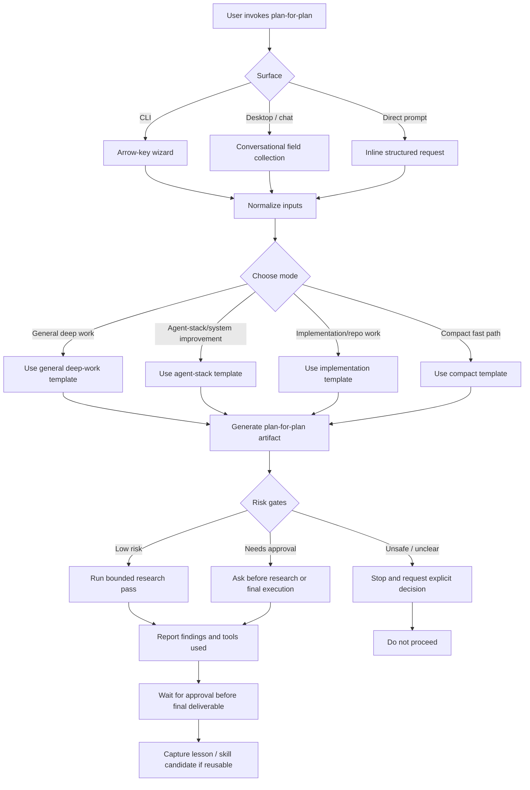

# Public Profile Oracle Integration

## Objective

Integrate a recruiter-safe projection of the Profile Oracle into the public hiring brief while keeping raw oracle sources, internal evidence references, local paths, and private harness mechanics out of the public release.

## Final artifact target

The public hiring brief at `/` contains a compact Profile Oracle section with project lenses, verified decision signal, capability tags, and a link to the password-protected WIP detail preview. The public section is static, readable without JavaScript, and generated from reviewed source data during this implementation pass.

## Inputs to examine

- `profile-oracle.json`
- `docs/prototypes/profile-oracle-preview.html`
- `logs/DECISION_LOG_TAGS.md`
- `docs/evidence/historical-decision-inventory.json`
- Public `site/index.html`, `site/assets/css/site.css`, and release allowlist
- Public profile-oracle route and decision-log contract tests

## Context assumptions

- The public site is a curated projection, not a mirror of the source repository.
- Only the 12 verified decisions already approved for the public decision log are eligible for this section.
- The detailed `/profile-oracle/` route remains password-protected WIP.
- The existing public decision log remains the canonical detailed timeline.
- English stable identifiers remain the data contract; recruiter-facing copy stays concise.

## Key questions to answer

1. Which Oracle fields are safe and useful on the public hiring brief?
2. How can the section show Oracle value without duplicating the full timeline?
3. Which links can be public without exposing private evidence paths?
4. Which release, accessibility, and no-JavaScript checks must protect the integration?

## Extraction method

1. Parse the reviewed Oracle JSON and count verified decisions by project.
2. Cross-check project IDs and capability tags against the current taxonomy.
3. Compare the public route and homepage for duplicate or contradictory status copy.
4. Inspect the public allowlist and contract tests before editing.

## Synthesis method

Create a compact public projection containing:

- A WIP-labelled Oracle heading and one-sentence purpose.
- Four project lenses with role/status labels.
- A verified-decision count and a short explanation of the evidence boundary.
- A small set of recruiter-understandable capability tags.
- A link to the gated detailed preview and the public decision log.

Do not expose `evidence_refs` from the private Oracle when they point to internal documents. Do not add a second full decision timeline to the homepage.

## Decision criteria

- Public value: helps a recruiter understand how the work is reasoned about.
- Evidence safety: every claim is present in the reviewed Oracle and marked as verified or WIP.
- Duplication control: the homepage summarizes; the decision-log page carries detail.
- Accessibility: semantic headings, list structures, keyboard-visible links, and no-JavaScript content.
- Reversibility: the section can be removed as one bounded HTML/CSS change without touching source history or the gated route.

## Proposed final output structure

```text
Hiring brief
  Hero and lead proof
  Profile Oracle summary
    purpose and WIP boundary
    four project lenses
    verified decision and capability signal
    links to gated Oracle preview and public decision log
  Existing proof and contact sections
```

## Acceptance criteria

- [ ] The public homepage contains a visible Profile Oracle section.
- [ ] The section uses only sanitized verified project and capability summaries.
- [ ] It does not contain local paths, raw plan names, secrets, or internal evidence links.
- [ ] The detailed preview remains password-protected and marked WIP.
- [ ] The public page works with JavaScript disabled.
- [ ] Accessibility and mobile layout checks pass.
- [ ] Public release validation passes.
- [ ] The change is committed and pushed to `marcus-uden-dev/ai-native-proof-of-work`.

## Risk gates

- Privacy-sensitive data: block any field that contains private local paths, raw internal references, or unsupported outcomes.
- Public deployment: publish only after contract, release, and browser checks pass.
- Existing dirty worktree: preserve unrelated `preview/homepage-v2` changes and never stage them.
- Auth: use the configured `marcus-uden-dev` account only for the public push, then restore the prior active account.

## Failure modes

- The Oracle is duplicated as a second long timeline and makes the homepage too long.
- A planned or internal record is presented as verified public evidence.
- The homepage links directly to private source files.
- The public gate is removed from the detailed preview without explicit scope.
- Unrelated preview work is staged during the public release.

## Stop rule

Stop publication if the public projection cannot be separated cleanly from private evidence, if release validation fails, or if the public page would make a stronger maturity or outcome claim than the Oracle supports.

## Next action

Build and validate the compact public Oracle summary in the public staging checkout, then publish it after all release gates pass.

## Research pass log

| Source / tool | Finding |
|---|---|
| `profile-oracle.json` | 4 project lenses and 12 verified decisions are available for a sanitized projection. |
| `site/profile-oracle/index.html` | The detailed route already contains the Oracle timeline and remains password-protected WIP. |
| Public release files | The homepage is allowlisted and has an existing design system and contract-test surface. |
| `logs/DECISION_LOG_TAGS.md` | Capability tags must describe evidenced capabilities and remain within the current taxonomy. |
| PowerShell, `rg`, Git status | Public staging had two unrelated dirty preview files; they were stashed and preserved before implementation. |

## Required workflow


