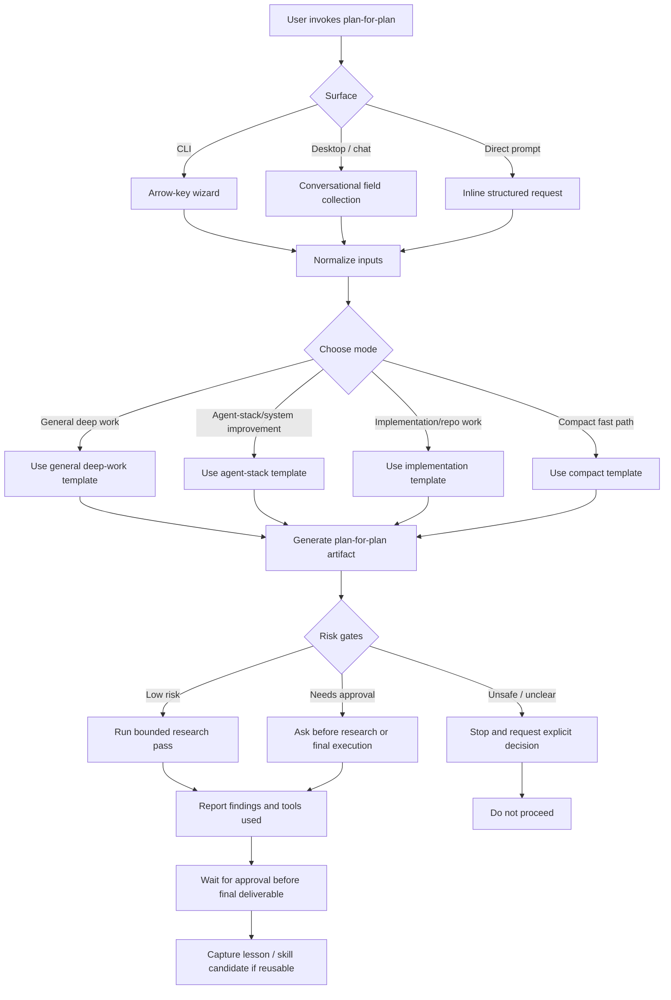

# Public Profile Oracle Integration

> Superseded by the repository-interview decision. Keep this document as historical planning context; do not use its public Oracle naming or implementation target as the current product contract.

## Objective

Integrate a recruiter-safe projection of the Profile Oracle into the public hiring brief while keeping raw oracle sources, internal evidence references, local paths, and private harness mechanics out of the public release.

## Final artifact target

The public hiring brief at `/` contains a compact Oracle summary, while the public Decision Log carries the detailed Oracle view. The log includes decisions from the Personal AI Harness and the specific product repositories, including product flow, telemetry, pricing, evidence boundaries, and architecture. Each record keeps its project, type, status, and capability tags visible. The public section is static, readable without JavaScript, and generated from reviewed source data.

## Inputs to examine

- `profile-oracle.json`
- `docs/prototypes/profile-oracle-preview.html`
- `logs/DECISION_LOG_TAGS.md`
- `docs/evidence/historical-decision-inventory.json`
- `strategy/<project>/{product,business,market,decisions}/`
- Public `site/index.html`, `site/assets/css/site.css`, and release allowlist
- Public profile-oracle route and decision-log contract tests

## Context assumptions

- The public site is a curated projection, not a mirror of the source repository.
- Verified decisions and explicitly labelled planned or hypothesis records from project strategy documents are eligible after redaction.
- The public Decision Log is the canonical detailed Oracle timeline; the former `/profile-oracle/` route redirects there.
- Project decisions must not be collapsed into Personal AI Harness decisions merely because the portfolio repository stores the evidence.
- English stable identifiers remain the data contract; recruiter-facing copy stays concise.

## Key questions to answer

1. Which Oracle fields are safe and useful on the public hiring brief?
2. How can the section show Oracle value without duplicating the full timeline?
3. Which links can be public without exposing private evidence paths?
4. Which release, accessibility, and no-JavaScript checks must protect the integration?

## Extraction method

1. Parse the reviewed Oracle JSON and inventory decision records by project and status.
2. Cross-check project IDs and capability tags against the current taxonomy.
3. Read project-scoped product, business, pricing, market, and decision-trail documents for additional user-flow, telemetry, pricing, and architecture decisions.
4. Compare the public route and homepage for duplicate or contradictory status copy.
5. Inspect the public allowlist and contract tests before editing.

## Synthesis method

Create a compact public projection containing:

- A WIP-labelled Oracle heading and one-sentence purpose.
- Four project lenses with role/status labels.
- A decision-record count and a short explanation of the evidence boundary.
- Project-specific records with explicit `Verified`, `Planned`, or `Hypothesis` status and decision type.
- A small set of recruiter-understandable capability tags.
- A link to the public Decision Log detail.

Do not expose `evidence_refs` from the private Oracle when they point to internal documents. Do not add a second full decision timeline to the homepage.

## Decision criteria

- Public value: helps a recruiter understand how the work is reasoned about.
- Evidence safety: every claim is present in the reviewed Oracle and marked as verified or WIP.
- Duplication control: the homepage summarizes; the decision-log page carries detail.
- Accessibility: semantic headings, list structures, keyboard-visible links, and no-JavaScript content.
- Reversibility: the section can be removed as one bounded HTML/CSS change without touching source history or the gated route.

## Proposed final output structure

```text
Hiring brief
  Hero and lead proof
  Profile Oracle summary
    purpose and WIP boundary
    four project lenses
    project decisions with status, type, and capability signal
    link to public Decision Log detail
  Existing proof and contact sections
```

## Acceptance criteria

- [ ] The public homepage contains a visible Profile Oracle section.
- [ ] The section uses sanitized project and capability summaries with explicit lifecycle status.
- [ ] Project-repository decisions cover product flow, telemetry, pricing, or architecture where evidence exists.
- [ ] It does not contain local paths, raw plan names, secrets, or internal evidence links.
- [ ] The former detailed preview route redirects to the public Decision Log and does not create a duplicate source.
- [ ] The public page works with JavaScript disabled.
- [ ] Accessibility and mobile layout checks pass.
- [ ] Public release validation passes.
- [ ] The change is committed and pushed to `marcus-uden-dev/ai-native-proof-of-work`.

## Risk gates

- Privacy-sensitive data: block any field that contains private local paths, raw internal references, or unsupported outcomes.
- Public deployment: publish only after contract, release, and browser checks pass.
- Existing dirty worktree: preserve unrelated `preview/homepage-v2` changes and never stage them.
- Auth: use the configured `marcus-uden-dev` account only for the public push, then restore the prior active account.

## Failure modes

- The Oracle is duplicated as a second long timeline and makes the homepage too long.
- A planned or internal record is presented as verified public evidence.
- A product-repository decision is incorrectly classified as a Personal AI Harness decision.
- The homepage links directly to private source files.
- The public gate is removed from the detailed preview without explicit scope.
- Unrelated preview work is staged during the public release.

## Stop rule

Stop publication if the public projection cannot be separated cleanly from private evidence, if release validation fails, or if the public page would make a stronger maturity or outcome claim than the Oracle supports.

## Next action

Build and validate the compact public Oracle summary in the public staging checkout, then publish it after all release gates pass.

## Research pass log

| Source / tool | Finding |
|---|---|
| `profile-oracle.json` | 4 project lenses plus project-specific decisions with verified, planned, and hypothesis statuses are available for a sanitized projection. |
| `strategy/job-agent/` | Product flow, telemetry, and pricing decisions are documented in project-scoped strategy files. |
| `strategy/pkm/` and `strategy/household-budget-app/` | Supporting-product positioning and pricing boundaries are documented without market-outcome claims. |
| `site/profile-oracle/index.html` | The former route now redirects to the public Decision Log to avoid duplicate Oracle surfaces. |
| Public release files | The homepage is allowlisted and has an existing design system and contract-test surface. |
| `logs/DECISION_LOG_TAGS.md` | Capability tags must describe evidenced capabilities and remain within the current taxonomy. |
| PowerShell, `rg`, Git status | Public staging had two unrelated dirty preview files; they were stashed and preserved before implementation. |

## Required workflow


