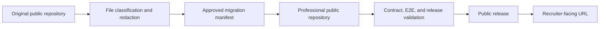

# Repository Consolidation and Source-of-Truth Plan

Created: 2026-08-25

Status: Proposed

Execution status: First migration batch is staged in the professional repository. The draft was preserved in the original repository, removed from the public release tree, and the local public history was rewritten to the professional author identity after a verified rollback bundle was created. Public release validation and contract tests pass. No remote force-push was performed.

## Executive summary

The repositories are not full duplicates, but their naming and links make them look like competing versions of the same portfolio.

Recommended target:

- Make `ai-native-proof-of-work-public` the final professional repository at `marcus-uden-dev/ai-native-proof-of-work`.
- Migrate the public-eligible project evidence and recruiter-facing updates from the original `TheOneDarkHorse` repository into it without importing the old Git history.
- Keep the original repository only as a short-term migration source and recoverable archive, then make it read-only or archive it.
- Retire the separate demo repository after its useful snapshots are confirmed in the professional repository.

The original repository is needed for the migration, not as a second permanent portfolio system.

## Evidence snapshot

Observed from the local repositories on 2026-08-25. Counts are approximate repository snapshots and can change with uncommitted work.

| Repository role today | Evidence | Actual role | Assessment |
|---|---:|---|---|
| `ai-native-proof-of-work` | 161 tracked files; 138 Markdown files; 7 HTML files; 3 JSON files | Original public proof-of-work archive with project updates, strategy, case studies, logs, source maps, templates, and local demo copies | Use as migration source; do not keep as a second active public destination |
| `ai-native-proof-of-work-public` | 58 tracked files; 6 HTML files; 17 JavaScript files; contract, E2E, and release validation tests | New professional clean-room site with allowlist, privacy review, evidence manifests, CV, and guided Job-agent proof | Use as the final professional repository and public presentation layer |
| `ai-native-proof-of-work-demo` | 17 tracked files | Older static demo portal for Job-agent, PKM, and household-budget snapshots | Archive/deprecate; its demo content is already duplicated in the source repo |

The strongest overlap finding is exact file duplication: the current `demos/` tree and the demo repository share the same hashes for the portal, Job-agent demo, manifest, styles, and JavaScript files. The public website repository is different: apart from generic repository metadata, its files do not share content hashes with the source repository.

The current naming and identity state is inconsistent:

- The source repository documentation names `marcus-uden-dev/ai-native-proof-of-work` as canonical, while its configured `origin` points to the `TheOneDarkHorse` repository.
- The public website repository documentation says it has no remote and is not published, while its local clone has a configured `origin` for `marcus-uden-dev/ai-native-proof-of-work`.
- The public release runbook explicitly requires a clean-room repository and says not to fork, transfer, mirror, or import history. File-level migration without old Git history is compatible with that boundary, but the current remote state must be reconciled before publication.
- The source repository has active local changes, and the public repository has untracked draft content. Consolidation must preserve those changes and must not use broad staging or destructive cleanup.

## Role decision

### Recommended: one final public repository, with temporary migration sources

| Layer | Owns | Must not own |
|---|---|---|
| Professional public repository | Approved project evidence, case studies, selected strategy, recruiter navigation, static website, public evidence JSON, sanitized CV, reviewed binaries, allowlist, privacy record, tests, and release history | Raw sessions, local paths, private indexes, runtime instructions, unreviewed personal material, or old pseudonymous identity references |
| Original repository during migration | File-level migration source and recoverable archive until the new repository is validated | New feature work or a competing canonical public URL after cutover |

The public repository's clean-room boundary should remain. Migrate approved file content and current project updates, not the old Git history or the entire working tree.

### What to do with the original repository

- Use it as the migration source for the public project material identified below.
- Preserve its current branch tips and local changes until the professional repository passes the migration checks.
- Stop treating it as the canonical recruiter destination after cutover.
- Archive it or make it read-only after the public repository contains the approved content and all links have been updated.
- Do not delete it as the first simplification step; the old history is the rollback reference.

### File migration inventory

The current repository is mostly documentation, but it is not all the same kind of documentation.

| Migration class | Approx. files | Examples | Action |
|---|---:|---|---|
| Direct public candidates | 49 | `case-studies/`, the three product strategy trees, `PROJECT_STATUS.md`, `PROJECT_TIMELINE.md`, recruiter navigation, one-pagers, and `CV.md` | Copy content into the professional repository after link and identity review |
| Review before migration | 38 | `architecture/`, `diagrams/`, screenshots, `career-evidence/`, install handoff, prototypes, and demo files | Migrate selectively; redact pseudonymous identity, local paths, stale claims, and duplicate site content |
| Keep out of the public repository | 70 | `AGENTS.md`, `internal/`, plans, prompts, runtime scripts, weekly logs, workflow operations, templates, tasks, and recruiter drafts | Leave in the original archive or move to a separate private archive if needed |

The direct candidates are mainly updates to existing projects: eight Job-agent strategy files, eight PKM strategy files, eight household-budget strategy files, and the case-study/project proof layer. The 38 review files contain useful evidence, but some also contain local runtime details, pseudonymous identity references, or content already represented by the professional site's HTML and JSON.

### What to do with the demo repository

Treat it as a historical publication artifact, not a third active product repository.

- Freeze new feature work there.
- Keep the existing published URL working for a transition period if external links still exist.
- Confirm that the public website contains the intended current Job-agent proof and that any useful PKM or household-budget snapshot has an approved home.
- Update source and recruiter links to the public website or to the current approved demo path.
- Archive the demo repository rather than deleting it. Archiving is reversible; deletion is not.

## Consolidation sequence

### Phase 0 — Decide the one-way doors

Record these decisions before changing remotes, repository names, publication settings, or DNS:

1. Confirm that the professional repository becomes the only canonical public URL.
2. Confirm that old pseudonymous links may be retired or redirected after the migration.
3. Confirm that the original repository remains available as a recoverable archive, without new public feature work.
4. Confirm that the old demo URL remains as a compatibility archive until replacement links are verified.

Changing a public repository name, moving it between identities, publishing Pages, or changing DNS is a one-way-door review item. Capture the current repository URLs, branch tips, Pages state, and rollback references before acting.

### Phase 1 — Freeze and inventory

Do not merge or delete anything yet.

- Capture the current branch, remote, latest commit, and clean/dirty status for all three repositories.
- Save a manifest of active public URLs and every source link that points to the old demo or to the source repository homepage.
- Classify each source file as `source`, `public release input`, `public generated artifact`, `historical demo`, or `internal-only`.
- Review and preserve the current uncommitted changes in both active clones. Resolve them separately before a release cut.
- Identify claims that exist only in the source repository and claims that exist only in the public website. Mark missing evidence as `Needs Review`; do not copy by assumption.

Deliverable: a small repository ownership matrix and a release-input manifest.

### Phase 2 — Prepare the migration source

Prepare the original repository without broad cleanup:

- Freeze the source commit and record all current working-tree changes.
- Mark the 49 direct candidates and 38 review files with migration decisions.
- Remove or rewrite pseudonymous links only in the copied public content; preserve old history in the archive.
- Keep local indexes, runtime instructions, raw logs, plans, prompts, and drafts out of the public migration.
- Do not change the old remote until the professional repository is validated.

Suggested migration records:

- `release/migration-map.json`
- `release/privacy-review.json`
- `release/allowlist.json`

### Phase 3 — Migrate approved content into the professional repository

Use the existing public repository as the destination and release gate:

- Merge the current project case studies and strategy updates into a coherent public navigation model. Do not create duplicate pages for the same claim.
- Make the README, site metadata, recruiter agent guide, and public links agree on one canonical URL and one professional identity.
- Add public Markdown case studies where they improve recruiter evidence; keep the static site as the primary reading path.
- Promote selected project updates into the existing Job-agent and recursive-workflow pages or their structured evidence files.
- Remove the stale “no remote” statement if the repository is intentionally published; otherwise remove the remote before returning it to staging.
- Keep `release/allowlist.json`, `release/privacy-review.json`, and the release validator as hard gates.
- Add a migration manifest that records the old source path, destination path, review status, and redaction decision for each promoted item.
- Publish only from an approved release candidate. Do not import the old Git history or copy the entire working tree.
- Add a visible public status note that explains the repository is the professional migrated edition.

The public website should not need the source repository at runtime. A recruiter should be able to evaluate the public site without access to private history or local source indexes.

### Phase 4 — Replace the duplicated demo layer

- Compare the old demo portal with the current public website's Job-agent proof, including screenshots, routes, maturity wording, and synthetic-data labels.
- Decide whether PKM and household-budget snapshots still add recruiter value. Keep them only if they have a clear public evidence role and a current owner.
- If retained, move approved assets to the public website release model or keep them as source-only previews. Do not maintain a third repository for them.
- Update all source links, README links, demo scripts, and recruiter navigation to the chosen current paths.
- Mark the old demo as historical and archive its repository after the replacement has passed validation.

### Phase 5 — Establish controlled migration and release

Use a simple, reviewable promotion flow:

Minimum controls:

- The original repository remains recoverable until cutover is complete.
- The professional repository becomes the only public website and evidence source after cutover.
- Every migrated item has an old source path, destination path, status label, review date, and privacy decision.
- Binary artifacts keep SHA-256 records and candidate-commit provenance.
- Public release history uses append-only revert commits.
- No unattended task may push to the public repository without the correct identity and release checks.

### Phase 6 — Cut over and archive

After one complete public release cycle:

- Run the public repository's contract, E2E, release, and diff checks.
- Check all canonical links and old demo links.
- Confirm no private paths, credentials, protected identity references, or raw source indexes enter the public site.
- Confirm the public site and public Markdown can be reviewed without cloning the original repository.
- Update all links from the pseudonymous repository and old demo to the professional repository.
- Archive the old demo repository and retain its last known-good commit and published URL in the migration record.
- Make the original repository read-only or archive it after the cutover validation passes.
- Remove stale “source/workbench” wording from the public-facing documentation.

## Definition of done

- One clearly named professional repository owns the public evidence and recruiter-facing experience.
- The original pseudonymous repository is a read-only archive or is otherwise clearly retired.
- The old demo repository is archived or has an explicit historical-only status and no active feature work.
- Repository names, remotes, README text, site links, and identity rules agree.
- A migration manifest connects every migrated public claim to its old source path without copying private history.
- Public release validation passes, including privacy, allowlist, binary provenance, contract, and E2E checks.
- Recruiter-facing links no longer make the old pseudonymous repository and professional repository look like competing portfolio versions.
- Rollback paths are recorded for repository moves, public releases, and demo retirement.

## Risks and mitigations

| Risk | Mitigation |
|---|---|
| Public and source claims drift | Require a release manifest and dated source references for every promotion |
| A private artifact leaks into the public website | Keep the allowlist and privacy validator; review the release candidate before publication |
| Old demo links break | Keep the old Pages URL during transition and archive rather than delete |
| Repository identity remains ambiguous | Resolve remotes and canonical URLs in one explicit decision and update all documentation together |
| Current uncommitted work is lost | Capture status and branch tips; do not reset, checkout, or broad-stage changes |
| The old archive becomes recruiter noise | Make the professional repository the primary recruiter link and archive the old repository after cutover |

## Recommended next action

Approve the identity-migration target and the retirement of the separate demo repository. Then run the file-level migration inventory before changing any remote, repository name, public release setting, or link.
