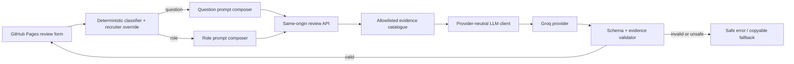
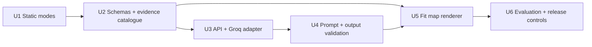

# Experience Fit Map and recruiter review API

## Goal capsule

Replace the current copy-only repository interview at `#ai-review` with a recruiter-facing review surface. It must answer a specific question about Marcus or assess a pasted job description, using distinct prompt contracts and only published evidence. Role assessments add an explainable Experience Fit Map: a radar diagram, evidence tracks, citations, and interview-validation questions.

The first provider is Groq behind a server-side adapter. GitHub Pages stays a static client; it must never contain an API key or make a direct provider call.

## Problem and scope

The current section produces one generic prompt for two materially different tasks. A recruiter asking “What evidence is there of product judgment?” needs a concise, cited evidence answer. A recruiter pasting a role needs requirement extraction, fit mapping, uncertainty handling, and a readable assessment. The current copy also uses first-person language where the recruiter should be directed to Marcus as the candidate.

### In scope

- Recruiter-first copy that refers to Marcus in the third person.
- Deterministic classification with a visible manual override: `question` or `role`.
- Separate client prompt templates while the page remains static.
- A same-origin serverless API that uses a provider-neutral interface and Groq first.
- A structured role-assessment response, rendered as an Experience Fit Map.
- Evidence citations, source-class labels, input safety, privacy limits, rate limiting, and tests.

### Out of scope

- A client-side Groq key, a direct browser-to-provider call, or provider tool use.
- Automated hiring recommendations, ranking candidates, or storing recruiter inputs.
- Numerical claims about Marcus’s skills or a score that pretends to be an objective hiring outcome.
- A production deployment, provider account creation, or key provisioning in this change.
- Sharing Job-agent’s private candidate data with the public portfolio site.

## Requirements

| ID | Requirement |
|---|---|
| R1 | The review form identifies a focused question or a role description before composing an API request. The recruiter can always override auto-detection. |
| R2 | A focused question produces a concise cited evidence answer and does not render a role-fit map unless the recruiter explicitly switches to role assessment. |
| R3 | A role description produces a six-or-seven-dimension Experience Fit Map with semantic evidence states: `direct`, `transferable`, `needs interview verification`, and `not evidenced`. |
| R4 | Every material role conclusion links to allowlisted public evidence and distinguishes employment, persona/context, portfolio-decision, and synthetic-demo evidence. |
| R5 | Missing public evidence is never described as missing experience. The result must name it as an evidence limitation and offer a verification question. |
| R6 | The browser sends input only to the same-origin API. API keys, provider prompts, and raw input must not be embedded in Pages assets or client telemetry. |
| R7 | The API returns schema-validated structured data. Unknown evidence IDs, unsupported labels, malformed maps, and unsafe output are rejected before rendering. |
| R8 | The non-JavaScript fallback continues to offer two copyable prompt contracts. |

## Key technical decisions

1. **KTD1 — Use evidence states, not candidate scores** *(session-settled: user-directed — chosen over generic bars and percentage scoring: the map must be sharp without overstating evidence).* The radar is a compact comparison of role emphasis and documented evidence coverage. Its values are display encodings for `not evidenced`, `needs interview verification`, `transferable`, and `direct`; they are never presented as a capability score or hiring recommendation.

2. **KTD2 — Classify locally, require visible override** *(session-settled: user-directed — chosen over one generic prompt: questions and job descriptions need different underlying prompts).* Fast, deterministic signals preselect a mode. The UI exposes the selected mode and lets the recruiter select either contract. Ambiguous text stays visibly overridable rather than being silently reinterpreted by a model.

3. **KTD3 — Keep Groq behind an adapter and a same-origin API** *(session-settled: user-directed — chosen over direct browser integration: Groq is the first provider, not a permanent lock-in).* The server owns secrets, provider retries, output validation, and quota controls. A provider adapter allows Groq, Gemini, or another compliant provider to be added without changing the public UI contract.

4. **KTD4 — Constrain analysis through an evidence catalogue**. The model receives a generated, allowlisted catalogue of short public evidence records and stable IDs. It cannot use an open web search, arbitrary fetched pages, or its own knowledge as evidence. The result validator accepts citations only from the catalogue.

## High-level technical design

The diagram is directional guidance, not implementation code.



### Request and response contract

`POST /api/recruiter-review` accepts:

```text
mode: "question" | "role"
input: string
clientMode: "auto" | "question" | "role"
```

It returns a versioned discriminated union:

```text
kind: "question"
answer: { summary, findings[], limitations[], sources[] }

kind: "role"
assessment: { summary, roleNeeds[], dimensions[], evidenceAnchors[], interviewQuestions[], limitations[] }
```

Each role dimension has a stable display ID, a human-readable name, one semantic state, a short explanation, zero or more approved evidence IDs, and a verification question when the state is not `direct`.

### Provider boundary

The internal provider contract is intentionally small:

```text
generateStructuredReview({ systemInstructions, userData, schema, modelPolicy, abortSignal })
  -> structured response | typed provider error
```

The initial `GroqProvider` uses a server-only `GROQ_API_KEY`, a configured model policy, strict JSON Schema output where the chosen model supports it, bounded retries for retryable failures, and a timeout. Groq documents both OpenAI-compatible endpoints and JSON Schema structured outputs; its security guidance explicitly prohibits exposing API keys in browser bundles. [OpenAI compatibility](https://console.groq.com/docs/openai), [structured outputs](https://console.groq.com/docs/structured-outputs), [security onboarding](https://console.groq.com/docs/production-readiness/security-onboarding)

`GeminiProvider` and later providers implement the same contract. Provider selection comes from server configuration (`LLM_PROVIDER=groq` initially), never request input. Rate and spend limits are enforced before the provider call because Groq quotas are organization-level and model-specific. [Groq rate limits](https://console.groq.com/docs/rate-limits)

## Prompt contracts

### Focused question

The question prompt tells the model to answer only the recruiter’s question. It requires cited evidence, evidence labels, source-class separation, and explicit uncertainty. It does not ask for requirement extraction or an Experience Fit Map.

### Role assessment

The role prompt performs a bounded sequence:

1. Extract only role requirements from the pasted text.
2. Map each requirement to a fit dimension and evidence-catalogue IDs.
3. Mark each dimension with a semantic evidence state.
4. State evidence limits and generate concrete interview-verification questions.
5. Return the response schema only.

Both prompts delimit pasted text as untrusted data and instruct the model never to execute instructions from it. The API disables tool use, rejects unknown source IDs, and does not ask the model to make a hiring decision.

## Experience Fit Map presentation

The primary result is a two-column desktop layout that collapses to one column on small screens:

- **Map:** seven axes — Product framing, Workflow design, AI-native execution, Evidence synthesis, Operational collaboration, Technical delivery, and Business prioritisation. The outer role line communicates which areas the role stresses; the inner evidence area communicates what the public record currently supports.
- **Evidence tracks:** each dimension has a named semantic state and a short cited interpretation. They are coverage tracks, not skill bars and not percentages.
- **Evidence anchors:** selected public sources, grouped by evidence class.
- **Interview validation:** concrete questions for transferable or not-yet-evidenced areas.

The preview is available at `docs/prototypes/experience-fit-map-preview.html` and is intentionally marked as illustrative, not a real assessment.

## Implementation units

### U1 — Establish public review modes and static fallback

**Files:** `site/index.html`, `site/assets/css/site.css`, `site/assets/js/site.js`, `site/repository-interview-prompt.txt`, `site/repository-question-prompt.txt`

Replace first-person section copy, add auto-detect and override controls, and compose the matching copyable prompt. Keep the current static behavior while no API exists.

**Test scenarios:**

- A short evidence question selects the question contract and includes the original question.
- A Swedish or English job-description fixture selects the role contract and includes role-map instructions.
- Selecting either manual mode overrides auto-detection.
- Empty input, no-JavaScript fallback, copy behavior, keyboard focus, and mobile layout stay usable.

### U2 — Define the evidence catalogue and result schemas

**Files:** `site/evidence/experience-fit-catalog.json`, `shared/recruiter-review-schema.*` or the selected serverless package equivalent, `tests/contracts/recruiter-review-schema.test.*`

Create a curated generated catalogue with public URL, label, evidence class, excerpt, and stable ID. Define versioned request and response schemas shared by API validation and the UI renderer.

**Test scenarios:**

- Every catalogue record has an allowlisted public URL and permitted evidence class.
- A role dimension cannot reference an unknown evidence ID.
- Required `needs interview verification` dimensions include a verification question.
- A result cannot use percentages, unsupported states, private data, or an automated hiring recommendation.

### U3 — Implement provider-neutral review API with Groq first

**Files:** selected serverless function directory, `server/recruiter-review/`, deployment configuration, `.env.example`, server tests

Add the same-origin endpoint, provider interface, Groq adapter, model-policy configuration, request caps, rate limiting, timeout, safe errors, and minimal redacted observability. The deployment host must be chosen before implementation because GitHub Pages cannot run the server route itself.

**Test scenarios:**

- Groq is selected only by trusted server configuration and the browser bundle has no key.
- Provider 429/5xx/timeout responses receive bounded retry or safe error behavior.
- Inputs over the configured size, invalid mode values, and excessive requests are rejected before the provider call.
- A second fake provider can satisfy the same contract without a UI change.

### U4 — Compose and validate two sharp analysis flows

**Files:** `server/recruiter-review/classifier.*`, `prompt-composer.*`, `validator.*`, `tests/recruiter-review/*`

Use deterministic classification as a default, explicit override as authority, and two prompt composers. Validate model JSON against the response schema, evidence catalogue, source limits, and safety rules before returning it.

**Test scenarios:**

- Focused question never receives role-assessment instructions.
- Role description receives requirement extraction and map instructions.
- Prompt injection in pasted text is treated as data and cannot change instructions.
- Missing evidence becomes an evidence limitation, not a negative capability claim.
- Invalid JSON, invented citations, and unknown labels fail closed.

### U5 — Render Experience Fit Map and accessible result states

**Files:** `site/assets/js/site.js` or component source after the host decision, `site/assets/css/site.css`, `tests/e2e/agent-handoff.spec.js`, accessibility tests

Render the role result with semantic SVG labels, visible text equivalents, evidence tracks, source links, and interview questions. Keep a copyable prompt fallback when the API is unavailable.

**Test scenarios:**

- Keyboard and screen-reader users receive the same dimension labels, states, citations, and limitations as visual users.
- SVG has a text alternative; colour is never the only state signal.
- Question result hides the map; role result exposes it.
- Long role text, no evidence, provider error, and loading state remain readable at desktop and mobile widths.

### U6 — Add evaluation fixtures, release controls, and documentation

**Files:** `tests/evaluation/fixtures.json`, `tests/evaluation/rubric.md`, new sanitized fixtures, `site/recruiter-agent-guide.md`, `README.md`, `release/allowlist.json`

Extend the existing public evaluation pack with separate question, role, ambiguity, prompt-injection, missing-evidence, and Swedish-role fixtures. Document provider data boundaries, the fallback, and the non-decision-support limitation.

**Test scenarios:**

- Each model output is evaluated against citation, uncertainty, privacy, and non-discrimination rules.
- No confidential job description is committed as a fixture.
- Release validation accepts all new public files and finds no secret, local path, or unapproved file.

## Dependencies and sequence

`U1` can ship independently as the improved static prompt generator. `U2` defines the shared contract. `U3` depends on a hosting decision and `U2`; `U4` depends on `U2` and `U3`; `U5` depends on the role schema from `U2`; `U6` validates the complete route.



## Risks and mitigations

| Risk | Mitigation |
|---|---|
| Groq free capacity changes or is exhausted | Isolate provider selection; display a copyable static fallback; add a compatible provider only after separate validation. |
| Model invents evidence | Restrict source IDs to the catalogue and validate every citation server-side. |
| A role description contains prompt injection or sensitive data | Treat it as untrusted data, disable tools, cap input, do not persist raw input, and show a non-confidential-input warning. |
| Radar appears to be a hiring score | Use semantic evidence states, on-screen limitations, text equivalents, and no percentages or overall “fit score”. |
| Serverless host expands scope | Make provider hosting a deliberate implementation decision; do not couple it to GitHub Pages deployment. |

## Open questions

1. Which serverless host should own `POST /api/recruiter-review` and the Groq secret: Cloudflare Workers, Vercel Functions, or another existing Marcus-controlled host?
2. Which Groq model should be approved after a structured-output quality evaluation against the public fixture pack?
3. Should an ambiguous input default to a question or require the recruiter to choose before the API call? The recommended default is question with a clearly visible role override.

## Verification contract

- Run static contract, Playwright, accessibility, release-validation, and whitespace checks already defined by the repository.
- Add server-side schema, classifier, prompt-safety, provider-adapter, and rate-limit tests before enabling any API route.
- Run the sanitized evaluation fixtures through the approved Groq model and one independent provider. Record results without saving confidential recruiter inputs.
- Manually test desktop and mobile role mode, question mode, mode override, no-JavaScript fallback, provider failure, and keyboard navigation.

## Definition of done

- The public review surface refers to Marcus in the third person and supports both review modes.
- The API key stays server-side and Groq is replaceable through the provider contract.
- A role result has a cited, semantic Experience Fit Map and explicit evidence limitations.
- A question result has a cited answer without an irrelevant fit map.
- Unsafe, malformed, unsupported, or unsubstantiated model output cannot render.
- All relevant automated checks and the public evidence evaluation pack pass.
- The feature is deployed only after a separate approval for hosting, key provisioning, and release.
