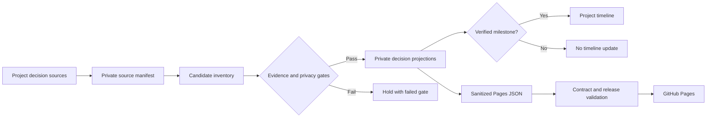

# Historical Project Decision Backfill - Plan

## Goal Capsule

**Objective:** Make historical project decisions searchable, defensible, and automatically publishable when objective gates pass.

**Means:** Use the historical inventory as the candidate layer. Verify each candidate against dated evidence. Update private projections first. Export only sanitized records that pass all public gates.

## Problem Frame

The current decision log contains recent, curated decisions. Earlier project decisions are distributed across trails, plans, logs, case studies, lessons, and indexed local sources. Direct copying would create duplicate entries, uncertain dates, unsupported claims, and privacy leaks.

## Requirements

### Historical evidence

- R1. Preserve only dates supported by explicit decision, event, or commit evidence.
- R2. Assign one primary project and explicit evidence status to every accepted candidate.
- R3. Maintain a stable candidate record with source references, a normalized fingerprint, and a public eligibility result.
- R4. Do not create an Apporganiser Android candidate without directly available, dated evidence.

### Publication and privacy

- R5. Publish historical records automatically only after evidence, redaction, taxonomy, schema, contract, and release gates pass.
- R6. Hold only the failing candidate and record its failed gate and retry condition.
- R7. Exclude raw chats, local paths, secrets, personal data, confidential material, and unsupported outcomes from public records.

### Projections and operations

- R8. Update the project timeline only for verified milestones.
- R9. Keep the private decision log as the source of truth and the public Pages JSON as a sanitized projection.
- R10. Process only new, changed, or newly unblocked candidates during weekly runs.

## Key Technical Decisions

- KTD1. Use objective publish-or-hold gates, not per-record approval. (session-settled: user-directed — chosen over a manual approval queue: gates are trusted.) Governs R5, R6.
- KTD2. Keep `docs/evidence/historical-decision-inventory.json` as the structured candidate layer. The decision log and Pages JSON remain projections, not competing sources of truth. Governs R2, R3, R9.
- KTD3. Use isolated full-history clones for public validation. The release privacy record can reference an older commit. Governs R5, R10.

## High-Level Technical Design

The diagram is a directional data-flow model. It does not prescribe an implementation language.

## Scope Boundaries

- In scope: Job-agent, PKM, Household budget, Personal AI Harness, and Apporganiser Android when evidence is verified.
- In scope: private inventory normalization, duplicate control, decision-log projections, and eligible Pages export.
- Out of scope: raw conversation reconstruction, inferred dates, public exposure of private source locations, and a manual publication queue.
- Deferred: product-level claims that need source access, measurement, implementation, or privacy-safe evidence.

## Risks and Dependencies

| Risk or dependency | Treatment |
|---|---|
| A source is unavailable or lacks an explicit date. | Keep the candidate at `hold` or `internal-only`; do not infer. |
| The same decision appears in a plan and an implementation record. | Use a stable ID and normalized fingerprint; link lifecycle evidence instead of duplicating it. |
| A public summary leaks private information. | Apply the redaction gate before public export and run the existing public release validator. |
| A candidate changes a product narrative. | Keep the decision private until evidence and safe wording meet R5. |
| A shared checkout is dirty. | Use the configured isolated clone workflow; do not edit the interactive checkout. |

## System-Wide Impact

The backfill affects private Markdown, the machine-readable candidate inventory, optional repository evidence projections, the static public decision JSON, GitHub Pages, and the weekly automation. It must keep those surfaces consistent without promoting a candidate beyond its evidence boundary.

---

## Implementation Units

The current 20-record inventory is the first batch, not the complete history. Process each project independently and preserve R1 through R10.

### U1. Align the historical-backfill policy with automatic gates

**Files:**
- Modify: `docs/plans/2026-08-24-003-feat-historical-decision-and-harness-backfill-plan.md`
- Modify: `docs/evidence/historical-decision-inventory.json`
- Modify: `docs/reference/DECISION_LOG_AUTOMATION.md`
- Modify if stale: `diagrams/decision-log-update-flow.mmd`, `diagrams/decision-log-update-flow.svg`, `diagrams/decision-log-update-flow.excalidraw`

**Step 1:** Mark the 2026-08-24 plan as superseded for routing and publication rules.

**Step 2:** Replace manual-review queue language with the states `publish`, `hold`, and `internal-only`.

**Step 3:** Define a hold record with stable ID, failed gate, evidence references, and next automatic retry condition.

**Step 4:** Make each diagram and reference state the same policy: objective gates decide publication; a failed candidate does not block other candidates.

**Step 5:** Validate the changed decision-policy text against the Verification Contract.

### U2. Add a deterministic inventory validation contract

**Files:**
- Create: `scripts/validate-historical-decision-inventory.mjs`
- Create: `scripts/validate-historical-decision-inventory.test.mjs`
- Modify: `docs/evidence/historical-decision-inventory.json`

**Step 1:** Write a failing Node test for a record with a missing ID, primary project, decision date, evidence status, or public eligibility.

**Step 2:** Confirm that the new test fails because the validator does not exist.

**Step 3:** Implement the validator. Require unique IDs, valid date precision, one approved primary project, explicit evidence and lifecycle status, three to seven valid capability tags, and non-empty evidence references.

**Step 4:** Add a duplicate test. Two records with the same stable ID or normalized decision fingerprint must fail.

**Step 5:** Add fixtures for `publish`, `hold`, and `internal-only`. Do not accept a manual-approval state.

**Step 6:** Confirm that all inventory-validator test scenarios pass.

### U3. Build a private source manifest for each project

**Files:**
- Create local-only: `internal/decision-backfill/SOURCE_MANIFEST.md`
- Create local-only: `internal/decision-backfill/<project>-candidates.md`
- Read: `logs/DECISION_LOG.md`, `logs/PROBLEM_SOLVING_LOG.md`, `logs/CHANGELOG.md`, `logs/WEEKLY_LOG.md`
- Read: `strategy/*/decisions/DECISION_TRAIL.md`, `case-studies/`, `docs/plans/`, `tasks/lessons.md`, and fresh source indexes when available

**Step 1:** Build one manifest section per project: Job-agent, PKM, Household budget, Personal AI Harness, and Apporganiser Android.

**Step 2:** List only evidence locations, explicit dates, decision candidates, and privacy constraints. Do not copy raw source material.

**Step 3:** Mark unavailable sources as `Source unavailable — needs user-provided file, repo path, export, or connector access.`

**Step 4:** For each candidate, record the best supported date, source priority, and a normalized decision fingerprint.

**Step 5:** Keep the manifest local and gitignored. It can contain operational source paths that must not enter recruiter-facing files.

### U4. Normalize the current inventory before expanding it

**Files:**
- Modify: `docs/evidence/historical-decision-inventory.json`
- Read: `repository-evidence-index.json`, `PROJECT_PROOF_POINTS.md`, `PROJECT_STATUS.md`

**Step 1:** Validate the existing 20 candidates with the new validator.

**Step 2:** Reconcile each existing candidate against its source reference. Preserve the original date when supported.

**Step 3:** Set one primary project, lifecycle status, evidence status, public eligibility, and redaction note for every record.

**Step 4:** Link related plan, implementation, lesson, and incident records instead of publishing duplicates.

**Step 5:** Add `apporganiser-android` to the taxonomy only after a verified candidate exists.

**Step 6:** Validate the normalized inventory against the Verification Contract.

### U5. Backfill project batches in chronological order

**Files:**
- Modify: `docs/evidence/historical-decision-inventory.json`
- Modify when grounded: `logs/DECISION_LOG.md`, `logs/DECISION_LOG_TAGS.md`, `repository-evidence-index.json`
- Modify only for verified milestones: `PROJECT_TIMELINE.md`

**Step 1:** Process Job-agent candidates first. Use product, workflow, telemetry, pricing, source-verification, and handoff decisions.

**Step 2:** Process PKM candidates. Keep claims limited to workflow and validation evidence; do not imply product-market validation.

**Step 3:** Process Household budget candidates. Exclude household and financial details. Keep only domain-model, privacy, workflow, and pricing-boundary evidence.

**Step 4:** Process Personal AI Harness candidates. Keep cross-project automation, governance, skills, and evidence-publishing decisions separate from product claims.

**Step 5:** Process Apporganiser Android only when its repository or documentation gives direct, dated evidence.

**Step 6:** For each accepted record, append the visible trail: Context → Options Considered → Tradeoffs → Decision → Evidence → Open Questions → Next Action.

**Step 7:** Update the timeline only when the record proves a project milestone. Record why a non-milestone stayed out of the timeline.

**Step 8:** Validate the inventory and documentation after each project batch.

### U6. Export eligible historical records to GitHub Pages

**Files:**
- Modify in the isolated public clone: `site/evidence/decision-log.json`
- Modify in the isolated public clone: `site/evidence/decision-log-tags.json`
- Modify only when the source requires it: `site/index.html`, `site/recruiter-agent-guide.md`, `site/llms.txt`
- Test: `tests/contracts/decision-log.test.mjs`

**Step 1:** Select only records with grounded evidence, explicit status, valid taxonomy tags, and a safe public summary.

**Step 2:** Remove private evidence references and replace them with recruiter-safe wording.

**Step 3:** Keep the public JSON newest-first and preserve stable record IDs.

**Step 4:** Run the public decision-log contract tests from the isolated public clone.

**Expected:** All decision-log contract tests pass.

**Step 5:** Run public release validation from the same full-history public clone.

**Expected:** Public release validation passes.

**Step 6:** Publish the validated public `main` update using the GitHub automation wrapper. GitHub Pages then deploys the static JSON.

### U7. Make historical backfill part of the weekly compiler

**Files:**
- Modify: active `ai-native-proof-of-work` automation prompt
- Modify when the repository mirror needs it: `AUTOMATION_PROMPT.md`, `template/WEEKLY_AUTOMATION_RUNBOOK.md`
- Modify: `docs/reference/DECISION_LOG_AUTOMATION.md`

**Step 1:** Add a bounded historical scan. Each run processes only candidates that are new, changed, held with new evidence, or missing from a project batch.

**Step 2:** Record a stable content fingerprint and last-evaluated date for each candidate. Do not rediscover unchanged records every week.

**Step 3:** Retry held records automatically when their evidence, redaction, taxonomy, or validation state changes.

**Step 4:** Keep full-history isolated clones for the public release validator.

**Step 5:** Confirm that a dirty interactive checkout never blocks a historical or current update.

**Step 6:** Keep automation documentation changes distinct from evidence updates.

### U8. Run a bounded first production backfill

**Files:**
- Modify only the records and projections justified by the first selected project batch
- Create: `docs/ops/runs/YYYY/MM/YYYY-MM-DD_HHMM_historical-decision-backfill.md`

**Step 1:** Start with Job-agent because it is the lead proof point and already has seven inventory candidates.

**Step 2:** Run private validation, public contract tests, and public release validation.

**Step 3:** Verify the published static JSON after GitHub Pages deploys.

**Step 4:** Record candidate counts: published, held, internal-only, duplicate, and source-unavailable.

**Step 5:** Confirm that the timeline includes only verified milestones.

**Step 6:** Use the same bounded procedure for the next project only after the first batch is clean.

## Verification Contract

- Validate the private inventory after every project batch with the planned inventory validator.
- Use `git diff --check` before each documentation commit.
- Run `node --test tests/contracts/decision-log.test.mjs` in the isolated full-history public clone.
- Run `npm run release:validate` in the same public clone.
- Confirm the Pages JSON is refreshed after the public `main` commit deploys.
- Confirm that held, internal-only, duplicate, and source-unavailable candidates are excluded from public JSON.

## Definition of Done

- Every historical candidate has stable identity, supported date precision, primary project, status, evidence references, tags, and a publish-or-hold result.
- The private decision log and tag log contain the accepted historical trail without duplicate entries.
- The timeline contains only verified milestones.
- Public JSON contains only redacted, contract-valid records.
- A failed candidate cannot block other eligible records.
- The weekly compiler finds changed or held historical candidates without rescanning unchanged evidence.
- Public contract tests and release validation pass from a full-history isolated clone.
