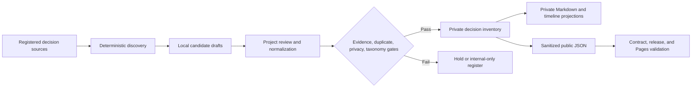

# Historical Decision Coverage Expansion

## Goal Capsule

**Objective:** Recover a substantially fuller, evidence-backed history of project and operating decisions without lowering privacy, evidence, or release controls.

**Means:** Make source coverage measurable, extract deterministic candidate drafts, review candidates per project, and retain the existing independent `publish`, `hold`, and `internal-only` outcomes.

## Problem Frame

The current historical inventory has 20 normalized records. It is a verified first release, not a representative decision history. The repository already contains 24 dated decision-log entries, five strategy decision trails, technical decisions, case studies, plans, workflow documents, and local source indexes. The first pass selected a small subset of this evidence.

The next pass must increase coverage without turning every activity note into a decision. It must also keep the private candidate layer separate from recruiter-facing projections.

## Requirements

### Decision recovery

- **R1.** Build a versioned, machine-readable source register before scanning. It must freeze the decision-bearing source universe, inclusion grammar, source class, accessibility, source revision, and scan state for that coverage revision.
- **R2.** Review every explicit decision that matches the registered source class grammar, not only a hand-picked subset. Exclude status-only activity, templates, and non-decision prose.
- **R3.** Create a private candidate record for each meaningful, supported decision or explicit decision boundary.
- **R4.** Reach at least 100 normalized private candidate records with a disposition and minimum evidence, unless the frozen source register proves fewer eligible decisions exist. Record the coverage evidence and the count by disposition if that exception occurs.
- **R5.** Use one primary project for every candidate. Add `phone-layout-agent` to the taxonomy only after its dated source passes the same validation as other projects.
- **R6.** Preserve an exact or bounded date only when the source supports it. Keep uncertain candidates in `hold` or `internal-only`; never infer a date from surrounding prose.

### Evidence, privacy, and publication

- **R7.** Treat automated extraction as candidate drafting only. A record cannot publish until a bounded project-wave normalization and redaction review is complete. Existing objective gates then decide publication automatically; no per-record approval state or queue is added.
- **R8.** Keep raw chats, private local paths, credentials, sensitive personal data, confidential source detail, source fingerprints, and per-source retry state out of public projections.
- **R9.** Keep failed candidates independent. One held candidate must not delay unrelated publishable records.

### Operating model

- **R10.** Make coverage, candidate disposition, duplicate resolution, review batch, and retry conditions observable in private records. Expose only sanitized aggregate counts to recruiter-facing reports.
- **R11.** Extend the weekly compiler so it consumes the canonical source register, scans only new or changed registered sources, and retries held candidates only when their named gate changes.

## Key Technical Decisions

- **KTD1 — Use a frozen source universe, coverage completion, and a 100-record floor.** The target is not a public quota. It is a private minimum that prevents the system from stopping after a small curated sample. Coverage is complete only when every source in the dated register revision was scanned and every matching explicit decision was classified. New sources create a later coverage revision. Governs R1–R4.
- **KTD2 — Separate discovery, normalization, and publication.** A deterministic scanner may identify headings and decision-trail sections, but it cannot decide public eligibility. It reads the canonical source register, produces local draft candidates, and records stable source anchors. The normalized inventory remains the reviewed source of truth. Governs R3, R7, R10.
- **KTD3 — Preserve existing objective gates.** Continue using `publish`, `hold`, and `internal-only`, with a failed gate and automatic retry condition for held records. Do not introduce a manual per-record approval queue. Governs R6–R9.
- **KTD4 — Treat decisions as meaningful choices or constraints.** Include product direction, architecture, evidence boundaries, governance, safety boundaries, rejected alternatives, and material sequencing decisions. Exclude status-only activity, duplicated lifecycle updates, and unverified outcomes. Define the extraction patterns by source class before scanning. Governs R2–R3.
- **KTD5 — Add projects through evidence, not portfolio preference.** The current dated `phone-layout-agent` decision trail is eligible for review only after its source-register ID and anchor are verified. Internal taxonomy, public taxonomy, and public project labels remain separate; a project reaches the public list only through an eligible record. Governs R5, R8.
- **KTD6 — Export public evidence through an allowlisted one-way bundle.** A release workspace generates public JSON from approved normalized fields only, records source and artifact hashes, then transfers only the generated bundle into the isolated public clone. The public clone never receives private inventory, candidate ledgers, indexes, source paths, or raw evidence references. Governs R7–R11.

## High-Level Technical Design

## Scope Boundaries

**In scope:** historical decisions from repository-visible logs, strategy trails, architecture records, case studies, plans, workflow documents, tasks, and fresh local source indexes; Job-agent, PKM, household budget, Personal AI Harness, phone-layout-agent, and Apporganiser Android when directly evidenced.

**Out of scope:** raw chat reconstruction, inferred dates, publishing private source locations, manufactured metrics, and changing public-site visual design.

**Deferred:** source repositories or private systems that are not accessible in the run. The coverage register records them as unavailable and names the required source access.

## Risks and Controls

| Risk | Control |
|---|---|
| Candidate volume creates duplicates. | Define canonical fingerprint fields, duplicate precedence, and collision-review rules before inventory insertion. |
| A scanner mistakes a status statement for a decision. | Classify drafts against KTD4 during project review; do not auto-publish. |
| A large private inventory leaks into public artifacts. | Use an allowlisted public schema, forbidden-content tests, one-way generated bundle, contract checks, release scan, and Pages validation. |
| A 100-record floor incentivizes weak entries. | Count only normalized, meaningful candidates with a source anchor and disposition. Report accepted, held, internal-only, and duplicate counts separately. |
| Stale local indexes omit decisions. | Record index age and refresh only the needed roots before declaring a coverage gap. |
| User changes exist in the checkout. | Preserve the existing `.gitignore` edit and stage only plan-owned files during execution. |

## Implementation Units

### U1 — Define a source-coverage contract

**Files:**

- Create: `docs/reference/HISTORICAL_DECISION_COVERAGE.md`
- Create: `docs/evidence/historical-decision-source-registry.json`
- Create local-only: `internal/decision-backfill/SOURCE_PATH_MAP.md`
- Retain local-only: `internal/decision-backfill/SOURCE_MANIFEST.md` as the per-candidate detail register; it is not the coverage authority.
- Modify: `docs/reference/DECISION_LOG_AUTOMATION.md`

**Approach:** Define the public-safe source-register schema: stable source ID, repository-relative source anchor, source class, inclusion and exclusion patterns, accessibility, source revision, scan state, scan cutoff, and aggregate result counts. States are `registered`, `stale`, `changed`, `scanned`, `unavailable`, and `blocked`; each non-scanned state has an owner, access requirement, or retry trigger. Freeze a dated register revision before each coverage run. Seed it with the current decision log, technical log, five strategy trails, case studies, plans, workflows, tasks, and local indexes. Use `SOURCE_PATH_MAP.md` only for absolute machine-path mapping. Merge the old manifest's source-detail role into the candidate-detail register without creating a second coverage authority.

**Test scenarios:**

1. A registered source has a stable identifier, source class, inclusion grammar, scan state, source revision, owner project, and privacy class.
2. An unavailable source records the required access without inventing contents.
3. A coverage report distinguishes “not scanned,” “scanned with zero decisions,” “scanned with held drafts,” and a source that is stale or unavailable.
4. A coverage claim names the frozen register revision and cannot include later-discovered sources silently.

### U2 — Build deterministic discovery as a drafting tool

**Files:**

- Create: `scripts/discover-historical-decision-candidates.mjs`
- Create: `scripts/discover-historical-decision-candidates.test.mjs`
- Create: `scripts/validate-historical-decision-source-registry.mjs`
- Create: `scripts/validate-historical-decision-source-registry.test.mjs`
- Modify: `scripts/validate-historical-decision-inventory.mjs`
- Modify: `scripts/validate-historical-decision-inventory.test.mjs`

**Approach:** Validate the source register before discovery. Parse only the source-register grammar for explicit decision headings and visible decision-trail structures. Emit local draft rows with a registry source ID, repository-relative anchor, supported date, decision text, canonical fingerprint inputs, collision group, and confidence. Keep absolute paths only in `SOURCE_PATH_MAP.md`. Define duplicate precedence as: reviewed inventory record, then dated decision trail, then technical log, then plan or case study. Add validation for accepted project taxonomy values. Do not write directly to the normalized inventory or public JSON.

**Execution note:** Start with fixtures from the current decision log, technical decision log, and strategy trails. Use characterization tests before broad source scanning.

**Test scenarios:**

1. A dated decision heading creates one draft with its exact date and source anchor.
2. A heading without a valid date creates a held draft rather than an inferred date.
3. Repeated decision text across a strategy trail and decision log resolves to one duplicate group.
4. Status-only headings and templates do not create publishable drafts.
5. A draft cannot alter the reviewed inventory or a public artifact.
6. A Windows drive path, home-path segment, raw-chat path, or runtime directory is rejected from an inventory or public candidate field.

### U3 — Expand and normalize the project taxonomy

**Files:**

- Modify: `docs/evidence/historical-decision-inventory.json`
- Modify: `scripts/validate-historical-decision-inventory.test.mjs`
- Modify when grounded: `logs/DECISION_LOG.md`

**Approach:** Add `phone-layout-agent` only after the source register contains the verified 2026-08-28 decision-trail anchor and the candidate has valid tags, evidence status, redaction notes, and disposition. Process Apporganiser Android only when direct dated evidence is available. Maintain an internal project taxonomy separately from the public project allowlist. Preserve the existing project labels for the other four inventory groups.

**Test scenarios:**

1. A phone-layout candidate validates only after the project appears in the taxonomy.
2. An unknown project remains invalid.
3. A project record with missing evidence references or duplicate fingerprint fails validation.

### U4 — Perform coverage-first review in project waves

**Files:**

- Modify: `docs/evidence/historical-decision-inventory.json`
- Modify: `logs/DECISION_LOG.md`
- Modify when milestone evidence exists: `PROJECT_TIMELINE.md`
- Create local-only: `internal/decision-backfill/<project>-candidates.md`

**Approach:** Review drafts by project in this order: Job-agent, Personal AI Harness, PKM, household budget, phone-layout-agent, then Apporganiser Android when accessible. A named reviewer performs bounded project-wave normalization and redaction review; objective gates then assign `publish`, `hold`, or `internal-only` automatically, without a per-record approval queue. For each draft, classify it as accepted, duplicate, `hold`, or `internal-only`. Link lifecycle records rather than repeat the same decision. Count only normalized, meaningful records with a source anchor and disposition toward the 100-record minimum. Continue until every source in the frozen register is scanned and the coverage target or documented exception is met.

**Test scenarios:**

1. Every accepted candidate has an evidence reference, supported date precision, project, lifecycle status, tags, and a publication state.
2. Every held candidate has its failed gate and retry condition.
3. A non-milestone decision does not alter the timeline.
4. A meaningful milestone updates the timeline with the same evidence boundary as its inventory record.
5. The coverage report separates accepted, held, internal-only, duplicate, and excluded activity counts; placeholders never count toward the target.

### U5 — Project safe records into recruiter-facing surfaces

**Files:**

- Modify in the isolated public release clone: `site/evidence/decision-log.json`
- Modify in the isolated public release clone: `site/evidence/decision-log-tags.json` when taxonomy changes require it
- Create: `scripts/export-public-decision-log.mjs`
- Create: `scripts/export-public-decision-log.test.mjs`
- Modify when source wording changes: `repository-evidence-index.json`, `PROJECT_PROOF_POINTS.md`, and `RECRUITER_AGENT_GUIDE.md`

**Approach:** Generate an allowlisted one-way release bundle in an isolated workspace from normalized inventory records that pass all gates. The exporter accepts approved fields only: stable ID, safe date, public project label, decision type, lifecycle and evidence labels, title, sanitized context, decision, tradeoff, approved tags, and public eligibility. It rejects private paths, raw references, fingerprints, retry state, source freshness, internal projects, PII, credentials, internal domains, and confidential content. Copy only the generated JSON and public taxonomy artifacts into the public clone whose remote resolves to `marcus-uden-dev/ai-native-proof-of-work` at the verified `main` ref. Record private source commit, public-clone base commit, artifact hash, approved ID set, and artifact count. Validate that public IDs and count exactly match the gate-passing private export manifest.

**Test scenarios:**

1. `hold` and `internal-only` records never appear in public JSON.
2. Public records retain stable IDs and valid tags.
3. The public filter counts derive from the JSON data rather than fixed historical totals.
4. The Pages payload returns only sanitized fields after deployment.
5. A release scan rejects private inventory files, candidate ledgers, local indexes, private Git-history references, forbidden paths, secrets, PII, and internal URLs from the release diff and deployment payload.
6. One representative recruiter reading path remains usable with the expanded filter and decision-log data.

### U6 — Make incremental coverage part of the weekly compiler

**Files:**

- Modify: `AUTOMATION_PROMPT.md`
- Modify: `template/WEEKLY_AUTOMATION_RUNBOOK.md`
- Modify: `docs/reference/DECISION_LOG_AUTOMATION.md`
- Modify or create: `scripts/check-historical-decision-coverage.mjs`
- Create: `scripts/check-historical-decision-coverage.test.mjs`

**Approach:** Compare each canonical-register source revision and local-only fingerprint with its last scan. Reprocess only new, changed, missing, stale, or newly unblocked material. Persist a held record's gate ID, gate version, retry trigger, attempt count, and terminal disposition. The private weekly run reports source coverage delta and candidate counts. Recruiter-facing output reports sanitized aggregates only, never source names, hashes, timestamps, or retry reasons for inaccessible sources.

**Test scenarios:**

1. An unchanged source does not create duplicate candidate drafts.
2. A changed source is marked for review.
3. A held record retries only when its named source or gate changes.
4. The report fails clearly if a registered source was never scanned.
5. A private-source fingerprint or inaccessible-source status cannot reach a recruiter-facing artifact.

### U7 — Validate the expanded release in isolation

**Files:**

- Create: `docs/ops/runs/YYYY/MM/YYYY-MM-DD_HHMM_historical-decision-coverage-expansion.md`
- Read: `docs/ops/runs/2026/10/2026-10-01_1525_historical-decision-backfill.md`

**Approach:** Use an isolated full-history clone for public projection and release validation. Bind the release record to the private source commit, public-clone base and deployment commits, generated bundle hash, exported ID set, and live JSON hash/count. Run history, tracked-file, release-diff, generated-site, and deployment-payload privacy scans. Record only verified aggregate counts, validation results, and public deployment evidence. Do not modify the user’s existing `.gitignore` change.

**Test scenarios:**

1. The private inventory validator and its test suite pass.
2. Public contract, generated projection, release validation, and browser tests pass in the isolated clone.
3. GitHub Quality and Pages deployment pass before a release is declared complete.
4. The live JSON count matches the generated public artifact.
5. The release privacy scan passes for Git history, tracked files, diff, generated site, and deployment bundle.

## Verification Contract

1. Run the historical inventory validator and test suite after each project wave.
2. Run discovery and coverage-check tests against fixtures before scanning live sources.
3. Validate every source-register revision and every normalized record for stable ID, fingerprint inputs, source coverage, date precision, project, tags, evidence, review batch, and publication state.
4. Run `git diff --check` before each scoped documentation commit.
5. In the isolated public clone, run decision-log contracts, generated-projection checks, release validation, and end-to-end tests.
6. Confirm the deployed public JSON contains no held or internal-only records, source paths, source fingerprints, per-source state, private projects, PII, credentials, internal domains, or private paths.
7. Confirm the public artifact IDs, count, and hash match the generated private export manifest and the verified deployed payload.
8. Confirm the final coverage report either shows at least 100 normalized, meaningful, dispositioned candidates or documents the coverage-based exception and its frozen register revision.

## Definition of Done

- Every source in the frozen register revision has a completed scan state or an explicit unavailable-source record.
- The private inventory contains at least 100 normalized, meaningful, dispositioned records with source anchors, or a documented coverage-based exception.
- All accepted records meet the existing validator contract and have no duplicate ID or fingerprint.
- `phone-layout-agent` is included only if its record passes validation and redaction.
- Public projections include only gate-passing, sanitized records generated by the one-way export bundle.
- Weekly automation performs incremental rescans instead of repeated full discovery.
- Private and public validation passes from their correct repositories.
- The release record states exact aggregate counts, release hashes, and remaining unavailable-source totals without unsupported claims or private-source detail.

## Rollback

The inventory and projections remain versioned. Revert a scoped inventory or public-clone commit to remove a bad projection. Keep invalid or weak candidates in `hold` rather than deleting their local review trail.
