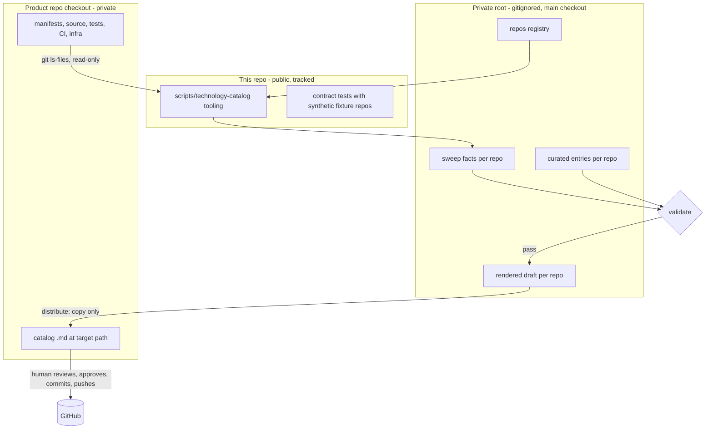
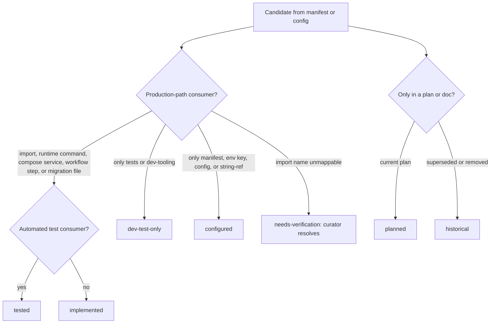
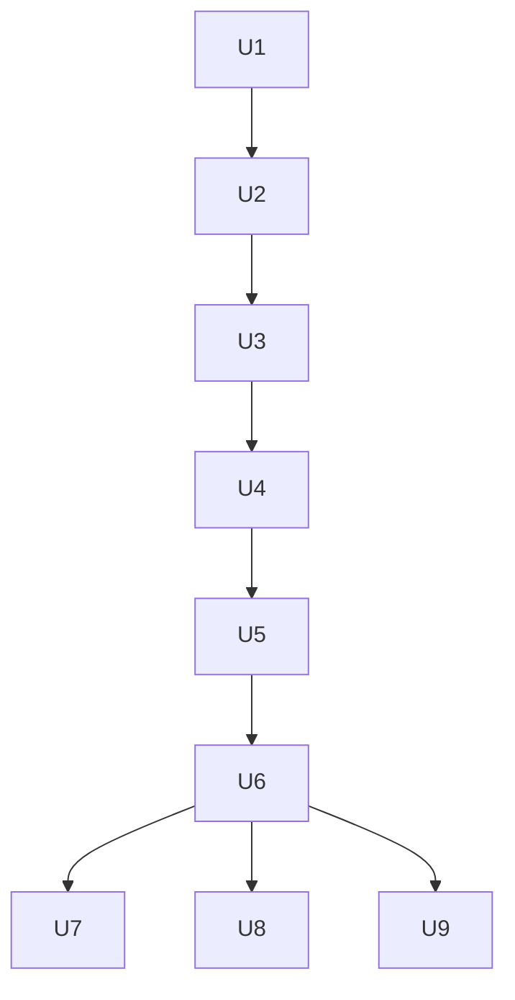

# Technology Capability Catalog Tooling - Plan

**Target repo:** this repository (the public proof-of-work repo). The tooling lives here. The generated catalogs are written into the owning product repos (Job-agent, PKM, Household Budget), which stay outside this plan's diff.

## Goal Capsule

- **Objective:** Each of Marcus's product repos has one readable catalog that says which technologies it uses, what for, which problem each solves, where the source shows it, and which engineering capabilities that evidence supports, without any entry claiming more than the source proves.
- **Means:** one set of catalog tooling in this repo sweeps a local checkout of any registered repo, validates curated entries against the swept facts, renders one `.md`, and copies it into that repo (KTD1, KTD3, KTD6).
- **Authority:** `AGENTS.md` and the release/privacy boundary win over this plan. Source code and current configuration win over prose. R-IDs govern behavior and KTDs govern mechanism.
- **Stop conditions:** stop if a change would add a private path, private repo URL, or private owner identity to a tracked file here. Stop before any commit, push, or remote change in a product repo until Marcus approves it. Stop a catalog claim when its only support is a manifest line, an environment key, or a plan.
- **Execution profile:** Node tooling with contract tests in this repo (U1-U5), then private curation passes and gated distribution per product repo (U6-U9). No product behavior or schema changes in any repo.

---

## Product Contract

### Summary

This repo gets a small catalog toolchain. It reads a local checkout of a product repo, records what the tracked source actually uses, and produces one Markdown catalog for that repo. A copy step places the file in the product repo so Marcus can commit and push it. Job-agent is the priority repo and proves the tooling before PKM and Household Budget. The earlier Job-agent plan (merged via PR 81) is superseded.

### Problem Frame

Each product repo holds real technical evidence spread across manifests, imports, routers, workers, migrations, tests, CI, and deployment files. A reader, human or agent, has to rebuild "we use X to solve Y, here is where, and here is how sure we are" from scratch each time. The earlier plan put the tooling, a validator, CI checks, and an export pipeline inside Job-agent. Marcus wants the same catalog in every repo without per-repo tooling, CI, or PR machinery, so the tooling moves here and each repo receives only a file.

This repo is public and the product repos are private. The tooling is public-safe. The evidence it collects is not, because it names private paths, so the evidence stays in a local gitignored area and only the finished `.md` leaves, into the repo that owns the source.

### Requirements

Catalog content
- R1. A catalog covers every materially used technology the tracked source evidences: languages, frameworks, libraries, datastores, queues, observability, integrations, auth and security, document tooling, frontend, testing, delivery infrastructure, CI/CD, and protocols.
- R2. Each entry states what the technology is, what the repo uses it for, the problem it solves, its architecture role, its evidence state, concrete repo-relative evidence locations, related technologies, and capability IDs.
- R3. Evidence state is one of `implemented`, `tested`, `configured`, `dev-test-only`, `planned`, `historical`. A manifest line, an environment key, or a configuration value alone never yields `implemented`. A technology that runs through infrastructure (a compose service, a workflow step, a migration file, a runtime command) can reach `implemented` through that execution evidence (KTD5).
- R4. `implemented` needs at least one production-path consumer. `tested` also needs at least one test consumer that uses the technology and is not solely a mock or patch target. The validator checks both against swept facts. Whether a test is relevant beyond that is a curator note the validator does not judge.
- R5. Every candidate the sweep finds, including environment-key names, is either cataloged or dispositioned with a reason (`incidental`, `transitive`, `unused`). A candidate the sweep cannot resolve sits on a `needs-verification` list that blocks validation until the curator catalogs or dispositions it. No candidate is silently dropped or defaulted.
- R6. Rationale is never invented. A decision reference must resolve to a tracked document in the swept repo. Otherwise the entry records that rationale is undocumented.
- R7. Technologies and capabilities map many-to-many.

Tooling and privacy
- R8. Tooling, schema, and tests live in this repo and run against any registered local checkout path. Product repos receive no validator, no CI step, and no new dependency.
- R9. Registry, swept facts, curated entries, and rendered drafts live in a gitignored private root that resolves correctly from the main checkout and from worktrees. Nothing tracked here contains a private path, private repo URL, or private owner identity.
- R10. Each repo gets exactly one `.md` catalog at a registry-defined path. The file carries a generated-file notice and provenance: swept commit, sweep fingerprint, and tool version.
- R11. The catalog states source evidence only. It makes no claim about production adoption, users, or outcomes, and Job-agent entries do not describe the product as live.

Distribution and lifecycle
- R12. `distribute` copies the rendered file into the registered checkout. It refuses a non-git target, a path that escapes the checkout, and a target file with uncommitted changes. It never commits, pushes, or edits a remote.
- R13. `status` reports on demand whether a catalog is stale against the checkout's current HEAD and lists the source-relevant files that changed. No CI is involved.
- R14. The Job-agent plan from PR 81 is marked superseded with a pointer to this plan. Its Job-agent validator, exporter, CI check, and multi-PR sequence are not built.
- R15. This repo's public release gates stay green. Every new tracked file is allowlisted.

### Success Criteria

- Searching the Job-agent catalog for its database-migration tool explains the tool's role, shows migration evidence, and maps it to a schema-migration capability.
- A package that appears only in a manifest or an environment key renders as `configured`, and the validator rejects any attempt to mark it `implemented`.
- Running `distribute` for a repo whose target file has unrelated uncommitted changes leaves that file untouched and exits non-zero.
- `npm run release:validate` passes with the tooling committed and no private data in the tree.

### Scope Boundaries

Deferred to Follow-Up Work
- A public-safe export of any catalog into this repo's `site/evidence/`, structured indexing, curated recruiter anchors, and retrieval tests. These were POW-PR1 to POW-PR3 in the earlier plan. They need their own plan and the allowlist and privacy gates.
- Decision-log entries derived from catalog entries.
- Scheduled refresh or a reminder automation.
- Automatic commit or PR creation in product repos.

Outside scope
- Changing any product repo's code, schema, dependencies, or CI.
- Describing any product as live, validated, or with measured outcomes.
- Copying private catalogs, sweep notes, or evidence paths into any tracked file here.

### Acceptance Examples

- AE1. Given a manifest that lists a package no tracked source imports or runs, when the sweep and validator run, then the package is `configured` at most and an `implemented` claim fails with the entry ID.
- AE2. Given a package imported by production code and by a test file, when the validator runs, then `tested` is accepted. With no test consumer, `tested` is rejected and `implemented` is accepted.
- AE3. Given a launcher that appears only in a Dockerfile command, when the sweep runs, then it is recorded as a runtime-command consumer and `implemented` is accepted.
- AE4. Given a target checkout whose catalog file has uncommitted edits, when `distribute` runs, then it exits non-zero and writes nothing.
- AE5. Given a checkout that gained commits after the sweep, when `status` runs, then it reports stale and lists the changed manifest and source files.
- AE6. Given the tooling run from a worktree, when it resolves the private root, then it uses the main checkout's ignored directory and never creates private files inside the worktree's tracked tree.

---

## Planning Contract

### Current Grounding

- The repo is Node 22, ESM, dependency-light. Existing scripts live as single `.mjs` files in `scripts/` and are checked by `node --test tests/contracts/*.test.mjs`. `tests/contracts/public-boundary.test.mjs` already builds throwaway git repos in temp directories, which is the fixture pattern to reuse.
- `scripts/check-public-release.mjs` requires every non-ignored file to be in `release/allowlist.json`, rejects local Windows paths, protected identities, and credential-shaped text in public text files, and skips git-ignored paths. It also pins the only allowed remote.
- `AGENTS.md` bars private paths and identities and requires Job-agent to be described as work in progress.
- The main checkout already ignores `internal/` source indexes on a branch not yet merged into `main`. A worktree created from `main` has no such rule and no `internal/` directory.
- The three product repos are local checkouts with different stacks. Between them they use Python and Node manifests, container and CI configuration, reverse-proxy and collector configs, SQL migrations, and a browser-extension manifest. Manifests sit in subdirectories, not at repo roots. Stack detail per repo stays in the private root, not in this plan.
- A prior Job-agent sweep exists as private local notes. It seeds U6 as leads to verify, never as evidence.

### Key Technical Decisions

- KTD1. **Tooling lives here and the product repos receive only a file.** (session-settled: user-directed — chosen over a catalog, validator, and exporter inside each repo: the user wants no per-repo validator, CI, or PR burden). Governs R8, R10, R12.
- KTD2. **Real evidence stays in a gitignored private root.** The registry, sweep facts, curated entries, and drafts are stored under a private root, `internal/technology-catalog/` in the main checkout, with one `<repo-id>/` folder per registered repo, overridable by `TECHNOLOGY_CATALOG_PRIVATE_ROOT`. The resolver finds the checkout that owns the git common directory, whatever branch it holds, so worktrees share one root. It runs the ignore check inside that checkout and refuses a root that git does not ignore by any source. An `init` command appends the rule to the shared `info/exclude` file when no rule matches, so the private curation units do not wait for the tracked `.gitignore` line to merge. This keeps the public tree free of private paths while the `.md` that carries paths goes only to the private repo that owns them. Governs R9.
- KTD3. **Two data layers: swept facts and curated entries.** The sweep is deterministic and records candidates and consumers. Curated entries add purpose, problem, role, and capability mapping. The validator derives the maximum allowed state for each entry from the facts, so judgment cannot raise a state above its evidence. Governs R3-R5.
- KTD4. **Node standard library only.** The tools use `git ls-files` for the file set, so untracked and generated trees are excluded without extra rules, and `git rev-parse HEAD` for provenance. No new dependency enters `package.json`. Governs R8.
- KTD5. **Consumers are classified per file, and anything unresolved is surfaced, not guessed.** A consumer is `app`, `test`, `dev-tooling`, `config`, or `doc`, with a kind: `import`, `runtime-command`, `compose-service`, `workflow-step`, `migration-file`, or `string-ref` (for example a driver named in a connection URL). Import, runtime-command, compose-service, workflow-step, and migration-file evidence count as production-path for the technology kinds they run. `string-ref` and bare config cap the state at `configured`. A package with no consumer, or an unmappable import name, goes to `needs-verification`. The curator may override a consumer class or cap with a recorded reason, and the renderer shows every override. Governs R3-R5.
- KTD6. **Distribution is a copy.** Commit and push remain a separate, human-approved step per repo, because each repo has its own branch rules and some checkouts carry unrelated work. Governs R12.
- KTD7. **Staleness is a command, not a gate.** `status` compares the recorded swept commit and branch with the checkout HEAD and lists changed files that the sweep classified as manifest, consumer, or infrastructure. Governs R13.
- KTD8. **Public-safe plan, private data.** This plan and all tracked files refer to repos by display name only. The registry maps a repo ID to an absolute checkout path and a target path in the private root only. Governs R9, R15.

### Alternatives Considered

- A catalog source of truth committed in this repo with public-safe wording: rejected because the evidence locations that make the catalog useful are private paths, and stripping them removes the value for the repos that own them.
- Per-repo copy of the tooling: rejected by the user's constraint (KTD1).
- Embedding the curated JSON inside each `.md`: rejected for v1. A second data block in the deliverable adds a parse path without a current need. The cost is that curated data survives only in the private root and its backup (see Risks).

### High-Level Technical Design





### Output Structure

```text
scripts/technology-catalog.mjs              CLI entry: sweep, validate, render, distribute, status
scripts/technology-catalog/
  private-root.mjs                          resolve and guard the private root; init; registry read
  aliases.mjs                               import-name to package alias table (public-safe names only)
  sweep.mjs                                 manifests, consumers, language census, fingerprint
  catalog.mjs                               curated-entry schema and validator
  render.mjs                                deterministic Markdown renderer
  distribute.mjs                            copy and status
tests/contracts/technology-catalog.test.mjs
tests/contracts/fixtures/technology-catalog/  synthetic fixture repo and expected sweep and render outputs
docs/TECHNOLOGY_CATALOG_RUNBOOK.md          refresh and distribution workflow, no private data
```

### Assumptions

- The three product repos stay available as local checkouts. A registry entry whose path is missing fails with a clear message.
- Job-agent's own repo rules allow a documentation file at `docs/architecture/`. PKM and Household Budget target paths are chosen in U8 and U9 after looking at each repo's `docs/` layout.
- A catalog describing a private repo may include repo-relative paths, because the file stays in that private repo.

### Risks

| Risk | Mitigation |
|---|---|
| The private root exists only on this machine. A re-sweep rebuilds facts but not curated purpose, role, and capability mapping, so losing the root loses that work. | The runbook adds a `backup` step with a restore check, and Marcus keeps the private root in his normal backup. The rendered `.md` in each repo is a readable copy, not a restore source. |
| Import detection counts comments, type-only imports, or local modules that shadow a package. | The sweep strips comments and strings, excludes type-only imports from production consumers, and resolves local modules before mapping to a package (U2). |
| Unmapped or zero-consumer packages hide as `configured`. | They go to `needs-verification` and block validation. `configured` is a curator outcome (R5). |
| A target checkout is on a feature branch with unrelated work, or has a dirty tree. | `sweep` refuses a dirty tracked tree and records the branch, so use a clean worktree of that repo. `distribute` writes one file and never stages or commits it. |
| Curated prose quotes a config value or internal host. | `validate` and `distribute` scan curated fields with the credential patterns from the release validator and reject a match (U3, U5). |
| The `.gitignore` rule conflicts with the unmerged branch that already edits ignore rules. | The change is a single added line. Resolve a textual conflict by keeping both lines. |
| A rendered catalog reaches a public path by mistake. | The renderer writes only to the private root, `distribute` only to a registered checkout, and `release:validate` still blocks unlisted files and local paths here. |

### Sequencing



U1-U5 are tracked changes in this repo and land together as one reviewable change set, which is complete on its own. U6 proves the tooling on the largest repo, so U8 and U9 wait for U6 to validate and then run in parallel. U7 waits for U6 and for Marcus's approval.

---

## Implementation Units

### U1. Private root, registry, and repository hygiene

- **Goal:** give the tooling a safe, worktree-aware home for private data and register the new tracked files.
- **Requirements:** R8, R9, R15
- **Dependencies:** none
- **Files:** `scripts/technology-catalog/private-root.mjs`, `scripts/technology-catalog/aliases.mjs`, `tests/contracts/technology-catalog.test.mjs`, `.gitignore`, `release/allowlist.json`, `package.json`
- **Approach:**
  - Resolve the private root from `TECHNOLOGY_CATALOG_PRIVATE_ROOT`, else from the main checkout found via the git common directory, under `internal/technology-catalog/`.
  - Refuse a root that `git check-ignore` does not ignore, running the check inside the checkout that owns the git common directory. Add an `init` command that appends the root's rule to the shared `info/exclude` file when no rule matches.
  - Define the registry shape: repo ID, display name, absolute checkout path, repo-relative target path. Validate that the checkout is a git repo and the target path stays inside it.
  - Add the ignore line, the allowlist entries for each new tracked file, and one `catalog` npm script that runs the CLI.
- **Patterns to follow:** temp-repo helpers in `tests/contracts/public-boundary.test.mjs`; script style of `scripts/build-repository-evidence-index.mjs`.
- **Test scenarios:**
  - Covers AE6. Running from a linked worktree resolves the main checkout's directory, not a path inside the worktree.
  - An override env var pointing outside the repo is accepted.
  - A root that is not ignored is rejected with a message naming the missing rule, and `init` then makes the same root pass without touching a tracked file.
  - A registry entry with a `..` target path, a missing checkout, or a non-git checkout is rejected with the repo ID.
  - A registry entry with a duplicate ID is rejected.
- **Verification:** the new tests pass, and `release:validate` passes with the new files allowlisted.

### U2. Sweep: manifests, consumers, and census

- **Goal:** produce deterministic, source-backed facts for one registered checkout.
- **Requirements:** R1, R3-R5
- **Dependencies:** U1
- **Files:** `scripts/technology-catalog/sweep.mjs`, `tests/contracts/technology-catalog.test.mjs`
- **Approach:**
  - Refuse a checkout with uncommitted changes to tracked files. List files with `git ls-files` and record the HEAD commit and the branch name.
  - Discover manifests at any depth: Python requirements files and `pyproject.toml`, `package.json`, Docker and compose images and services, GitHub workflow files and steps, SQL migration files, and infrastructure configs (reverse proxy, collector, extension manifest).
  - Discover environment-key names from example env files and settings modules. Record names only, never values.
  - For each package, find consumers by import statements (Python `import`/`from`, JS and TS `import`/`require`/dynamic import). Strip comments and strings first, exclude type-only imports from production consumers, and resolve a name to a local module before mapping it to a package. Classify each consumer file as `app`, `test`, `dev-tooling`, `config`, or `doc` by path and name conventions.
  - Record Dockerfile and compose commands, compose services, workflow steps, and migration files as consumers of the technologies they run, and record string references such as a driver in a connection URL as `string-ref` (KTD5).
  - Keep the import-name alias table in `aliases.mjs`. Any package with no consumer, or an unmappable name, goes to `needs-verification`.
  - Emit a language and file-type census, and a fingerprint: SHA-256 over facts serialized with sorted keys and no timestamps. Write `sweep.json` under the repo's private folder.
- **Technical design:** directional only — facts are keyed by package; each fact holds `sources` (manifest paths), `consumers` (path, class, kind), and `confidence`. Exact field names are settled in implementation.
- **Test scenarios:**
  - Covers AE1. A package present only in a manifest yields zero consumers.
  - A package imported by one app file and one test file yields one `app` and one `test` consumer.
  - Covers AE3. A command in a Dockerfile naming a launcher yields a `runtime-command` consumer with no import.
  - A compose service, a workflow step, and a migration file each yield a consumer for the technology they run.
  - A driver named only in a connection URL yields a `string-ref` consumer and no `app` consumer.
  - An import inside a comment, a string, a type-only import, and a local module with the same name as a package each yield no production consumer.
  - A package with no consumer lands in `needs-verification` and is not defaulted to `configured`.
  - An example env file yields key names and no values.
  - A checkout with an uncommitted tracked-file change is refused, and the sweep records the branch name.
  - A manifest in a subdirectory and a second manifest at the root are both found.
  - An untracked file and a file under a generated or vendor directory contribute no consumers.
  - A package with a different import name resolves through the alias table, and an unknown one lands in `needs-verification`.
  - Two sweeps of the same commit produce the same fingerprint.
- **Verification:** the sweep of the synthetic fixture under `tests/contracts/fixtures/technology-catalog/` matches its expected facts snapshot.

### U3. Curated-entry schema and validator

- **Goal:** make unsupported claims fail before anything is rendered.
- **Requirements:** R2-R7, R11
- **Dependencies:** U2
- **Files:** `scripts/technology-catalog/catalog.mjs`, `tests/contracts/technology-catalog.test.mjs`
- **Approach:**
  - Define the entry shape: ID, name, kind, domain, evidence state, purpose, problem solved, architecture role, technologies, capability IDs, evidence locations, decision references or an explicit `rationale: undocumented`, and optional search aliases.
  - Define the capability taxonomy as data in the curated file, with stable dotted IDs.
  - Derive the maximum allowed state per entry from the facts (KTD3) and reject any higher claim. `dev-test-only` needs only `test` or `dev-tooling` consumers. A string-ref or bare config consumer caps at `configured`. A curator override applies only with a recorded reason. `planned` and `historical` need a doc evidence location and no production consumer claim.
  - Check every evidence path against the swept file set, every decision reference against tracked documents, every capability reference against the taxonomy, and every sweep candidate for a catalog entry or a disposition with a reason (R5).
  - Lint prose fields for adoption and outcome language and for the word `live` applied to a product (R11). Scan every curated field with the credential patterns from `scripts/check-public-release.mjs` and for internal host names.
- **Test scenarios:**
  - Covers AE1. `implemented` on a manifest-only package fails with the entry ID and the allowed maximum.
  - Covers AE2. `tested` with an app and a test consumer passes. With no test consumer it fails.
  - A duplicate entry ID, a duplicate capability ID, and an unknown capability reference each fail.
  - An evidence path that is not in the swept file set fails. A glob matching no file fails.
  - A decision reference to a missing document fails, and `rationale: undocumented` passes.
  - A sweep candidate with no entry and no disposition fails and is named. Each of the three disposition values passes with a reason and fails without one.
  - Any candidate still on `needs-verification` fails validation.
  - A technology with only `test` and `dev-tooling` consumers is capped at `dev-test-only`.
  - A compose-service or workflow-step consumer allows `implemented` for an infrastructure technology, and a string-ref allows at most `configured`.
  - A consumer override without a reason fails, and one with a reason passes and is carried to the renderer.
  - A credential-shaped string or internal host name in a curated field fails.
  - Prose containing "in production" or "currently live" fails the language lint.
  - A technology mapped to two capabilities and a capability backed by two technologies both validate (R7).
- **Verification:** the validator accepts the fixture catalog and rejects each seeded invalid copy with a specific message.

### U4. Deterministic Markdown renderer

- **Goal:** turn a validated catalog into the one readable file per repo.
- **Requirements:** R2, R7, R10, R11
- **Dependencies:** U3
- **Files:** `scripts/technology-catalog/render.mjs`, `tests/contracts/technology-catalog.test.mjs`
- **Approach:**
  - Emit a header with a generated-file notice, the repo display name, the swept commit, the sweep fingerprint, and the tool version, then a source-evidence disclaimer (R11) and a state legend.
  - Group entries by domain. Add a language table from the sweep census, a technology index, and a capability index so a reader can search by any of them. Show every consumer override with its reason.
  - Render each entry with purpose, problem, role, state, evidence locations, related technologies, capability links, and rationale status.
  - Sort every list by stable keys so output does not depend on input order. Write to the repo's private folder only.
- **Test scenarios:**
  - Rendering the same catalog twice is byte-identical.
  - Shuffling entry order in the input does not change the output.
  - Every entry appears exactly once in its domain section and once in the technology index.
  - The header carries the swept commit and fingerprint, and the disclaimer text.
  - Rendering refuses an unvalidated catalog.
- **Verification:** the rendered fixture catalog matches its stored expected file under `tests/contracts/fixtures/technology-catalog/`.

### U5. Distribute, status, CLI, and runbook

- **Goal:** move the finished file into a product repo safely and report staleness.
- **Requirements:** R10, R12, R13
- **Dependencies:** U4
- **Files:** `scripts/technology-catalog.mjs`, `scripts/technology-catalog/distribute.mjs`, `docs/TECHNOLOGY_CATALOG_RUNBOOK.md`, `release/allowlist.json`, `tests/contracts/technology-catalog.test.mjs`
- **Approach:**
  - The CLI exposes `sweep`, `validate`, `render`, `distribute`, and `status`, each taking a repo ID.
  - `distribute` copies the rendered file to the registered target path. It creates missing parent folders inside the checkout. It stops on a non-git checkout, an escaping path, a missing rendered draft, a credential-pattern match in the draft, or uncommitted changes to the target file. A re-run whose target already equals the draft is a no-op, so a distributed file awaiting commit does not block a refresh. It prints the target's `git status` for that file and stops. It never stages, commits, or pushes.
  - `status` compares the recorded swept commit with the checkout HEAD and lists changed manifest, source, test, and infra files. A flag returns a non-zero exit when stale.
  - The runbook documents the refresh sequence (sweep, curate, validate, render, distribute, then the approved commit and push in the product repo) and a `backup` step for the private root. It contains no private paths.
- **Test scenarios:**
  - Covers AE4. A target file with uncommitted edits makes `distribute` exit non-zero and leave the file unchanged.
  - A target already equal to the draft passes as a no-op.
  - A missing parent folder inside the checkout is created.
  - A draft containing a credential-shaped string is refused.
  - A clean target receives the file at the registered path, and no commit or index change happens in the target repo.
  - A target path that escapes the checkout is refused.
  - Covers AE5. After a new commit in the fixture checkout, `status` reports stale and lists the changed files. With no new commit it reports current.
  - `distribute` with no rendered draft fails with a message naming the missing step.
- **Verification:** all contract tests pass, `npm run release:validate` passes, and a repo-wide scan of tracked files finds no private path or owner identity.

### U6. Job-agent catalog pass

- **Goal:** produce the first real catalog, and prove the tooling on a large repo.
- **Requirements:** R1-R7, R10, R11
- **Dependencies:** U5
- **Files:** none tracked. Private root only: Job-agent registry entry, sweep facts, curated entries, rendered draft.
- **Execution note:** knowledge-work inside the private root. Treat the earlier private sweep notes as leads and re-verify each against the current checkout, because the code has moved.
- **Approach:**
  - Register the Job-agent checkout and set its target path under its existing architecture docs folder.
  - Run the sweep, then curate entries domain by domain, resolving the open verification list kept in the private notes, plus every `needs-verification` candidate the sweep reports.
  - Record rationale references only where a decision document exists, and mark the rest undocumented.
  - Validate, render, and read the output against the success criteria.
- **Test scenarios:**
  - Test expectation: none -- private curation. The validator and the AE1 and AE2 behaviors from U3 are the proof.
- **Verification:** validation passes with zero undispositioned candidates, and the rendered catalog answers the migration-tool search in the success criteria.

### U7. Distribute the Job-agent catalog and supersede the earlier plan

- **Goal:** land the file in Job-agent and retire the old plan.
- **Requirements:** R12, R14
- **Dependencies:** U6, and Marcus's approval for any commit or push
- **Files:** none tracked here. In Job-agent: the catalog file, and a one-line superseded note at the top of the earlier plan file.
- **Approach:**
  - Run `distribute` for Job-agent, add the one-line note pointing to this plan in the earlier plan, and show Marcus the two-file diff.
  - After approval, commit and push following Job-agent's own branch rules. Check whether its default branch allows a direct push before choosing a branch.
- **Test scenarios:**
  - Test expectation: none -- operational step. The `distribute` behaviors are covered in U5.
- **Verification:** Job-agent's working tree shows exactly the two intended files, and `status` reports current.

### U8. PKM catalog pass and distribution

- **Goal:** catalog PKM, including its browser-extension and reverse-proxy surfaces.
- **Requirements:** R1-R7, R10-R12
- **Dependencies:** U6
- **Files:** none tracked. Private root, and the catalog file in PKM after approval.
- **Execution note:** private curation, same flow as U6.
- **Approach:**
  - Register PKM, choose its target path after reading its `docs/` layout, then sweep, curate, validate, and render.
  - Record the extension manifest and proxy config as presence facts and catalog them only with a consumer or a clear role.
  - Distribute and hand the commit decision to Marcus.
- **Test scenarios:**
  - Test expectation: none -- private curation.
- **Verification:** validation passes, and PKM's working tree shows only the catalog file after distribution.

### U9. Household Budget catalog pass and distribution

- **Goal:** catalog Household Budget, including its Supabase migrations and test tooling.
- **Requirements:** R1-R7, R10-R12
- **Dependencies:** U6
- **Files:** none tracked. Private root, and the catalog file in Household Budget after approval.
- **Execution note:** private curation. The checkout is on a feature branch, so sweep a clean worktree of the agreed branch and confirm with Marcus which branch receives the file before distribution.
- **Approach:**
  - Register the repo, sweep, curate, validate, and render.
  - Treat SQL migrations as a language and schema-evolution surface, and confirm the data-access consumers before assigning a state.
  - Distribute and hand the commit decision to Marcus.
- **Test scenarios:**
  - Test expectation: none -- private curation.
- **Verification:** validation passes, and the target repo shows only the catalog file after distribution.

---

## Verification Contract

| Gate | Command | Applies to |
|---|---|---|
| Contract tests | `npm run test:contracts` | U1-U5 |
| Public release boundary | `npm run release:validate` | U1-U5, and before any commit here |
| Full suite | `npm run test:e2e` | final candidate, per `AGENTS.md` |
| Clean install | `npm ci` | final candidate |
| Diff hygiene | `git diff --check` | every change |
| Catalog validation | `npm run catalog -- validate <repo-id>` | U6, U8, U9 |
| Staleness | `npm run catalog -- status <repo-id>` | U7, U8, U9 after distribution |

## Definition of Done

Tooling (U1-U5, complete without the catalogs)
- The tooling sweeps, validates, renders, distributes, and reports status for a registered checkout, with contract tests that use synthetic fixture repos only.

Catalogs (U6-U9)
- Job-agent, PKM, and Household Budget each have one validated catalog `.md` in their working tree at the registered path, ready for Marcus's commit decision.
- No tracked file here contains a private path, private repo URL, or private owner identity, and `release:validate` passes.
- No catalog entry is `implemented` or `tested` without the matching consumer evidence, and no sweep candidate is undispositioned.
- The earlier Job-agent plan carries a superseded pointer, after approval.
- Abandoned experiments and scratch files are removed from the diff.

Per unit
- U1: root resolution, guard, and registry validation tested, files allowlisted.
- U2: deterministic sweep proven on fixtures.
- U3: every invalid seeded catalog rejected with a specific message.
- U4: render is byte-stable and complete.
- U5: copy is safe, status works, runbook written.
- U6, U8, U9: validated rendered catalog per repo.
- U7: two-file Job-agent diff shown and, once approved, committed.

## Appendix

### Mapping from the earlier Job-agent plan

| Earlier plan | Disposition |
|---|---|
| R1-R10 coverage and evidence rules | carried forward as R1-R7 |
| R11-R13 human reference and drift check | carried forward as R10, R13 without per-repo CI |
| R14-R17 public-safe export and R18-R24 recruiter retrieval | deferred (see Scope Boundaries) |
| R25-R27 decision-log integration | deferred |
| R28-R29 CI in both repos | dropped by the user's no-CI constraint; replaced by `status` |
| JA-PR1 to JA-PR3 | dropped; tooling moves here |
| POW-PR1 to POW-PR3 | deferred |
| Source-of-truth order for state (implementation, verified config, matching docs, plans, history) | kept as the basis of KTD3 and the state diagram |
