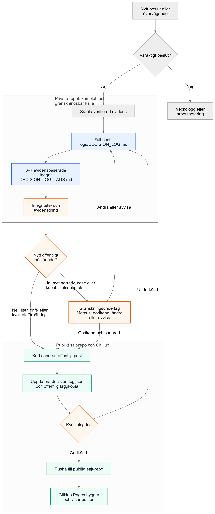
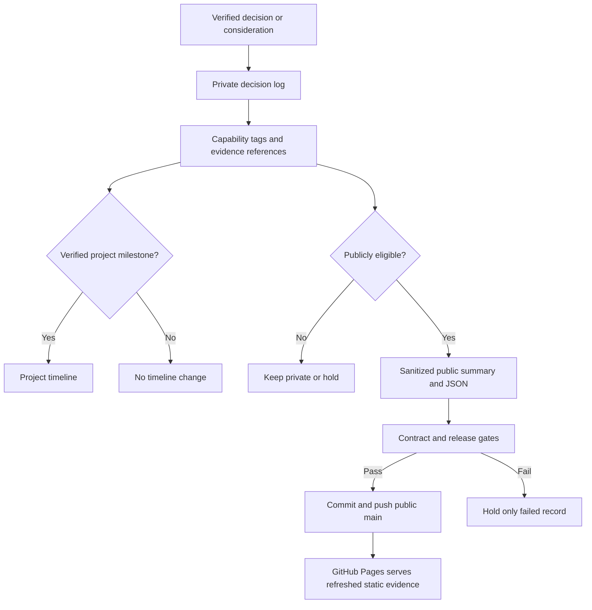

# Decision Log Automation Reference

## Purpose

This reference describes how a verified decision moves from the private evidence repository into the public GitHub Pages decision log. The process is automatic. It does not require approval for each decision.

Source files: [Mermaid](../../diagrams/decision-log-update-flow.mmd), [SVG](../../diagrams/decision-log-update-flow.svg), and [Excalidraw](../../diagrams/decision-log-update-flow.excalidraw).

## System model

## Private evidence layer

The private repository remains the source of truth.

Historical coverage starts with the versioned source register at `docs/evidence/historical-decision-source-registry.json`. It freezes the private decision-bearing source universe, extraction grammar, source revision, scan state, and cutoff for a coverage run. The register and its local-only source map never reach public projections. See [Historical Decision Coverage](HISTORICAL_DECISION_COVERAGE.md) for the coverage contract.

- `logs/DECISION_LOG.md` records the visible decision trail: context, options, tradeoffs, decision, evidence, open questions, and next action.
- `logs/DECISION_LOG_TAGS.md` classifies the decision with the approved capability taxonomy.
- `PROJECT_TIMELINE.md` changes only when a decision creates a meaningful, verified project milestone. A decision alone is not enough.
- `repository-evidence-index.json` can receive a stable projection of a decision when it has a clear project, status, safe summary, tags, and evidence references. It is an index, not a source of truth.

## Public GitHub Pages layer

Only public-safe projections are published. The Pages site is static: it exposes JSON through normal HTTP `GET` requests, not a server-side inference API or database.

- `evidence/decision-log.json` contains the public decision records.
- `evidence/decision-log-tags.json` contains the public tag projection.
- The Pages interface and recruiter-facing pages query these static JSON files.

The public record is a sanitized summary. It must not include private paths, raw chats, credentials, personal data, confidential material, or unsupported claims.

## Automatic gates

Each weekly run evaluates every candidate independently. A candidate publishes automatically when all gates pass:

1. Evidence is grounded and its status is explicit.
2. Public wording passes privacy and redaction checks.
3. Tags use the current capability taxonomy.
4. The decision-log schema and contract tests pass.
5. The public release validator passes.

There is no manual approval queue. Each candidate is routed independently to publish, hold, or internal-only. If a candidate fails a gate, record its stable ID, failed gate, evidence references, and automatic retry condition; keep it out of the public projection until the retry succeeds. Other eligible updates continue.

## Weekly execution model

The active weekly automation runs every Sunday at 22:00. It uses isolated, full-history Git clones for the private evidence branch, public `main` branch, and the operations logbook.

This avoids a common failure mode: normal uncommitted work in an interactive checkout cannot block the scheduled run. The automation stages only its own generated files, validates each clone before and after committing, and pushes only validated commits. It removes the exact temporary run directory after completion.

For historical coverage, the weekly run validates the frozen source register and scans only sources that are new, changed, stale, or newly unblocked. It records private aggregate coverage counts. A held candidate retries only when its named gate or source revision changes.

## Expected result

One verified decision can therefore have three distinct outcomes:

| Outcome | Condition | Result |
|---|---|---|
| Private decision only | Not a public claim or fails a public gate | Private log remains the record; public site does not change. |
| Timeline milestone | Decision also creates a verified milestone | Private log and timeline update. |
| Public decision evidence | All public gates pass | Private log, public JSON, and GitHub Pages refresh automatically. |

## Operational rule

Trust objective gates, not recurring manual approvals. A failed gate is actionable feedback for the next automatic run; it is not a request for a human to approve an otherwise unsafe claim. The retry condition is evaluated automatically and never blocks unrelated candidates.
