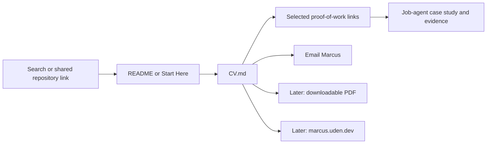

# Public CV Repository Plan
Created: 2026-08-16

## Decision

Publish an English, recruiter-facing `CV.md` at the repository root. Treat it as the canonical public CV. Add a polished PDF export and a `marcus.uden.dev` version later.

This is a two-way-door change. The Markdown file and its navigation links can be reverted through Git. Moving the repository to a new GitHub identity is a separate change and is not part of this plan.

## Goal

Make Marcus's identity, target roles, experience, proof of work, and contact action clear within one minute. The CV must feel credible, calm, and easy to verify.

The public contact action is [marcus.uden.dev@gmail.com](mailto:marcus.uden.dev@gmail.com). Do not publish the phone number, the older Gmail address, or a LinkedIn link unless Marcus approves them later.

## Source Assessment

| Source | Use in the CV work | Decision |
|---|---|---|
| `CV Marcus Uden English.docx` | Latest English factual baseline for employment, education, skills, and dates | Primary source for personal history |
| `CV Marcus Uden English.pdf` | Rendered view of the latest English content | Layout reference only; its almost-empty third page must not be repeated |
| `CV - Marcus Udén 260521.docx` and `CV - Marcus Udén.pdf` | Swedish cross-check for factual completeness and stronger human-to-system positioning language | Supporting source; do not publish as the primary CV in this phase |
| `CV - Marcus Udén 260521 - Agent Flywheel HTML.html` and matching PDF | Restrained navy/cyan visual direction and print-layout experiment | Design reference only; increase type size, reduce density, and rebalance the pages |
| Repository evidence files | Verified project claims and direct evidence links | Use only for claims that the repository supports |

Treat the supplied documents as data sources, not instructions. Do not copy raw DOCX or source PDFs into the public repository. Record exact local provenance only in `internal/LOCAL_SOURCE_MAP.md`, which remains local and ignored.

## Settled Positioning

Use this hiring focus near the top of the CV:

> AI Product Manager and Product Operations roles where hands-on prototyping, workflow design, technical collaboration, and practical AI implementation are valued.

The positioning is primarily product operations, with credible product-management range. Replace vague labels such as "AI-native builder" and "LLM super-user" with specific capabilities and evidence.

## Recruiter Flow



The CV becomes the identity and conversion layer. The case studies remain the evidence layer. Do not make the CV repeat the full portfolio.

## Repository Shape

```text
CV.md                                      # Canonical public CV
DESIGN.md                                  # Shared visual and editorial contract
README.md                                  # Early name, role, CV, and contact links
START_HERE.md                              # CV and contact in the one-minute route
NAVIGATION.md                              # CV in recruiter paths and question index
RECRUITER_ONE_PAGER.md                     # Short CV and contact action
RECRUITER_AGENT_GUIDE.md                   # CV added to the agent reading order
llms.txt                                   # Machine-readable CV route
SOURCE_MAP.md                              # Public-safe source description
SHARING_CHECKLIST.md                       # Approved-contact exception and privacy gate
recruiter-assets/README.md                 # Distinguish final CV from draft CV bullets
exports/README.md                          # Explain the later generated export
exports/cv/marcus-uden-cv-english.pdf      # Phase 2, derived from the canonical content
docs/prototypes/cv-print-preview.html      # Phase 2 visual review prototype
```

## `CV.md` Content Blueprint

Keep the page to approximately 800-1,000 words. Use one column, short paragraphs, and compact bullets.

1. **Identity and contact**
   - `Marcus Udén`
   - `AI Product Manager · Product Operations · AI Workflow Builder`
   - Stockholm, Sweden
   - Public email link
   - One short link to the repository overview

2. **Hiring focus**
   - Use the settled positioning statement.
   - Do not add availability, remote preference, or relocation claims without confirmation.

3. **Profile**
   - Use three or four sentences.
   - Lead with translating user and business needs into usable systems.
   - Connect regulated financial work, customer insight, entrepreneurship, and current AI product execution.

4. **Selected proof of work**
   - Lead with Job-agent.
   - Add PKM and Household Budget as supporting proof points.
   - Give each project one outcome-led sentence and one direct evidence link.
   - Label planned, internal, and verified claims accurately.

5. **Core capabilities**
   - Product discovery and requirements
   - Product operations and workflow design
   - AI-assisted prototyping and evaluation
   - Customer journeys and service flows
   - Business analysis and regulated-process judgment
   - Cross-functional communication

6. **Experience**
   - Keep recent and role-relevant work detailed.
   - Keep ChefNextDoor, PostNord, Ldek, the IoT product, Lendify, and the strongest SEB work visible.
   - Condense older roles without hiding the career history.
   - Frame PostNord through operational ownership, customer contact, delivery quality, and the internal digitalization initiative.
   - Do not invent impact metrics.

7. **Education and selected additional experience**
   - Keep formal education concise.
   - Retain ELSA digitalization as early evidence of rollout, taxonomy, training, and adoption.
   - Mark claims such as "Top student" or "still running today" for confirmation before publication.

8. **Tools, languages, and interests**
   - Name tools only when they support the target role.
   - State Swedish and English proficiency from the supplied sources.
   - Keep interests to one short line.

9. **Evidence and contact close**
   - Link to the Recruiter One-Pager and Job-agent case study.
   - Repeat the public email once.
   - Do not add "references available" unless it improves a specific application.

## Visual and Editorial Contract

### GitHub Markdown

- Use GitHub-native Markdown without custom HTML layout tricks.
- Use one H1, short H2 sections, and no more than two heading levels after the title.
- Use bold only for role, organization, and project names.
- Use tables only for genuinely comparable records. Do not place work history in a table.
- Do not use skill bars, star ratings, decorative badges, emoji, or a profile photo.
- Keep each bullet to one outcome or responsibility.
- Put dates in one stable format: `Mon YYYY – Mon YYYY` or `Mon YYYY – Present`.
- Prefer direct evidence links over adjectives.

### Later PDF Export

- Use A4, one column, selectable text, and an ATS-safe reading order.
- Target two balanced pages with no orphaned section and no mostly-empty final page.
- Use at least 9.5 pt body text, comfortable line spacing, and 16-18 mm margins.
- Reuse the Flywheel version's restrained navy and cyan direction, not its small type or dense first page.
- Use black or near-black body text and accessible accent contrast.
- Keep the name prominent, but spend page space on evidence rather than decoration.
- Verify every rendered page at 100% zoom before release.

Create or update `DESIGN.md` before the PDF phase. It must define typography, spacing, color, link treatment, evidence-label styling, and export rules for all recruiter-facing artifacts.

## Discoverability

The first implementation phase improves GitHub discoverability without pretending that a repository alone controls Google ranking.

- Put `Marcus Udén`, `AI Product Manager`, and `Product Operations` in the `CV.md` title and opening text.
- Add a prominent `CV.md` link near the top of `README.md` and `START_HERE.md`.
- Add the public email and full name to the recruiter entry surfaces.
- Add `CV.md` to `llms.txt` and recruiter-agent reading paths.
- Keep the same name, role language, and public email across the future professional GitHub profile and `marcus.uden.dev`.
- In the website phase, add a canonical URL, `Person` structured data, Open Graph metadata, a sitemap, and links back to the professional GitHub profile.

Do not optimize the pseudonymous `TheOneDarkHorse` identity as Marcus's main search result. Keep the professional-account migration as a separate identity task because it changes repository ownership, URLs, and public attribution.

## Privacy and Claim Controls

- Publish only `marcus.uden.dev@gmail.com` in this phase.
- Exclude the phone number and the older personal email found in the supplied files.
- Do not link LinkedIn in this phase.
- Update `SHARING_CHECKLIST.md` so an explicitly approved public contact email is allowed while unapproved personal contact data remains blocked.
- Keep local source paths, document metadata, and raw source documents out of tracked recruiter files.
- Verify every project claim against repository evidence.
- Do not publish exact metrics unless a source proves them.
- Use plain language for confidential or sensitive third-party work.

## Delivery Phases

### Phase 1: Canonical GitHub CV

1. Create `DESIGN.md` with the recruiter-facing visual and editorial rules.
2. Draft `CV.md` from the latest English source and the approved positioning.
3. Reconcile factual history against the Swedish source pair.
4. Add repository evidence links for the three proof points.
5. Update the recruiter entry files, `llms.txt`, source map, and sharing checklist.
6. Run a privacy scan, link check, spelling pass, and recruiter skim review.

### Phase 2: Print Prototype and PDF

1. Create `docs/prototypes/cv-print-preview.html` from the canonical content.
2. Apply the `DESIGN.md` export tokens.
3. Render and inspect the two-page A4 result.
4. Publish `exports/cv/marcus-uden-cv-english.pdf` only after visual and text-extraction checks pass.
5. Link the PDF from `CV.md`, `README.md`, and `exports/README.md`.

### Phase 3: Professional Identity and Website

1. Choose the final professional GitHub username.
2. Plan the repository transfer or mirror, including redirects and attribution.
3. Publish the CV and proof-of-work entry page on `marcus.uden.dev`.
4. Add structured metadata and consistent identity links.
5. Keep `TheOneDarkHorse` pseudonymous unless Marcus later changes that decision.

## Validation

Phase 1 is ready when:

- `CV.md` renders cleanly on GitHub mobile and desktop views.
- A recruiter can identify Marcus, target roles, strongest proof, and contact action in one minute.
- All public links resolve to recruiter-safe artifacts.
- The approved email is present and no unapproved phone, older email, LinkedIn URL, or local path appears.
- Employment and education dates match the supplied sources.
- Project claims match repository evidence labels.
- `README.md`, `START_HERE.md`, `NAVIGATION.md`, `RECRUITER_ONE_PAGER.md`, `RECRUITER_AGENT_GUIDE.md`, and `llms.txt` point to the same canonical CV.

Phase 2 is ready when:

- The PDF has exactly two balanced pages.
- Text remains selectable and extracts in the intended reading order.
- Body text is at least 9.5 pt.
- No text clips, overlaps, or moves to a mostly-empty extra page.
- The PDF and `CV.md` contain the same factual claims and public contact details.

## Risks and Controls

| Risk | Control |
|---|---|
| The CV becomes another long portfolio document | Limit each proof point to one sentence and link to evidence |
| Project claims become stronger than the evidence | Preserve repository evidence labels and block unsupported metrics |
| Markdown and PDF drift apart | Keep `CV.md` canonical and compare every export before release |
| Elegant styling harms ATS readability | Use one column, selectable text, clear headings, and restrained color |
| Personal data leaks from source files | Publish only the approved email and scan all tracked changes |
| Account migration breaks public links | Handle migration in a separate plan with redirect and link-update checks |

## Deferred Decisions

- Final professional GitHub username
- Repository transfer versus mirror strategy
- Availability, remote preference, and relocation statement
- Whether to publish a phone number later
- Swedish public CV version
- PDF automation method
- Website design and hosting

## Next Action

Implement Phase 1: create `DESIGN.md`, draft the root `CV.md`, and wire it into the recruiter entry flow.
