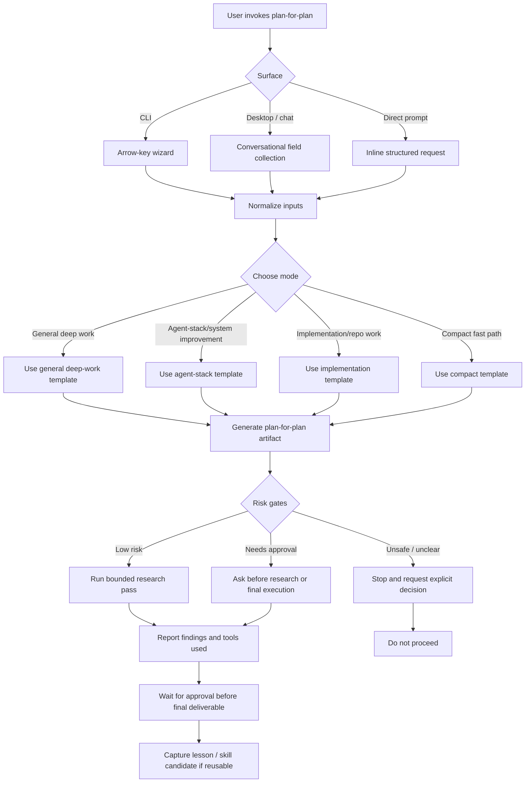

# Profile decision timeline v2 integration plan

## 1. Objective

Define a safe, implementation-ready approach for replacing the marked Decision Log content on the public recursive-workflow page with the structure from `profile-decision-timeline-preview-v2.html`.

The plan must identify the affected source files, data contracts, tests, dependencies, and links. It must preserve the public site's evidence boundary and existing recruiter flow.

## 2. Final artifact target

The eventual implementation will update the public-site checkout:

```text
<public-proof checkout>
```

The primary target is:

```text
site/proof/recursive-workflow/index.html
```

Supporting changes may be needed in:

```text
site/assets/css/site.css
site/assets/js/site.js
DESIGN.md
tests/e2e/recursive-workflow.spec.js
tests/e2e/accessibility.spec.js
```

This planning artifact is stored in the private source-of-truth repository. No public-site implementation, commit, push, or deployment is part of this phase.

## 3. Inputs to examine

1. `docs/prototypes/profile-decision-timeline-preview-v2.html` in the public-proof checkout
2. `site/proof/recursive-workflow/index.html` in the public-proof checkout
3. `site/assets/css/site.css` in the public-proof checkout
4. `site/assets/js/site.js` in the public-proof checkout
5. `tests/e2e/recursive-workflow.spec.js` in the public-proof checkout
6. `tests/e2e/accessibility.spec.js` in the public-proof checkout
7. `tests/contracts/decision-log.test.mjs` in the public-proof checkout
8. `scripts/check-public-release.mjs` in the public-proof checkout
9. `release/allowlist.json` in the public-proof checkout
10. `site/evidence/decision-log.json` in the public-proof checkout
11. `site/evidence/decision-log-tags.json` in the public-proof checkout
12. `DESIGN.md` in the public-proof checkout
13. Existing private decision-log and repository-interview plans in `docs/plans/` and `tasks/`.

## 4. Context assumptions

- The marked replacement is the content inside the existing `#decision-log` section, not the full page shell.
- The existing page header, recursive-workflow sections, contact section, footer, canonical metadata, and shared stylesheet remain in place.
- `#decision-log` remains the stable public anchor because the header, homepage, sitemap, recruiter guide, and browser links use it.
- `site/evidence/decision-log.json` is the current data source of truth. It contains 17 records, while the v2 prototype contains 12 hardcoded records.
- The prototype is a visual and structural reference. Its hardcoded copy must not replace the current evidence data without reconciliation.
- The public site already uses static HTML for the decision entries. The replacement must keep entries available in the raw page and must not introduce client-side fetching.
- `ai-native-proof-of-work-public-edit` is the clean implementation staging checkout. The sibling `ai-native-proof-of-work-public` checkout has unrelated dirty changes and is not the default edit target.
- The local `file:///` path is development-only. It must never appear in public HTML, links, metadata, release files, or recruiter-facing documentation.

## 5. Key questions to answer

1. Which visual structures from v2 should map into the existing `#decision-log` section?
2. Which current controls must remain for project filtering, capability filtering, auto-scroll, pause status, and evidence links?
3. How will all 17 current records remain visible and newest-first?
4. Which v2 project-card links resolve to public evidence, and which need a public-site or canonical repository target?
5. Does the v2 typography and token model fit `DESIGN.md`, or should the implementation map it to existing site tokens?
6. Can the existing JavaScript support the new markup without new runtime dependencies?
7. Which tests need assertion updates, and which contract/release tests should remain unchanged?
8. Does any text in the prototype create a privacy, maturity, or unsupported-outcome risk?

## 6. Extraction method

1. Compare the v2 DOM hierarchy with the existing `#decision-log` section.
2. Inventory every v2 `id`, `href`, script, stylesheet, fetch call, external asset, record count, project card, and capability tag.
3. Compare the v2 records with `site/evidence/decision-log.json`; retain the public JSON records and current status labels as the evidence contract.
4. Map v2 visual concepts to existing classes, root tokens, responsive rules, print rules, and accessibility conventions in `site/assets/css/site.css` and `DESIGN.md`.
5. Trace all incoming links to `#decision-log` and all outgoing links from the current section.
6. Read the current E2E and contract assertions before changing markup.
7. Check the public release allowlist and internal-link validator for any new file or path requirement.

## 7. Synthesis method

Use the v2 information hierarchy inside the existing page section:

1. Keep the current Decision Log heading and structured evidence links.
2. Adapt the v2 introduction, summary facts, project lenses, capability vocabulary, filters, timeline, and legend.
3. Keep `Ask the Repository` linked to `../../#repository-interview`.
4. Keep `decision-log.json` and capability-taxonomy links linked to the current relative public paths.
5. Keep the 17 current records and their evidence labels. Add the newer records if the prototype is older than the public data.
6. Preserve the existing accessible filter contract, including `aria-pressed`, screen-reader labels, and hidden-state behavior.
7. Reuse shared site CSS and tokens. Add only narrowly scoped component rules when an existing selector cannot express the v2 layout.
8. Keep the existing auto-scroll and pause behavior unless a deliberate design decision removes it. If it changes, update the tests and accessibility text together.
9. Keep project cards as links only when their targets are verified. Prefer public proof routes or verified canonical repository paths over links to local or private-only files.
10. Do not copy the prototype's full masthead, hero, contact block, inline stylesheet, or inline script into the live page.

## 8. Decision criteria

- Visual fidelity: the live section reflects v2's editorial timeline hierarchy and project-first framing.
- Evidence fidelity: current public JSON data remains authoritative, with no invented or stale record count.
- Link integrity: every internal link resolves under the project subpath, and every external project link has a verified public target.
- Accessibility: headings, controls, labels, focus states, keyboard use, reduced motion, and screen-reader order remain correct.
- Compatibility: the page works with JavaScript disabled; JavaScript enhances filtering and scrolling only.
- Design consistency: the implementation follows `DESIGN.md` tokens and component rules.
- Dependency discipline: no new package, CDN, font download, API, or build step is required.
- Scope discipline: only the decision-log surface and directly required tests/styles/docs change.
- Reversibility: the implementation is a bounded HTML/CSS/JS change that can be reverted without data migration.

## 9. Proposed final output structure

```text
Existing recursive-workflow page
  Existing header and proof sections
  Decision Log section (#decision-log)
    Section heading and structured evidence links
    Decision Log introduction
      Continuous decision-log explanation
      Ask the Repository action
    Summary facts
      Decision-record count
      Project-lens count
      Capability-signal count
    Project lenses
      Personal AI Harness
      Job-agent
      PKM
      Household budget
    Capability tag reference
    Project and capability filters
    Accessible, newest-first timeline with all public records
    Boundary and legend
  Existing contact and footer
```

## 10. Acceptance criteria

- [ ] The marked content is replaced inside the existing `#decision-log` section without duplicating the page shell.
- [ ] The live page keeps `id="decision-log"`, `id="decision-log-title"`, and `id="decision-timeline"` unless tests and incoming links are deliberately migrated.
- [ ] All 17 current public decision records remain present, newest-first, and evidence-labelled.
- [ ] Project filters and capability filters work for the current data.
- [ ] Auto-scroll pauses on hover or interaction, or the removal is explicitly approved and tested.
- [ ] The section retains working links to `decision-log.json`, `decision-log-tags.json`, and `#repository-interview`.
- [ ] All project-lens links resolve to verified public evidence targets, or the card is rendered as non-link content when no safe target exists.
- [ ] No `file:///` path, local path, raw session content, secret, private-only link, or unsupported outcome enters the public release.
- [ ] No new runtime or package dependency is added.
- [ ] The page passes responsive, print, reduced-motion, keyboard, and accessibility checks.
- [ ] `npm test` passes in `ai-native-proof-of-work-public-edit`.
- [ ] `npm run release:validate` passes in `ai-native-proof-of-work-public-edit`.
- [ ] A browser review confirms visual parity with v2 at desktop and narrow widths.
- [ ] The final diff excludes unrelated changes from `ai-native-proof-of-work-public`.

## 11. Risk gates

- Credentials, auth, billing, and permissions: not required for implementation or validation. Do not add them.
- External dependencies: the prototype has no external CSS, JavaScript, font, image, or API dependency. Stop if implementation proposes one.
- Privacy: review every project link and every copied sentence before public release. Stop on local paths, private source links, or unsupported claims.
- Public deployment: implementation and local validation are reversible. Commit, push, and Pages publication require a separate release decision after tests pass.
- Destructive actions: do not reset, clean, stash, or overwrite unrelated work in the dirty public checkout.
- Data changes: do not alter `site/evidence/decision-log.json` or its taxonomy unless a separate evidence update is requested.
- Cross-repository authority: the private repository remains the documentation source of truth. The public-site checkout owns the rendered presentation.

## 12. Failure modes

- Copying the complete prototype creates a second header, footer, contact block, or competing profile surface.
- Copying the prototype's 12 records hides five current public records or makes the count inaccurate.
- Reusing the prototype's visual tokens directly creates a second design system and breaks site consistency.
- Project cards point to paths that exist only in the private source checkout or in a non-published branch.
- Removing the current evidence links weakens the public evidence boundary and breaks existing tests.
- Changing class names or IDs breaks homepage deep links, filters, auto-scroll, or E2E selectors.
- Inline JavaScript or CSS creates maintenance drift from the shared site assets.
- A new font, CDN, or package adds a network or release dependency without clear value.
- A visual redesign accidentally changes the recursive-workflow page's supporting-proof position into a second lead case.
- A public push from the dirty `ai-native-proof-of-work-public` checkout includes unrelated files.

## 13. Stop rule

Stop before implementation if the intended public project links cannot be verified, if the current evidence data cannot fit the v2 structure without unsupported copy, or if the change requires a new dependency, API, credential, or deployment action. Stop publication if any privacy, accessibility, contract, or release check fails.

## 14. Next action

After approval, implement the bounded section replacement in `ai-native-proof-of-work-public-edit`, starting with an HTML-to-existing-CSS mapping and a link matrix before editing.

## 15. Research pass log

| Source / tool | Finding |
|---|---|
| PowerShell and `git status` | The private documentation repo has unrelated existing edits. The plan is added as a separate new artifact. |
| `profile-decision-timeline-preview-v2.html` | The prototype is 135 lines, self-contained, uses inline CSS and inline JavaScript, contains 12 hardcoded entries, four project cards, and no fetch/CDN/runtime dependency. |
| Prototype link inventory | It uses fragment links plus four GitHub paths for project evidence. Those targets must be verified against the public repository before reuse. |
| Public recursive-workflow page | The implementation target already contains a `#decision-log` section, 17 static entries, project/tag filters, auto-scroll, pause status, structured evidence links, and an `Ask the Repository` link. |
| Public evidence JSON | `site/evidence/decision-log.json` contains 17 records. `site/evidence/decision-log-tags.json` contains 49 taxonomy records. |
| Public `site.js` and E2E tests | Existing JavaScript owns filter and auto-scroll behavior. Tests assert IDs, counts, filter results, pause behavior, and evidence-link paths. |
| Public `site.css` and `DESIGN.md` | The site already defines decision-log, stacked-list, pill, responsive, print, and reduced-motion patterns. The v2 inline token system should be mapped to these shared rules. |
| Public release validator and allowlist | No new file is needed for the section replacement. Relative internal links must remain inside `site/`; public release privacy and maturity scans remain active. |
| Public checkout comparison | `ai-native-proof-of-work-public-edit` is clean on `codex/repository-interview-copy`. `ai-native-proof-of-work-public` contains unrelated dirty work and should not be used for this implementation. |
| Existing repository-interview task and prior plans | Public copy must use `Decision Log` and `Ask the Repository`, and must not recreate the superseded `Profile Oracle` surface. |

### Required workflow


