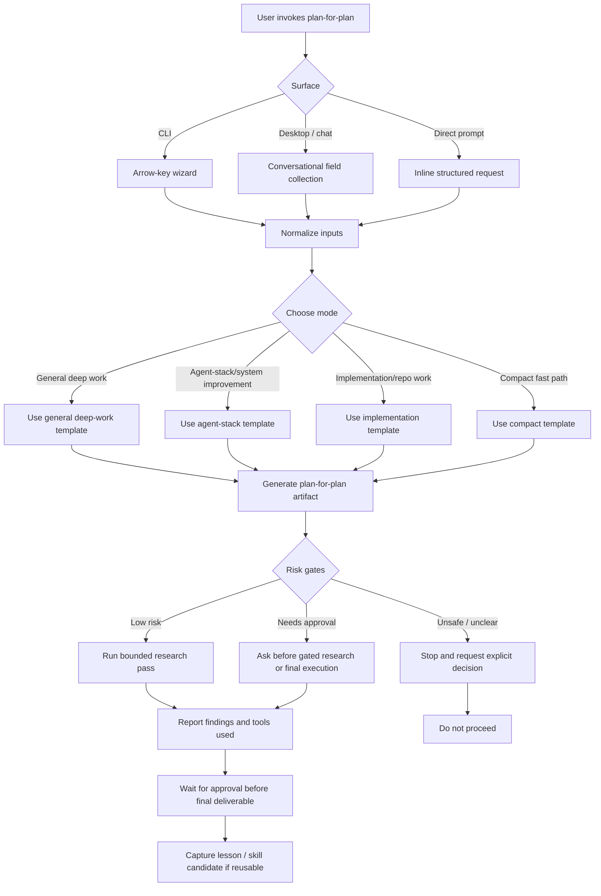

# Plan for the Plan: Clean Git State and Recurrence Prevention

Mode: Agent-stack / system improvement

## 1. Objective

Restore a clean, coherent Git state without discarding valid documentation work, then add the smallest repo-local safeguard that makes mixed staged, unstaged, and untracked output visible and actionable at the end of future compiler runs.

## 2. Final artifact target

A reviewed commit containing the intended documentation update, a repo-local Git-state check integrated into the weekly compiler workflow, and concise operating guidance that defines the clean-state handoff contract.

## 3. Inputs to examine

- Current staged, unstaged, and untracked changes: determine ownership, coherence, and whether anything sensitive or accidental is present.
- `AUTOMATION_PROMPT.md` and `prompts/WEEKLY_PROOF_OF_WORK_COMPILER.md`: identify the existing completion and Git-handling contract.
- `template/WEEKLY_AUTOMATION_RUNBOOK.md`: keep reusable guidance aligned with the live workflow.
- `.gitignore`, Git configuration, and repository scripts: determine whether line-ending noise or missing checks contributed.
- Recent Git history and weekly logs: establish whether the pending work is a coherent compiler run.
- `AGENTS.md` and `tasks/lessons.md`: preserve repository rules and prior lessons.

## 4. Context assumptions

- This is a repo-local workflow improvement on Windows using PowerShell and Git.
- The current documentation edits belong to the user unless inspection proves otherwise.
- A normal commit is a two-way door because its parent commit remains available for rollback.
- No push, deployment, credential change, or external account action is authorized or required.
- The prevention mechanism should be usable by both Claude and Codex and should not depend on a runtime-specific hook.

## 5. Key questions to answer

1. Do the pending files form one coherent and evidence-grounded documentation update?
2. Is the staged rename intentional, and should the two new README files be included?
3. Are there secrets, private local paths, malformed Markdown, whitespace errors, or unintended line-ending-only changes?
4. What allowed the workflow to end with a mixed Git state?
5. What is the smallest check and instruction change that prevents a future run from silently finishing dirty?

## 6. Extraction method

Inspect file-level and content-level diffs, compare dates and claims against repository logs, search changed content for sensitive patterns and private paths, validate Markdown and links with repo-native tooling where available, and inspect automation instructions for missing end-of-run checks. Separate substantive documentation updates from formatting-only noise.

## 7. Synthesis method

Keep valid pending work as one coherent documentation commit. Add one narrow PowerShell check that reports staged, unstaged, and untracked files and fails when the tree is not clean. Reference it from the live and reusable weekly workflow instructions, with explicit guidance that an automation must either commit its intended output or report the dirty state as incomplete.

## 8. Decision criteria

- Include changes that are coherent, evidence-labelled, privacy-safe, and linked to the documented weekly update.
- Correct changes that contain broken references, inconsistent dates, mixed staging, or unsupported claims.
- Reject or leave out generated noise, secrets, private paths in recruiter-facing files, and unrelated edits.
- Add a check only if it is deterministic, fast, dependency-free, and useful outside one runtime.
- Avoid hooks or automatic commits that could capture unrelated concurrent user work.

## 9. Proposed final output structure

- `plans/clean-git-state/plan-for-plan.md`: this planning and research artifact.
- `scripts/Test-CleanGitState.ps1`: deterministic repo-state guard.
- `AUTOMATION_PROMPT.md`: live completion contract.
- `prompts/WEEKLY_PROOF_OF_WORK_COMPILER.md`: compiler completion contract.
- `template/WEEKLY_AUTOMATION_RUNBOOK.md`: reusable handoff guidance.
- One reviewed Git commit containing the coherent pending work and prevention changes.

## 10. Acceptance criteria

1. `git status --short --branch` is clean after the final commit.
2. The intended rename and new documentation index files are committed coherently.
3. Changed content passes whitespace, privacy, and available Markdown/link checks.
4. The guard exits successfully on a clean tree and demonstrably fails on a dirty tree without changing files.
5. Weekly workflow instructions require a final Git-state check and forbid silently reporting completion with pending changes.
6. No push or irreversible action occurs.

## 11. Risk gates

- Credentials/secrets: inspect only; stop if exposed material is found.
- Privacy-sensitive data: inspect recruiter-facing diffs for local paths and personal data; correct before commit.
- Destructive actions: none planned. Do not reset, discard, or overwrite existing work.
- External dependencies, auth, billing, infra, deploy, sandbox bypass, and long-running automation: not involved.
- Commit: reversible two-way door; rollback is available from the parent commit SHA recorded before committing.

## 12. Failure modes

- Committing unrelated or unreviewed user work.
- Adding an auto-commit mechanism that captures concurrent changes.
- Treating CRLF warnings as content corruption.
- Creating a guard that always sees its own temporary test artifact.
- Adding redundant instructions across too many files.
- Claiming a clean state before committing the plan and safeguard themselves.

## 13. Stop rule

Stop research when the pending diff has been classified, sensitive-content and consistency checks have completed, the workflow gap is located, and the exact guard and instruction edits are known. Because the user explicitly authorized implementation, proceed directly from that bounded research result to the final deliverable unless a risk gate is triggered.

## 14. Next action

Ready to run bounded research.

## 15. Research pass log

- Tools and source types used: PowerShell, `rg`, Git status/diff/history/configuration, repository instructions, weekly logs, source-repo Git inspection, prior lessons, and the `plan-for-plan` skill template.
- Sources inspected: the complete pending file set, automation prompts and runbook, recent proof-of-work history, `AGENTS.md`, `tasks/lessons.md`, recruiter-facing evidence surfaces, and the committed state of the lead source repository.
- Key finding: the branch matched `origin/main` before cleanup. The dirty state was accumulated output from multiple weekly runs: one staged report rename, unstaged documentation updates, and two untracked documentation index files.
- Key finding: the weekly logs explicitly show that later runs found pre-existing unrelated changes, declined to commit or push, and then still added another documentation sync. The missing control was a clean-state preflight that stops before editing.
- Key finding: the pending documentation batch is coherent, evidence-labelled, and contains no detected secrets or private local paths in recruiter-facing files. The report rename and new `docs/` indexes are intentional.
- Key finding: system Git uses `core.autocrlf=true`; the LF-to-CRLF messages are conversion warnings, not evidence of corrupt or content-only changes, so no repository-wide line-ending rewrite is warranted.
- Decision: implement a deterministic PowerShell guard plus a start/finish contract in the live prompt, compiler prompt, and reusable runbook. Do not add an auto-commit hook.
- Unresolved questions: none that block implementation. The 2026-08-09 lead-project snapshot is intentionally dated and remains valid historical evidence even though the source repository has moved again since that run.
- Blockers or approval gates: none.

## Workflow Diagram

