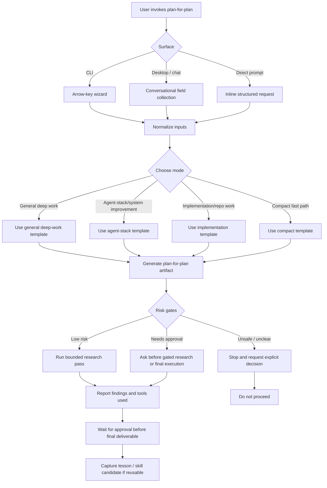

# Plan for the Plan: Full-repository recruiter review

Mode: Implementation / repo work

## 1. Objective

Make the recruiter review search the complete public repository safely. Keep role-specific needs dynamic. Keep the Experience Fit Map evidence-based and score-free.

## 2. Final artifact target

A tested repository feature. It includes a generated public evidence index, safe Worker retrieval, dynamic citations, and the existing GitHub Pages review UI.

## 3. Inputs to examine

- `workers/recruiter-review/src/`: Worker request flow, prompt contract, validation, and evidence model.
- `workers/recruiter-review/wrangler.jsonc`: deployed bindings and configuration limits.
- `site/evidence/`: current public evidence catalogue and generated-asset conventions.
- `scripts/check-public-release.mjs` and release files: public-file and privacy boundary.
- `tests/` and Worker tests: current contract coverage.
- Official GitHub and Cloudflare documentation: public fetch and Worker cache behavior.

## 4. Context assumptions

- The canonical repository is public and safe to index.
- The Groq key stays only in the Cloudflare Worker secret store.
- The Worker must never accept a user-supplied repository URL or execute repository text.
- GitHub Pages remains a static UI. It calls only the Worker.
- The existing seven-dimension map stays comparable across roles. Role needs vary by pasted description.

## 5. Key questions to answer

- How can the Worker retrieve complete public evidence without exposing credentials?
- How can the repository index stay current and remain release-safe?
- How do dynamic evidence IDs pass strict server-side validation?
- How do we bound download size, prompt size, latency, and external API use?
- Which tests prove both full-repository retrieval and existing safety controls?

## 6. Extraction method

Inspect the current Worker boundaries, release allowlist, test fixtures, and public evidence assets. Compare them with official GitHub raw-content and Cloudflare cache documentation. Identify the smallest compatible extension point.

## 7. Synthesis method

Generate a deterministic index from allowlisted public text files. Retrieve that fixed index from a fixed canonical URL. Rank chunks server-side with the submitted text. Send only bounded, cited chunks to Groq. Preserve current validation, rate limits, timeout, CORS, and score prohibition.

## 8. Decision criteria

- Use generated static JSON before adding a database, vector store, or new dependency.
- Use a fixed canonical public source. Do not accept dynamic source locations.
- Retain evidence citations and server-side allowlisting.
- Reject source files that fail public-release validation.
- Defer semantic/vector search until lexical retrieval proves insufficient.

## 9. Proposed final output structure

1. Index generator and release check.
2. Worker retrieval and cache adapter.
3. Dynamic evidence validation and prompt contract.
4. UI rendering and accessible source links.
5. Unit, release, browser, and live smoke tests.
6. Deployment and rollback record.

## 10. Acceptance criteria

- A job description produces role-specific needs and citations from beyond the former small catalogue.
- A focused question can cite a public indexed file.
- The Worker uses no user-selected URL, no repository execution, and no client-side key.
- The page still renders a score-free map and source links.
- Index freshness is checked in CI or release validation.
- Existing tests and public-release validation pass.

## 11. Risk gates

- Credentials: no new credential. The existing Groq secret remains server-side.
- Infrastructure: Worker behavior and deploy change. The user has authorized implementation and deploy in this conversation.
- Privacy: generated index includes only already-public, release-allowlisted text.
- External dependency: GitHub raw content is an external public source. It must use a fixed URL and a bounded cache.
- Destructive actions: none planned.

## 12. Failure modes

- Index includes non-public or generated local files.
- Index becomes stale after a repository change.
- Retrieval lets the pasted input control a URL or source path.
- Prompt context exceeds provider limits or increases latency.
- Dynamic citations bypass validation.
- UI implies a candidate score.

## 13. Stop rule

Stop only after implementation, repository tests, public-release validation, Worker smoke test, and GitHub Pages deployment verification complete. Report any unverified external state.

## 14. Next action

Execute the bounded architecture research, then implement the smallest safe index-and-retrieval path.

## 15. Research pass log

### Sources and tools used

- PowerShell and `rg`: inspected the Worker, site rendering, release validator, allowlist, test suite, and GitHub Actions workflows.
- [GitHub Git trees REST API](https://docs.github.com/en/rest/git/trees): confirmed recursive public repository tree access and response limits.
- [Cloudflare Workers Cache API](https://developers.cloudflare.com/workers/runtime-apis/cache/): confirmed that Worker cache entries are local to the originating data center.

### Key findings

- The current Worker validates citations against eight bundled catalogue records. This is the only source-size boundary that prevents complete public repository retrieval.
- The browser receives only known catalogue metadata. Dynamic citations need a small, response-scoped source list.
- The public release allowlist is the correct index input boundary. It already excludes local files, credentials, and unreviewed binaries.
- The repository contains 115 public text files and about 669,000 text characters. A deterministic chunk index is practical, but the Worker must send only ranked excerpts to Groq.
- GitHub Pages deploys only after Quality succeeds. The Worker deploy remains explicit and independent.

### Decision

Use a generated `site/evidence/repository-evidence-index.json` as the complete public search corpus. The Worker fetches a fixed raw GitHub URL, caches it briefly, ranks bounded excerpts server-side, and returns only metadata for cited records. This avoids a database, a user-controlled URL, and a new secret.

### Unresolved questions

None that block implementation. Semantic or vector retrieval remains deferred until lexical retrieval produces a measured quality issue.

## Workflow Diagram

