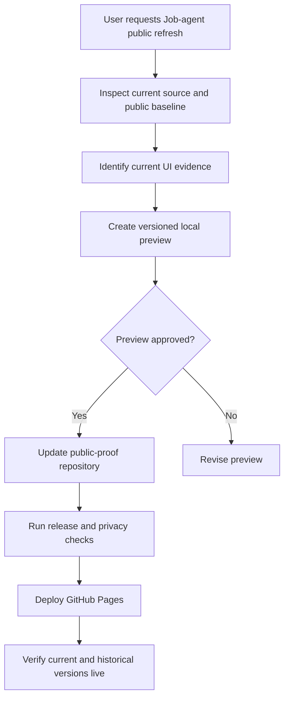

# Plan for the Plan: Job-agent public proof refresh

## 1. Objective

Prepare a recruiter-safe refresh that presents the current Job-agent UI as a later design version while preserving the existing public proof and the earlier historical version.

## 2. Final artifact target

The eventual deliverable is a coordinated update to the public-proof repository, its GitHub Pages Job-agent case study, and its versioned static evidence assets. This phase also needs a local clickable layout preview.

## 3. Inputs to examine

- The private Job-agent source repository — current source UI, branch state, committed product changes, and current design language.
- `site/proof/job-agent/index.html` in the public-proof repository — current public page structure and evidence boundary.
- `site/assets/images/job-agent/` — published current and historical assets.
- `docs/prototypes/job-agent-snapshot-refresh-proposal.html` — existing preview and prior layout decisions.
- `PROJECT_STATUS.md`, `PROJECT_TIMELINE.md`, `SOURCE_MAP.md`, and Job-agent case-study docs — recruiter-safe claims and source boundaries.
- Public URL `https://marcus-uden-dev.github.io/ai-native-proof-of-work/proof/job-agent/` — deployed baseline.

## 4. Context assumptions

- The public-proof repository is separate from the private Job-agent source repository.
- The current public page is `0.8-public-proof`; the refresh should use `0.9-public-proof` as the next public-evidence version unless source review rejects that label.
- Version labels describe meaningful public-proof/UI snapshots. Screenshot dates and source commit references provide traceability.
- The earlier `v0.5` UI and the existing `v0.8-public-proof` page/assets remain visible or directly reachable.
- The preview is local and read-only. It does not publish, merge, or change production services.
- Current source branch work must not be presented as market validation or a production deployment.

## 5. Key questions to answer

1. Which committed current-source screens best represent the new UI?
2. How should `v0.5`, `0.8-public-proof`, and `0.9-public-proof` appear in one clear timeline?
3. Which files must be copied or renamed so the previous public evidence cannot be overwritten?
4. How can the page show current proof first, historical proof second, and evidence limits at every version boundary?
5. Which tests and release checks prove that both versions, all images, and the prototype link remain valid?

## 6. Extraction method

- Inspect the current source branch and its committed UI routes/components.
- Compare the deployed page with the public repository's clean `main` baseline.
- Identify the existing current and historical image assets without treating private local paths as public evidence.
- Extract the existing prototype's versioning, timeline, and Option B decisions.
- Record only verified source, commit, capture-date, and synthetic-data claims.

## 7. Synthesis method

Use one public page with a visible three-step timeline:

```text
v0.5 historical UI → 0.8-public-proof previous public edition → 0.9-public-proof current UI
```

Lead with the current `0.9` proof sequence. Keep `0.8` as an archived previous edition and keep `v0.5` as the original baseline. Namespace new assets by public version or capture date. Preserve the existing evidence-boundary language and link each version to its source/capture note.

## 8. Decision criteria

- Use the actual current source UI and committed evidence first.
- Never overwrite the `0.8-public-proof` assets or remove the `v0.5` history.
- Keep the strongest current frame first, following the selected Option B job-detail-led composition.
- Keep synthetic data, public-source, inferred-demo, and work-in-progress labels explicit.
- Make the smallest public-repo change that preserves traceability and passes existing release gates.
- Defer any source-repo code change, product release, or production deployment.

## 9. Proposed final output structure

1. Current `0.9-public-proof` hero and evidence boundary.
2. Version timeline with links or anchors for `v0.5`, `0.8`, and `0.9`.
3. Current UI proof sequence: Job detail lead, Today, and Find jobs support.
4. Previous `0.8-public-proof` edition, clearly marked as archived.
5. Original `v0.5` historical sequence, clearly marked as an earlier UI.
6. Versioning and evidence notes.
7. Recruiter-safe limitations and source/capture metadata.

## 10. Acceptance criteria

- The local preview shows the new layout and the complete version timeline.
- `0.9-public-proof` is visibly later than `0.8-public-proof`.
- The `0.8` edition and `v0.5` history remain inspectable.
- New assets use a non-colliding path or filename convention.
- The page keeps the recruiter-safe evidence boundary and synthetic-data labels.
- The public-repo test suite, release validation, image checks, and link checks pass after implementation.
- No private source paths, credentials, raw user data, or unverified market claims enter the public repository.

## 11. Risk gates

- **Low risk now:** read-only source inspection and a local static preview.
- **Needs later verification:** public-repo changes, release allowlist updates, and GitHub Pages deployment.
- **Do not perform in this phase:** force pushes, destructive asset replacement, production activation, or changes to the private Job-agent source.

## 12. Failure modes

- Planning from the stale local public worktree instead of clean public `main`.
- Overwriting the previous `0.8` screenshots while adding the new version.
- Treating the current source branch as a released product without CI or merge evidence.
- Showing a visual refresh without a version label or capture date.
- Linking the preview through a Windows `file:///` URL that the Codex browser cannot access.
- Repeating the old public page text while the UI evidence has moved on.

## 13. Stop rule

Stop this phase after the plan, bounded research, and local preview are complete. Do not update the public repository or deploy GitHub Pages until the preview is approved.

## 14. Next action

Ready to produce the local preview after the bounded research pass.

## 15. Research pass log

### Tools and source types used

- PowerShell repository reads and `rg` searches.
- Git status and recent-commit inspection.
- Local image inspection of current and historical Job-agent screenshots.
- HTTP status and content check for the deployed GitHub Pages URL.

### Sources inspected

- Current private Job-agent source repository.
- Public-proof working repository and existing prototype in this workspace.
- Public deployed Job-agent page.
- Portfolio source-map, status, timeline, and case-study documents.

### Key findings

- The current source repository is on `codex/final-verification-and-cleanup` at `061d0e2` and contains the current Today, Find jobs, and job-detail UI routes.
- The deployed page returns HTTP 200 and currently identifies itself as `0.8-public-proof`.
- The deployed page already contains current proof frames, historical UI content, and the prototype link.
- The existing local proposal already uses the Option B job-detail-led composition and labels the historical UI as `v0.5`.
- The current source repo's status document says its branch has no pull request. The later public update must therefore keep source-branch status explicit until release evidence is verified.
- The local primary worktree contains unrelated user changes. Those changes must remain untouched.

### Unresolved questions

- Whether the new public version should be `0.9-public-proof` or another label after final source-branch review.
- Which new screenshots can be captured from the current committed source branch without exposing private or live user data.

### Blockers or approval gates

- No blocker for a local preview.
- Public repository edits and GitHub Pages deployment are deferred until the preview is approved.

## Workflow diagram


