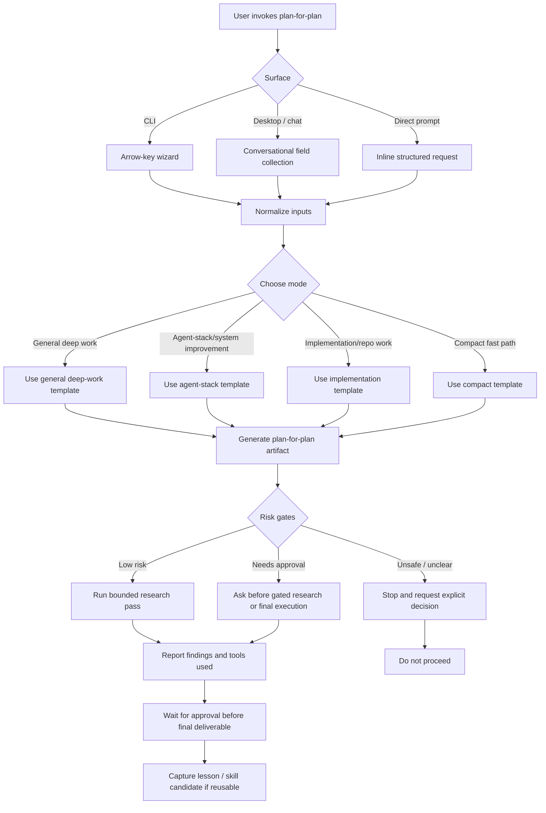

# Plan for the Plan: Recruiter review reliability and follow-up

Mode: Implementation / repo work

## 1. Objective

Deliver four connected improvements to the public recruiter review:

1. Make Groq quota, timeout, validation, and provider failures clear and recoverable.
2. Add two or three saved smoke tests from distinct role families.
3. Log consented recruiter enquiries and send a notification to `marcus.uden.dev@gmail.com`.
4. Remove the merged feature branch after all changes are deployed.

## 2. Final artifact target

An implemented and deployed repository change. It includes Worker code, static-site UI, saved smoke artifacts, tests, setup documentation, and a merged GitHub Pages release.

## 3. Inputs to examine

| Input | Reason |
|---|---|
| `workers/recruiter-review/` | Current API, provider, validation, configuration, and tests. |
| `site/assets/js/site.js` and `site/assets/css/site.css` | Current recruiter-review interaction and messages. |
| `site/evidence/smoke-tests/` | Existing saved role-review artifact format. |
| `scripts/provision-recruiter-review-api.mjs` | Current Worker provisioning and secret setup. |
| `wrangler.jsonc` and Worker README | Cloudflare bindings and deployment constraints. |
| Site privacy and release documents | Consent, public-data, and release-boundary requirements. |
| GitHub Actions and Pages configuration | Deployment and verification path. |

## 4. Context assumptions

- GitHub Pages is static and cannot keep a Groq key or store enquiries.
- The existing Cloudflare Worker is the trusted backend boundary.
- Stored enquiries must require explicit, informed consent.
- Email delivery must use a server-side credential, never browser JavaScript.
- The public role review remains evidence-based and must not become a candidate score.
- The user approved implementation and delivery to `marcus.uden.dev@gmail.com`.

## 5. Key questions to answer

1. Which provider failures can the Worker identify safely and map to a retryable user message?
2. Which Cloudflare storage and email services fit the existing Worker with minimal new dependencies?
3. What minimum enquiry data is useful, privacy-safe, and sufficient for proactive follow-up?
4. How does the page disclose consent without blocking role review?
5. Which role families give meaningful smoke-test coverage beyond customer-service platform work?
6. Which tests prove the UI, Worker, storage, notification, and deployment paths?
7. Can the merged branch be removed without affecting a worktree or recovery path?

## 6. Extraction method

Inspect the current Worker request path, static UI, saved-artifact format, deployment scripts, and privacy language. Record existing bindings and tests before selecting new Cloudflare services. Use official provider documentation only for current service constraints.

## 7. Synthesis method

Use the existing Worker as one API boundary. Add a small consented-enquiry endpoint or extend the existing endpoint only if it keeps rate limiting, CORS, validation, and logging coherent. Keep the email provider behind an adapter. Store only submitted text, timestamp, consent state, and a minimal request fingerprint if the privacy policy supports it. Add role smoke files that use public source listings and generated evidence only.

## 8. Decision criteria

1. Reuse existing Worker, schema, validation, and test patterns.
2. Keep the Groq key and email credential in Worker secrets.
3. Reject any design that logs without explicit consent.
4. Prefer Cloudflare-native storage when it does not add billing or complex operations.
5. Prefer an email adapter with documented free-tier support and a clear secret setup path.
6. Use saved smoke tests only when the role listing is public and the output passes validation.
7. Delete only the merged remote branch after recording its merge commit as recovery evidence.

## 9. Proposed final output structure

1. Reliability behavior and user messages.
2. Consent and enquiry form.
3. Worker storage and notification adapter.
4. Saved smoke-test artifacts and role coverage.
5. Tests and deployment evidence.
6. Setup instructions for required secrets and bindings.
7. Branch-cleanup evidence.

## 10. Acceptance criteria

1. The UI distinguishes rate limits, timeouts, validation failures, and temporary provider errors.
2. A recruiter can opt in, submit an enquiry, and see a clear confirmation.
3. The Worker validates consent, stores only documented fields, and sends a notification to the configured recipient without exposing a credential.
4. At least two new saved smoke tests represent role families different from the Spotify example.
5. Targeted Worker, contract, browser, and public-release checks pass.
6. The change is committed, merged, deployed, and verified on the live site.
7. The merged feature branch is removed only after deployment confirmation.

## 11. Risk gates

| Gate | Status | Handling |
|---|---|---|
| Groq and email credentials | High | Use Worker secrets only. Never print or commit values. |
| Cloudflare storage and email configuration | High | Inspect existing account configuration. Create bindings only under the user-approved scope. |
| Privacy-sensitive enquiry content | High | Require explicit consent and document retention and contact purpose. |
| External email notification | High | Send only to the user-specified address from the Worker. Test with a controlled request. |
| Production deployment | High | Use the existing PR, Quality, and Pages workflow. |
| Branch deletion | Two-way door | Delete only after the squash merge and capture the merge commit. |

## 12. Failure modes

1. Logging role text without valid consent.
2. Leaking Groq or email credentials to the browser or repository.
3. Treating provider outages as a completed assessment.
4. Creating saved artifacts from non-public or stale role sources.
5. Adding a storage system that is not deployed with the Worker.
6. Sending duplicate notification emails during retries.
7. Deleting a branch that still has unique commits or an active worktree.

## 13. Stop rule

Stop only when all four requested outcomes are implemented, verified, deployed, and documented, or when an external credential or account state blocks the next safe action.

## 14. Next action

Ready to run bounded research and then produce the final implementation under the user-approved scope.

## 15. Research pass log

Verified on 2026-09-09:

1. The deployed Worker already enforces CORS, rate limiting, server-only Groq access, and public-evidence validation. It mapped all provider failures to one generic 503 response.
2. The static panel has an existing stable review input and a saved-smoke JSON format. The new work can preserve both interfaces.
3. Cloudflare D1 is available in the active account. A dedicated `recruiter-review-enquiries` database now holds opted-in follow-up data only; no IP address is stored.
4. Cloudflare Email Service supports a Worker `send_email` binding with a fixed destination address. It requires an onboarded sender domain and a verified `FOLLOW_UP_FROM` address. The current account has no such secret, so logging can deploy now while delivery remains an explicit provider-side setup step.
5. Public current role listings suitable for distinct smoke coverage are available from PeopleGrove (Product Operations Manager) and Saviynt (Staff Product Operations Manager, AI-native workflows).
6. The old `codex/label-experience-fit-map` branch is squash-merged through pull request #37. Its cleanup remains deferred until this new branch is merged and deployed.

## Workflow Diagram

