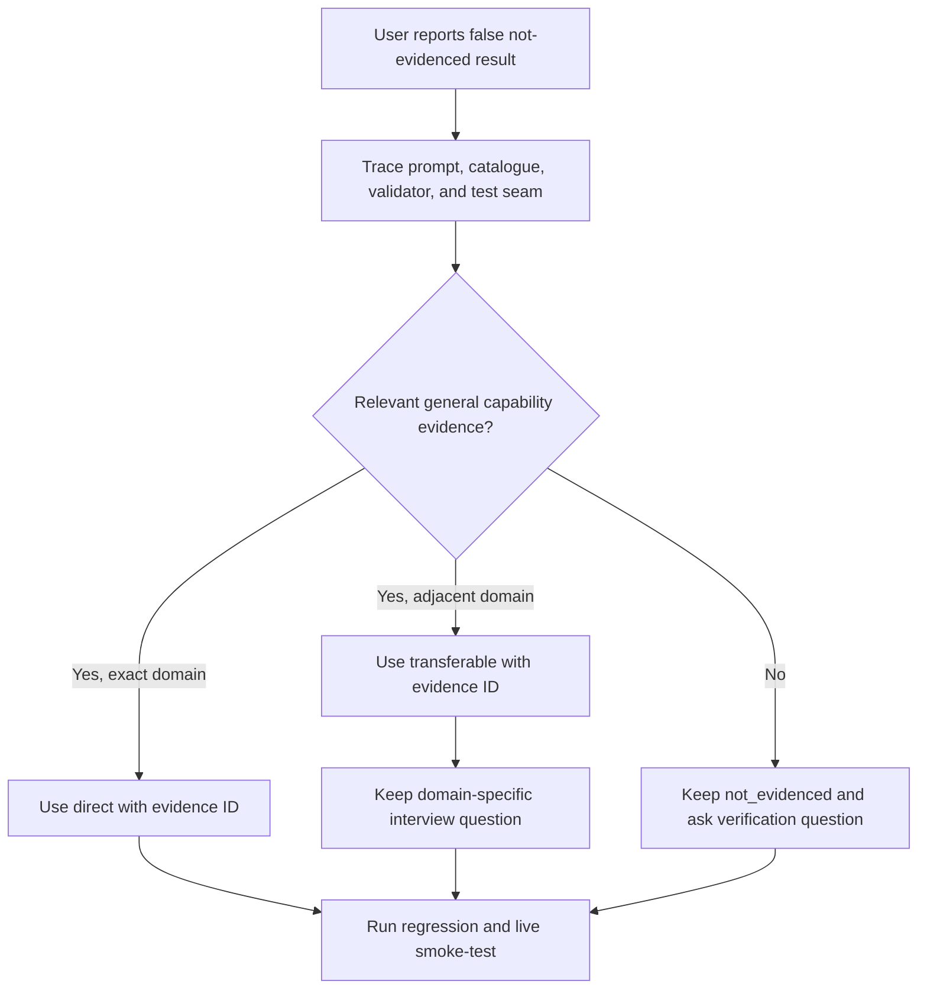

# Workflow Evidence Classification — Implementation Plan

## 1. Objective

Ensure the recruiter review does not classify a documented general capability as `not_evidenced` only because the job ad belongs to a different domain. For the SEB insurance smoke-test case, workflow evidence should be represented as transferable evidence, while insurance-specific depth remains an interview question.

## 2. Final artifact target

A repo-local bug-fix implementation: prompt guidance plus regression coverage for semantic role-dimension classification.

## 3. Inputs to examine

- `workers/recruiter-review/src/prompt.js` — role-assessment instructions.
- `workers/recruiter-review/src/validation.js` — accepted states and evidence validation.
- `workers/recruiter-review/src/repository-index.js` — dynamic evidence selection.
- `site/evidence/experience-fit-catalog.json` — curated workflow and customer-journey evidence.
- `workers/recruiter-review/test/recruiter-review.test.mjs` — existing worker contract tests.
- The live SEB smoke-test response — reproduction evidence for the incorrect `not_evidenced` result.

## 4. Context assumptions

- The public repository and deployed Worker are the systems in scope.
- The existing four-state model remains unchanged.
- Generic workflow evidence may be `direct` for the stable workflow dimension, or `transferable` when the role requires an unproven domain variant.
- The safe evidence boundary and fixed public index remain unchanged.

## 5. Key questions to answer

- How should the prompt distinguish capability evidence from domain-specific experience?
- Which existing test seam can prove the corrected classification contract?
- Can the change avoid weakening evidence validation or introducing scores?
- What live smoke-test input should verify the original SEB scenario?

## 6. Extraction method

Trace the role request from `composeSystemInstructions` through the provider schema and `validateReview`. Inspect the curated catalogue and existing mock-provider tests. Use the original live response as the failing behavioral example. Ignore unrelated UI, deployment, and authentication code.

## 7. Synthesis method

Make one prompt-level semantic correction, add one focused regression assertion using the existing mock-provider seam, run the worker tests and relevant repository checks, then rerun one live role smoke-test after deployment only if the fix is shipped. Keep the public evidence IDs and state names stable.

## 8. Decision criteria

- Prefer the existing prompt and test patterns.
- Do not add a new state, score, dependency, or data source.
- Use `transferable` when evidence supports the capability but not the role's exact domain.
- Keep `not_evidenced` only when no relevant evidence exists.
- Reject changes that make domain-specific claims from generic evidence.

## 9. Proposed final output structure

1. Root cause and changed files.
2. Prompt rule for capability-versus-domain separation.
3. Regression test and local verification.
4. Live smoke-test result and remaining limitation.

## 10. Acceptance criteria

- A role requiring insurance workflows cannot erase existing general workflow-design evidence.
- The expected result is `transferable` or `direct` with at least one known evidence ID.
- A domain-specific verification question remains when insurance experience is not evidenced.
- Existing security, validation, question mode, and non-role behavior remain unchanged.
- Relevant tests pass.

## 11. Risk gates

- Credentials/secrets: none.
- Auth, billing, permissions, destructive actions: none.
- Production-facing behavior: prompt output changes after deployment; validate before shipping.
- External dependency: Groq remains unchanged.
- Privacy: use only existing public evidence.

## 12. Failure modes

- Prompt remains too domain-specific and reproduces the false gap.
- Regression test only checks JSON shape, not semantic evidence mapping.
- A change accidentally permits unsupported direct claims.
- Live output differs because provider output is nondeterministic.
- Unrelated branch changes are included.

## 13. Stop rule

Stop after the focused fix, local verification, and live verification if deployment is explicitly requested. Do not change the evidence corpus or deployment configuration as part of this bug fix.

## 14. Next action

Local implementation and verification are complete. Next action: deploy the Worker and GitHub Pages change, then rerun the SEB role smoke-test against the live endpoint.

## 15. Research pass log

- Tools: PowerShell, `rg`, Node-based index inspection, live Worker smoke-test.
- Inspected: prompt, validation, repository index, curated catalogue, worker tests, current branch state.
- Finding: `cv-customer-journey` documents end-to-end customer journey and product/flow recommendations; the live model narrowed the dimension to insurance-specific workflows.
- Finding: validation accepts `not_evidenced` as long as other dimensions cite known evidence, so semantic over-narrowing passes.
- Unresolved: final live classification can vary with provider output; the regression must protect the instruction contract locally.
- Implementation: prompt guidance, dimension-specific evidence anchors, and regression tests were added; the focused Worker test and full `npm test` pass.
- Blockers: none for the local fix. Deployment remains a separate production operation.

## Workflow Diagram

