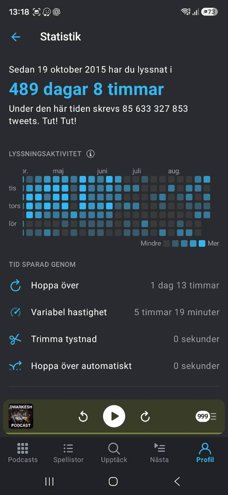

# Information Diet and Learning Signals

Last updated: 2026-08-27
Status: Recruiter-facing / Evidence-labeled

## Summary

This file summarizes private Pocket Casts exports into a recruiter-safe view of learning interests, professional taste, and external signal intake.

Source status: Verified subscription list from a Pocket Casts OPML backup dated 2026-03-19, plus a user-provided Pocket Casts stats screenshot dated 2026-08-28. The OPML export contains followed podcast feeds. The screenshot contains aggregate listening time, not episode-level history or category-level listening.

## Recruiter-Facing Formulation

Marcus has a long-running and documented information-intake habit through podcasts, averaging roughly three hours of listening per day over the measured period. The followed feeds span AI, technology, startups, business, science, decision-making, institutions, and policy. This is not evidence of expertise by itself, but it helps explain the breadth of input behind his product judgment and external-signal awareness.

## How To Read This

This is not a claim that every show is listened to regularly.

It is useful as a weak-to-medium signal of:

- sustained curiosity about AI, technology, startups, economics, institutions, science, and decision quality
- breadth across builder, business, research, policy, and cultural contexts
- source taste that can support product judgment and recruiter conversations

It is useful as a measured aggregate listening signal, but not yet as a category-level learning metric.

## Listening-Time Statistics

| Metric | Value | Evidence Status |
|---|---:|---|
| Total Pocket Casts listening time since 2015-10-19 | 489 days 8 hours | Verified user-provided screenshot dated 2026-08-28 |
| Total listening time in hours | 11,744 hours | Calculated from screenshot |
| Total listening time in minutes | 704,640 minutes | Calculated from screenshot |
| Listening time in years | 1.34 years | Calculated from screenshot |
| Average listening time per day from 2015-10-19 to 2026-08-28 | 2.96 hours/day | Calculated from screenshot date |
| Average listening time per day in minutes | 178 minutes/day | Calculated from screenshot date |
| Average listening time per week | 20.7 hours/week | Calculated from screenshot date |
| Share of elapsed calendar time spent listening | 12.3% | Calculated from screenshot date |
| Total time saved by Pocket Casts playback features | 1 day 18 hours | Verified screenshot |
| Time saved by skipping | 1 day 13 hours | Verified screenshot |
| Time saved by variable speed | 5 hours 19 minutes | Verified screenshot |

Interpretation: this is a long-running learning and information-intake habit. The stronger professional claim is not "podcasts as proof by themselves"; it is that product, AI, business, science, and policy inputs have been part of the same operating system that supports the project work documented elsewhere in this repository.

Quick conversions:

- 489 days 8 hours is roughly 70 weeks of continuous listening.
- 11,744 hours is roughly 5.6 full-time work years at 40 hours/week.
- The long-run average is about 3 hours per day, or 20.7 hours per week.
- Category-level time is still unavailable, so these totals should not be presented as "AI listening time" or "business listening time" without richer app statistics.

## Recruiter-Relevant Podcast Clusters

| Cluster | Representative followed podcasts | What It Signals | Evidence Status |
|---|---|---|---|
| AI and technical change | AI Breakdown; The Cognitive Revolution; Hard Fork; The TED AI Show; Latent Space AI; Practical AI; Anthropic; Dwarkesh Podcast; Lightcone Podcast; Future of Life Institute Podcast | Active attention to AI capability shifts, builder tooling, AI safety, and technical product context | Verified subscription / category-level time unavailable |
| Startups, VC, and product building | The Twenty Minute VC; Request for Startups; Y Combinator Startup Podcast; MicroConf On Air; Startups For the Rest of Us; This Week in Startups; The Startup Ideas Podcast; The Official SaaStr Podcast; How to Start a Startup; All-In | Exposure to startup strategy, product-market fit, fundraising, SaaS, and founder/operator tradeoffs | Verified subscription / category-level time unavailable |
| Business, economics, and markets | Planet Money; The Rest Is Money; Stratechery; EconTalk; Money Stuff: The Podcast; Economist Podcasts; Macro Voices; The Answer Is Transaction Costs; More or Less: Behind the Stats; Compound Interest from Semafor Business | Business-model thinking, market structure, incentives, and decision-making under uncertainty | Verified subscription / category-level time unavailable |
| Science, rationality, and decision quality | Skeptoid; The Studies Show; Clearer Thinking; Rationally Speaking; 80,000 Hours Podcast; The Knowledge Project; The Jim Rutt Show; Everything Hertz; Sean Carroll's Mindscape; Science Vs | Evidence quality, reasoning hygiene, research literacy, and calibration | Verified subscription / category-level time unavailable |
| Institutions, policy, and geopolitics | War on the Rocks; Net Assessment; The Ezra Klein Show; The Dispatch Podcast; Checks and Balance; In Our Time; The Good Fight; This Week In Free Speech; Wisdom of Crowds; Call Me Back | Understanding of institutions, policy constraints, governance, geopolitical risk, and public narratives | Verified subscription / category-level time unavailable |

## Metadata Currently Available

| Metadata | Available? | Notes |
|---|---|---|
| Podcast title | Yes | Extracted from Pocket Casts OPML feed titles |
| Feed URL | Yes | Present in OPML, kept out of this recruiter summary unless needed |
| Subscription count | Yes | 511 followed feeds in the export |
| Export date | Yes | File timestamp: 2026-03-19 |
| Aggregate listening time | Yes | User-provided Pocket Casts screenshot dated 2026-08-28 shows 489 days 8 hours listened since 2015-10-19 |
| AI/business listening share | No | Can be calculated only after importing listening history or app statistics |
| Episode-level topics | No | Would require a richer export or feed/episode enrichment workflow |

## Future Metadata Model

If Pocket Casts or another podcast app can export listening statistics, the proof-of-work repository could add a privacy-safe aggregate table:

| Metric | Recruiter-Safe Use | Privacy Handling |
|---|---|---|
| Minutes listened by category | Shows sustained learning investment across AI, business, product, and economics | Aggregate only; no raw listening logs |
| Completed episodes by topic | Shows active learning, not just subscriptions | Topic-level counts only |
| Recently active shows | Shows current interests | Exclude private or sensitive feeds |
| Source diversity | Shows breadth across technical, business, scientific, and institutional domains | Summarize by cluster |

## Privacy Notes

- Private feed names, account identifiers, raw feed URLs, and local file paths are excluded from this recruiter-facing file.
- The source export should remain private unless deliberately redacted.
- Future X follows or browser-visit summaries should use the same rule: aggregate by topic and source quality, not raw identity trails or browsing logs.
