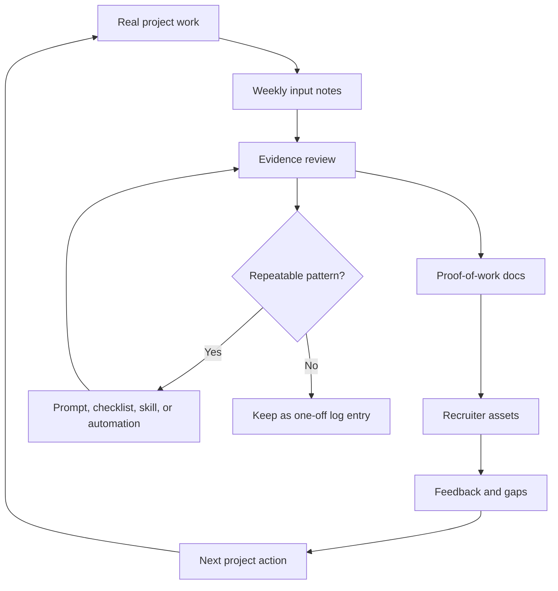

# Repository Seed Blueprint

Last updated: 2026-06-09
Status: Active / Standalone LLM-agnostic seed

## Purpose

This document is the standalone instruction for recreating this proof-of-work repository architecture for another person.

It is designed to be copied into any capable LLM, coding agent, chat assistant, IDE assistant, or automation runner. The goal is to let another user clone the architecture, operating model, documentation system, and automation prompts without copying private evidence, local paths, credentials, vendor-specific assumptions, or Marcus-specific claims.

Use this when:

- a new user wants their own AI-native proof-of-work repository
- the target repository is empty or partially scaffolded
- any LLM or agent needs one clear file that explains what to build
- the system should be reproducible without access to this repository

## What This Seeds

This seed creates a private, recruiter-shareable proof-of-work repository that turns real product work into structured evidence.

The target repository should document:

- concrete product projects as the primary proof
- project-scoped product strategy
- architecture reasoning
- workflow automation
- weekly execution logs
- evidence quality and privacy rules
- recruiter-facing summaries
- agent-readable navigation
- reusable prompts for recurring maintenance
- install and handoff guides for lead source projects when the proof should be reproducible

This is not a codebase template. It is a documentation, evidence, and operating-system template.

## One-Click Clone Goal State

Goal state: a new user should be able to clone or fork this repository, give an LLM assistant one bootstrap instruction, and end up with the same kind of proof-of-work system.

A clone can reproduce:

- repository architecture
- Markdown file structure
- evidence labels
- decision-trail format
- recruiter and agent reading paths
- weekly compiler prompts
- source-indexing prompts and templates
- automation runbooks
- custom skill documentation model and case template
- privacy and sharing rules
- lead-project handoff pattern
- reusable template guidance
- the pattern for connecting the proof-of-work repo to the user's own product repositories

A clone cannot automatically reproduce:

- private product evidence
- Marcus's product repositories or weekly updates
- local source indexes
- scheduler state from another machine
- GitHub permissions
- secrets, tokens, or credentials
- local paths, worktrees, or raw chat histories
- access to private source repositories

The expected path is therefore:

1. Clone or fork the repository.
2. Replace user/project placeholders.
3. Run the LLM-agnostic bootstrap prompt.
4. Point the proof-of-work system at the user's own product repositories, case studies, screenshots, source roots, and weekly input.
5. Add local source roots only if the user explicitly wants source indexing.
6. Recreate the weekly automation from [WEEKLY_AUTOMATION_RUNBOOK.md](WEEKLY_AUTOMATION_RUNBOOK.md), using the user's own repository URL, source repos, and automation runner.
7. Add real weekly input and evidence before promoting claims.

The target is functional equivalence, not private-data equivalence.

## LLM-Agnostic Contract

This seed should not depend on Codex, Claude, ChatGPT, Gemini, Cursor, GitHub Copilot, or any other specific model, agent, plugin, scheduler, operating system, or IDE.

The target agent only needs the ability to:

- read and write repository files
- create folders
- preserve existing useful content
- follow Markdown instructions
- avoid fabricating evidence
- run basic repository checks when available

If the target environment cannot edit files directly, it should output the exact file tree and file contents for the user to apply manually.

Provider-specific names are allowed only as local adapters. The portable architecture should use neutral concepts such as:

- `LLM assistant`
- `coding agent`
- `automation runner`
- `weekly compiler`
- `source index refresh`
- `privacy review`
- `instruction drift audit`

## Copy-Paste Seed Prompt

Copy everything inside this block into the target LLM, agent, or automation runner.

```text
You are helping me bootstrap a private proof-of-work repository.

Goal:
Create a recruiter-shareable evidence repository that documents my real product work, AI-native workflow design, architecture reasoning, automation system, project decisions, weekly execution, and reusable operating model.

This repository is not the product itself. It is the evidence and packaging layer around my products, projects, experiments, and workflows.

Work from the actual repository state. If the repository is empty, create the full scaffold. If files already exist, inspect them first, preserve useful work, and update incrementally.

Do not fabricate evidence, metrics, source contents, dates, users, revenue, commits, screenshots, or project outcomes.

Use placeholders where evidence is missing.

Use Markdown as the source of truth.
Use Mermaid diagrams for GitHub-rendered diagrams.
Keep files readable in GitHub.
Keep private source indexes local and gitignored.
Do not expose private local paths, credentials, personal addresses, private emails, raw chat logs, or sensitive third-party data in recruiter-facing files.

Replace these placeholders for the target user:
- USER_NAME: <user name>
- CANONICAL_REPO_URL: <GitHub repository URL>
- LEAD_PROJECT: <main proof-point project>
- LEAD_PROJECT_REPO_URL: <main product/source repository URL>
- SUPPORTING_PROJECT_1: <supporting project>
- SUPPORTING_PROJECT_1_REPO_URL: <optional supporting product/source repository URL>
- SUPPORTING_PROJECT_2: <supporting project>
- SUPPORTING_PROJECT_2_REPO_URL: <optional supporting product/source repository URL>
- TARGET_ROLES: <target roles or role families>
- LOCAL_SOURCE_ROOTS: <optional local source folders to index, if available>
- AUTOMATION_RUNNER: <scheduler or automation tool, if available>

Repository positioning:
- Concrete projects are the primary proof.
- LEAD_PROJECT is the lead proof point.
- SUPPORTING_PROJECT_1 and SUPPORTING_PROJECT_2 are supporting proof points.
- Automation, source indexes, weekly compiler, prompts, and review loops are documented operating infrastructure.
- The repository is the evidence layer, not the product being evaluated.
- Recruiter-facing files should summarize evidence without exposing private local material.
- Weekly updates should come from the target user's own product repositories, weekly-input notes, screenshots, source summaries, commits, and explicit evidence.
- Do not keep references to Marcus, TheOneDarkHorse/job-agent, PKM, or the household budget app unless the target user is intentionally documenting those exact projects.

Create or update this root file scaffold:
- .gitignore
- AGENTS.md
- README.md
- START_HERE.md
- NAVIGATION.md
- AUTOMATION_PROMPT.md
- EXECUTIVE_SUMMARY.md
- RECRUITER_ONE_PAGER.md
- RECRUITER_AGENT_GUIDE.md
- RECRUITER_BRIEF.md
- PROOF_OF_WORK.md
- PROJECT_STATUS.md
- PROJECT_PROOF_POINTS.md
- PROJECT_TIMELINE.md
- EVIDENCE_MATRIX.md
- ROLE_READING_PATHS.md
- BEFORE_AFTER_SNAPSHOTS.md
- PORTFOLIO_CASE_STUDY.md
- DEMO_SCRIPT.md
- SOURCE_MAP.md
- SHARING_CHECKLIST.md

Create or update these folders:
- architecture/
- assets/screenshots/
- case-studies/
- diagrams/
- exports/
- internal/templates/
- logs/
- prompts/
- recruiter-assets/
- strategy/
- template/
- tasks/
- weekly-input/
- workflows/

Create clone/fork template files:
- template/README.md
- template/REPO_SEED_BLUEPRINT.md
- template/IMPORT_INSTRUCTIONS.md
- template/LLM_BOOTSTRAP_REPO_PROMPT.md
- template/WEEKLY_AUTOMATION_RUNBOOK.md
- template/CUSTOM_SKILL_CASE_TEMPLATE.md

Create project strategy structure:
- strategy/README.md
- strategy/LEAD_PROJECT/README.md
- strategy/LEAD_PROJECT/product/VALUE_PROPOSITION.md
- strategy/LEAD_PROJECT/product/PRODUCT_STRATEGY.md
- strategy/LEAD_PROJECT/product/COMPETITIVE_POSITIONING.md
- strategy/LEAD_PROJECT/business/BUSINESS_MODEL.md
- strategy/LEAD_PROJECT/business/PRICING_STRATEGY.md
- strategy/LEAD_PROJECT/market/GO_TO_MARKET.md
- strategy/LEAD_PROJECT/decisions/DECISION_TRAIL.md
- strategy/SUPPORTING_PROJECT_1/README.md
- strategy/SUPPORTING_PROJECT_1/product/VALUE_PROPOSITION.md
- strategy/SUPPORTING_PROJECT_1/product/PRODUCT_STRATEGY.md
- strategy/SUPPORTING_PROJECT_1/product/COMPETITIVE_POSITIONING.md
- strategy/SUPPORTING_PROJECT_1/business/BUSINESS_MODEL.md
- strategy/SUPPORTING_PROJECT_1/business/PRICING_STRATEGY.md
- strategy/SUPPORTING_PROJECT_1/market/GO_TO_MARKET.md
- strategy/SUPPORTING_PROJECT_1/decisions/DECISION_TRAIL.md
- strategy/SUPPORTING_PROJECT_2/README.md
- strategy/SUPPORTING_PROJECT_2/product/VALUE_PROPOSITION.md
- strategy/SUPPORTING_PROJECT_2/product/PRODUCT_STRATEGY.md
- strategy/SUPPORTING_PROJECT_2/product/COMPETITIVE_POSITIONING.md
- strategy/SUPPORTING_PROJECT_2/business/BUSINESS_MODEL.md
- strategy/SUPPORTING_PROJECT_2/business/PRICING_STRATEGY.md
- strategy/SUPPORTING_PROJECT_2/market/GO_TO_MARKET.md
- strategy/SUPPORTING_PROJECT_2/decisions/DECISION_TRAIL.md
- strategy/portfolio-operating-system/README.md

Create architecture files:
- architecture/ARCHITECTURE.md
- architecture/DATA_FLOW.md
- architecture/INGESTION_MODEL.md
- architecture/AUTORESEARCH_MODEL.md
- architecture/RECURSIVE_WORKFLOWS.md
- architecture/SYSTEM_BOUNDARIES.md
- architecture/TECHNICAL_DECISION_LOG.md

Create workflow files:
- workflows/WORKFLOW_PHILOSOPHY.md
- workflows/AI_OPERATING_MODEL.md
- workflows/CLAUDE_CODEX_WORKFLOW.md
- workflows/SCHEDULED_TASKS_MODEL.md
- workflows/REVIEW_AND_PROMOTION_LOOP.md
- workflows/SOURCE_QUALITY_MODEL.md
- workflows/CUSTOM_SKILLS_DOCUMENTATION_MODEL.md

Create diagram files:
- diagrams/USER_FLOW.md
- diagrams/FUNCTIONAL_MODEL.md
- diagrams/TECHNICAL_MODEL.md
- diagrams/RECURSIVE_AGENT_MODEL.md
- diagrams/RECRUITER_VIEW.md
- diagrams/LOCAL_SOURCE_DISCOVERY_MODEL.md

Create log files:
- logs/WEEKLY_LOG.md
- logs/CHANGELOG.md
- logs/DECISION_LOG.md
- logs/PROBLEM_SOLVING_LOG.md

Create case studies:
- case-studies/README.md
- case-studies/LEAD_PROJECT_CASE_STUDY.md
- case-studies/LEAD_PROJECT_INSTALL_AND_HANDOFF.md
- case-studies/SUPPORTING_PROJECT_1_CASE_STUDY.md
- case-studies/SUPPORTING_PROJECT_2_CASE_STUDY.md
- case-studies/WORKFLOW_IMPLEMENTATION_CASES.md
- case-studies/CUSTOM_SKILLS_CASE_STUDY.md

Create recruiter assets:
- recruiter-assets/README.md
- recruiter-assets/CV_BULLETS.md
- recruiter-assets/LINKEDIN_DRAFTS.md
- recruiter-assets/RECRUITER_SUMMARY.md
- recruiter-assets/INTERVIEW_TALKING_POINTS.md
- recruiter-assets/SCREENSHOT_SHARING_PLAN.md

Create prompt files:
- prompts/WEEKLY_PROOF_OF_WORK_COMPILER.md
- prompts/SOURCE_INDEX_REFRESH_PROMPT.md
- prompts/CODEX_BOOTSTRAP_REPO_PROMPT.md if the user specifically uses Codex

Create internal templates:
- internal/README.md
- internal/templates/LOCAL_SOURCE_MAP.template.md
- internal/templates/LLM_WORKSPACES_INDEX.template.md
- internal/templates/AGENT_PROJECTS_INDEX.template.md
- internal/templates/NOTES_AND_PLANNING_INDEX.template.md
- internal/templates/ASSISTANT_HISTORY_INDEX.template.md
- internal/templates/AGENT_INFRASTRUCTURE_INDEX.template.md
- internal/templates/SKILLS_INDEX.template.md
- internal/templates/SCRIPTS_INDEX.template.md
- internal/templates/DOCUMENTATION_INDEX.template.md

Create weekly input files:
- weekly-input/README.md
- weekly-input/TEMPLATE.md

Create task memory:
- tasks/lessons.md

.gitignore must exclude:
- internal/LOCAL_SOURCE_MAP.md
- internal/source-indexes/*.md
- .env
- .env.*
- secrets.*
- credentials.*
- *.key
- *.pem
- node_modules/
- .venv/
- venv/
- __pycache__/
- .cache/
- dist/
- build/

Evidence labels:
- Verified: supported by artifact, source, file, screenshot, commit, or explicit user input
- Estimated: plausible but not directly measured
- Planned: intended but not completed
- Open Question: unresolved
- Decision: strategic, architectural, workflow, or product decision
- Hypothesis: testable assumption
- Rejected: considered and intentionally not pursued
- Internal: useful for operation but not recruiter-facing
- Needs Review: stale or uncertain

Decision trail format:
Context -> Options Considered -> Tradeoffs -> Decision -> Evidence -> Open Questions -> Next Action

Recruiter-facing files must answer:
1. What problem was identified?
2. What changed?
3. Why was the change made?
4. What evidence supports it?
5. What tradeoffs were accepted?
6. What remains unvalidated?
7. Why does this matter to a recruiter, hiring manager, or collaborator?

Lead project handoff files must answer:
1. Where is the source repo?
2. What does the product do?
3. What must be installed first?
4. Which environment variables are needed as placeholders?
5. Which local services and ports should be running?
6. Which files should an LLM agent read before editing?
7. Which commands verify that setup works?
8. Which files, secrets, local indexes, and raw chats must not be copied?

Automations to document and seed:
1. Weekly Proof-of-Work Compiler
   Purpose: turn weekly project progress into recruiter-readable evidence.
   Input: weekly-input/, target user's product repo changes, safe source summaries, logs, project docs, screenshots, and explicit user-provided evidence.
   Output: updated proof-of-work docs, recruiter assets, lead project install/handoff docs, weekly log, changelog, decision log when needed.
   Prompt file: prompts/WEEKLY_PROOF_OF_WORK_COMPILER.md
   Runbook: template/WEEKLY_AUTOMATION_RUNBOOK.md
   Schedule suggestion: weekly.

2. Source Index Refresh
   Purpose: summarize local project, notes, agent, and skill folders without exposing raw private data.
   Input: LOCAL_SOURCE_ROOTS if available.
   Output: internal/LOCAL_SOURCE_MAP.md and internal/source-indexes/*.md.
   Prompt file: prompts/SOURCE_INDEX_REFRESH_PROMPT.md
   Schedule suggestion: every 14 days or before a weekly compiler run when indexes are stale.

3. Instruction Drift Audit
   Purpose: find duplicate, stale, contradictory, or over-specific instructions.
   Input: AGENTS.md, README.md, prompts/, workflows/, tasks/lessons.md.
   Output: small instruction cleanup PR or decision log entry.
   Schedule suggestion: monthly.

4. Privacy and Sharing Review
   Purpose: prevent accidental sharing of private paths, secrets, raw chats, sensitive personal data, or confidential third-party details.
   Input: recruiter-facing files and export candidates.
   Output: SHARING_CHECKLIST.md updates and redaction notes.
   Schedule suggestion: before every external share.

5. Kill-Switch Review
   Purpose: disable or merge automations that produce noise.
   Input: logs, automation outputs, recurring prompt results.
   Output: decision log entry and updated scheduled task model.
   Schedule suggestion: monthly or after repeated low-value runs.

Weekly compiler behavior:
- Inspect AGENTS.md first.
- Inspect weekly-input/ before promoting new claims.
- Cross-check SOURCE_MAP.md, PROJECT_STATUS.md, PROJECT_PROOF_POINTS.md, PROJECT_TIMELINE.md, PROOF_OF_WORK.md, EVIDENCE_MATRIX.md, ROLE_READING_PATHS.md, case-studies/, logs/, strategy/, architecture/, workflows/, and diagrams/.
- Cross-check case-studies/CUSTOM_SKILLS_CASE_STUDY.md, workflows/CUSTOM_SKILLS_DOCUMENTATION_MODEL.md, and template/CUSTOM_SKILL_CASE_TEMPLATE.md when a custom skill, reusable agent workflow, or skill documentation rule changes.
- Cross-check target user's own product repositories when available and authorized.
- If no verified new source material exists, do not invent progress.
- Add a weekly log entry only when there is verified input, repo-visible change, or an explicit "no verified new source material" record.
- Static strategy files should change only when strategy, positioning, architecture, or operating assumptions changed.
- Meaningful strategy or architecture changes require a decision log entry.

Source indexing behavior:
- Prefer existing fresh indexes over rescanning.
- Refresh indexes when absent, older than 14 days, or explicitly requested.
- Summarize folder purpose, important files, scripts, skills, candidate evidence, unknowns, and freshness.
- Exclude dependencies, caches, binaries, credentials, secrets, large logs, raw email dumps, and unrelated temporary files.
- Do not commit real local source indexes unless explicitly approved.
- Use provider-neutral source index names by default. If the user has tool-specific roots such as Codex, Claude, Cursor, ChatGPT exports, or another assistant history, map them into neutral evidence categories instead of making the architecture depend on that provider.

Quality gate before completion:
- Markdown files exist and are internally linked.
- Mermaid diagrams are valid enough for GitHub rendering.
- Recruiter-facing docs do not expose private local paths or secrets.
- Evidence claims are labeled.
- Missing evidence is marked clearly.
- Repository can be understood from START_HERE.md, NAVIGATION.md, and template/README.md.
- Automation prompts are present and reusable.
- Custom skills are documented as sanitized problem/solution cases, not raw local prompt dumps.
- Final response lists updated files, new artifacts, verification run, failures, unverified items, and one next action.

Start by inspecting the current repository state. Then create the scaffold and seed content.
```

## Minimum Viable Seed Files

If the target LLM has limited time, create these files first:

| File | Purpose |
|---|---|
| `AGENTS.md` | Controlling operating instructions |
| `README.md` | Public-facing repo overview |
| `START_HERE.md` | Fast human entry point |
| `NAVIGATION.md` | Reading map |
| `template/README.md` | Clone/fork adoption kit |
| `template/REPO_SEED_BLUEPRINT.md` | Standalone reproduction seed |
| `PROOF_OF_WORK.md` | Central evidence map |
| `PROJECT_STATUS.md` | Current state by project |
| `PROJECT_PROOF_POINTS.md` | Strongest evidence by project |
| `PROJECT_TIMELINE.md` | Milestones over time |
| `EVIDENCE_MATRIX.md` | Capability-to-evidence map |
| `RECRUITER_AGENT_GUIDE.md` | LLM-readable recruiter review path |
| `SOURCE_MAP.md` | Safe summary of evidence sources |
| `logs/WEEKLY_LOG.md` | Weekly execution record |
| `logs/DECISION_LOG.md` | Strategy and architecture decisions |
| `prompts/WEEKLY_PROOF_OF_WORK_COMPILER.md` | Recurring weekly compiler prompt |
| `prompts/SOURCE_INDEX_REFRESH_PROMPT.md` | Local source indexing prompt |
| `template/LLM_BOOTSTRAP_REPO_PROMPT.md` | Provider-neutral bootstrap prompt |
| `workflows/SCHEDULED_TASKS_MODEL.md` | Automation model |
| `template/WEEKLY_AUTOMATION_RUNBOOK.md` | Weekly automation schedule and recreation path |

## Growth Model

The repository should grow through a repeatable loop:



## Adaptation Rules

When another user adopts this seed:

- replace project names before creating strategy and case-study files
- replace source repository URLs with the user's own repositories
- point weekly automation at the user's own evidence sources, not Marcus's repositories
- keep the proof-of-work repo separate from product repos
- keep private source indexes out of recruiter-facing docs
- use examples only as structure, not as copied evidence
- replace tool-specific names with neutral concepts unless a tool-specific adapter is actually needed
- update `template/REPO_SEED_BLUEPRINT.md` when the system learns a better bootstrapping pattern
- keep the seed standalone so it can travel without the original repo

## Common Failure Modes

| Failure Mode | Prevention |
|---|---|
| The repo becomes a content dump | Tie every file to evidence, decisions, proof points, or recruiter usefulness |
| Automation overshadows project work | Keep concrete projects as the primary proof |
| Claims become inflated | Use evidence labels and avoid fake metrics |
| Private context leaks | Keep raw source indexes internal and gitignored |
| LLM cannot find the seed | Link `template/README.md` from `README.md`, `START_HERE.md`, and `NAVIGATION.md` |
| Seed becomes vendor-specific | Keep the core prompt provider-neutral and treat tool-specific files as adapters |
| Strategy gets mixed across projects | Keep strategy under `strategy/<project>/` |
| Weekly runs invent progress | Require weekly input, repo-visible changes, or explicit no-new-evidence status |

## Expected Final State

A successful seeded repository should let a new reader or assistant answer:

1. What has this person built?
2. What evidence supports that claim?
3. What changed over time?
4. What decisions did they make?
5. What tradeoffs did they accept?
6. What is still unvalidated?
7. How does their AI-native operating model work?
8. How can the system keep improving weekly?
