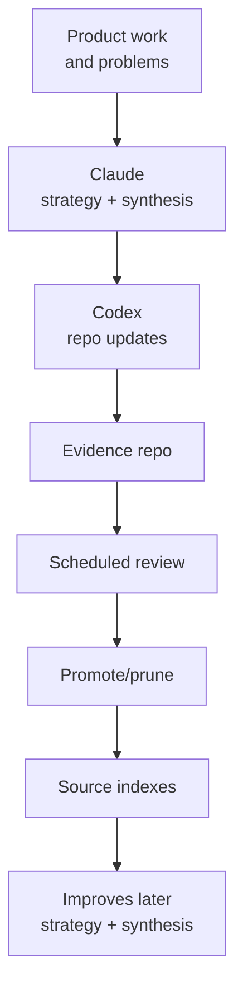

# AI Operating Model

Last updated: 2026-05-11
Status: Initial design

## Operating Model

## Roles

| Tool / Layer | Role |
|---|---|
| Claude | reasoning, strategy, synthesis, evaluation |
| Codex | repo updates, structured file changes, implementation planning |
| GitHub | source of truth and proof archive |
| Local Codex projects | historical project evidence |
| Local Claude projects | strategy and planning evidence |
| Shared agents folder | reusable skills, scripts, documentation |
| Scheduled Tasks | recurring review and compilation |
| Human Review | judgment, approval, prioritization |

## Why This Matters

The model reduces duplicated work and turns thinking into reusable assets. It treats AI as an operating layer for capturing, structuring, evaluating, and preserving execution evidence.
