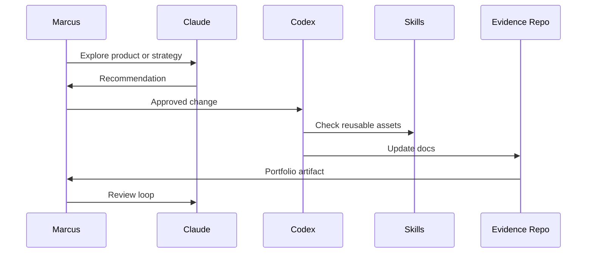

# Claude + Codex Workflow

Last updated: 2026-05-11
Status: Initial version

## Claude

Best for:

- reasoning
- strategy
- product thinking
- synthesis
- instruction writing
- document drafting
- evaluation

## Codex

Best for:

- repository work
- file updates
- structured documentation maintenance
- implementation planning
- diff-based edits
- repeatable repo hygiene
- source indexing
- keeping proof-of-work docs organized

## Shared Skills / Agents Layer

The shared skills layer lives in a private local workspace.

Because Marcus uses a custom shared-skills setup, Codex must inspect indexes before assuming structure.

The current internal index treats shared skills and scheduled routines as reusable workflow infrastructure, separate from Codex execution projects and Claude planning projects.

## Combined Workflow

## Operating Rule

Claude explores and structures. Codex maintains the repo. Shared skills provide reusable components. GitHub preserves the proof. Marcus makes final decisions.
