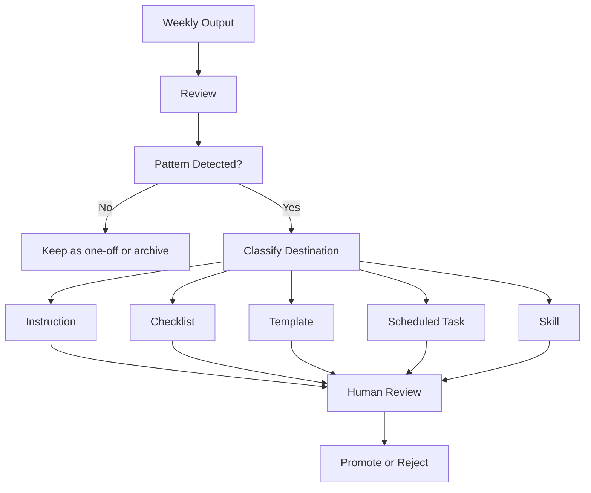

# Review and Promotion Loop

Last updated: 2026-05-08  
Status: Initial design

## Purpose

Turn repeated useful patterns into durable assets.

## Loop

## Promotion Destinations

| Pattern | Destination |
|---|---|
| Repeated prompt | Template or instruction |
| Repeated review behavior | Checklist |
| Repeated schedule need | Scheduled task |
| Reusable capability | Skill |
| Stable decision | Static documentation |
| Temporary idea | Archive |

## Rule

No important instruction update should be promoted without human review.
